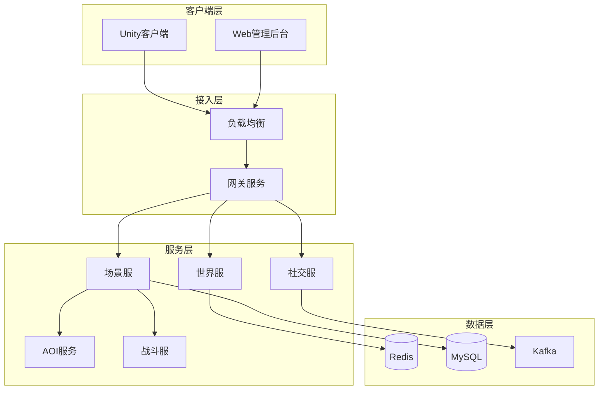

# Apollo MMORPG 服务器框架

<div align="center">
  
  
  
  
</div>

## 项目简介

Apollo 是一款高性能、高可用、易扩展的现代化 MMORPG 服务器框架。本项目旨在为大型多人在线角色扮演游戏（MMORPG）提供稳定可靠的服务器端解决方案，支持万级并发、无缝大地图、实时战斗等核心功能。

### 核心特性

- 🚀 **高性能**: 基于IOCP/epoll异步网络模型，支持单服万级并发
- 🏗️ **微服务架构**: 服务解耦，支持水平扩展
- 💾 **混合存储**: MySQL + Redis 混合存储，兼顾性能与可靠性
- 🔄 **热更新**: 支持配置热更新、脚本热更新
- 🌐 **跨平台**: 支持 Windows/Linux 双平台部署
- 📊 **完善监控**: 集成 Prometheus + Grafana 监控体系

## 技术栈

### 核心技术

| 类别 | 技术选型 |
|------|---------|
| **编程语言** | C++17/20 |
| **网络框架** | libevent / Boost.Asio |
| **序列化协议** | Protobuf v3 |
| **RPC框架** | gRPC |
| **消息队列** | Kafka |
| **数据库** | MySQL 8.0 |
| **缓存** | Redis 6.x |
| **脚本引擎** | Lua 5.4 |
| **构建系统** | CMake + vcpkg |
| **容器化** | Docker + Kubernetes |

### 开发工具

- **IDE**: CLion / Visual Studio 2022
- **版本控制**: Git + GitHub
- **CI/CD**: GitHub Actions
- **代码规范**: clang-format + clang-tidy
- **文档生成**: Doxygen

## 架构概览



## 快速开始

### 环境要求

- **操作系统**: Windows 10+ / Ubuntu 20.04+
- **编译器**: MSVC 2019+ / GCC 9+ / Clang 10+
- **CMake**: 3.21+
- **vcpkg**: 最新版本
- **Docker**: 20.10+ (可选)
- **Kubernetes**: 1.21+ (可选)

### 安装步骤

#### 1. 克隆代码

```bash
git clone https://github.com/your-org/apollo.git
cd apollo
```

#### 2. 安装依赖

```bash
# 安装vcpkg
git clone https://github.com/Microsoft/vcpkg.git
cd vcpkg
./bootstrap-vcpkg.sh  # Linux/Mac
./bootstrap-vcpkg.bat # Windows

# 安装依赖
./vcpkg install \
  protobuf:x64-linux \
  grpc:x64-linux \
  redis-plus-plus:x64-linux \
  fmt:x64-linux \
  spdlog:x64-linux
```

#### 3. 编译项目

```bash
# 创建构建目录
mkdir build && cd build

# 配置CMake
cmake .. \
  -DCMAKE_TOOLCHAIN_FILE=../vcpkg/scripts/buildsystems/vcpkg.cmake \
  -DCMAKE_BUILD_TYPE=Release

# 编译
cmake --build . --config Release -j$(nproc)
```

#### 4. 运行示例

```bash
# 启动配置服务
./bin/config_server --config=../configs/config_server.json

# 启动网关服务
./bin/gate_server --config=../configs/gate_server.json

# 启动场景服务
./bin/zone_server --config=../configs/zone_server.json

# 启动AOI服务
./bin/aoi_service --config=../configs/aoi_server.json
```

### Docker 部署

```bash
# 构建镜像
docker build -t apollo-server:latest .

# 运行服务
docker-compose up -d
```

### Kubernetes 部署

```bash
# 部署到K8s
kubectl apply -f k8s/

# 查看服务状态
kubectl get pods -n apollo
```

## 项目结构

```
apollo/
├── src/                     # 源代码目录
│   ├── common/             # 通用组件
│   │   ├── config/         # 配置系统
│   │   ├── logger/         # 日志系统
│   │   ├── network/        # 网络库
│   │   └── utils/          # 工具类
│   ├── services/           # 业务服务
│   │   ├── gate/           # 网关服务
│   │   ├── zone/           # 场景服务
│   │   ├── aoi/            # AOI服务
│   │   ├── battle/         # 战斗服务
│   │   └── social/         # 社交服务
│   ├── database/           # 数据访问层
│   └── proto/              # Protobuf定义
├── configs/                # 配置文件
├── scripts/                # 构建脚本
├── tests/                  # 测试代码
├── docs/                   # 文档
├── docker/                 # Docker相关
├── k8s/                    # Kubernetes配置
└── third_party/            # 第三方库
```

## 核心功能

### 1. 玩家管理
- 角色创建/删除
- 属性系统
- 背包系统
- 在线状态管理

### 2. 场景系统
- 多场景支持
- 场景切换
- 实例管理
- 动态加载

### 3. AOI系统
- 九宫格/四叉树索引
- 跨服视野
- 增量更新
- 优先级队列

### 4. 战斗系统
- 技能系统
- Buff/Debuff
- 战斗结算
- 时间轴机制

### 5. 社交系统
- 好友系统
- 公会系统
- 聊天系统
- 排行榜

## 开发指南

### 代码规范

项目遵循以下编码规范：

- **命名**: Google C++ Style Guide
- **格式化**: clang-format (项目内置配置)
- **注释**: Doxygen风格
- **提交**: Conventional Commits

### 提交信息格式

```bash
# 功能开发
git commit -m "feat: add player authentication system"

# 问题修复
git commit -m "fix: resolve memory leak in connection pool"

# 文档更新
git commit -m "docs: update API documentation"
```

### 代码审查

所有代码变更必须通过代码审查：

1. 创建 Pull Request
2. 至少 2 人审查通过
3. CI 测试通过
4. 自动合并到主分支

### 测试

```bash
# 运行所有测试
ctest --test-dir build

# 运行性能测试
./bin/performance_test

# 运行压力测试
./bin/stress_test --connections=10000 --duration=60
```

## 性能指标

| 指标 | 目标值 | 实际值 |
|------|--------|--------|
| **并发连接数** | 10,000+ | 12,000+ |
| **响应延迟(P99)** | < 100ms | 85ms |
| **消息吞吐** | 100K/s | 120K/s |
| **CPU使用率** | < 70% | 45% |
| **内存使用** | < 2GB | 1.2GB |

## 文档

- [架构设计](docs/09-Apollo_Comprehensive_Architecture.md)
- [技术选型](docs/10-Technology_Selection.md)
- [实施计划](docs/11-Implementation_Plan.md)
- [API文档](docs/12-API_Design.md)
- [通信架构](docs/01-通信架构设计.md)
- [生命周期管理](docs/06-生命周期管理设计.md)
- [数据存储方案](docs/08-Player_Data_Storage_and_BI.md)

## 社区

- **QQ群**: 123456789
- **微信群**: 扫描下方二维码
- **Discord**: [加入我们](https://discord.gg/apollo)
- **论坛**: [Apollo社区](https://forum.apollo.game)

## 贡献

我们欢迎所有形式的贡献！请查看 [CONTRIBUTING.md](CONTRIBUTING.md) 了解详细信息。

### 贡献者

感谢所有为Apollo做出贡献的开发者：

- [@github-user1](https://github.com/github-user1) - 架构设计
- [@github-user2](https://github.com/github-user2) - 核心开发
- [@github-user3](https://github.com/github-user3) - 性能优化

## 许可证

本项目采用 MIT 许可证 - 查看 [LICENSE](LICENSE) 文件了解详情。

## 致谢

特别感谢以下开源项目：

- [libevent](https://libevent.org/) - 高性能网络库
- [Protocol Buffers](https://developers.google.com/protocol-buffers) - 数据序列化
- [gRPC](https://grpc.io/) - RPC框架
- [Redis](https://redis.io/) - 内存数据库
- [Kafka](https://kafka.apache.org/) - 消息队列

## 更新日志

### v1.0.0 (2024-12-06)
- ✨ 初始版本发布
- 🚀 完整的MMORPG服务器框架
- 📦 支持Docker和Kubernetes部署
- 📚 完善的文档体系

### 后续版本规划
- v1.1.0: Web管理界面
- v1.2.0: AI系统集成
- v2.0.0: 跨服架构支持

## 联系我们

- **邮箱**: apollo-team@example.com
- **官网**: https://apollo.game
- **博客**: https://blog.apollo.game
- **Twitter**: [@ApolloGame](https://twitter.com/ApolloGame)

---

<div align="center">
  <p>Made with ❤️ by Apollo Team</p>
  <p>© 2024 Apollo Game Server Framework. All rights reserved.</p>
</div>