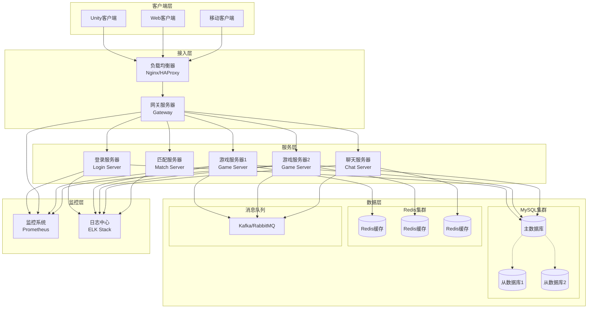
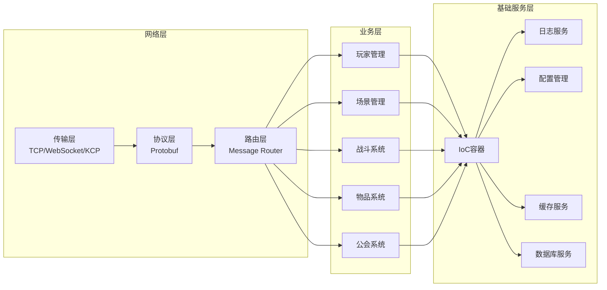
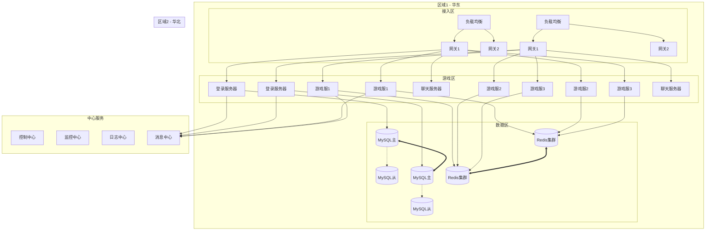

# Apollo MMORPG 服务器框架

[](https://github.com/cuihairu/apollo/blob/main/LICENSE)
[](https://github.com/cuihairu/apollo)
[](https://github.com/cuihairu/apollo)
[](https://github.com/cuihairu/apollo/actions)

> 一个高性能、模块化的MMORPG服务器开发框架

## 📖 项目简介

Apollo是一个专为大型多人在线角色扮演游戏（MMORPG）设计的服务器框架。它采用现代C++17开发，提供了完整的游戏服务器解决方案，包括网络通信、数据存储、游戏逻辑、战斗系统等核心模块。

### 核心特性

- 🏗️ **IoC容器系统** - 依赖注入和组件生命周期管理
- 🌐 **高性能网络层** - 跨平台异步I/O（IOCP/Epoll）
- 📦 **Protobuf消息系统** - 高效的序列化和RPC框架
- 🔥 **ECS战斗系统** - 灵活的实体-组件-系统架构
- 👁 **AOI九宫格系统** - 高效的视野管理
- 💾 **数据存储层** - 数据库连接池和Redis缓存
- ⚡ **日志系统** - 多级别异步日志
- 🔧 **工具类库** - 线程池、内存池、配置管理等

## 🏛️ 架构设计

### 系统架构概览



### 核心模块架构



### 分布式部署架构



### 技术栈

- **编程语言**: C++17
- **构建系统**: CMake
- **网络库**: 自实现跨平台网络层
- **序列化**: Google Protobuf
- **数据库**: MySQL (主存储), Redis (缓存)
- **消息队列**: Kafka/RabbitMQ
- **监控系统**: Prometheus + Grafana
- **日志系统**: ELK Stack (Elasticsearch + Logstash + Kibana)
- **容器化**: Docker + Kubernetes
- **测试框架**: GTest
- **CI/CD**: GitHub Actions

## 🚀 快速开始

### 环境要求

- C++17 或更高版本
- CMake 3.16+
- GCC 9+ / Clang 10+ / MSVC 2019+
- MySQL 8.0+ (可选)
- Redis 6.0+ (可选)

### 编译项目

```bash
# 克隆项目
git clone https://github.com/cuihairu/apollo.git
cd apollo

# 安装 vcpkg（用于依赖管理）
git clone https://github.com/microsoft/vcpkg.git
./vcpkg/bootstrap-vcpkg.sh

# 创建构建目录
cmake -B build -G Ninja \
  -DCMAKE_BUILD_TYPE=Release \
  -DCMAKE_TOOLCHAIN_FILE="$PWD/vcpkg/scripts/buildsystems/vcpkg.cmake" \
  -DVCPKG_TARGET_TRIPLET=x64-linux   # macOS: x64-osx / arm64-osx

# 编译
cmake --build build --parallel

# 运行示例
./build/examples/all_features_demo
```

### Windows (Visual Studio)

```bash
# 使用 Visual Studio 2019 或更高版本
git clone https://github.com/cuihairu/apollo.git
cd apollo

git clone https://github.com/microsoft/vcpkg.git
.\vcpkg\bootstrap-vcpkg.bat

cmake -B build -G "Visual Studio 16 2019" ^
  -DCMAKE_TOOLCHAIN_FILE=%cd%\\vcpkg\\scripts\\buildsystems\\vcpkg.cmake ^
  -DVCPKG_TARGET_TRIPLET=x64-windows

# 打开 build\\Apollo.sln 进行编译
```

## 📚 模块说明

### Framework 核心框架
- **IoC容器**: 管理组件生命周期和依赖注入
- **组件系统**: 支持插件式开发
- **配置管理**: 支持热更新和多种格式

### Game 游戏逻辑
- **AOI系统**: 九宫格空间索引，高效视野管理
- **战斗系统**: ECS架构，支持技能、Buff、状态机
- **属性系统**: 灵活的属性计算和同步机制
- **场景管理**: 多场景支持和场景迁移

### Network 网络通信
- **传输层**: Socket封装，支持TCP/WebSocket/KCP
- **消息层**: Protobuf消息路由和处理
- **RPC框架**: 远程过程调用框架

### Storage 存储层
- **数据库连接池**: MySQL连接管理和复用
- **Redis客户端**: 完整的Redis命令支持
- **序列化**: 多种数据序列化方案

### Utils 工具库
- **日志系统**: 多级别异步日志，文件/控制台输出
- **线程池**: 高性能任务调度
- **内存池**: 优化的内存管理
- **配置系统**: JSON/XML/Lua配置支持

## 🔧 使用示例

### 服务器基础框架

```cpp
#include "apollo/framework/ioc/ApplicationContext.h"
#include "apollo/server/GameServer.h"

int main() {
    // 初始化IoC容器
    auto& context = apollo::ApplicationContext::getInstance();

    // 注册组件
    context.registerComponent<apollo::GameServer>("GameServer");
    context.registerComponent<apollo::NetworkServer>("NetworkServer");
    context.registerComponent<apollo::DatabaseManager>("DatabaseManager");

    // 初始化所有组件
    if (!context.initialize()) {
        std::cerr << "Failed to initialize application" << std::endl;
        return -1;
    }

    // 启动服务
    if (!context.start()) {
        std::cerr << "Failed to start application" << std::endl;
        return -1;
    }

    // 运行主循环
    context.run();

    // 清理
    context.destroy();
    return 0;
}
```

### 使用AOI系统

```cpp
#include "apollo/game/aoi/AOIManager.h"

// 初始化AOI管理器
auto& aoi = apollo::AOIManager::Instance();
aoi.Initialize(100.0f);  // 100米网格

// 创建实体
apollo::AOIEntity player(1001, 1);
player.position = {100.0f, 0.0f, 100.0f};
player.aoiRadius = 30.0f;

// 更新到AOI
aoi.UpdateEntity(player);

// 获取可见实体
auto visible = aoi.GetVisibleEntities(1001);
for (auto id : visible) {
    std::cout << "Entity " << id << " is visible" << std::endl;
}
```

### 使用战斗系统

```cpp
#include "apollo/game/battle/BattleWorld.h"
#include "apollo/game/battle/components.hpp"

// 创建战斗世界
auto world = std::make_unique<apollo::BattleWorld>(1);

// 创建玩家实体
auto player = world->CreateEntity(1001);
auto transform = player->AddComponent<apollo::TransformComponent>();
auto attributes = player->AddComponent<apollo::AttributeComponent>();
auto battleState = player->AddComponent<apollo::BattleStateComponent>();

// 设置属性
attributes->SetLevel(50);
attributes->SetHp(1000);
attributes->SetAttack(150);

// 更新战斗世界
world->Update(deltaTime);
```

## 📊 性能指标

| 指标 | 目标值 | 说明 |
|------|--------|------|
| 单服承载 | 5000+ CCU | 单GameServer并发用户数 |
| 响应延迟 | P99 < 50ms | 核心操作响应时间 |
| 内存使用 | < 2GB | 5000用户内存占用 |
| 网络吞吐 | 100MB/s | 峰值网络带宽 |
| 数据库连接 | 1000+ | 最大连接池大小 |

## 🧪 测试

项目包含完整的单元测试和示例代码：

```bash
# 运行所有测试
cd build && ctest

# 运行功能演示
./examples/all_features_demo
```

测试覆盖：
- IoC容器测试
- 网络通信测试
- 数据库操作测试
- Redis操作测试
- AOI系统测试
- 属性系统测试

## 📋 目录结构

```
apollo/
├── include/apollo/          # 头文件
│   ├── framework/          # 核心框架
│   ├── game/              # 游戏逻辑
│   ├── network/           # 网络通信
│   ├── storage/           # 存储层
│   ├── utils/              # 工具类
│   └── core/              # 核心定义
├── src/                    # 实现文件
│   ├── framework/
│   ├── game/
│   ├── network/
│   ├── storage/
│   └── utils/
├── tests/                  # 测试代码
├── examples/               # 示例代码
├── sdk/                    # 客户端SDK
│   └── unity/              # Unity SDK
├── docs/                   # 文档
└── build/                  # 构建输出
```

详细目录说明见 [Directory Structure](docs/Directory_Structure.md)

## 🔌 客户端SDK

### Unity SDK

提供完整的Unity客户端SDK，支持：

- 网络通信管理
- 消息序列化/反序列化
- 自动重连机制
- 资源热更新
- 性能监控

```csharp
// Unity SDK使用示例
var config = new ApolloClientConfig {
    ServerAddress = "game.example.com",
    Port = 7700,
    Protocol = TransportProtocol.Tcp
};

var client = new ApolloClient(config);
await client.ConnectAsync();
await client.LoginAsync(loginRequest);
```

## 🤝 贡献指南

欢迎贡献代码！请遵循以下步骤：

1. Fork 项目
2. 创建特性分支 (`git checkout -b feature/AmazingFeature`)
3. 提交更改 (`git commit -m 'Add some AmazingFeature'`)
4. 推送到分支 (`git push origin feature/AmazingFeature`)
5. 创建 Pull Request

### 代码规范

- 遵循 [Google C++ Style Guide](https://google.github.io/styleguide/cppguide.html)
- 使用有意义的变量和函数名
- 添加适当的注释
- 编写单元测试

## 📄 许可证

本项目采用 [MIT License](LICENSE) 许可证。

## 🙏 致谢

- 感谢所有贡献者的努力
- 感谢开源社区的支持
- 感谢所有用户的反馈和建议

## 📞 联系方式

- 项目主页: https://github.com/cuihairu/apollo
- 问题反馈: [Issues](https://github.com/cuihairu/apollo/issues)
- 邮箱: cuihairu@example.com

---

**Apollo - 构建你的MMORPG世界** 🎮
