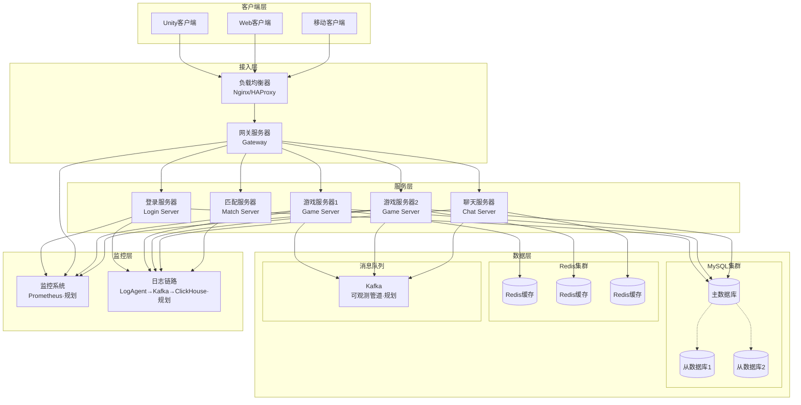
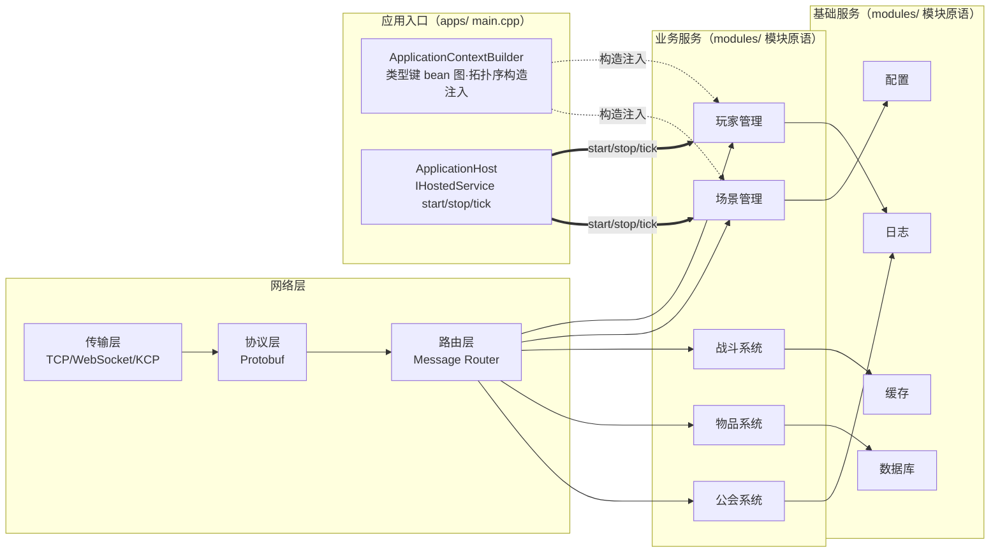
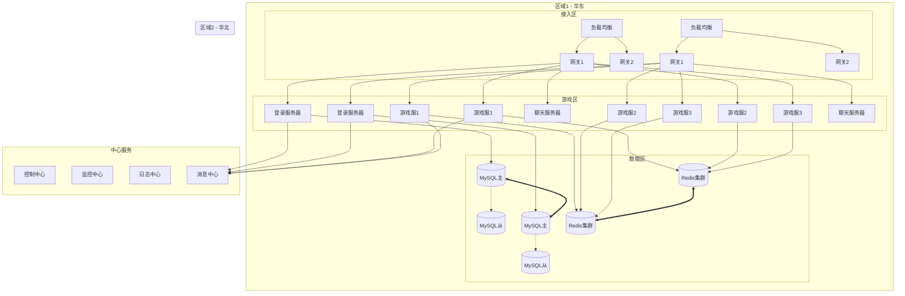

<p align="center">
  
</p>

# Apollo MMORPG 服务器框架

[](https://github.com/cuihairu/apollo/blob/main/LICENSE)
[](https://github.com/cuihairu/apollo)
[](https://github.com/cuihairu/apollo)
[](https://github.com/cuihairu/apollo/actions/workflows/ci.yml)
[](https://codecov.io/gh/cuihairu/apollo)

> 一个高性能、模块化的MMORPG服务器开发框架

## 📖 项目简介

Apollo是一个专为大型多人在线角色扮演游戏（MMORPG）设计的服务器框架。它采用现代C++20开发，提供了完整的游戏服务器解决方案，包括网络通信、数据存储、游戏逻辑、战斗系统等核心模块。

### 核心特性

- 🏗️ **极简构造注入 DI** - `apollo::core::di`：类型键 bean 图、拓扑序装配，+ `ApplicationHost` 帧驱动生命周期（`IHostedService` start/stop/tick）；明确不采用 Spring 式运行时容器（论证见 `docs/analysis/ioc-review.md` §0）
- 📜 **实体契约系统** - XML+XSD 契约（attrs/messages/entities/errors，错拼即报错）+ 独立生成器 `apollo_gen`，生成器不进运行时链接图（`sdks/contract`，docs/36 决策 #3/#4/#5）
- 🌐 **高性能网络层** - 跨平台异步I/O（IOCP/Epoll）
- 📦 **Protobuf消息系统** - 高效的序列化和RPC框架
- 🔥 **ECS战斗系统** - 灵活的实体-组件-系统架构
- 👁 **AOI九宫格系统** - 高效的视野管理
- 💾 **数据存储层** - 数据库连接池和Redis缓存
- ⚡ **日志系统** - 多级别异步日志
- 🔧 **工具类库** - 线程池、内存池、配置管理等
- 🧩 **BigWorld兼容层** - BigWorld 风格 C++ API facade（见 `docs/33-BigWorld_Compatibility.md`）

## 🏛️ 架构设计

### 系统架构概览（目标形态，按 docs/todo.md 批次落地）


```mermaid
graph TB
    subgraph "客户端层"
        C1[Unity客户端]
        C2[Web客户端]
        C3[移动客户端]
    end

    subgraph "接入层"
        LB[负载均衡器<br/>Nginx/HAProxy]
        GW[网关服务器<br/>Gateway]
    end

    subgraph "服务层"
        LS[登录服务器<br/>Login Server]
        GS1[游戏服务器1<br/>Game Server]
        GS2[游戏服务器2<br/>Game Server]
        CS[聊天服务器<br/>Chat Server]
        MS[匹配服务器<br/>Match Server]
    end

    subgraph "数据层"
        subgraph "MySQL集群"
            DB1[(主数据库)]
            DB2[(从数据库1)]
            DB3[(从数据库2)]
        end

        subgraph "Redis集群"
            R1[(Redis缓存)]
            R2[(Redis缓存)]
            R3[(Redis缓存)]
        end

        subgraph "消息队列"
            MQ[Kafka<br/>可观测管道·规划]
        end
    end

    subgraph "监控层"
        MON[监控系统<br/>Prometheus·规划]
        LOG[日志链路<br/>LogAgent→Kafka→ClickHouse·规划]
    end

    C1 --> LB
    C2 --> LB
    C3 --> LB
    LB --> GW
    GW --> LS
    GW --> GS1
    GW --> GS2
    GW --> CS
    GW --> MS

    LS --> DB1
    GS1 --> DB1
    GS2 --> DB1
    GS1 --> R1
    GS2 --> R2
    CS --> R3

    GS1 --> MQ
    GS2 --> MQ
    CS --> MQ

    DB1 -.-> DB2
    DB1 -.-> DB3

    LS --> LOG
    GS1 --> LOG
    GS2 --> LOG
    CS --> LOG
    MS --> LOG

    LS --> MON
    GW --> MON
    GS1 --> MON
    GS2 --> MON
```

### 核心模块架构


```mermaid
graph LR
    subgraph "网络层"
        T1[传输层<br/>TCP/WebSocket/KCP]
        P1[协议层<br/>Protobuf]
        R1[路由层<br/>Message Router]
    end

    subgraph "业务服务（modules/ 模块原语）"
        A1[玩家管理]
        S1[场景管理]
        B1[战斗系统]
        I1[物品系统]
        G1[公会系统]
    end

    subgraph "基础服务（modules/ 模块原语）"
        LOG[日志]
        CONF[配置]
        CACHE[缓存]
        DB[数据库]
    end

    subgraph "应用入口（apps/ main.cpp）"
        ASM[ApplicationContextBuilder<br/>类型键 bean 图·拓扑序构造注入]
        HOST[ApplicationHost<br/>IHostedService start/stop/tick]
    end

    T1 --> P1
    P1 --> R1
    R1 --> A1
    R1 --> S1
    R1 --> B1
    R1 --> I1
    R1 --> G1

    A1 --> LOG
    S1 --> CONF
    B1 --> CACHE
    I1 --> DB
    G1 --> LOG

    ASM -.构造注入.-> A1
    ASM -.构造注入.-> S1
    HOST ==start/stop/tick==> A1
    HOST ==start/stop/tick==> S1
```

> 模块间依赖为**编译期构造注入**（实线 = 直接依赖，无运行时容器中介）；装配与生命周期托管只存在于应用入口 `apps/`（`ApplicationContextBuilder` 拓扑序建图、`ApplicationHost` 帧驱动托管），模块内部互不感知容器。明确不采用 Spring 式运行时容器——论证见 `docs/analysis/ioc-review.md` §0/§17。

### 分布式部署架构（目标形态）


```mermaid
graph TB
    subgraph "区域1 - 华东"
        subgraph "接入区"
            ELB1[负载均衡]
            GW1_1[网关1]
            GW1_2[网关2]
        end

        subgraph "游戏区"
            LS1[登录服务器]
            GS1_1[游戏服1]
            GS1_2[游戏服2]
            GS1_3[游戏服3]
            CS1[聊天服务器]
        end

        subgraph "数据区"
            M1[(MySQL主)]
            S1[(MySQL从)]
            R1_1[(Redis集群)]
        end
    end

    subgraph "区域2 - 华北"
        subgraph "接入区"
            ELB2[负载均衡]
            GW2_1[网关1]
            GW2_2[网关2]
        end

        subgraph "游戏区"
            LS2[登录服务器]
            GS2_1[游戏服1]
            GS2_2[游戏服2]
            GS2_3[游戏服3]
            CS2[聊天服务器]
        end

        subgraph "数据区"
            M2[(MySQL主)]
            S2[(MySQL从)]
            R2_1[(Redis集群)]
        end
    end

    subgraph "中心服务"
        CC[控制中心]
        MON[监控中心]
        LOG[日志中心]
        MQ[消息中心]
    end

    ELB1 --> GW1_1
    ELB1 --> GW1_2
    ELB2 --> GW2_1
    ELB2 --> GW2_2

    GW1_1 --> LS1
    GW1_1 --> GS1_1
    GW1_1 --> GS1_2
    GW1_1 --> GS1_3
    GW1_1 --> CS1

    GW2_1 --> LS2
    GW2_1 --> GS2_1
    GW2_1 --> GS2_2
    GW2_1 --> GS2_3
    GW2_1 --> CS2

    LS1 --> M1
    GS1_1 --> R1_1
    GS1_2 --> R1_1
    GS1_3 --> R1_1

    LS2 --> M2
    GS2_1 --> R2_1
    GS2_2 --> R2_1
    GS2_3 --> R2_1

    M1 -.-> S1
    M2 -.-> S2

    M1 <==> M2
    R1_1 <==> R2_1

    LS1 --> MQ
    LS2 --> MQ
    GS1_1 --> MQ
    GS2_1 --> MQ
```

### 技术栈

- **编程语言**: C++20
- **构建系统**: CMake + Ninja，vcpkg 清单模式管理依赖
- **网络库**: 自实现跨平台网络层
- **序列化**: Google Protobuf；实体契约为 XML+XSD def 体系 + 独立生成器 `apollo_gen`（`sdks/contract`）
- **数据库**: MySQL 8（主存储）+ Redis（缓存/会话）+ ClickHouse（分析，规划）；PostgreSQL 留缝（docs/36 决策 #17）
- **消息队列**: Kafka 用于可观测管道（规划，决策 #14）；服务间通信用自研消息总线（规划，`docs/design/net-abstraction.md`）
- **监控系统**: Prometheus + Grafana（规划，批次8）
- **日志系统**: 自研多级别日志（`apollo::core::log`）；目标链路 LogAgent→Kafka→ClickHouse（决策 #14）
- **测试框架**: GTest + 零依赖断言式单测
- **CI/CD**: GitHub Actions

## 🚀 快速开始

### 环境要求

- C++20 或更高版本
- CMake 3.16+
- GCC 9+ / Clang 10+ / MSVC 2019+
- MySQL 8.0+ (可选)
- Redis 6.0+ (可选)

### 编译项目

```bash
# 克隆项目
git clone https://github.com/cuihairu/apollo.git
cd apollo

# 安装 vcpkg（用于依赖管理）
git clone https://github.com/microsoft/vcpkg.git
./vcpkg/bootstrap-vcpkg.sh

# 创建构建目录
cmake -B build -G Ninja \
  -DCMAKE_BUILD_TYPE=Release \
  -DCMAKE_TOOLCHAIN_FILE="$PWD/vcpkg/scripts/buildsystems/vcpkg.cmake" \
  -DVCPKG_TARGET_TRIPLET=x64-linux   # macOS: x64-osx / arm64-osx

# 编译
cmake --build build --parallel

# 运行示例
./build/examples/all_features_demo
```

### Windows (Visual Studio)

```bash
# 使用 Visual Studio 2019 或更高版本
git clone https://github.com/cuihairu/apollo.git
cd apollo

git clone https://github.com/microsoft/vcpkg.git
.\vcpkg\bootstrap-vcpkg.bat

cmake -B build -G "Visual Studio 16 2019" ^
  -DCMAKE_TOOLCHAIN_FILE=%cd%\\vcpkg\\scripts\\buildsystems\\vcpkg.cmake ^
  -DVCPKG_TARGET_TRIPLET=x64-windows

# 打开 build\\Apollo.sln 进行编译
```

## 📚 模块说明

### Core 核心框架（modules/core · modules/runtime）
- **依赖注入**: `apollo::core::di` 极简构造注入容器——类型键 bean 图、拓扑序装配、仅 Singleton/Prototype 两档作用域；明确不采用 Spring 式运行时容器（`docs/analysis/ioc-review.md` §0）
- **应用生命周期**: `ApplicationHost` 帧驱动托管——`IHostedService` start/stop/tick + 六阶段状态机（Boot→…→Stopped）
- **配置**: `apollo::core::config::ConfigRegistry` 键值注册表；热更规划走 tick 边界换 ConfigSnapshot（ioc-review §17.6）
- *(legacy `Apollo::` IoC 框架仍在仓库中清退，见 ioc-review §6 删除式迁移)*

### Game 游戏逻辑
- **AOI系统**: 九宫格空间索引，高效视野管理
- **战斗系统**: ECS架构，支持技能、Buff、状态机
- **属性系统**: 灵活的属性计算和同步机制
- **场景管理**: 多场景支持和场景迁移

### Network 网络通信
- **传输层**: Socket封装，支持TCP/WebSocket/KCP
- **消息层**: Protobuf消息路由和处理
- **RPC框架**: 远程过程调用框架

### Storage 存储层
- **数据库连接池**: MySQL连接管理和复用
- **Redis客户端**: 完整的Redis命令支持
- **序列化**: 多种数据序列化方案

### Utils 工具库
- **日志系统**: 多级别异步日志，文件/控制台输出
- **线程池**: 高性能任务调度
- **内存池**: 优化的内存管理
- **配置系统**: JSON/XML/Lua配置支持

### Compatibility 兼容层
- **BigWorld Compatibility Layer**: BigWorld-style C++ API facade (see `docs/33-BigWorld_Compatibility.md`)
- **BigWorld API Tests**: `tests/test_bigworld_api.cpp` (CTest: `BigWorldApiTests`)

## 🔧 使用示例

### 服务器基础框架

```cpp
#include "apollo/core/di/application_context.hpp"
#include "apollo/runtime/application_host.hpp"

// 业务 bean：普通类，依赖走构造函数（无注解、无注册宏）
struct GameClockService {
    std::string name = "game_clock";
};

class LoginPipeline {
public:
    explicit LoginPipeline(GameClockService& clock) : clock_(clock) {}
private:
    GameClockService& clock_;
};

// 托管服务：实现 IHostedService，由 ApplicationHost 帧驱动
class GameServerService : public apollo::runtime::IHostedService {
public:
    explicit GameServerService(apollo::core::di::ApplicationContext& ctx)
        : clock_(ctx.get<GameClockService>()) {}

    std::string_view service_name() const override { return "game_server"; }
    bool start() override { return true; }
    void stop() override {}
    bool is_running() const override { return true; }
    void tick() override { /* 每帧业务逻辑 */ }

private:
    GameClockService& clock_;
};

int main() {
    // 装配：bean 图 = 一串 add_singleton，依赖即模板参数
    apollo::core::di::ApplicationContextBuilder builder;
    builder.add_singleton<GameClockService>().name("game_clock");
    builder.add_singleton<LoginPipeline, GameClockService>().name("login_pipeline");
    auto context = builder.build();
    if (!context.initialize()) {
        return 1;  // 拓扑序构造，失败即退出
    }

    // 托管：start → run_once 帧循环 → stop
    apollo::runtime::ServiceHost host;
    host.add_service(std::make_shared<GameServerService>(context));
    if (!host.start()) {
        return 1;
    }
    while (host.is_running()) {
        host.run_once();
    }
    host.stop();
    return 0;
}
```

> 完整可运行版本见 `apps/game-server/src/main.cpp`。装配只发生在应用入口（apps/），模块内部互不感知容器。

### 使用AOI系统

```cpp
#include "apollo/game/aoi/AOIManager.h"

// 初始化AOI管理器
auto& aoi = apollo::AOIManager::Instance();
aoi.Initialize(100.0f);  // 100米网格

// 创建实体
apollo::AOIEntity player(1001, 1);
player.position = {100.0f, 0.0f, 100.0f};
player.aoiRadius = 30.0f;

// 更新到AOI
aoi.UpdateEntity(player);

// 获取可见实体
auto visible = aoi.GetVisibleEntities(1001);
for (auto id : visible) {
    std::cout << "Entity " << id << " is visible" << std::endl;
}
```

### 使用战斗系统

```cpp
#include "apollo/game/battle/BattleWorld.h"
#include "apollo/game/battle/components.hpp"

// 创建战斗世界
auto world = std::make_unique<apollo::BattleWorld>(1);

// 创建玩家实体
auto player = world->CreateEntity(1001);
auto transform = player->AddComponent<apollo::TransformComponent>();
auto attributes = player->AddComponent<apollo::AttributeComponent>();
auto battleState = player->AddComponent<apollo::BattleStateComponent>();

// 设置属性
attributes->SetLevel(50);
attributes->SetHp(1000);
attributes->SetAttack(150);

// 更新战斗世界
world->Update(deltaTime);
```

## 📊 性能指标

| 指标 | 目标值 | 说明 |
|------|--------|------|
| 单服承载 | 5000+ CCU | 单GameServer并发用户数 |
| 响应延迟 | P99 < 50ms | 核心操作响应时间 |
| 内存使用 | < 2GB | 5000用户内存占用 |
| 网络吞吐 | 100MB/s | 峰值网络带宽 |
| 数据库连接 | 1000+ | 最大连接池大小 |

## 🧪 测试

项目包含完整的单元测试和示例代码：

```bash
# 运行所有测试
cd build && ctest

# 仅运行 BigWorld 兼容层测试
cd build && ctest -R BigWorldApiTests

# 运行功能演示
./examples/all_features_demo
```

测试覆盖：
- IoC容器测试
- 网络通信测试
- 数据库操作测试
- Redis操作测试
- AOI系统测试
- 属性系统测试
- BigWorld 兼容层 API 测试（`BigWorldApiTests`）

## 📋 目录结构

```
apollo/
├── apps/                   # 可执行服务：login/gateway/base/cell/game-server
├── modules/                # 模块化源码：base/core/data/game/net/runtime 等
├── include/                # 公共头文件与兼容层头文件
├── src/                    # 公共实现与兼容层实现
├── tests/                  # 测试代码
├── examples/               # 示例代码
├── sdks/                   # Unity 客户端 SDK 与契约工具（contract 契约 + gen 生成器 + cpp 生成物）
├── skds/                   # Cocos / Laya / 历史 SDK 工作区
├── docs/                   # VitePress 文档站点
├── cmake/                  # CMake 辅助脚本
└── build*/                 # 构建输出
```

详细目录说明见 [Directory Structure](docs/Directory_Structure.md)

## 🔌 客户端SDK

### Unity SDK

提供完整的Unity客户端SDK，支持：

- 网络通信管理
- 消息序列化/反序列化
- 自动重连机制
- 资源热更新
- 性能监控

```csharp
// Unity SDK使用示例
var config = new ApolloClientConfig {
    ServerAddress = "game.example.com",
    Port = 7700,
    Protocol = TransportProtocol.Tcp
};

var client = new ApolloClient(config);
await client.ConnectAsync();
await client.LoginAsync(loginRequest);
```

## 🤝 贡献指南

欢迎贡献代码！请遵循以下步骤：

1. Fork 项目
2. 创建特性分支 (`git checkout -b feature/AmazingFeature`)
3. 提交更改 (`git commit -m 'Add some AmazingFeature'`)
4. 推送到分支 (`git push origin feature/AmazingFeature`)
5. 创建 Pull Request

### 代码规范

- 遵循 [Google C++ Style Guide](https://google.github.io/styleguide/cppguide.html)
- 使用有意义的变量和函数名
- 添加适当的注释
- 编写单元测试

## 📄 许可证

本项目采用 [MIT License](LICENSE) 许可证。

## 🙏 致谢

- 感谢所有贡献者的努力
- 感谢开源社区的支持
- 感谢所有用户的反馈和建议

## 📞 联系方式

- 项目主页: https://github.com/cuihairu/apollo
- 问题反馈: [Issues](https://github.com/cuihairu/apollo/issues)
- 邮箱: cuihairu@example.com

---

**Apollo - 构建你的MMORPG世界** 🎮
