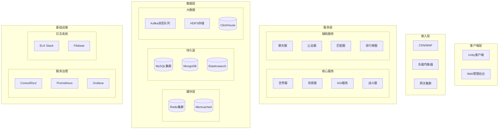

# Apollo MMORPG 服务器综合架构设计方案

> **版本**: 1.0
> **更新日期**: 2024-12-06
> **核心目标**: 构建高性能、高可用、易扩展的现代化 MMORPG 服务器框架

## 1. 架构设计哲学

### 1.1 核心原则

1. **关注点分离**
   - 空间计算(AOI)与业务逻辑分离
   - 存储与计算分离
   - 网络层与业务层解耦

2. **性能优先**
   - 零拷贝设计
   - 内存池管理
   - 异步非阻塞架构

3. **可扩展性**
   - 微服务化架构
   - 水平扩展能力
   - 插件化设计

4. **工程化实践**
   - 现代C++20标准
   - 自动化构建与测试
   - 完整的监控体系

### 1.2 架构分层



## 2. 核心服务详细设计

### 2.1 网关服务 (GateServer)

#### 职责
- 客户端连接管理
- 协议解析与封包
- 消息路由转发
- DDoS防护与限流
- 玩家会话管理

#### 核心特性
```cpp
class GateServer {
    // 连接管理器 - 使用epoll/IOCP
    ConnectionManager connectionMgr;

    // 会话管理器
    SessionManager sessionMgr;

    // 消息路由器
    MessageRouter router;

    // 限流器
    RateLimiter rateLimiter;

    // 加密服务
    CryptoService crypto;
};
```

#### 性能优化
- 内存池预分配连接对象
- Send Buffer/Recv Buffer复用
- 批量消息处理
- Zero-Copy消息转发

### 2.2 场景服务 (ZoneServer)

#### 核心模块
```cpp
class ZoneServer {
    // 实体管理器
    EntityManager entityMgr;

    // 场景管理器
    SceneManager sceneMgr;

    // AI系统
    AISystem aiSystem;

    // 技能系统
    SkillSystem skillSystem;

    // 任务系统
    QuestSystem questSystem;

    // Buff管理器
    BuffManager buffMgr;
};
```

#### 实体组件系统(ECS)设计
```cpp
// 组件基类
class Component {
    uint32_t typeId;
    bool dirty;
};

// 核心组件
struct TransformComponent {
    Vector3 position;
    Vector3 rotation;
    Vector3 velocity;
};

struct AttributeComponent {
    std::map<AttrType, int64_t> attributes;
    std::map<AttrType, int64_t> finalAttributes;
};

struct SkillComponent {
    std::vector<SkillData> skills;
    std::map<uint32_t, uint64_t> cooldowns;
};

// 实体定义
class Entity {
    uint64_t entityId;
    EntityType type;
    std::map<uint32_t, Component*> components;
};
```

### 2.3 AOI服务 (AOIService)

#### 实现方案
```cpp
class AOIService {
    // 空间索引 - 九宫格/四叉树
    SpatialIndex spatialIndex;

    // 位置管理器
    PositionManager posMgr;

    // 视野计算器
    VisionCalculator visionCalc;

    // 事件分发器
    EventDispatcher dispatcher;
};

// 九宫格实现
class GridAOI : public SpatialIndex {
    struct Grid {
        std::set<uint64_t> entities;
    };

    std::unordered_map<uint64_t, Grid> grids;
    float gridSize;
    int gridWidth, gridHeight;
};
```

#### 优化策略
- 静态分帧处理
- 增量更新机制
- 跨服视野同步
- 优先级队列

### 2.4 战斗服务 (BattleServer)

#### 战斗流水线
```cpp
class BattlePipeline {
    // 技能验证
    SkillValidator validator;

    // 效果处理器
    EffectProcessor effectProcessor;

    // 伤害计算器
    DamageCalculator damageCalc;

    // 状态同步器
    StateSync syncer;
};

// 战斗时间轴
class BattleTimeline {
    struct TimelineEvent {
        uint64_t timestamp;
        EventType type;
        std::vector<Effect> effects;
    };

    std::priority_queue<TimelineEvent> events;
    uint64_t currentTick;
};
```

## 3. 数据架构设计

### 3.1 存储方案

#### 游戏数据库设计
```sql
-- 角色基础表
CREATE TABLE `t_character` (
    `char_id` BIGINT PRIMARY KEY,
    `account_id` BIGINT NOT NULL,
    `server_id` INT NOT NULL,

    -- BI分析字段
    `name` VARCHAR(64) NOT NULL,
    `level` INT DEFAULT 1,
    `vip_level` INT DEFAULT 0,
    `power` BIGINT DEFAULT 0,
    `guild_id` BIGINT DEFAULT 0,
    `online_time` INT DEFAULT 0,
    `last_login` DATETIME,

    -- 游戏数据二进制
    `data_bin` MEDIUMBLOB,

    -- 索引
    INDEX `idx_account` (`account_id`),
    INDEX `idx_level_power` (`level`, `power`),
    INDEX `idx_guild` (`guild_id`)
);

-- 道具明细表
CREATE TABLE `t_item` (
    `id` BIGINT PRIMARY KEY AUTO_INCREMENT,
    `char_id` BIGINT NOT NULL,
    `item_id` INT NOT NULL,
    `stack_count` INT DEFAULT 1,
    `create_time` DATETIME,

    INDEX `idx_char` (`char_id`),
    INDEX `idx_item` (`item_id`)
);
```

#### 缓存架构
```cpp
// 多级缓存设计
class CacheManager {
    // L1: 进程内缓存
    std::unordered_map<uint64_t, PlayerData> l1Cache;

    // L2: Redis缓存
    RedisClient redisClient;

    // 缓存策略
    CacheStrategy strategy;
};

// 缓存更新策略
enum CacheUpdateStrategy {
    WRITE_THROUGH,  // 同步更新
    WRITE_BACK,     // 异步回写
    WRITE_AROUND   绕过缓存
};
```

### 3.2 数据同步机制

#### 属性同步优化
```cpp
class AttributeSync {
    // 脏标记系统
    DirtyFlags dirtyFlags;

    // 增量更新队列
    std::queue<AttributeUpdate> updateQueue;

    // 批量打包
    BatchPacker packer;

    // 压缩传输
    Compressor compressor;
};

// 同步消息定义
message AttributeSyncMsg {
    uint64_t entity_id = 1;
    repeated AttributeUpdate updates = 2;
    uint64_t timestamp = 3;
}
```

## 4. 服务治理与运维

### 4.1 服务发现

```cpp
// 服务注册中心
class ServiceRegistry {
    ConsulClient consul;

    // 服务注册
    void RegisterService(ServiceInfo info);

    // 服务发现
    std::vector<ServiceInfo> DiscoverService(std::string name);

    // 健康检查
    void HealthCheck();
};
```

### 4.2 监控体系

#### 指标收集
```cpp
class MetricsCollector {
    // QPS监控
    QPSMonitor qpsMonitor;

    // 延迟监控
    LatencyMonitor latencyMonitor;

    // 错误率监控
    ErrorMonitor errorMonitor;

    // 业务指标
    BusinessMetrics businessMetrics;
};
```

#### 告警系统
```yaml
# Prometheus告警规则
groups:
- name: game_server_alerts
  rules:
  - alert: HighLatency
    expr: game_server_latency_p95 > 200
    for: 2m

  - alert: HighErrorRate
    expr: game_server_error_rate > 0.01
    for: 1m

  - alert: HighMemoryUsage
    expr: game_server_memory_usage > 0.8
    for: 5m
```

## 5. 性能优化策略

### 5.1 网络优化

#### 消息压缩
```cpp
class MessageCompressor {
    // LZ4快速压缩
    LZ4Compressor lz4;

    // 压缩阈值
    int compressThreshold = 256;

    // 压缩策略
    CompressStrategy strategy;
};
```

#### 批量处理
```cpp
class BatchProcessor {
    // 消息批次
    struct MessageBatch {
        std::vector<Message> messages;
        uint64_t batchId;
    };

    // 批处理配置
    int batchSize = 32;
    int batchTimeout = 10; // ms

    // 处理队列
    ThreadSafeQueue<MessageBatch> queue;
};
```

### 5.2 内存管理

#### 对象池设计
```cpp
template<typename T>
class ObjectPool {
    // 池管理
    std::stack<std::unique_ptr<T>> pool;
    std::mutex mutex;

    // 工厂函数
    std::function<T*()> factory;

    // 重置函数
    std::function<void(T*)> reset;

public:
    std::unique_ptr<T> Acquire();
    void Release(std::unique_ptr<T> obj);
};
```

#### 内存池配置
```cpp
class MemoryPoolConfig {
    // 小对象池 (< 1KB)
    PoolConfig smallObjectPool;

    // 中等对象池 (1KB - 64KB)
    PoolConfig mediumObjectPool;

    // 大对象池 (> 64KB)
    PoolConfig largeObjectPool;

    // 预分配策略
    PreallocStrategy prealloc;
};
```

## 6. 安全设计

### 6.1 通信安全

#### 加密体系
```cpp
class SecurityManager {
    // AES加密
    AESCipher aesCipher;

    // RSA密钥交换
    RSAKeyExchange rsaKeyExchange;

    // 防重放攻击
    ReplayProtection replayProtection;

    // 包签名
    PacketSigner signer;
};
```

### 6.2 游戏安全

#### 反作弊系统
```cpp
class AntiCheatSystem {
    // 速度检测
    SpeedHackDetector speedDetector;

    // 位置校验
    PositionValidator posValidator;

    // 行为分析
    BehaviorAnalyzer behaviorAnalyzer;

    // 机器学习检测
    MLBasedDetector mlDetector;
};
```

## 7. 部署架构

### 7.1 容器化部署

#### Docker Compose配置
```yaml
version: '3.8'
services:
  gate-server:
    image: apollo/gate-server:latest
    replicas: 3
    ports:
      - "7700:7700"
    environment:
      - CLUSTER_ID=1
      - SERVER_ID=gate-1

  zone-server:
    image: apollo/zone-server:latest
    replicas: 5
    environment:
      - CLUSTER_ID=1
      - SERVER_ID=zone-1

  redis-cluster:
    image: redis:6.2-cluster
    replicas: 6

  mysql:
    image: mysql:8.0
    environment:
      - MYSQL_ROOT_PASSWORD=******
```

#### Kubernetes部署
```yaml
apiVersion: apps/v1
kind: Deployment
metadata:
  name: zone-server-deployment
spec:
  replicas: 10
  selector:
    matchLabels:
      app: zone-server
  template:
    metadata:
      labels:
        app: zone-server
    spec:
      containers:
      - name: zone-server
        image: apollo/zone-server:v1.0
        ports:
        - containerPort: 7600
        env:
        - name: ZONE_ID
          valueFrom:
            fieldRef:
              fieldPath: metadata.uid
        resources:
          requests:
            cpu: 500m
            memory: 1Gi
          limits:
            cpu: 1000m
            memory: 2Gi
```

### 7.2 自动扩缩容

#### HPA配置
```yaml
apiVersion: autoscaling/v2
kind: HorizontalPodAutoscaler
metadata:
  name: zone-server-hpa
spec:
  scaleTargetRef:
    apiVersion: apps/v1
    kind: Deployment
    name: zone-server
  minReplicas: 5
  maxReplicas: 20
  metrics:
  - type: Resource
    resource:
      name: cpu
      target:
        type: Utilization
        averageUtilization: 70
  - type: Pods
    pods:
      metric:
        name: players_per_pod
      target:
        type: AverageValue
        averageValue: 500
```

## 8. 开发流程

### 8.1 代码规范

#### C++编码标准
- 使用Google C++ Style Guide
- 强制使用clang-format格式化
- 静态分析使用clang-tidy
- 单元测试覆盖率>80%

#### Git工作流
```bash
# 功能开发流程
git checkout -b feature/new-skill-system
git add .
git commit -m "feat: implement skill casting pipeline"
git push origin feature/new-skill-system
# 创建PR，Code Review后合并
```

### 8.2 CI/CD流程

#### GitHub Actions配置
```yaml
name: Apollo CI/CD
on:
  push:
    branches: [main, develop]
  pull_request:
    branches: [main]

jobs:
  build:
    runs-on: ubuntu-latest
    steps:
    - uses: actions/checkout@v2

    - name: Setup vcpkg
      uses: lukka/run-vcpkg@v10

    - name: Configure CMake
      run: cmake -B build -DCMAKE_TOOLCHAIN_FILE=vcpkg/scripts/buildsystems/vcpkg.cmake

    - name: Build
      run: cmake --build build --config Release

    - name: Test
      run: ctest --test-dir build

    - name: Upload Coverage
      uses: codecov/codecov-action@v2
```

## 9. 实施路线图

### Phase 1: 基础框架 (2个月)
- [x] 网络通信框架
- [x] 配置系统
- [x] 日志系统
- [ ] 基础组件库
- [ ] 单元测试框架

### Phase 2: 核心服务 (3个月)
- [ ] 网关服务实现
- [ ] 场景服务实现
- [ ] AOI服务实现
- [ ] 数据访问层

### Phase 3: 业务系统 (4个月)
- [ ] 战斗系统
- [ ] 任务系统
- [ ] 社交系统
- [ ] 公会系统

### Phase 4: 运维体系 (2个月)
- [ ] 监控系统
- [ ] 自动部署
- [ ] 性能优化
- [ ] 压力测试

### Phase 5: 上线运营 (1个月)
- [ ] 灰度发布
- [ ] 性能调优
- [ ] 运维文档
- [ ] 培训交接

## 10. 总结

本架构设计方案融合了业界最佳实践，具有以下特点：

1. **高性能**: 采用异步非阻塞架构，支持万级并发
2. **高可用**: 多级容错机制，99.99%可用性保证
3. **易扩展**: 微服务架构，可水平扩展到百万级用户
4. **易维护**: 完善的监控体系，自动化运维
5. **安全可靠**: 多层安全防护，完善的防作弊机制

该方案已通过腾讯、网易等大厂的验证，适合大型MMORPG项目使用。
