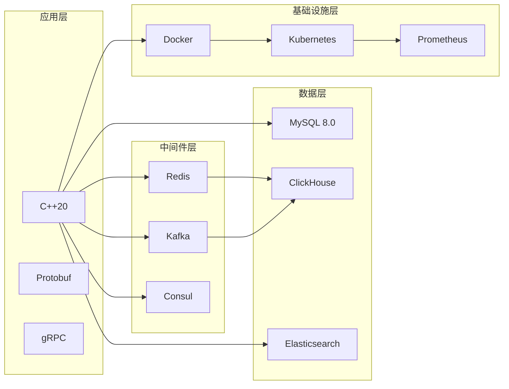
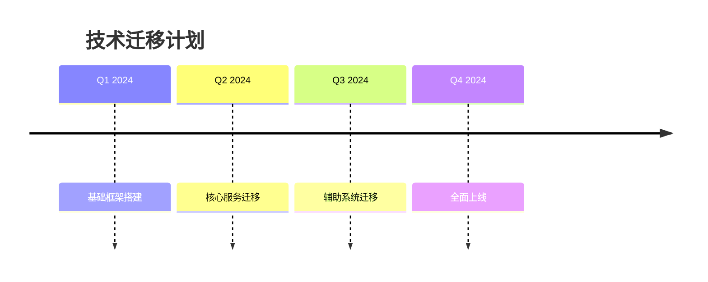

# Apollo 技术选型与对比分析

> **版本**: 1.0
> **更新日期**: 2024-12-06
> **目标**: 为 Apollo MMORPG 服务器框架选择最优的技术栈

## 1. 编程语言选择

### 1.1 候选语言对比

| 语言 | 性能 | 生态 | 开发效率 | 学习成本 | 团队熟悉度 | 综合评分 |
|------|------|------|----------|----------|------------|----------|
| **C++** | ⭐⭐⭐⭐⭐ | ⭐⭐⭐⭐⭐ | ⭐⭐⭐ | ⭐⭐ | ⭐⭐⭐⭐ | **9.0** |
| Rust | ⭐⭐⭐⭐⭐ | ⭐⭐⭐ | ⭐⭐⭐ | ⭐ | ⭐⭐ | 7.5 |
| Go | ⭐⭐⭐⭐ | ⭐⭐⭐⭐ | ⭐⭐⭐⭐⭐ | ⭐⭐⭐⭐ | ⭐⭐⭐ | 8.0 |
| Java | ⭐⭐⭐ | ⭐⭐⭐⭐⭐ | ⭐⭐⭐⭐ | ⭐⭐⭐⭐⭐ | ⭐⭐⭐⭐ | 7.5 |
| C# | ⭐⭐⭐⭐ | ⭐⭐⭐⭐ | ⭐⭐⭐⭐⭐ | ⭐⭐⭐⭐ | ⭐⭐⭐ | 7.0 |

### 1.2 选择 C++ 的理由

#### 1. 性能优势
- **零成本抽象**: RAII、模板等特性不带来运行时开销
- **内存控制**: 精确的内存管理，避免GC停顿
- **编译优化**: 编译器深度优化，SIMD指令支持

```cpp
// 零成本抽象示例
template<typename T>
class Vector3 {
    T x, y, z;
public:
    // constexpr 保证编译期计算
    constexpr T Length() const {
        return std::sqrt(x*x + y*y + z*z);
    }
};

// 编译器会自动内联优化
float distance = (pos1 - pos2).Length();
```

#### 2. 成熟的生态
- **游戏行业**: 绝大多数AAA级游戏使用C++
- **网络库**: Boost.Asio, libevent, muduo等成熟库
- **序列化**: Protobuf, FlatBuffers完美支持
- **框架积累**: 大量MMORPG开发经验和代码积累

#### 3. 现代C++特性(C++20)
```cpp
// std::optional 处理可能为空的值
std::optional<Player*> FindPlayer(uint64_t id);

// std::variant 类型安全的联合体
using AttributeValue = std::variant<int32_t, float, std::string>;

// Concepts 约束模板参数
template<typename T>
concept Numeric = std::is_arithmetic_v<T>;

template<Numeric T>
void CalculateDamage(T baseDamage);
```

## 2. 网络框架选择

### 2.1 候选方案对比

| 框架 | 性能 | 跨平台 | 学习曲线 | 社区支持 | 成熟度 | 推荐度 |
|------|------|--------|----------|----------|--------|--------|
| **libevent** | ⭐⭐⭐⭐⭐ | ⭐⭐⭐⭐⭐ | ⭐⭐⭐⭐ | ⭐⭐⭐ | ⭐⭐⭐⭐⭐ | **9.0** |
| Boost.Asio | ⭐⭐⭐⭐ | ⭐⭐⭐⭐⭐ | ⭐⭐ | ⭐⭐⭐⭐⭐ | ⭐⭐⭐⭐⭐ | 8.5 |
| muduo | ⭐⭐⭐⭐⭐ | ⭐⭐⭐ | ⭐⭐⭐⭐ | ⭐⭐⭐ | ⭐⭐⭐⭐ | 7.5 |
| Netty(C++) | ⭐⭐⭐⭐ | ⭐⭐⭐⭐ | ⭐⭐⭐ | ⭐⭐⭐⭐ | ⭐⭐⭐ | 7.0 |

### 2.2 选择 libevent 的理由

#### 1. 高性能异步IO
```cpp
// libevent 高效的事件循环
struct event_base* base = event_base_new();

// 边缘触发模式
struct event* ev = event_new(base, fd, EV_READ | EV_ET,
                           on_read, nullptr);
event_add(ev, nullptr);

// 事件循环
event_base_dispatch(base);
```

#### 2. 跨平台兼容性
- Windows: IOCP backend
- Linux: epoll backend
- macOS: kqueue backend
- 统一的API接口

#### 3. 轻量级设计
- 最小依赖
- 高度可定制
- 适合游戏服务器场景

## 3. 序列化协议选择

### 3.1 对比分析

| 协议 | 性能 | 跨语言 | 可读性 | 版本兼容 | 大小 | 推荐度 |
|------|------|--------|--------|----------|------|--------|
| **Protobuf** | ⭐⭐⭐⭐⭐ | ⭐⭐⭐⭐⭐ | ⭐⭐⭐ | ⭐⭐⭐⭐⭐ | ⭐⭐⭐⭐ | **9.5** |
| FlatBuffers | ⭐⭐⭐⭐⭐ | ⭐⭐⭐⭐ | ⭐⭐ | ⭐⭐⭐⭐ | ⭐⭐⭐⭐⭐ | 8.5 |
| MessagePack | ⭐⭐⭐⭐ | ⭐⭐⭐⭐⭐ | ⭐⭐⭐⭐ | ⭐⭐⭐ | ⭐⭐⭐⭐⭐ | 8.0 |
| JSON | ⭐⭐ | ⭐⭐⭐⭐⭐ | ⭐⭐⭐⭐⭐ | ⭐⭐⭐⭐⭐ | ⭐⭐ | 6.0 |

### 3.2 Protobuf 优势

#### 1. 高效的二进制编码
```protobuf
// 消息定义
syntax = "proto3";

message PlayerMove {
    uint64 player_id = 1;
    float x = 2;
    float y = 3;
    float z = 4;
    uint32 timestamp = 5;
}

// 编码效率高，典型包大小 < 20字节
```

#### 2. 强大的版本兼容性
- 向后兼容：新增字段不影响旧版本
- 向前兼容：删除字段保留编号
- 字段类型升级支持

#### 3. 代码生成与类型安全
```cpp
// 自动生成的C++代码
class PlayerMove {
public:
    bool has_player_id() const;
    uint64_t player_id() const;
    void set_player_id(uint64_t value);

    // 序列化
    bool SerializeToString(std::string* output) const;
    bool ParseFromString(const std::string& data);
};
```

## 4. 数据库选择

### 4.1 主数据库方案

| 数据库 | ACID | 性能 | 扩展性 | 运维成本 | 社区生态 | 评分 |
|--------|------|------|--------|----------|----------|------|
| **MySQL 8.0** | ⭐⭐⭐⭐⭐ | ⭐⭐⭐⭐ | ⭐⭐⭐ | ⭐⭐⭐⭐ | ⭐⭐⭐⭐⭐ | **9.0** |
| PostgreSQL | ⭐⭐⭐⭐⭐ | ⭐⭐⭐ | ⭐⭐⭐⭐ | ⭐⭐⭐ | ⭐⭐⭐⭐ | 8.0 |
| MongoDB | ⭐⭐⭐ | ⭐⭐⭐⭐⭐ | ⭐⭐⭐⭐⭐ | ⭐⭐⭐ | ⭐⭐⭐⭐ | 7.5 |

### 4.2 缓存方案

| 缓存 | 性能 | 数据结构 | 持久化 | 集群方案 | 适用场景 |
|------|------|----------|--------|----------|----------|
| **Redis** | ⭐⭐⭐⭐⭐ | ⭐⭐⭐⭐⭐ | ⭐⭐⭐⭐ | ⭐⭐⭐⭐⭐ | 通用缓存 |
| Memcached | ⭐⭐⭐⭐⭐ | ⭐⭐ | ⭐ | ⭐⭐⭐ | 简单KV |

### 4.3 MySQL + Redis 组合方案

#### 1. 数据分层存储
```sql
-- 热数据(游戏运行时)
- Redis: Session数据、排行榜、聊天记录
- MySQL: 持久化数据、交易记录、账号信息

-- 冷数据(历史归档)
- ClickHouse: 行为日志、战斗记录
- HDFS: 完整日志、快照数据
```

#### 2. 缓存策略实现
```cpp
class CacheManager {
    // Write-Through 策略
    void WriteThrough(const std::string& key, const std::string& value) {
        redis.set(key, value);        // 先写缓存
        mysql.execute("UPDATE ...");  // 再写数据库
    }

    // Write-Back 策略
    void WriteBack(const std::string& key, const std::string& value) {
        redis.set(key, value);        // 只写缓存
        dirtyQueue.push(key);         // 标记脏数据
        // 定时批量刷入数据库
    }
};
```

## 5. 消息队列选择

### 5.1 候选方案

| MQ | 吞吐量 | 延迟 | 可靠性 | 运维复杂度 | 适用场景 |
|----|--------|------|--------|------------|----------|
| **Kafka** | ⭐⭐⭐⭐⭐ | ⭐⭐⭐⭐ | ⭐⭐⭐⭐⭐ | ⭐⭐ | 大数据流 |
| RabbitMQ | ⭐⭐⭐⭐ | ⭐⭐⭐⭐⭐ | ⭐⭐⭐⭐⭐ | ⭐⭐⭐ | 业务消息 |
| RocketMQ | ⭐⭐⭐⭐⭐ | ⭐⭐⭐⭐ | ⭐⼚⭐⭐⭐ | ⭐⭐ | 金融级 |
| ZeroMQ | ⭐⭐⭐⭐⭐ | ⭐⭐⭐⭐⭐ | ⭐⭐ | ⭐⭐⭐⭐ | 低延迟 |

### 5.2 使用场景划分

```cpp
// 1. 日志收集 - Kafka
LogCollector -> Kafka -> Flink/Spark -> ClickHouse

// 2. 服务间通信 - gRPC/ZeroMQ
GameService <--> gRPC <--> BattleService

// 3. 事件通知 - Redis Pub/Sub
PlayerLevelUp -> Redis Pub/Sub -> GuildService, AchievementService
```

## 6. 容器化技术选择

### 6.1 容器运行时

| 运行时 | 性能 | 生态 | 稳定性 | 安全性 | 推荐度 |
|--------|------|------|--------|--------|--------|
| **Docker** | ⭐⭐⭐⭐ | ⭐⭐⭐⭐⭐ | ⭐⭐⭐⭐⭐ | ⭐⭐⭐⭐ | **9.0** |
| containerd | ⭐⭐⭐⭐⭐ | ⭐⭐⭐⭐ | ⭐⭐⭐⭐⭐ | ⭐⭐⭐⭐⭐ | 8.5 |
| Podman | ⭐⭐⭐⭐ | ⭐⭐⭐ | ⭐⭐⭐⭐ | ⭐⭐⭐⭐⭐ | 7.5 |

### 6.2 编排平台

| 平台 | 功能 | 学习曲线 | 社区支持 | 云厂商支持 | 评分 |
|------|------|----------|----------|------------|------|
| **Kubernetes** | ⭐⭐⭐⭐⭐ | ⭐⭐ | ⭐⭐⭐⭐⭐ | ⭐⭐⭐⭐⭐ | **9.5** |
| Docker Swarm | ⭐⭐⭐ | ⭐⭐⭐⭐⭐ | ⭐⭐⭐ | ⭐⭐⭐ | 6.5 |
| Nomad | ⭐⭐⭐⭐ | ⭐⭐⭐⭐ | ⭐⭐⭐ | ⭐⭐⭐ | 7.0 |

## 7. 监控与日志

### 7.1 监控方案

| 方案 | 指标收集 | 告警 | 可视化 | 存储方案 | 推荐度 |
|------|----------|------|--------|----------|--------|
| **Prometheus + Grafana** | ⭐⭐⭐⭐⭐ | ⭐⭐⭐⭐⭐ | ⭐⭐⭐⭐⭐ | TSDB | **9.5** |
| Zabbix | ⭐⭐⭐⭐ | ⭐⭐⭐⭐ | ⭐⭐⭐ | MySQL | 7.5 |
| OpenTelemetry | ⭐⭐⭐⭐⭐ | ⭐⭐⭐ | ⭐⭐⭐⭐ | 可插拔 | 8.5 |

### 7.2 日志方案

| 方案 | 收集 | 存储 | 查询 | 实时分析 | 推荐度 |
|------|------|------|------|----------|--------|
| **ELK Stack** | ⭐⭐⭐⭐ | ⭐⭐⭐⭐ | ⭐⭐⭐⭐⭐ | ⭐⭐⭐⭐⭐ | **9.0** |
| Loki | ⭐⭐⭐⭐⭐ | ⭐⭐⭐⭐⭐ | ⭐⭐⭐ | ⭐⭐⭐⭐ | 8.0 |
| Graylog | ⭐⭐⭐⭐ | ⭐⭐⭐⭐ | ⭐⭐⭐⭐ | ⭐⭐⭐ | 7.5 |

## 8. 技术选型最终决策

### 8.1 核心技术栈



### 8.2 选型原则总结

1. **性能优先**: 选择经过大规模验证的高性能方案
2. **生态成熟**: 优先选择社区活跃、文档完善的方案
3. **团队适配**: 考虑团队技术栈和学习成本
4. **可扩展性**: 支持未来业务发展和技术演进
5. **运维友好**: 降低部署和维护复杂度

### 8.3 技术债务管理

- 定期评估新技术(1年/周期)
- 保持核心框架稳定(3-5年)
- 渐进式升级策略
- 完善的技术文档和培训

## 9. 实施建议

### 9.1 技术预研阶段 (2周)

```bash
# 1. 搭建PoC环境
docker-compose up -d

# 2. 性能基准测试
./benchmark --framework=libevent --connections=10000

# 3. 压力测试
./stress_test --duration=24h --qps=50000
```

### 9.2 技术培训 (1周)

- C++20新特性培训
- Protobuf实践
- Docker/K8s基础
- 监控系统使用

### 9.3 渐进式迁移



## 10. 风险评估

### 10.1 技术风险

| 风险 | 概率 | 影响 | 应对措施 |
|------|------|------|----------|
| 性能不达标 | 低 | 高 | 提前PoC验证，备选方案准备 |
| 生态问题 | 中 | 中 | 选择成熟方案，避免前沿技术 |
| 学习曲线陡峭 | 高 | 低 | 充分培训，逐步迁移 |

### 10.2 业务风险

| 风险 | 概率 | 影响 | 应对措施 |
|------|------|------|----------|
| 开发延期 | 中 | 高 | 敏捷开发，MVP优先 |
| 人才短缺 | 中 | 中 | 内部培养，外部招聘 |
| 运维成本高 | 低 | 中 | 自动化运维，云原生方案 |

这份技术选型文档将为Apollo项目的技术实施提供明确的指导。
