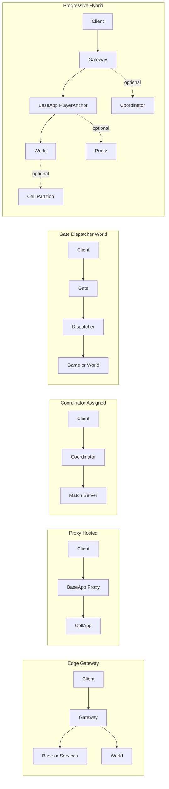
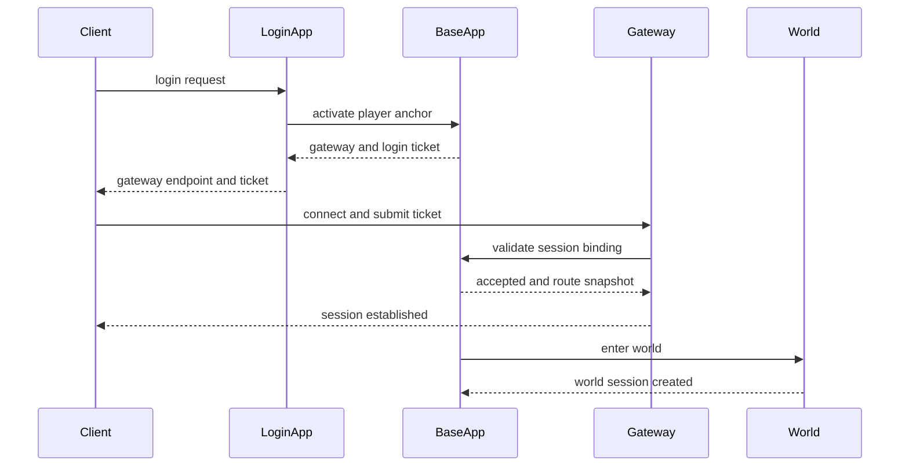
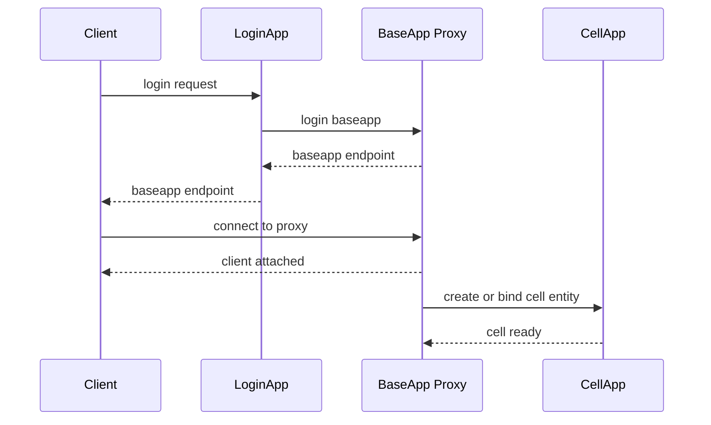
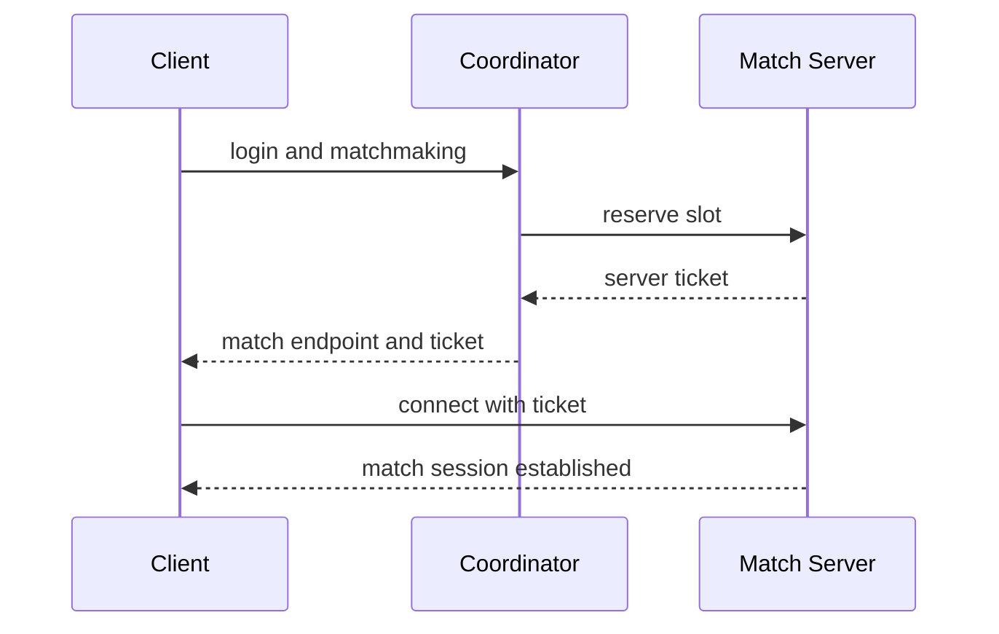
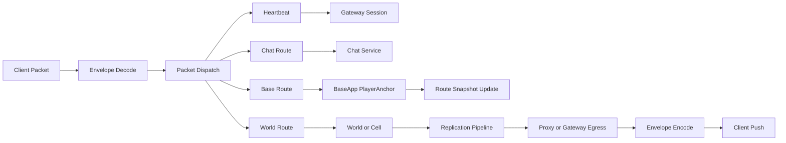
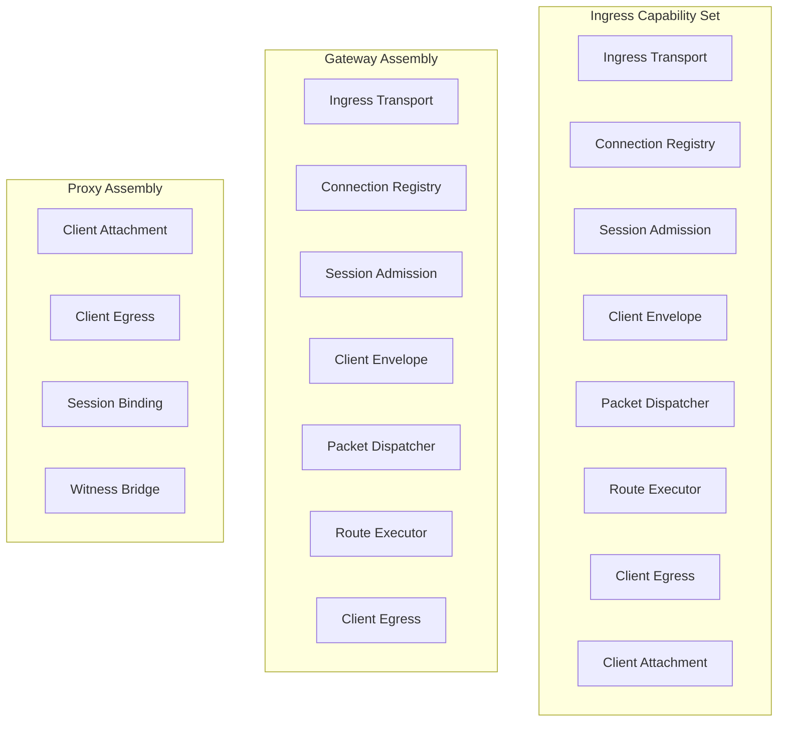

# Topology 对比与登录分发设计

这篇文档解决的是 Apollo 在继续设计时一个必须先统一的问题：

`不同在线游戏服务器拓扑到底怎么命名、怎么比较、各自适合什么场景，以及客户端从登录验证到最终连接、消息分发到底怎么流动。`

如果这层不先统一，后面很容易继续出现：

- `Gateway`
- `Proxy`
- `BaseApp`
- `Coordinator`
- `World`

这些词一会儿指进程，一会儿指对象，一会儿又指能力集合。

## 一、先说结论

Apollo 后续建议统一使用下面 5 个 topology 名字：

- `Edge Gateway Topology`
- `Proxy-Hosted Topology`
- `Coordinator-Assigned Topology`
- `Gate-Dispatcher-World Topology`
- `Progressive Hybrid Topology`

这 5 类不是“某个项目名字的别名”，而是 5 类稳定的架构形态。

对应关系大致如下：

- `Edge Gateway Topology`
  - 现代常见 `Gateway -> Services`
  - `Pitaya` 更接近这一类
- `Proxy-Hosted Topology`
  - `KBE / BigWorld`
- `Coordinator-Assigned Topology`
  - `Dota2 / Valve Game Coordinator` 风格
- `Gate-Dispatcher-World Topology`
  - `GoWorld`
- `Progressive Hybrid Topology`
  - Apollo 推荐目标形态

## 二、5 类 Topology 的核心定义

## 三、`Edge Gateway Topology`

核心结构：

```text
Client -> Gateway -> Base / World / Chat / Social / Match
```

### 核心特点

- 公网连接由边缘网关承接
- session 和 connection 先收在 gateway/front-end
- 后端服务不直接监听客户端连接
- 后端通过内部 RPC 或消息总线协作

### 更接近的项目

- `Pitaya`
- 大多数现代服务化在线架构

### 优点

- 接入层和业务层边界清楚
- 协议升级、限流、防刷、灰度、观测更容易做
- gateway 可以单独扩容
- 非 MMO 场景也能复用

### 缺点

- 多一跳
- 如果把路由权威、在线主状态也压进 gateway，会变成中心单点
- 对 BigWorld 风格的 `Proxy / Witness / Ghost` 语义不天然

### 适用场景

- 普通在线
- 普通 MMO
- 社交大厅
- 房间制
- 多业务服务化在线项目

## 四、`Proxy-Hosted Topology`

核心结构：

```text
Client -> BaseApp(Proxy) -> CellApp
```

### 核心特点

- 没有独立公网 gateway 层
- `BaseApp` 内部的 `Proxy` 承接客户端代理能力
- `CellApp` 承接空间内实时权威
- `Proxy / Base / Cell / Witness / Ghost` 强耦合协作

### 更接近的项目

- `KBE`
- `BigWorld`

### 优点

- 大世界对象模型完整
- 玩家代理、长期逻辑、空间权威分层强
- 适合 authority transfer、witness、ghost、无缝大地图

### 缺点

- 接入层和玩家宿主耦合重
- `BaseApp` 职责很重
- 普通 MMO 和小项目往往会觉得过重
- 工程治理难度高

### 适用场景

- 超大世界 MMO
- 强空间分布
- 无缝地图
- 空间权威迁移

## 五、`Coordinator-Assigned Topology`

核心结构：

```text
Client -> Coordinator -> Assigned Match Server
```

### 核心特点

- 有中央协调服务
- 协调服务负责认证、匹配、分配目标 server、签发 ticket
- 实时游戏运行在独立 match server 或 dedicated server
- coordinator 不承接实时世界模拟

### 更接近的项目

- `Valve Game Coordinator`
- 大部分 match-based 在线系统

### 优点

- 匹配、编排、开局、票据签发非常清楚
- 协调层和实时战斗层边界清楚
- 非常适合赛局化玩法

### 缺点

- 不直接解决 MMO 世界状态问题
- 如果硬套到大世界，会缺 `PlayerAnchor / WorldAssignment / SpaceAuthority`

### 适用场景

- MOBA
- FPS
- 对局制游戏
- 回合战斗局

## 六、`Gate-Dispatcher-World Topology`

核心结构：

```text
Client -> Gate -> Dispatcher -> Game / World
```

### 核心特点

- 有独立 gate
- 有中心 dispatcher 或 central route service
- world/game 节点承接实体与世界逻辑

### 更接近的项目

- `GoWorld`

### 优点

- 比纯服务架构更像 MMO/world 框架
- 比 KBE 轻
- gate 独立，接入治理更现代
- 对普通 MMO 比较友好

### 缺点

- `Dispatcher` 容易成为中心路径
- 大世界语义深度通常仍弱于 KBE/BigWorld
- 后续如果继续做分布式空间，还要补更强的 authority 模型

### 适用场景

- 普通 MMO
- 中型在线世界
- 需要 `Entity / Space / AOI`
- 但复杂度不想直接进入 BigWorld 档

## 七、`Progressive Hybrid Topology`

核心结构不是固定一个，而是分模式组合：

- 默认模式
  - `Client -> Gateway -> BaseApp(PlayerAnchor) -> World`
- 大世界增强模式
  - 在默认模式之上叠加 `Proxy / Witness / Ghost / Authority Transfer / Partition`
- 对局模式
  - 叠加 `Coordinator / Match Server`

### 核心特点

- 不是单一拓扑
- 是一套可渐进装配的拓扑家族
- 相同的底层协议和领域层可以复用
- 不同游戏形态用不同装配方式

### 更接近的目标

- `Apollo`

### 优点

- 普通 MMO 和大世界可以共用一套框架基线
- 不需要一开始就进入 KBE 级复杂度
- 匹配制玩法也能挂进来

### 缺点

- 设计要求最高
- 边界不清时最容易两边都学坏
- 必须严格区分：
  - `GatewaySession`
  - `Proxy`
  - `PlayerAnchor`
  - `WorldSession`

### 适用场景

- 一个框架支持多种游戏类型
- 需要从普通 MMO 渐进到大世界
- 需要长期演化能力

## 八、拓扑总览图



## 九、客户端登录到最终连接的 3 条典型主链

## 十、`Edge Gateway Topology` 登录链



### 说明

- 客户端不直连 `BaseApp`
- `Gateway` 只承接公网接入
- `BaseApp` 才是在线主状态权威

## 十一、`Proxy-Hosted Topology` 登录链



### 说明

- 这里没有独立公网 `Gateway`
- `BaseApp` 的 `Proxy` 吸收了客户端代理能力
- `CellApp` 不直接作为客户端接入入口

## 十二、`Coordinator-Assigned Topology` 登录链



### 说明

- 中央协调层负责分配目标对局 server
- 实时 server 不负责登录入口编排
- 这更适合 match-based 游戏

## 十三、数据分发主链图

这个图回答的是：

`客户端消息和服务端下行数据，在不同 topology 下是如何流动的。`



### 说明

- `Envelope`
  - 负责统一协议头、session 标识、路由元信息
- `Packet Dispatch`
  - 负责分类，不负责权威决策
- `Route Snapshot`
  - 负责 world 目标选择和更新
- `Proxy or Gateway Egress`
  - 表示下行出口能力可以装配在独立 gateway，也可以装配在 proxy

## 十四、能力拆分图

这张图专门解释：

`为什么 Proxy 不是完整 Gateway，但两者确实有能力重叠。`



### 设计结论

- `Gateway` 不是一个不可再拆的大对象
- `Proxy` 也不是完整网关
- 两者本质上都是接入能力集合的不同装配方式

## 十五、优缺点对比表

| Topology | 连接入口 | 在线主状态 | 世界权威 | 优点 | 缺点 | 更适合 |
|---|---|---|---|---|---|---|
| Edge Gateway | 独立 Gateway | Base 或 Services | World | 治理清楚，扩容方便 | 多一跳，设计差会把 gateway 做成中心 | 普通 MMO，服务化在线 |
| Proxy-Hosted | BaseApp Proxy | BaseApp | CellApp | 大世界语义强 | Base 职责重，复杂度高 | BigWorld，超大世界 MMO |
| Coordinator-Assigned | Coordinator 分配 | Match Session | Match Server | 匹配编排强 | 不直接解决 MMO 世界状态 | MOBA，FPS，对局制 |
| Gate-Dispatcher-World | 独立 Gate | Game 或 Anchor | World | 比较均衡 | Dispatcher 容易成为中心路径 | 中型 MMO，AOI 世界 |
| Progressive Hybrid | 可装配 | BaseApp PlayerAnchor | World 或 Cell | 覆盖面最广 | 设计难度最高 | Apollo |

## 十六、Apollo 的推荐路线

Apollo 更合理的默认路线是：

- 默认采用 `Edge Gateway Topology`
- 在线主状态收口到 `BaseApp(PlayerAnchor Host)`
- 世界表现态收口到 `WorldHost`

当需要进入大世界增强时：

- 在此基础上叠加 `Proxy-Hosted` 里的能力语义
- 重点引入：
  - `Proxy`
  - `Witness`
  - `Ghost`
  - `Authority Transfer`
  - `Partition`

但不建议直接照搬：

- `客户端必须直连 BaseApp`

当需要支持对局制玩法时：

- 叠加 `Coordinator-Assigned` 里的 match orchestration
- 不必强行让所有玩法都走 MMO world 主链

## 十七、结论

Apollo 后续不该再争论：

- 到底“要不要 Gateway”
- 到底“Proxy 是不是 Gateway”

更合理的理解是：

- `Gateway`
  - 是一组接入能力的装配方式
- `Proxy`
  - 是一组客户端代理能力的装配方式
- `Coordinator`
  - 是一组编排和票据签发能力的装配方式

不同游戏形态只是装配方式不同。

Apollo 要做的不是照搬某一个项目，而是：

- 把这些 topology 的能力边界拆清楚
- 再按游戏类型装配成不同主链

这才是渐进式框架真正应该采用的路线。

## 相关阅读

- [玩家在线主链设计](./player-online-flow.md)
- [LoginApp 收口设计](./login-app-design.md)
- [Gateway 接入 Facade 设计](./gateway-ingress-facade-design.md)
- [Base Cell Proxy 对象模型](./base-cell-proxy-model.md)
- [进程语义重定义](./process-semantics-redefinition.md)
- [技术收敛与替换清单](./technology-convergence-and-replacement-plan.md)
