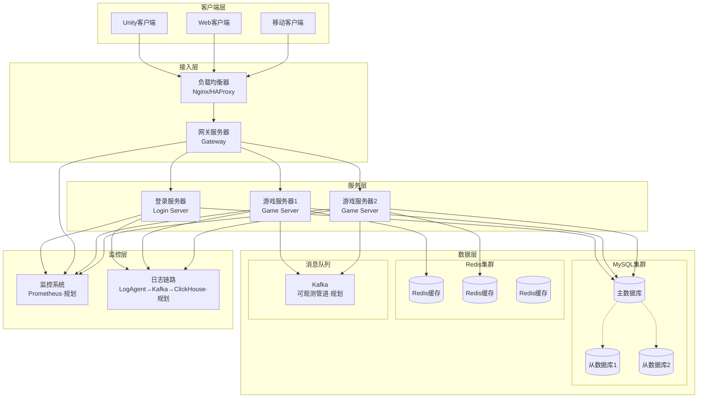
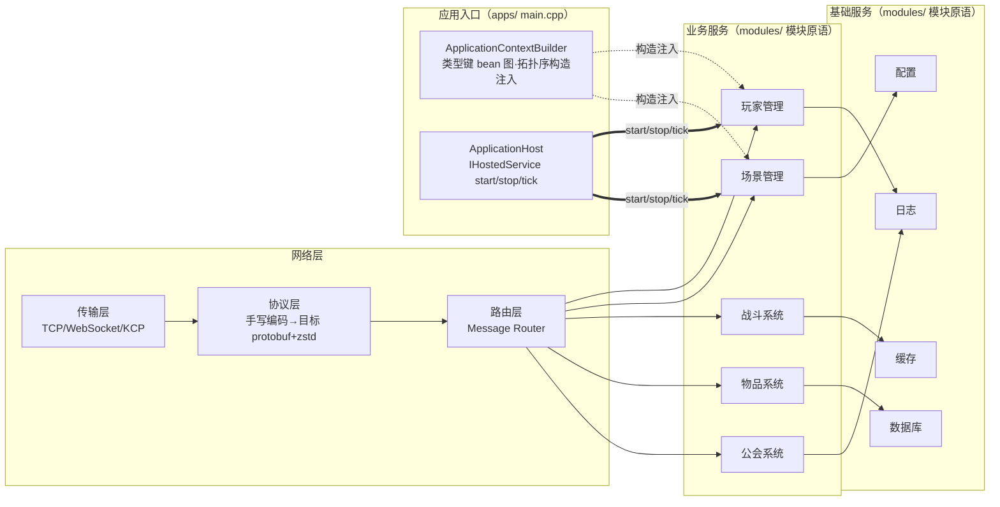
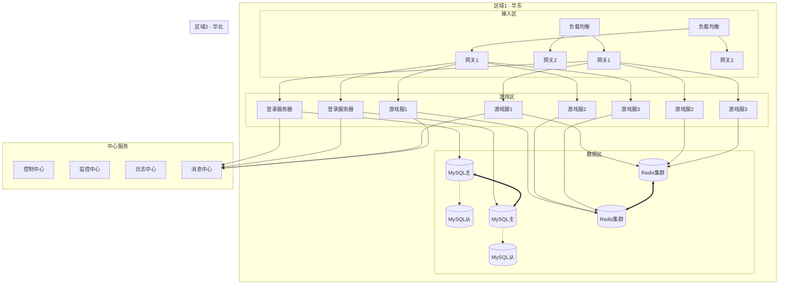

# 架构总览

> 目标形态全景（按 `docs/todo.md` 批次落地）。本页三张图为 README 迁入的架构图；进程编队（八件）、权威分解与 Zone/无缝辨析的现状设计见[架构审计报告](/analysis/architecture-review) §31，Compact 单进程形态见 [Compact GameServer 设计](/30-Compact_GameServer_Design)。

## 系统架构概览（目标形态）

> 2026-10-01 迁入注记：原 README 图服务层含「聊天服务器 / 匹配服务器」两节点——对 `docs/todo.md` 与 `docs/design/*` 全量检索零命中（**不在册**，BW 拓扑时代遗留，同 C-93 chat-app 死路一源），随迁删除；Redis 第三实例与聊天的连线一并清理。聊天/匹配若未来立项，按 gap 登记流程补图。

## 核心模块架构

> 模块间依赖为**编译期构造注入**（实线 = 直接依赖，无运行时容器中介）；装配与生命周期托管只存在于应用入口 `apps/`（`ApplicationContextBuilder` 拓扑序建图、`ApplicationHost` 帧驱动托管），模块内部互不感知容器。

## 分布式部署架构（目标形态）

> 同上注记：原图游戏区含「聊天服务器」节点（区域1 CS1 / 区域2 CS2）与对应连线，不在册随迁删除。
