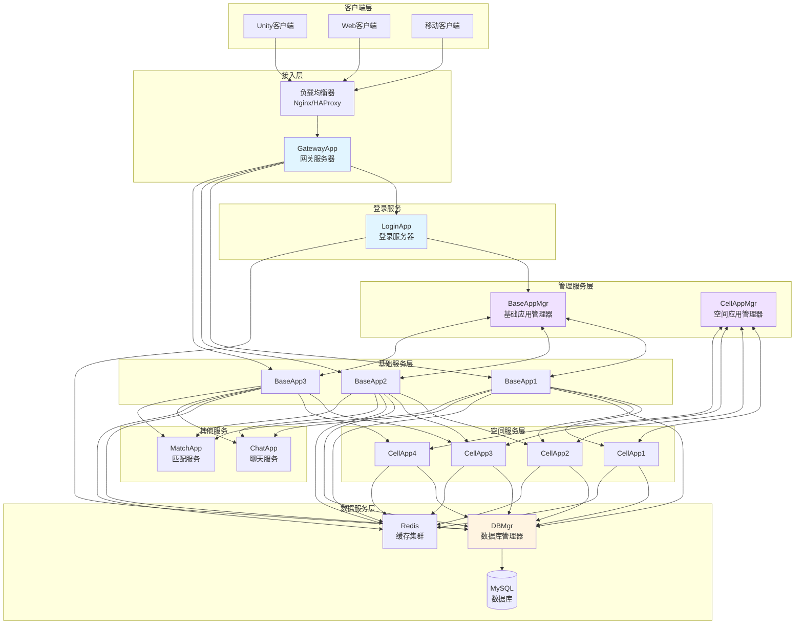
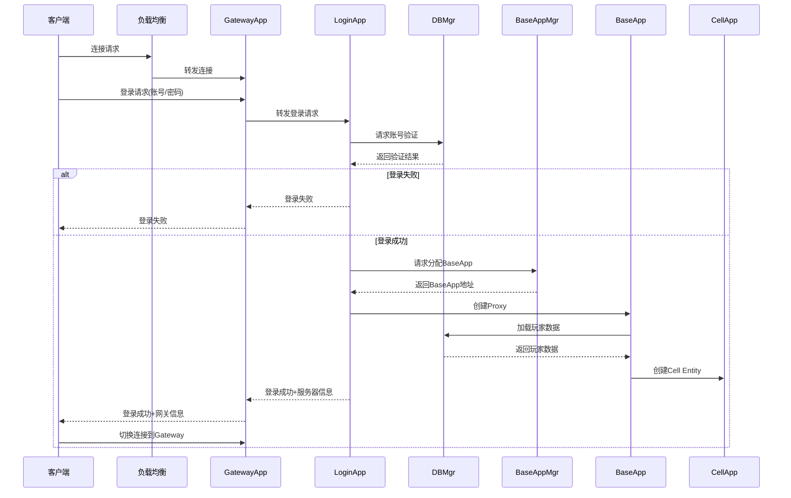
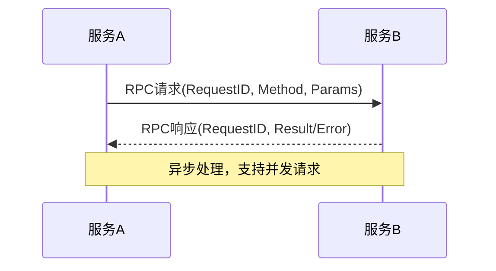

# Q1: 请画出你熟悉的 MMORPG 服务器架构图，说明各组件的职责和通信方式

## 问题分析

本题考察对 MMORPG 服务器整体架构的理解，需要：
1. 画出完整的服务器架构图
2. 说明各组件的职责
3. 说明组件间的通信方式

## 参考架构：BigWorld/KBEngine 风格

### 整体架构图



### 登录流程图



---

## 各组件职责详解

### 1. 客户端层

| 组件 | 说明 |
|------|------|
| Unity客户端 | PC端主流游戏引擎 |
| Web客户端 | H5小游戏、网页游戏 |
| 移动客户端 | iOS/Android原生或Unity导出 |

### 2. 接入层

#### GatewayApp（网关服务器）
**职责**：
- 客户端连接管理（维持长连接）
- 消息路由转发
- 会话管理（Session管理）
- 防攻击（限流、黑名单）
- 消息编解码

**通信方式**：
- 与客户端：TCP/KCP/WebSocket + Protobuf
- 与内部服务：TCP + 自定义RPC协议

### 3. 登录服务

#### LoginApp（登录服务器）
**职责**：
- 账号密码验证
- 服务器列表分发
- 与BaseAppMgr协调分配BaseApp
- 登录态管理

**通信方式**：
- 与GatewayApp：RPC
- 与DBMgr：RPC
- 与BaseAppMgr：RPC

### 4. 管理服务层

#### BaseAppMgr（基础应用管理器）
**职责**：
- 管理所有BaseApp实例
- 负责新玩家连接分配
- BaseApp负载均衡
- 跟踪BaseApp状态

#### CellAppMgr（空间应用管理器）
**职责**：
- 管理所有CellApp实例
- 空间分区负载均衡
- 动态调整Cell边界
- Entity跨CellApp迁移调度

### 5. 基础服务层

#### BaseApp（基础应用）
**职责**：
- 管理玩家的Proxy（Base Entity）
- 处理非空间相关逻辑：
  - 背包系统
  - 好友系统
  - 邮件系统
  - 任务系统
  - 商城交易
- 作为客户端的通信锚点
- 消息重定向到CellApp

**通信方式**：
- 与GatewayApp：长连接RPC
- 与CellApp：长连接RPC
- 与DBMgr：异步RPC

### 6. 空间服务层

#### CellApp（空间应用）
**职责**：
- 管理空间区域（Cell）
- 处理空间相关逻辑：
  - 玩家移动
  - AOI系统
  - 战斗系统
  - NPC AI
  - 技能释放
  - 场景对象管理
- Entity的位置管理

**通信方式**：
- 与BaseApp：长连接RPC
- 与相邻CellApp：Entity同步
- 与DBMgr：异步RPC

### 7. 数据服务层

#### DBMgr（数据库管理器）
**职责**：
- 数据库连接池管理
- 异步数据存取
- 玩家数据持久化
- 账号数据管理

**数据库划分**：
- **AccountDB**：账号信息、登录记录
- **CharacterDB**：角色数据、属性、背包
- **WorldDB**：世界数据、公会、排行

#### Redis（缓存集群）
**职责**：
- 热点数据缓存
- 排行榜实时计算
- 会话状态存储
- 分布式锁

### 8. 其他服务

#### ChatApp（聊天服务）
**职责**：
- 频道聊天（世界、公会、队伍）
- 私聊
- 系统广播
- 敏感词过滤

#### MatchApp（匹配服务）
**职责**：
- 玩家匹配（PVP、副本）
- 队伍组建
- 匹配算法（ELO、段位）

---

## 通信方式总结

### 通信协议栈

```
┌─────────────────────────────────────────────────────────────┐
│                      业务协议层                              │
│   Protobuf消息定义 + RPC接口定义                            │
└─────────────────────────────────────────────────────────────┘
                            ↓
┌─────────────────────────────────────────────────────────────┐
│                      传输协议层                              │
│   客户端↔网关: TCP/KCP/WebSocket                            │
│   内部服务: TCP长连接                                        │
└─────────────────────────────────────────────────────────────┘
                            ↓
┌─────────────────────────────────────────────────────────────┐
│                      网络层                                  │
│   IP + 路由                                                 │
└─────────────────────────────────────────────────────────────┘
```

### 消息格式

```
┌──────────────┬──────────────┬──────────────┬──────────────┐
│   PacketLen  │   MsgType    │   MsgID      │   Body       │
│   (4 bytes)  │   (2 bytes)  │   (4 bytes)  │   (Protobuf) │
└──────────────┴──────────────┴──────────────┴──────────────┘
```

### RPC调用流程



---

## 架构特点总结

| 特性 | 说明 |
|------|------|
| **分层设计** | 客户端→网关→业务服务→数据服务，职责清晰 |
| **空间分离** | BaseApp处理非空间逻辑，CellApp处理空间逻辑 |
| **水平扩展** | BaseApp/CellApp可动态增减 |
| **高可用** | 无单点故障，各服务可多实例部署 |
| **异步通信** | 内部采用异步RPC，提高吞吐量 |

---

## 参考资料

- [KBEngine 技术概览 - 软件组件](https://imgamer.gitbooks.io/kbengine-overview/content/content/5_2DesignIntroduction.html)
- [BigWorld Cell 架构设计介绍](https://blog.csdn.net/monokai/article/details/151142091)
