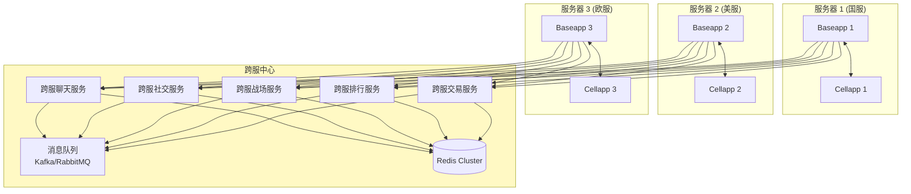

# Q10: 如何实现跨服功能（如跨服战场、跨服聊天）？

## 问题分析

本题考察对跨服功能设计的理解：
- 跨服功能的常见场景
- 不同跨服场景的实现方案
- KBEngine 如何支持跨服
- 跨服架构的权衡与挑战

---

## 一、跨服场景分析

### 1.1 常见跨服功能

```
┌─────────────────────────────────────────────────────────────┐
│                      跨服功能分类                            │
├─────────────────────────────────────────────────────────────┤
│                                                             │
│  1. 跨服聊天                                                │
│     ├── 全服公告                                           │
│     ├── 世界频道                                           │
│     └── 跨服私聊                                           │
│                                                             │
│  2. 跨服社交                                                │
│     ├── 好友系统                                           │
│     ├── 公会系统                                           │
│     └── 跨服组队                                           │
│                                                             │
│  3. 跨服玩法                                                │
│     ├── 跨服战场                                           │
│     ├── 跨服竞技场                                         │
│     ├── 跨服副本                                           │
│     └── 跨服活动                                           │
│                                                             │
│  4. 跨服交易                                                │
│     ├── 跨服拍卖行                                         │
│     ├── 跨服商城                                           │
│     └── 跨服交易                                           │
│                                                             │
│  5. 跨服排行                                                │
│     ├── 全服排行榜                                         │
│     ├── 战力排行                                           │
│     └── 成就排行                                           │
│                                                             │
└─────────────────────────────────────────────────────────────┘
```

### 1.2 跨服需求分析

| 功能 | 实时性要求 | 一致性要求 | 实现复杂度 |
|------|-----------|-----------|-----------|
| **跨服聊天** | 低（秒级） | 低 | 简单 |
| **跨服好友** | 中 | 高 | 中等 |
| **跨服组队** | 高 | 高 | 复杂 |
| **跨服战场** | 高 | 中 | 复杂 |
| **跨服排行** | 低 | 高 | 中等 |
| **跨服交易** | 中 | 高 | 复杂 |

---

## 二、跨服架构设计

### 2.1 整体架构图



### 2.2 通信方式

```
跨服通信的三种方式：

1. 直接 TCP 连接
   ┌─────────────────────────────────────────────────────────────┐
   │                                                             │
   │   Server A                          Server B               │
   │  ┌────────┐  ─────────────────────►  ┌────────┐           │
   │  │Client  │      TCP 直连             │Client  │           │
   │  └────────┘                          └────────┘           │
   │                                                             │
   │  优点：实时性好                                             │
   │  缺点：连接管理复杂                                         │
   └─────────────────────────────────────────────────────────────┘

2. 消息队列
   ┌─────────────────────────────────────────────────────────────┐
   │                                                             │
   │   Server A              MQ              Server B           │
   │  ┌────────┐   ─────────►┌────┐◄─────────  ┌────────┐      │
   │  │Client  │             │Kafka│             │Client  │      │
   │  └────────┘   ◄─────────└────┘───────────  └────────┘      │
   │                                                             │
   │  优点：解耦、可靠                                            │
   │  缺点：有延迟                                               │
   └─────────────────────────────────────────────────────────────┘

3. 中心服务转发
   ┌─────────────────────────────────────────────────────────────┐
   │                                                             │
   │   Server A                                        Server B  │
   │  ┌────────┐                                        ┌────────┐│
   │  │Client  │◄───────────┐         ┌────────────►│Client  ││
   │  └────────┘            │         │             └────────┘│
   │                         ▼         ▼                       │
   │                  ┌───────────────────┐                     │
   │                  │   跨服中心服务    │                     │
   │                  └───────────────────┘                     │
   │                                                             │
   │  优点：统一管理                                             │
   │  缺点：中心服务是瓶颈                                       │
   └─────────────────────────────────────────────────────────────┘
```

---

## 三、具体功能实现

### 3.1 跨服聊天

#### 架构设计

```
┌─────────────────────────────────────────────────────────────┐
│                    跨服聊天架构                              │
├─────────────────────────────────────────────────────────────┤
│                                                             │
│   Server A          Server B          Server C              │
│  ┌────────┐        ┌────────┐        ┌────────┐            │
│  │Player1 │        │Player2 │        │Player3 │            │
│  │说话:"   │        │说话:"   │        │说话:"   │            │
│  │大家好"  │        │大家好"  │        │大家好"  │            │
│  └────┬───┘        └────┬───┘        └────┬───┘            │
│       │                 │                 │                 │
│       └─────────────────┼─────────────────┘                 │
│                         ▼                                   │
│                  ┌─────────────┐                            │
│                  │  聊天服务   │                            │
│                  │  ChatApp    │                            │
│                  └──────┬──────┘                            │
│                         │                                   │
│                  ┌──────┴──────┐                            │
│                  │             │                            │
│                  ▼             ▼                            │
│            ┌─────────┐  ┌─────────┐                         │
│            │  Redis  │  │  Kafka  │                         │
│            │ Pub/Sub │  │  Topic  │                         │
│            └─────────┘  └─────────┘                         │
│                                                             │
└─────────────────────────────────────────────────────────────┘
```

#### 实现代码

```python
# 跨服聊天服务实现

class ChatService:
    """
    跨服聊天服务
    """
    def __init__(self):
        # Redis 发布订阅
        self.redis_pubsub = RedisPubSub("chat:cross_server")

        # 消息队列
        self.message_queue = KafkaTopic("cross_server_chat")

        # 服务器注册表
        self.server_registry = {}

    def on_chat_message(self, server_id, player_id, channel_type, message):
        """
        处理跨服聊天消息
        """
        # 1. 验证玩家
        if not self.validate_player(server_id, player_id):
            return

        # 2. 敏感词过滤
        filtered_message = self.filter_sensitive_words(message)

        # 3. 构建跨服消息
        cross_msg = {
            "server_id": server_id,
            "player_id": player_id,
            "player_name": self.get_player_name(server_id, player_id),
            "channel": channel_type,
            "message": filtered_message,
            "timestamp": time.time()
        }

        # 4. 广播到所有服务器
        self.broadcast_to_servers(cross_msg)

    def broadcast_to_servers(self, message):
        """
        广播消息到所有服务器
        """
        # 方式 1: Redis Pub/Sub
        self.redis_pubsub.publish(message)

        # 方式 2: Kafka Topic
        self.message_queue.send(message)

        # 方式 3: 直接转发（如果服务器列表不大）
        for server_id, server_info in self.server_registry.items():
            self.send_to_server(server_info["host"], message)
```

#### 频道设计

```python
# 跨服聊天频道设计

class CrossServerChannel:
    """
    跨服聊天频道
    """
    # 频道类型
    CHANNEL_WORLD = 1        # 世界频道（全服）
    CHANNEL_SYSTEM = 2       # 系统公告
    CHANNEL_GUILD = 3        # 公会频道（跨服公会）
    CHANNEL_TEAM = 4         # 队伍频道（跨服组队）
    CHANNEL_PRIVATE = 5      # 私聊（需要好友关系）

    def can_send_to_channel(self, player, channel_type):
        """
        检查玩家是否可以发送到指定频道
        """
        # 等级限制
        if player.level < 10:
            return False

        # 冷却时间
        if channel_type == self.CHANNEL_WORLD:
            if not self.check_cooldown(player, 30):  # 30秒冷却
                return False

        # VIP 权限
        if channel_type == self.CHANNEL_SYSTEM:
            if not player.is_vip:
                return False

        return True
```

### 3.2 跨服战场

#### 架构设计

```mermaid
sequenceDiagram
    participant P1 as Player(Server A)
    participant BA as Baseapp A
    participant BM as BattleMatcher
    participant BS as BattleServer
    participant P2 as Player(Server B)

    Note over P1: 1. 玩家请求跨服战场
    P1->>BA: 进入匹配队列
    BA->>BM: 跨服匹配请求

    Note over BM: 2. 匹配系统寻找对手
    BM->>BM: 查找匹配的玩家
    BM->>BA: 找到匹配！

    Note over P1: 3. 创建跨服战场
    BA->>BS: 创建战场实例
    BS->>BS: 初始化战场
    BS-->>BA: 战场地址

    Note over P1: 4. 玩家进入战场
    BA->>P1: 转发到战场
    P1->>BS: 连接战场服务器

    Note over P2: 对手同时也进入
    P2->>BS: 连接战场服务器

    Note over P1: 5. 战斗进行
    P1<->>BS: 战斗逻辑
    P2<->>BS: 战斗逻辑

    Note over P1: 6. 战斗结束
    BS->>BA: 战斗结果
    BA->>P1: 返回原服务器
    BS->>P2: 返回原服务器
```

#### 实现代码

```python
# 跨服战场匹配器

class CrossServerBattleMatcher:
    """
    跨服战场匹配器
    """
    def __init__(self):
        # 匹配队列（按战力分段）
        self.match_queues = {
            "low": [],      # 战力 0-5000
            "mid": [],      # 战力 5000-10000
            "high": [],     # 战力 10000+
        }

        # 战场服务器池
        self.battle_servers = []

    def join_match(self, server_id, player_id, battle_power):
        """
        玩家加入匹配队列
        """
        player_info = {
            "server_id": server_id,
            "player_id": player_id,
            "battle_power": battle_power,
            "join_time": time.time()
        }

        # 根据战力加入对应队列
        if battle_power < 5000:
            queue = self.match_queues["low"]
        elif battle_power < 10000:
            queue = self.match_queues["mid"]
        else:
            queue = self.match_queues["high"]

        queue.append(player_info)

        # 尝试匹配
        self.try_match(queue)

    def try_match(self, queue):
        """
        尝试匹配玩家
        """
        if len(queue) >= 2:
            # 简单的 FIFO 匹配
            player1 = queue.pop(0)
            player2 = queue.pop(0)

            # 创建战场
            self.create_battle([player1, player2])

    def create_battle(self, players):
        """
        创建跨服战场
        """
        # 选择负载最低的战场服务器
        battle_server = self.select_battle_server()

        # 创建战场实例
        battle_id = battle_server.create_battle_instance(
            players=players,
            battle_type="arena",
            map_id=1
        )

        # 通知玩家
        for player in players:
            self.notify_player_matched(
                player["server_id"],
                player["player_id"],
                battle_server.address,
                battle_id
            )
```

#### 战场服务器设计

```cpp
// 战场服务器实现

class BattleServer {
public:
    // 战场实例
    struct BattleInstance {
        uint32_t battleId;
        std::vector<PlayerInfo> players;
        BattleState state;
        uint32_t startTime;
    };

    // 创建战场实例
    uint32_t createBattleInstance(const std::vector<PlayerInfo>& players,
                                   BattleType type,
                                   uint32_t mapId) {
        BattleInstance instance;
        instance.battleId = generateBattleId();
        instance.players = players;
        instance.state = BattleState::WAITING;
        instance.startTime = getTime();

        // 存储实例
        battles_[instance.battleId] = instance;

        return instance.battleId;
    }

    // 玩家连接到战场
    void onPlayerConnect(uint32_t battleId, uint32_t playerId) {
        auto& battle = battles_[battleId];

        // 检查是否所有玩家都连接了
        bool allConnected = true;
        for (auto& player : battle.players) {
            if (!player.connected) {
                allConnected = false;
                break;
            }
        }

        // 所有玩家连接完毕，开始战斗
        if (allConnected) {
            startBattle(battleId);
        }
    }

    // 开始战斗
    void startBattle(uint32_t battleId) {
        auto& battle = battles_[battleId];
        battle.state = BattleState::FIGHTING;

        // 通知所有玩家战斗开始
        for (auto& player : battle.players) {
            sendToPlayer(player.serverId, player.playerId,
                       "BATTLE_START", battleId);
        }

        // 设置战斗超时
        schedule(battleId, BATTLE_TIMEOUT, [this, battleId]() {
            endBattle(battleId);
        });
    }
};
```

### 3.3 跨服好友

#### 数据结构

```sql
-- 跨服好友表
CREATE TABLE cross_server_friends (
    id BIGINT PRIMARY KEY AUTO_INCREMENT,
    player_server_id INT NOT NULL,          -- 玩家所在服务器
    player_id BIGINT NOT NULL,              -- 玩家 ID
    friend_server_id INT NOT NULL,          -- 好友所在服务器
    friend_id BIGINT NOT NULL,              -- 好友 ID
    friend_name VARCHAR(64) NOT NULL,       -- 好友名称
    is_online TINYINT DEFAULT 0,            -- 是否在线
    last_login_time TIMESTAMP,              -- 最后登录时间
    create_time TIMESTAMP DEFAULT CURRENT_TIMESTAMP,
    UNIQUE KEY uk_player (player_server_id, player_id, friend_server_id, friend_id),
    KEY idx_friend (friend_server_id, friend_id)
);
```

#### 实现代码

```python
# 跨服好友服务

class CrossServerFriendService:
    """
    跨服好友服务
    """
    def add_friend(self, my_server_id, my_player_id,
                   friend_server_id, friend_player_id):
        """
        添加跨服好友
        """
        # 1. 检查是否已经是好友
        if self.is_friend(my_server_id, my_player_id,
                         friend_server_id, friend_player_id):
            return {"code": 1, "msg": "已经是好友"}

        # 2. 获取好友信息（跨服查询）
        friend_info = self.get_player_info_cross_server(
            friend_server_id, friend_player_id
        )

        if not friend_info:
            return {"code": 2, "msg": "玩家不存在"}

        # 3. 添加好友记录（双向）
        self.add_friend_record(my_server_id, my_player_id,
                              friend_server_id, friend_player_id,
                              friend_info["name"])

        # 4. 发送好友申请通知
        self.send_friend_request_notification(
            friend_server_id, friend_player_id,
            my_server_id, my_player_id
        )

        return {"code": 0, "msg": "success"}

    def get_player_info_cross_server(self, server_id, player_id):
        """
        跨服获取玩家信息
        """
        # 检查本地缓存
        cache_key = f"player_info:{server_id}:{player_id}"
        cached = self.redis.get(cache_key)
        if cached:
            return json.loads(cached)

        # 缓存未命中，查询目标服务器
        server_addr = self.get_server_address(server_id)
        if not server_addr:
            return None

        # 远程调用获取玩家信息
        player_info = self.rpc_call(
            server_addr,
            "getPlayerInfo",
            player_id
        )

        # 缓存结果
        self.redis.setex(cache_key, 3600, json.dumps(player_info))

        return player_info
```

### 3.4 跨服排行

#### 架构设计

```
┌─────────────────────────────────────────────────────────────┐
│                    跨服排行架构                              │
├─────────────────────────────────────────────────────────────┤
│                                                             │
│   Server A          Server B          Server C              │
│  ┌────────┐        ┌────────┐        ┌────────┐            │
│  │Player1 │        │Player2 │        │Player3 │            │
│  │战力:5000│        │战力:8000│        │战力:6000│            │
│  └────┬───┘        └────┬───┘        └────┬───┘            │
│       │                 │                 │                 │
│       │   上报数据       │                 │                 │
│       └─────────────────┼─────────────────┘                 │
│                         ▼                                   │
│                  ┌─────────────┐                            │
│                  │ 排行服务    │                            │
│                  │ RankService │                            │
│                  └──────┬──────┘                            │
│                         │                                   │
│                         ▼                                   │
│                  ┌─────────────┐                            │
│                  │  Redis      │                            │
│                  │ Sorted Set  │                            │
│                  └─────────────┘                            │
│                                                             │
│                  ┌─────────────┐                            │
│                  │ rank:battle_power                      │
│                  │ 1. ServerB-Player2: 8000                │
│                  │ 2. ServerC-Player3: 6000                │
│                  │ 3. ServerA-Player1: 5000                │
│                  └─────────────┘                            │
│                                                             │
└─────────────────────────────────────────────────────────────┘
```

#### 实现代码

```python
# 跨服排行服务

class CrossServerRankService:
    """
    跨服排行服务
    """
    def __init__(self):
        self.redis = RedisCluster()

    def report_score(self, server_id, player_id, rank_type, score):
        """
        上报玩家分数（各服务器定期上报）
        """
        member = f"{server_id}:{player_id}"

        # 使用 Redis Sorted Set
        rank_key = f"rank:{rank_type}"

        # 更新分数
        self.redis.zadd(rank_key, {member: score})

        # 设置过期时间（避免数据无限增长）
        self.redis.expire(rank_key, 7 * 24 * 3600)  # 7天

    def get_rank(self, rank_type, top_n=100):
        """
        获取排行榜
        """
        rank_key = f"rank:{rank_type}"

        # 获取前 N 名（降序）
        top_members = self.redis.zrevrange(
            rank_key, 0, top_n - 1, withscores=True
        )

        # 格式化结果
        result = []
        for rank, (member, score) in enumerate(top_members, 1):
            server_id, player_id = member.split(":")
            result.append({
                "rank": rank,
                "server_id": int(server_id),
                "player_id": int(player_id),
                "score": int(score)
            })

        return result

    def get_player_rank(self, server_id, player_id, rank_type):
        """
        获取玩家排名
        """
        member = f"{server_id}:{player_id}"
        rank_key = f"rank:{rank_type}"

        # 获取玩家排名
        rank = self.redis.zrevrank(rank_key, member)

        if rank is None:
            return None

        # 获取玩家分数
        score = self.redis.zscore(rank_key, member)

        return {
            "rank": rank + 1,  # Redis 排名从 0 开始
            "score": int(score)
        }
```

---

## 四、数据一致性

### 4.1 分布式事务

```
跨服交易的一致性保证：

┌─────────────────────────────────────────────────────────────┐
│                                                             │
│   Server A              Server B           跨服交易中心       │
│  ┌────────┐            ┌────────┐         ┌────────┐        │
│  │Player1 │            │Player2 │         │协调器   │        │
│  │金币:100│            │金币:50  │         │        │        │
│  └────┬───┘            └────┬───┘         └────┬───┘        │
│       │                     │                   │            │
│       │   玩家1给玩家2转50金币                    │            │
│       │                     │                   │            │
│       │◄────────────────────┼───────────────────►│            │
│       │                     │                   │            │
│       │  1. 协调器创建事务                        │            │
│       │                     │                   │            │
│       │◄────┐               │                   │            │
│       │    │ 扣款50         │                   │            │
│       │────┘               │                   │            │
│  金币:50                  │                   │            │
│       │                     │                   │            │
│       │                     │◄────┐             │            │
│       │                     │    │ 加款50       │            │
│       │                     │────┘             │            │
│       │               金币:100                  │            │
│       │                     │                   │            │
│       │◄────────────────────┼───────────────────►│            │
│       │   2. 确认提交（两阶段）                   │            │
│       │                     │                   │            │
│       ▼                     ▼                   ▼            │
│   提交成功                提交成功             提交完成         │
│                                                             │
└─────────────────────────────────────────────────────────────┘
```

### 4.2 补偿机制

```python
# 分布式事务补偿机制

class DistributedTransaction:
    """
    分布式事务（补偿模式）
    """
    def transfer_money_cross_server(self, from_server, from_player,
                                    to_server, to_player, amount):
        """
        跨服转账
        """
        transaction_id = self.generate_transaction_id()

        # 记录事务日志（用于补偿）
        self.log_transaction(transaction_id, {
            "from_server": from_server,
            "from_player": from_player,
            "to_server": to_server,
            "to_player": to_player,
            "amount": amount,
            "status": "pending"
        })

        try:
            # 1. 扣款
            result1 = self.deduct_money(from_server, from_player, amount)
            if not result1["success"]:
                raise Exception("扣款失败")

            # 2. 加款
            result2 = self.add_money(to_server, to_player, amount)
            if not result2["success"]:
                # 补偿：加款失败，退还款项
                self.compensate_add_money(from_server, from_player, amount)
                raise Exception("加款失败")

            # 3. 标记事务完成
            self.update_transaction_status(transaction_id, "completed")

            return {"success": True}

        except Exception as e:
            # 标记事务失败
            self.update_transaction_status(transaction_id, "failed")

            # 触发人工处理（记录日志）
            self.alert_transaction_failed(transaction_id, str(e))

            return {"success": False, "msg": str(e)}
```

---

## 五、性能优化

### 5.1 批量处理

```python
# 批量上报优化

class BatchReporter:
    """
    批量上报器
    """
    def __init__(self):
        self.pending_data = []
        self.last_flush = time.time()
        self.batch_size = 100
        self.flush_interval = 5  # 5秒

    def report(self, data):
        """
        上报数据
        """
        self.pending_data.append(data)

        # 达到批量大小时刷新
        if len(self.pending_data) >= self.batch_size:
            self.flush()

    def flush(self):
        """
        刷新数据到跨服中心
        """
        if not self.pending_data:
            return

        # 批量发送
        self.send_batch(self.pending_data)

        # 清空缓存
        self.pending_data.clear()
        self.last_flush = time.time()

    def auto_flush(self):
        """
        自动刷新（定时器）
        """
        if time.time() - self.last_flush >= self.flush_interval:
            self.flush()
```

### 5.2 本地缓存

```python
# 本地缓存跨服数据

class CrossServerCache:
    """
    跨服数据缓存
    """
    def __init__(self):
        self.local_cache = {}
        self.cache_ttl = 300  # 5分钟

    def get_player_info(self, server_id, player_id):
        """
        获取玩家信息（优先缓存）
        """
        cache_key = (server_id, player_id)

        # 检查缓存
        if cache_key in self.local_cache:
            cached_data, cached_time = self.local_cache[cache_key]
            if time.time() - cached_time < self.cache_ttl:
                return cached_data

        # 缓存未命中，查询跨服
        player_info = self.query_cross_server(server_id, player_id)

        # 更新缓存
        self.local_cache[cache_key] = (player_info, time.time())

        return player_info
```

---

## 六、总结

### 实现方案对比

| 功能 | 推荐方案 | 优点 | 缺点 |
|------|----------|------|------|
| **跨服聊天** | Redis Pub/Sub | 简单、实时 | 有序性差 |
| **跨服战场** | 独立战场服务器 | 隔离好 | 迁移复杂 |
| **跨服好友** | 中心数据库 | 一致性好 | 性能瓶颈 |
| **跨服排行** | Redis Sorted Set | 高性能 | 数据有损 |
| **跨服交易** | 补偿事务 | 最终一致 | 复杂度高 |

### 最佳实践

```
跨服功能设计建议：

1. 选择合适的通信方式
   - 聊天：消息队列
   - 战场：直连战场服务器
   - 社交：中心数据库
   - 排行：Redis

2. 注意数据一致性
   - 使用补偿机制
   - 记录事务日志
   - 提供人工介入

3. 性能优化
   - 批量处理
   - 本地缓存
   - 异步上报

4. 容错处理
   - 超时重试
   - 降级服务
   - 监控告警
```

---

## 参考资料

- [KBEngine Lab - 负载均衡](https://www.kbelab.com/manual/balance.html)
- [Redis Pub/Sub 官方文档](https://redis.io/topics/pubsub)
- [Kafka 分布式消息队列](https://kafka.apache.org/documentation/)
- [跨服架构设计实践](https://www.infoq.cn/article/game-server-cross-server)
