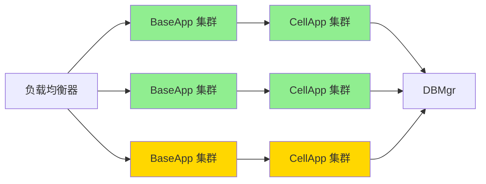

# Q100: 如何进行服务器容量规划？

## 问题分析

本题考察对容量规划的理解：
- 性能基准
- 容量计算
- 扩展策略
- KBEngine 性能指标

---

## 一、容量规划概述

### 1.1 规划维度

```
┌─────────────────────────────────────────────────────────────┐
│                    容量规划维度                                │
├─────────────────────────────────────────────────────────────┤
│                                                             │
│  并发用户 (CCU):                                            │
│  ├── 在线玩家数                                             │
│  ├── 同时活跃数                                             │
│  └── 峰值预留                                               │
│                                                             │
│  请求处理 (QPS):                                            │
│  ├── 每秒请求数                                             │
│  ├── 消息吞吐量                                             │
│  └── 响应时间 (RT)                                          │
│                                                             │
│  数据存储:                                                   │
│  ├── 玩家数据量                                             │
│  ├── 游戏数据量                                             │
│  └── 日志数据量                                             │
│                                                             │
│  网络带宽:                                                   │
│  ├── 入站流量                                               │
│  ├── 出站流量                                               │
│  └── 峰值带宽                                               │
│                                                             │
│  系统资源:                                                   │
│  ├── CPU 使用率                                             │
│  ├── 内存使用量                                             │
│  ├── 磁盘 I/O                                               │
│  └── 网络连接数                                             │
│                                                             │
└─────────────────────────────────────────────────────────────┘
```

---

## 二、性能基准测试

### 2.1 KBEngine 性能指标

```python
# KBEngine 性能基准

"""
KBEngine 性能基准 (参考值):

硬件: Intel Xeon E5-2680 v4, 32GB RAM, SSD

单 BaseApp:
- 玩家数量: 2000-3000
- CPU 使用: 60-80%
- 内存使用: 2-4GB
- 消息处理: 5000-8000 msg/s

单 CellApp:
- 实体数量: 1000-2000 (取决于复杂度)
- CPU 使用: 60-80%
- 内存使用: 4-8GB
- 消息处理: 3000-5000 msg/s

DBMgr:
- 并发写入: 1000-2000/s
- 并发读取: 5000-10000/s
- 内存使用: 2-4GB
"""

class PerformanceBenchmark:
    """性能基准测试"""

    def __init__(self):
        self.metrics = {
            "baseapp": {
                "max_players": 2500,
                "max_cpu": 80,
                "max_memory": 4 * 1024,  # MB
                "max_qps": 5000
            },
            "cellapp": {
                "max_entities": 1500,
                "max_cpu": 80,
                "max_memory": 8 * 1024,
                "max_qps": 3000
            },
            "dbmgr": {
                "max_writes": 1500,
                "max_reads": 8000,
                "max_memory": 4 * 1024
            },
            "loginapp": {
                "max_logins_per_sec": 200,
                "max_concurrent": 500
            }
        }

    def calculate_capacity(self, target_ccu):
        """计算所需容量"""
        # BaseApp 容量
        baseapp_count = max(1, (target_ccu + self.metrics["baseapp"]["max_players"] - 1) //
                           self.metrics["baseapp"]["max_players"])

        # CellApp 容量 (假设 70% 玩家在 CellApp 有实体)
        active_players = int(target_ccu * 0.7)
        cellapp_count = max(1, (active_players + self.metrics["cellapp"]["max_entities"] - 1) //
                              self.metrics["cellapp"]["max_entities"])

        # DBMgr 通常单实例
        dbmgr_count = 1

        # LoginApp 容量
        # 假设峰值登录为 CCU 的 10%
        peak_logins = int(target_ccu * 0.1)
        loginapp_count = max(1, (peak_logins + self.metrics["loginapp"]["max_logins_per_sec"] - 1) //
                               self.metrics["loginapp"]["max_logins_per_sec"])

        return {
            "baseapp": baseapp_count,
            "cellapp": cellapp_count,
            "dbmgr": dbmgr_count,
            "loginapp": loginapp_count,
            "total_servers": baseapp_count + cellapp_count + dbmgr_count + loginapp_count
        }

    def estimate_hardware(self, target_ccu):
        """估算硬件需求"""
        capacity = self.calculate_capacity(target_ccu)

        # 估算机器数量
        # 假设每台机器可以运行: 2 BaseApp + 3 CellApp
        baseapp_per_machine = 2
        cellapp_per_machine = 3

        game_machines = max(
            (capacity["baseapp"] + baseapp_per_machine - 1) // baseapp_per_machine,
            (capacity["cellapp"] + cellapp_per_machine - 1) // cellapp_per_machine
        )

        return {
            "game_servers": game_machines,
            "db_server": 1,
            "login_server": 1,
            "total_machines": game_machines + 2,
            "capacity": capacity
        }
```

---

## 三、容量计算模型

### 3.1 资源计算

```python
# 容量计算模型

class CapacityCalculator:
    """容量计算器"""

    # 资源系数
    CPU_COEFFICIENT = 1.2  # 20% 预留
    MEMORY_COEFFICIENT = 1.3  # 30% 预留
    NETWORK_COEFFICIENT = 1.5  # 50% 预留
    PEAK_RATIO = 1.5  # 峰值/平均比例

    @staticmethod
    def calculate_cpu_usage(ccu, player_actions_per_minute=60):
        """计算 CPU 使用"""
        # 每个玩家每分钟操作数
        actions_per_second = (ccu * player_actions_per_minute) / 60

        # 每个操作 CPU 时间 (毫秒)
        cpu_time_per_action = 0.5  # 0.5ms

        # 所需 CPU 核心
        cpu_cores = (actions_per_second * cpu_time_per_action) / 1000
        cpu_cores *= CapacityCalculator.CPU_COEFFICIENT

        return cpu_cores

    @staticmethod
    def calculate_memory_usage(ccu):
        """计算内存使用"""
        # 每个玩家内存占用 (MB)
        memory_per_player = 1.5

        # 总内存
        total_memory = ccu * memory_per_player
        total_memory *= CapacityCalculator.MEMORY_COEFFICIENT

        return total_memory  # MB

    @staticmethod
    def calculate_network_bandwidth(ccu):
        """计算网络带宽"""
        # 每个玩家带宽 (Kbps)
        bandwidth_per_player = 5  # 5 Kbps

        # 总带宽
        total_bandwidth = ccu * bandwidth_per_player
        total_bandwidth *= CapacityCalculator.NETWORK_COEFFICIENT

        return total_bandwidth / 1024  # Mbps

    @staticmethod
    def calculate_db_capacity(ccu, retention_days=30):
        """计算数据库容量"""
        # 每个玩家数据大小 (KB)
        data_per_player = 50  # 50 KB

        # 每天新增玩家
        new_players_per_day = int(ccu * 0.1)

        # 每天数据增长
        daily_growth = new_players_per_day * data_per_player

        # 保留期内总数据
        total_data = daily_growth * retention_days

        # 索引开销
        total_data *= 1.5

        return total_data / 1024 / 1024  # GB

    @staticmethod
    def calculate_redis_memory(ccu):
        """计算 Redis 内存"""
        # 每个玩家缓存数据 (KB)
        cache_per_player = 10  # 10 KB

        # 在线玩家缓存
        online_cache = ccu * cache_per_player

        # 总缓存 (包含离线玩家部分数据)
        total_cache = online_cache * 2

        return total_cache / 1024  # MB


# 容量规划计算器
def plan_capacity(target_ccu, growth_rate=0.2):
    """容量规划"""
    calculator = CapacityCalculator()

    # 当前需求
    current = {
        "cpu_cores": calculator.calculate_cpu_usage(target_ccu),
        "memory_mb": calculator.calculate_memory_usage(target_ccu),
        "bandwidth_mbps": calculator.calculate_network_bandwidth(target_ccu),
        "db_gb": calculator.calculate_db_capacity(target_ccu),
        "redis_mb": calculator.calculate_redis_memory(target_ccu)
    }

    # 考虑增长
    future_ccu = int(target_ccu * (1 + growth_rate))
    future = {
        "cpu_cores": calculator.calculate_cpu_usage(future_ccu),
        "memory_mb": calculator.calculate_memory_usage(future_ccu),
        "bandwidth_mbps": calculator.calculate_network_bandwidth(future_ccu),
        "db_gb": calculator.calculate_db_capacity(future_ccu),
        "redis_mb": calculator.calculate_redis_memory(future_ccu)
    }

    return {
        "target_ccu": target_ccu,
        "current": current,
        "future_ccu": future_ccu,
        "future": future
    }
```

---

## 四、扩展策略

### 4.1 水平扩展



```python
# 扩展策略

class ScalingStrategy:
    """扩展策略"""

    @staticmethod
    def get_scaling_policy(current_ccu, max_ccu):
        """获取扩展策略"""
        usage_ratio = current_ccu / max_ccu

        if usage_ratio > 0.9:
            return "critical_scale"  # 紧急扩展
        elif usage_ratio > 0.75:
            return "scale_out"  # 扩容
        elif usage_ratio < 0.3:
            return "scale_in"  # 缩容
        else:
            return "maintain"  # 保持

    @staticmethod
    def calculate_scale_out(current, max_ccu):
        """计算扩容数量"""
        target_ratio = 0.7  # 目标使用率 70%

        # 计算需要的实例数
        target_instances = int(current / target_ratio)
        current_instances = int(current / max_ccu)

        return max(0, target_instances - current_instances)


class AutoScaler:
    """自动扩展器"""

    def __init__(self):
        self.check_interval = 60  # 秒
        self.scale_out_threshold = 0.75
        self.scale_in_threshold = 0.3
        self.max_instances = 20
        self.min_instances = 2

    def start(self):
        """启动自动扩展"""
        KBEngine.addTimer(self.check_interval, 0, self.check_and_scale)

    def check_and_scale(self):
        """检查并扩展"""
        # 获取当前负载
        baseapp_load = self.get_baseapp_load()

        for instance_id, load in baseapp_load.items():
            if load > self.scale_out_threshold:
                self.scale_out()
                break
            elif load < self.scale_in_threshold:
                self.scale_in()
                break

    def get_baseapp_load(self):
        """获取 BaseApp 负载"""
        loads = {}
        baseapps = KBEngine.getWatcher().get("components/baseapp")

        for baseapp_id, data in baseapps.items():
            max_players = data.get("maxPlayers", 2500)
            current_players = data.get("playerCount", 0)
            loads[baseapp_id] = current_players / max_players

        return loads

    def scale_out(self):
        """扩容"""
        # 检查是否可以扩容
        baseapp_count = len(KBEngine.getWatcher().get("components/baseapp"))
        if baseapp_count >= self.max_instances:
            WARNING_MSG("Max instances reached, cannot scale out")
            return

        INFO_MSG("Scaling out: starting new BaseApp")
        # 调用启动脚本
        # os.system("./start_baseapp.sh")

    def scale_in(self):
        """缩容"""
        # 检查是否可以缩容
        baseapp_count = len(KBEngine.getWatcher().get("components/baseapp"))
        if baseapp_count <= self.min_instances:
            return

        INFO_MSG("Scaling in: stopping idle BaseApp")
        # 选择负载最低的实例停止
        # os.system("./stop_baseapp.sh <id>")
```

---

## 五、容量监控

### 5.1 实时监控

```python
# 容量监控

class CapacityMonitor:
    """容量监控"""

    def __init__(self):
        self.metrics_history = []
        self.max_history = 1440  # 24 小时 (每分钟一条)

    def collect_metrics(self):
        """收集指标"""
        metrics = {
            "timestamp": time.time(),
            "ccu": self.get_ccu(),
            "cpu": self.get_cpu_usage(),
            "memory": self.get_memory_usage(),
            "network": self.get_network_usage(),
            "db_connections": self.get_db_connections()
        }

        self.metrics_history.append(metrics)

        # 限制历史长度
        if len(self.metrics_history) > self.max_history:
            self.metrics_history.pop(0)

        return metrics

    def get_ccu(self):
        """获取在线人数"""
        return len([e for e in KBEngine.entities.values()
                   if hasattr(e, 'playerName')])

    def get_cpu_usage(self):
        """获取 CPU 使用率"""
        # 从 KBEngine Watcher 获取
        return KBEngine.getWatcher().get("stats/cpuUsage")

    def get_memory_usage(self):
        """获取内存使用"""
        return KBEngine.getWatcher().get("mem/allocated")

    def get_network_usage(self):
        """获取网络使用"""
        stats = KBEngine.getWatcher().get("network/*")
        return {
            "in": stats.get("messageIn", 0),
            "out": stats.get("messageOut", 0)
        }

    def get_db_connections(self):
        """获取数据库连接数"""
        return KBEngine.getWatcher().get("db/connections")

    def predict_capacity(self, hours=24):
        """预测容量需求"""
        if len(self.metrics_history) < 24:
            return None

        # 获取最近 24 小时的数据
        recent = self.metrics_history[-24 * 60:]  # 每分钟一条

        # 计算增长率
        ccu_values = [m["ccu"] for m in recent]
        growth_rate = (ccu_values[-1] - ccu_values[0]) / ccu_values[0] if ccu_values[0] > 0 else 0

        # 预测
        current_ccu = ccu_values[-1]
        predicted_ccu = int(current_ccu * (1 + growth_rate * hours / 24))

        return {
            "current_ccu": current_ccu,
            "growth_rate": growth_rate,
            "predicted_ccu": predicted_ccu,
            "hours_ahead": hours
        }
```

---

## 六、容量规划表

### 6.1 不同规模配置

| CCU | BaseApp | CellApp | LoginApp | DBMgr | 机器配置 | 网络带宽 |
|-----|---------|---------|----------|-------|----------|----------|
| 500 | 1 | 1 | 1 | 1 | 1台 8C/16G | 50 Mbps |
| 1000 | 1 | 1 | 1 | 1 | 1台 8C/32G | 100 Mbps |
| 3000 | 2 | 2 | 1 | 1 | 2台 8C/32G | 200 Mbps |
| 5000 | 2 | 3 | 1 | 1 | 2台 16C/64G | 300 Mbps |
| 10000 | 4 | 5 | 2 | 1 | 4台 16C/64G | 500 Mbps |
| 30000 | 12 | 15 | 3 | 2 | 12台 16C/64G | 1 Gbps |
| 50000 | 20 | 25 | 5 | 3 | 20台 16C/64G | 2 Gbps |

---

## 七、最佳实践

### 7.1 容量规划建议

| 实践 | 说明 |
|------|------|
| **基准测试** | 建立性能基准 |
| **预留空间** | CPU/Memory 预留 20-30% |
| **弹性扩展** | 支持动态增减实例 |
| **监控预测** | 基于历史数据预测 |
| **压力测试** | 定期进行压测 |
| **分阶段扩容** | 避免过度配置 |

---

## 八、总结

### 容量规划核心

```
容量规划 = 性能基准 + 资源计算 + 扩展策略 + 监控预测
- 建立性能基准
- 计算 CPU/内存/网络需求
- 水平扩展策略
- 实时监控和预测
```

---

## 参考资料

- [KBEngine Performance](https://kbengine.github.io/docs/en/performance.html)
- [Capacity Planning Fundamentals](https://www.amazon.com/Capacity-Planning-Fundamentals-Amazon-Web-Services-ebook/dp/B07JHFM2ZV)
- [Game Server Scaling](https://www.gamasutra.com/blogs/MichaelKerr/20190813/349290/Scaling_Multiplayer_Games.php)
