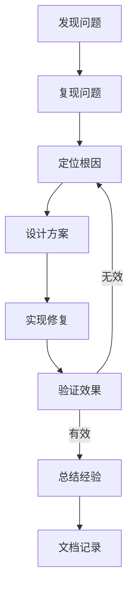

# Q106: 你遇到过最难的技术问题是什么？如何解决的？

## 问题分析

本题考察问题解决能力：
- 问题定位
- 分析思路
- 解决方案
- 经验总结

---

## 一、内存泄漏问题

### 1.1 问题描述

```
问题现象:
- 服务器运行 12 小时后内存持续增长
- 从 2GB 增长到 16GB 后 OOM 崩溃
- 只在特定活动期间出现

影响范围:
- 玩家掉线
- 数据丢失
- 需要频繁重启
```

### 1.2 排查过程

```python
# 内存泄漏排查

import gc
import sys
import objgraph

class MemoryLeakDebugger:
    """内存泄漏调试器"""

    def __init__(self):
        self.snapshots = []

    def take_snapshot(self, label=""):
        """获取内存快照"""
        import sys
        import gc

        gc.collect()

        snapshot = {
            'label': label,
            'objects': len(gc.get_objects()),
            'ref_counts': {}
        }

        # 统计各类对象数量
        for obj in gc.get_objects():
            type_name = type(obj).__name__
            snapshot['ref_counts'][type_name] = \
                snapshot['ref_counts'].get(type_name, 0) + 1

        self.snapshots.append(snapshot)

        return snapshot

    def compare_snapshots(self, idx1, idx2):
        """比较两个快照"""
        s1 = self.snapshots[idx1]
        s2 = self.snapshots[idx2]

        print(f"Comparing {s1['label']} -> {s2['label']}")
        print(f"Total objects: {s1['objects']} -> {s2['objects']}")

        # 找出增长最多的类型
        growth = {}
        for type_name, count in s2['ref_counts'].items():
            old_count = s1['ref_counts'].get(type_name, 0)
            growth[type_name] = count - old_count

        # 排序输出
        for type_name, delta in sorted(growth.items(),
                                       key=lambda x: x[1],
                                       reverse=True)[:10]:
            if delta > 0:
                print(f"  {type_name}: +{delta}")

    def find_leaking_refs(self, obj_type):
        """查找泄漏对象的引用链"""
        import gc

        for obj in gc.get_objects():
            if type(obj).__name__ == obj_type:
                # 获取引用链
                referrers = gc.get_referrers(obj)
                print(f"Object {obj} referenced by:")
                for ref in referrers:
                    print(f"  {type(ref).__name__}: {ref}")


# KBEngine 内存泄漏案例
"""
问题: Player 实体被销毁后，事件监听器仍然持有引用

根本原因:
1. EventManager 中注册的回调持有 Player 引用
2. Player 销毁时没有取消注册
3. EventManager 是全局单例，永不被回收

解决方案:
1. 实现 onDestroy 生命周期
2. 自动清理事件监听
3. 使用弱引用 (weakref)
"""

class EventManager:
    """修复后的事件管理器"""

    def __init__(self):
        self.listeners = {}

    def subscribe(self, event_type, callback, owner=None):
        """订阅事件"""
        if event_type not in self.listeners:
            self.listeners[event_type] = []

        # 使用弱引用
        import weakref
        if owner:
            owner_ref = weakref.ref(owner)
            self.listeners[event_type].append({
                'callback': callback,
                'owner': owner_ref
            })
        else:
            self.listeners[event_type].append({
                'callback': callback,
                'owner': None
            })

    def publish(self, event_type, *args, **kwargs):
        """发布事件"""
        if event_type not in self.listeners:
            return

        # 清理已销毁的监听器
        self.listeners[event_type] = [
            listener for listener in self.listeners[event_type]
            if listener['owner'] is None or listener['owner']() is not None
        ]

        # 调用回调
        for listener in self.listeners[event_type]:
            if listener['owner']:
                owner = listener['owner']()
                if owner is not None:
                    listener['callback'](owner, *args, **kwargs)
            else:
                listener['callback'](*args, **kwargs)
```

---

## 二、死锁问题

### 2.1 问题描述

```
问题现象:
- 服务器定期卡死约 30 秒
- CPU 使用率正常
- 玩家连接断开
- 日志显示 "Waiting for lock..."

触发条件:
- 高峰期出现频繁
- 与特定操作相关
```

### 2.2 解决方案

```cpp
// 死锁问题解决

// 问题代码
class DatabaseManager {
    std::mutex player_mutex;
    std::mutex guild_mutex;

    void updatePlayerGuild(int playerId) {
        std::lock_guard<std::mutex> lock1(player_mutex);
        // ... 读取玩家数据

        std::lock_guard<std::mutex> lock2(guild_mutex);
        // ... 更新公会数据
    }

    void updateGuildPlayers(int guildId) {
        std::lock_guard<std::mutex> lock1(guild_mutex);
        // ... 读取公会数据

        std::lock_guard<std::mutex> lock2(player_mutex);
        // ... 更新玩家数据
    }
};

// 死锁原因:
// 1. 线程 A: updatePlayerGuild 获取 player_mutex，等待 guild_mutex
// 2. 线程 B: updateGuildPlayers 获取 guild_mutex，等待 player_mutex
// 3. 互相等待，形成死锁

// 解决方案 1: 统一加锁顺序
class FixedDatabaseManager {
    std::mutex player_mutex;
    std::mutex guild_mutex;
    std::mutex order_mutex;  // 用于保证加锁顺序

    void updatePlayerGuild(int playerId) {
        // 按固定顺序加锁: 先 player 后 guild
        std::lock(player_mutex, guild_mutex);
        std::lock_guard<std::mutex> lock1(player_mutex, std::adopt_lock);
        std::lock_guard<std::mutex> lock2(guild_mutex, std::adopt_lock);

        // ... 业务逻辑
    }

    void updateGuildPlayers(int guildId) {
        // 同样的顺序
        std::lock(player_mutex, guild_mutex);
        std::lock_guard<std::mutex> lock1(player_mutex, std::adopt_lock);
        std::lock_guard<std::mutex> lock2(guild_mutex, std::adopt_lock);

        // ... 业务逻辑
    }
};

// 解决方案 2: 使用 std::scoped_lock (C++17)
class ModernDatabaseManager {
    std::mutex player_mutex;
    std::mutex guild_mutex;

    void updatePlayerGuild(int playerId) {
        // 同时锁定多个互斥量，避免死锁
        std::scoped_lock lock(player_mutex, guild_mutex);

        // ... 业务逻辑
    }

    void updateGuildPlayers(int guildId) {
        std::scoped_lock lock(player_mutex, guild_mutex);

        // ... 业务逻辑
    }
};

// 解决方案 3: 超时锁
class TimeoutDatabaseManager {
    std::mutex player_mutex;
    std::mutex guild_mutex;

    bool updatePlayerGuild(int playerId) {
        // 尝试加锁，超时则返回失败
        if (!try_lock_for(player_mutex, std::chrono::seconds(5))) {
            ERROR_MSG("Failed to acquire player_mutex");
            return false;
        }

        std::unique_lock<std::mutex> lock1(player_mutex, std::adopt_lock);

        if (!try_lock_for(guild_mutex, std::chrono::seconds(5))) {
            ERROR_MSG("Failed to acquire guild_mutex");
            return false;
        }

        std::unique_lock<std::mutex> lock2(guild_mutex, std::adopt_lock);

        // ... 业务逻辑
        return true
    }

private:
    template<typename Mutex, typename Duration>
    bool try_lock_for(Mutex& m, const Duration& duration) {
        std::unique_lock<Mutex> lock(m, std::try_to_lock);
        if (lock.owns_lock()) {
            lock.release();
            return true;
        }
        return false;
    }
};
```

---

## 三、网络同步问题

### 3.1 问题描述

```
问题现象:
- 玩家报告位置跳跃
- 技能释放无效
- 客户端和服务端状态不一致

复现步骤:
- 在高延迟环境下出现
- 快速移动时更明显
```

### 3.2 解决方案

```python
# 网络同步修复

# 问题: 客户端预测和服务端校验不一致

class PositionSync:
    """位置同步 (修复版)"""

    # 时间同步补偿
    SERVER_CLIENT_DELAY = 0.1  # 100ms

    def __init__(self, entity):
        self.entity = entity
        self.pending_moves = []
        self.last_confirmed_pos = (0, 0, 0)
        self.client_time_offset = 0

    def on_client_move(self, client_pos, client_time):
        """客户端移动"""
        # 计算时间偏移
        server_time = time.time()
        if not self.client_time_offset:
            self.client_time_offset = server_time - client_time

        # 校正后的客户端时间
        adjusted_time = client_time + self.client_time_offset

        # 保存待验证移动
        self.pending_moves.append({
            'pos': client_pos,
            'time': adjusted_time,
            'sequence': len(self.pending_moves)
        })

        # 服务端预测
        self.validate_and_correct()

    def validate_and_correct(self):
        """验证并校正"""
        if not self.pending_moves:
            return

        # 取最早的待验证移动
        move = self.pending_moves[0]

        # 速度检测
        distance = self.calculate_distance(
            self.last_confirmed_pos,
            move['pos']
        )

        time_delta = move['time'] - time.time()

        # 速度限制 (假设最大速度 10m/s)
        max_speed = 10.0
        max_distance = max_speed * abs(time_delta)

        if distance > max_distance:
            # 超速，拒绝移动
            WARNING_MSG(f"Player {self.entity.id} speed hack detected")

            # 发送校正位置
            self.send_position_correction(
                self.last_confirmed_pos
            )

            self.pending_moves.clear()
            return

        # 验证通过，确认移动
        self.last_confirmed_pos = move['pos']
        self.entity.position = move['pos']

        # 广播给附近玩家
        self.broadcast_position(move['pos'])

        # 移除已处理的移动
        self.pending_moves.pop(0)

    def send_position_correction(self, correct_pos):
        """发送位置校正"""
        if hasattr(self.entity, 'client'):
            self.entity.client.onPositionCorrection({
                'position': correct_pos,
                'server_time': time.time()
            })

    def broadcast_position(self, pos):
        """广播位置"""
        # 获取 AOI 内的玩家
        nearby_players = self.entity.getAOIPlayers()

        for player in nearby_players:
            if hasattr(player, 'client') and player.client:
                player.client.onEntityPosition({
                    'entity_id': self.entity.id,
                    'position': pos
                })

    @staticmethod
    def calculate_distance(pos1, pos2):
        """计算距离"""
        import math
        dx = pos1[0] - pos2[0]
        dy = pos1[1] - pos2[1]
        dz = pos1[2] - pos2[2]
        return math.sqrt(dx*dx + dy*dy + dz*dz)
```

---

## 四、总结

### 4.1 问题解决方法论



| 阶段 | 方法 |
|------|------|
| 发现 | 监控告警、日志分析 |
| 复现 | 最小化场景、压力测试 |
| 定位 | gdb/valgrind/pdb |
| 方案 | 多方案对比 |
| 验证 | 单元测试、回归测试 |
| 总结 | 文档、分享 |

---

## 参考资料

- [Debugging Memory Leaks](https://docs.python.org/3/library/tracemalloc.html)
- [Deadlock Detection](https://preshing.com/20120612/an-introduction-to-lock-free-programming/)
- [Network Compensation](https://www.gabrielgambetta.com/client-side-prediction-lockstep.html)
