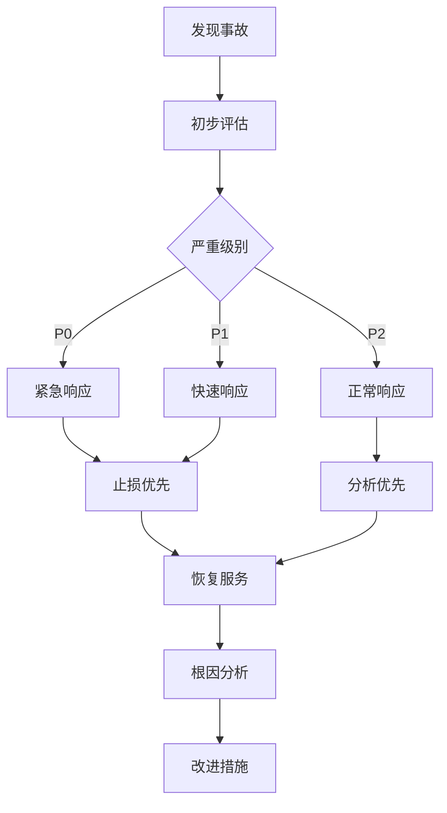

# Q107: 线上出过什么严重事故？如何处理的？

## 问题分析

本题考察生产事故处理能力：
- 事故案例
- 应急响应
- 根因分析
- 改进措施

---

## 一、事故案例库

### 1.1 常见事故类型

```
┌─────────────────────────────────────────────────────────────┐
│                    生产事故分类                                │
├─────────────────────────────────────────────────────────────┤
│                                                             │
│  数据事故:                                                   │
│  ├── 数据丢失                                               │
│  ├── 数据错乱                                               │
│  ├── 回滚失败                                               │
│  └── 影响: 玩家损失巨大                                      │
│                                                             │
│  服务事故:                                                   │
│  ├── 服务宕机                                               │
│  ├── 响应超时                                               │
│  ├── 连接断开                                               │
│  └── 影响: 无法登录/游戏                                     │
│                                                             │
│  安全事故:                                                   │
│  ├── 刷物品                                                 │
│  ├── 外挂泛滥                                               │
│  ├── 数据泄露                                               │
│  └── 影响: 经济系统崩溃                                      │
│                                                             │
│  性能事故:                                                   │
│  ├── 负载过高                                               │
│  ├── 内存溢出                                               │
│  ├── 数据库锁                                               │
│  └── 影响: 服务不可用                                        │
│                                                             │
└─────────────────────────────────────────────────────────────┘
```

---

## 二、事故处理流程

### 2.1 应急响应



### 2.2 事故分级

| 级别 | 描述 | 响应时间 | 示例 |
|------|------|----------|------|
| P0 | 核心功能完全不可用 | 5分钟 | 所有玩家无法登录 |
| P1 | 严重影响部分玩家 | 15分钟 | 某个服掉线 |
| P2 | 轻微影响 | 1小时 | 个别功能异常 |
| P3 | 观察性问题 | 4小时 | 偶发卡顿 |

---

## 三、案例研究：数据库误删

### 3.1 事故描述

```python
# 生产事故案例

"""
事故描述:
时间: 周六晚 20:00 (高峰期)
影响: 全服玩家数据丢失
持续时间: 2 小时

事故经过:
1. 执行数据库清理脚本
2. 误将 WHERE 条件写错
3. 清空了玩家数据表
4. 发现后立即停止服务
"""

# 问题脚本 (错误示例)
def cleanup_old_players():
    """
    错误: 注释掉的条件导致全表删除
    """
    # WHERE last_login < DATE_SUB(NOW(), INTERVAL 180 DAY)
    sql = "DELETE FROM players"  # 忘记 WHERE 条件!
    db.execute(sql)

# 正确脚本
def cleanup_old_players_safe():
    """安全的清理脚本"""
    # 1. 先查询确认
    check_sql = """
        SELECT COUNT(*)
        FROM players
        WHERE last_login < DATE_SUB(NOW(), INTERVAL 180 DAY)
    """
    count = db.query_one(check_sql)

    print(f"Will delete {count} old players")

    if count > 10000:
        # 异常数量检查
        raise Exception(f"Too many rows to delete: {count}")

    # 2. 分批删除
    batch_size = 1000
    offset = 0

    while True:
        delete_sql = """
            DELETE FROM players
            WHERE last_login < DATE_SUB(NOW(), INTERVAL 180 DAY)
            LIMIT %s
        """
        affected = db.execute(delete_sql, (batch_size,))

        if affected == 0:
            break

        offset += affected
        print(f"Deleted {offset} rows")
```

### 3.2 应急处理

```python
# 应急恢复流程

class IncidentHandler:
    """事故处理器"""

    def handle_data_loss(self):
        """处理数据丢失"""
        # 1. 立即停止服务
        self.stop_all_services()

        # 2. 评估损失
        loss_assessment = self.assess_data_loss()
        INFO_MSG(f"Data loss assessment: {loss_assessment}")

        # 3. 恢复数据
        recovery_result = self.recover_data()

        # 4. 验证数据
        validation_result = self.validate_recovery()

        # 5. 恢复服务
        if validation_result['success']:
            self.restore_services()
        else:
            CRITICAL_MSG("Recovery validation failed!")
            # 启动备份方案
            self.fallback_recovery()

    def assess_data_loss(self):
        """评估数据损失"""
        assessment = {
            'affected_tables': [],
            'affected_players': 0,
            'data_range': None,
            'recovery_options': []
        }

        # 检查每个表
        for table in ['players', 'inventory', 'guilds']:
            count = self.query(f"SELECT COUNT(*) FROM {table}")
            assessment['affected_tables'].append({
                'table': table,
                'count': count
            })

        return assessment

    def recover_data(self):
        """恢复数据"""
        # 选项 1: 从最新备份恢复
        backup_time = self.get_latest_backup_time()
        INFO_MSG(f"Latest backup from: {backup_time}")

        # 选项 2: 从 binlog 恢复
        binlog_position = self.get_binlog_position()
        INFO_MSG(f"Binlog position: {binlog_position}")

        # 执行恢复
        try:
            # 停止应用
            self.stop_applications()

            # 恢复备份
            self.restore_from_backup(backup_time)

            # 应用 binlog
            self.apply_binlog(binlog_position)

            return {'success': True, 'method': 'backup+binlog'}

        except Exception as e:
            ERROR_MSG(f"Recovery failed: {e}")
            return {'success': False, 'error': str(e)}

    def validate_recovery(self):
        """验证恢复结果"""
        # 检查数据完整性
        checks = [
            self.check_player_count(),
            self.check_data_consistency(),
            self.check_critical_accounts()
        ]

        all_passed = all(check['passed'] for check in checks)

        return {
            'success': all_passed,
            'checks': checks
        }
```

---

## 四、案例研究：刷物品漏洞

### 4.1 事故描述

```
事故描述:
时间: 活动上线后 10 分钟
影响: 游戏经济崩溃
损失: 数百亿游戏币

事故经过:
1. 新增交易功能
2. 未校验余额
3. 玩家发现可无限刷钱
4. 短时间内大量传播
```

### 4.2 漏洞修复

```python
# 刷物品漏洞修复

class TradingSystem:
    """交易系统 (修复版)"""

    def trade_item(self, player_id, item_id, count, price):
        """交易物品"""

        # 1. 开启事务
        with self.db.transaction():

            # 2. 加锁查询 (悲观锁)
            player = self.db.query_for_update(
                "SELECT * FROM players WHERE id = ? FOR UPDATE",
                (player_id,)
            )

            if not player:
                raise Exception("Player not found")

            # 3. 校验物品数量
            inventory = self.get_inventory(player_id, item_id)

            if inventory['count'] < count:
                raise Exception("Insufficient items")

            # 4. 校验余额 (如果购买)
            if price < 0:  # 购买
                if player['gold'] < abs(price):
                    raise Exception("Insufficient gold")

            # 5. 扣除物品
            self.remove_item(player_id, item_id, count)

            # 6. 更新余额
            self.update_gold(player_id, player['gold'] + price)

            # 7. 记录日志
            self.log_transaction({
                'player_id': player_id,
                'item_id': item_id,
                'count': count,
                'price': price,
                'timestamp': time.time()
            })

        # 8. 通知客户端
        self.notify_client(player_id, {
            'action': 'trade_complete',
            'item_id': item_id,
            'count': count,
            'new_gold': player['gold'] + price
        })


class AntiAbuse:
    """防刷系统"""

    def __init__(self):
        self.player_limits = {}
        self.global_limits = {
            'transactions_per_minute': 1000,
            'gold_change_per_minute': 1000000
        }

    def check_transaction_limit(self, player_id, action, amount):
        """检查交易限制"""
        current_time = time.time()
        key = (player_id, action)

        # 获取玩家历史
        if key not in self.player_limits:
            self.player_limits[key] = []

        history = self.player_limits[key]

        # 清理 1 分钟前的记录
        history[:] = [t for t in history if current_time - t < 60]

        # 检查频率
        if len(history) > 100:  # 每分钟最多 100 次
            WARNING_MSG(f"Player {player_id} exceeded transaction limit")
            return False

        # 检查金额
        if action == 'gold_change':
            total = sum(h['amount'] for h in history)
            if total + amount > 100000:  # 每分钟最多 10 万
                WARNING_MSG(f"Player {player_id} exceeded gold limit")
                return False

        # 记录
        history.append({'time': current_time, 'amount': amount})

        return True
```

### 4.3 数据回滚

```python
# 数据回滚方案

class DataRollback:
    """数据回滚"""

    def rollback_economy(self):
        """回滚经济数据"""

        # 1. 确定回滚点
        exploit_detected_time = self.get_exploit_detected_time()
        rollback_time = exploit_detected_time - 300  # 前5分钟

        INFO_MSG(f"Rolling back to {rollback_time}")

        # 2. 备份当前数据
        self.backup_current_state("before_rollback")

        # 3. 回滚玩家金币
        self.rollback_player_gold(rollback_time)

        # 4. 回滚物品交易
        self.rollback_item_transactions(rollback_time)

        # 5. 追缴非法所得
        self.confiscate_illegal_assets()

        # 6. 补偿正常玩家
        self.compensate_players()

    def confiscate_illegal_assets(self):
        """追缴非法所得"""
        # 查找异常获取物品的玩家
        suspicious_players = self.find_suspicious_players()

        for player_id in suspicious_players:
            # 计算非法所得
            illegal_amount = self.calculate_illegal_amount(player_id)

            # 扣除
            self.deduct_gold(player_id, illegal_amount)

            # 记录
            INFO_MSG(f"Confiscated {illegal_amount} gold from player {player_id}")

            # 封禁
            if illegal_amount > 100000:
                self.ban_player(player_id, reason="exploit_abuse")
```

---

## 五、事后分析

### 5.1 根因分析

```python
# 5 Whys 分析法

"""
事故: 数据库误删玩家数据

Why 1: 为什么数据被删除?
答: 清理脚本误删

Why 2: 为什么清理脚本会误删?
答: WHERE 条件被注释掉

Why 3: 为什么 WHERE 条件被注释?
答: 测试时临时注释，忘记恢复

Why 4: 为什么没有测试就上线?
答: 缺少代码审查流程

Why 5: 为什么缺少流程?
答: 没有建立完善的上线规范

根本原因: 缺少完善的代码审查和上线流程
"""
```

### 5.2 改进措施

| 措施 | 说明 |
|------|------|
| 代码审查 | 所有数据库操作必须审查 |
| 脚本验证 | 脚本执行前预览 |
| 备份测试 | 定期测试备份恢复 |
| 权限控制 | 限制生产环境操作 |
| 监控告警 | 异常操作立即告警 |

---

## 六、最佳实践

### 6.1 事故处理建议

| 实践 | 说明 |
|------|------|
| **快速止损** | 优先恢复服务 |
| **保持冷静** | 按流程处理 |
| **记录详细** | 保留所有日志 |
| **及时沟通** | 通知相关人员 |
| **事后总结** | 输出事故报告 |
| **预防为主** | 建立防护机制 |

---

## 七、总结

### 生产事故处理核心

```
事故处理 = 快速响应 + 止损恢复 + 根因分析 + 改进预防
- 分级响应
- 优先恢复服务
- 详细记录过程
- 建立改进机制
```

---

## 参考资料

- [Incident Response Guide](https://www.us-cert.gov/sites/default/files/publications/incident_response_guidance.pdf)
- [Post-Mortem Culture](https://www.amazon.com/Google-SRE-Book-Site-Reliability/dp/1491950358)
