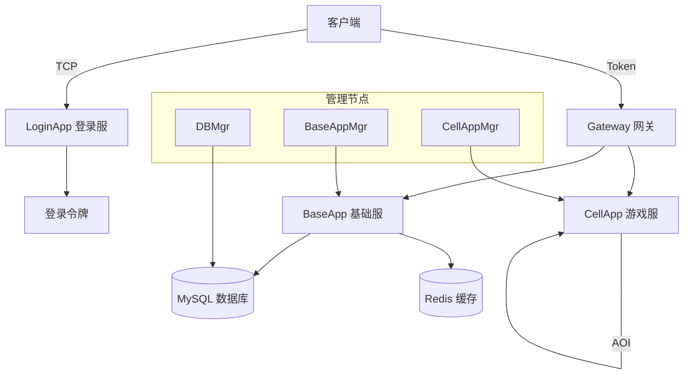
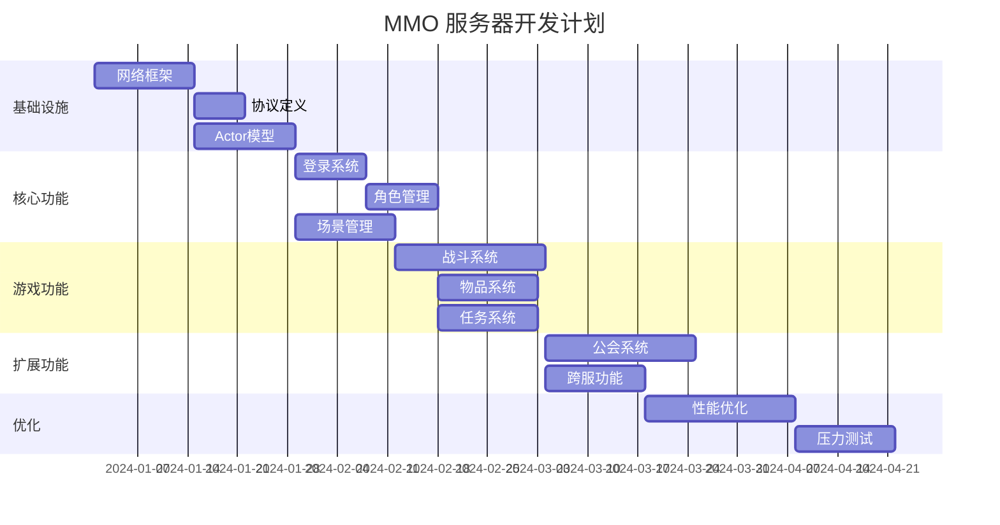

# Q108: 从 0 到 1 搭建一个 MMO 服务器，你的思路是什么？

## 问题分析

本题考察系统设计能力：
- 需求分析
- 架构设计
- 技术选型
- 实施路线

---

## 一、需求分析

### 1.1 核心需求

```
┌─────────────────────────────────────────────────────────────┐
│                    MMO 服务器需求                             │
├─────────────────────────────────────────────────────────────┤
│                                                             │
│  功能需求:                                                   │
│  ├── 玩家注册/登录                                           │
│  ├── 角色创建/管理                                           │
│  ├── 3D 场景移动                                             │
│  ├── 聊天系统                                                │
│  ├── 战斗系统                                                │
│  ├── 背包/物品                                               │
│  ├── 任务系统                                                │
│  └── 公会系统                                                │
│                                                             │
│  非功能需求:                                                 │
│  ├── 承载: 5000+ CCU                                        │
│  ├── 延迟: < 100ms (同区)                                   │
│  ├── 可用性: 99.9%                                          │
│  ├── 扩展性: 支持动态扩容                                     │
│  └── 安全性: 防外挂、防刷                                    │
│                                                             │
└─────────────────────────────────────────────────────────────┘
```

---

## 二、技术选型

### 2.1 技术栈

| 层级 | 技术选择 | 理由 |
|------|----------|------|
| 网络层 | TCP/KCP | 可靠传输 |
| 协议层 | Protobuf | 高效序列化 |
| 通信模型 | Actor | 分布式友好 |
| 脚本语言 | Python | 快速开发 |
| 数据库 | MySQL + Redis | 持久化 + 缓存 |
| 消息队列 | 自建 | 游戏专用 |

### 2.2 架构决策

```python
# 技术选型分析

class ArchitectureDecision:
    """架构决策"""

    @staticmethod
    def choose_communication_model():
        """选择通信模型"""
        return {
            'model': 'Actor',
            'reasons': [
                '避免锁竞争',
                '天然分布式',
                '消息隔离',
                '易于扩展'
            ],
            'alternatives': {
                '线程模型': '锁竞争复杂',
                '协程模型': '阻塞风险',
                '进程模型': '通信成本高'
            }
        }

    @staticmethod
    def choose_serialization():
        """选择序列化方案"""
        return {
            'primary': 'Protobuf',
            'reasons': [
                '性能优异',
                '跨语言',
                '字段兼容',
                '体积小'
            ],
            'comparison': {
                'Protobuf': {'speed': 9, 'size': 8, 'readability': 5},
                'JSON': {'speed': 5, 'size': 4, 'readability': 10},
                'MsgPack': {'speed': 8, 'size': 9, 'readability': 4},
                'FlatBuffers': {'speed': 10, 'size': 9, 'readability': 3}
            }
        }
```

---

## 三、架构设计

### 3.1 系统架构



### 3.2 组件职责

```python
# 组件定义

class ComponentArchitecture:
    """组件架构"""

    components = {
        'LoginApp': {
            '职责': ['玩家登录验证', '令牌发放', '负载均衡'],
            '技术': 'Python/Tornado',
            '端口': 8000,
            '实例数': 2
        },
        'Gateway': {
            '职责': ['连接管理', '消息转发', '流量控制'],
            '技术': 'C++/Epoll',
            '端口': 9000,
            '实例数': 4
        },
        'BaseApp': {
            '职责': ['玩家数据管理', '背包/任务', '跨服功能'],
            '技术': 'Python/Actor',
            '端口': 10000,
            '实例数': 4
        },
        'CellApp': {
            '职责': ['场景逻辑', '战斗系统', 'AOI 广播'],
            '技术': 'Python/Actor',
            '端口': 11000,
            '实例数': 8
        },
        'DBMgr': {
            '职责': ['数据库操作', '数据缓存', '异步保存'],
            '技术': 'Python/MySQL',
            '端口': 12000,
            '实例数': 1
        }
    }
```

---

## 四、实施路线

### 4.1 分阶段计划



### 4.2 详细计划

```
第一阶段：基础设施 (4 周)
├── Week 1-2: 网络框架
│   ├── TCP/KCP 通信
│   ├── Protobuf 协议
│   ├── 消息分发
│   └── 心跳机制
├── Week 3: Actor 模型
│   ├── 消息队列
│   ├── Actor 调度
│   ├── 邮箱机制
│   └── 远程调用
└── Week 4: 基础组件
    ├── 定时器
    ├── 日志系统
    ├── 配置管理
    └── 监控接口

第二阶段：核心功能 (6 周)
├── Week 5-6: 登录系统
│   ├── 账号验证
│   ├── 令牌机制
│   ├── 网关接入
│   └── 负载均衡
├── Week 7-8: 角色系统
│   ├── 角色创建
│   ├── 属性系统
│   ├── 数据持久化
│   └── 缓存管理
└── Week 9-10: 场景系统
    ├── 空间管理
    ├── 位置同步
    ├── AOI 实现
    └── 场景切换

第三阶段：游戏功能 (8 周)
├── Week 11-13: 战斗系统
│   ├── 技能系统
│   ├── 伤害计算
│   ├── 状态效果
│   └── AI 行为
├── Week 14-15: 物品系统
│   ├── 背包管理
│   ├── 物品使用
│   ├── 交易系统
│   └── 拍卖行
└── Week 16-18: 社交系统
    ├── 好友系统
    ├── 聊天系统
    ├── 公会系统
    └── 组队系统

第四阶段：优化测试 (5 周)
├── Week 19-20: 性能优化
│   ├── 内存优化
│   ├── 网络优化
│   ├── 数据库优化
│   └── 并发优化
└── Week 21-23: 测试发布
    ├── 单元测试
    ├── 集成测试
    ├── 压力测试
    └── 试运行
```

---

## 五、关键设计

### 5.1 消息协议

```protobuf
// 消息协议定义

// 基础消息
message BaseMessage {
    uint32 msg_id = 1;        // 消息 ID
    uint64 sequence = 2;      // 序列号
    uint64 timestamp = 3;     // 时间戳
    bytes body = 4;           // 消息体
}

// 登录请求
message LoginRequest {
    string account = 1;
    string password = 2;
    string client_version = 3;
}

// 登录响应
message LoginResponse {
    int32 code = 1;
    string message = 2;
    string token = 3;
    repeated string servers = 4;  // 可选服务器
}

// 位置同步
message PositionUpdate {
    uint64 entity_id = 1;
    float x = 2;
    float y = 3;
    float z = 4;
    float yaw = 5;
    uint32 timestamp = 6;
}
```

### 5.2 数据模型

```python
# 数据模型设计

class PlayerSchema:
    """玩家数据模式"""

    # 数据库表结构
    TABLE_SQL = """
    CREATE TABLE players (
        id BIGINT PRIMARY KEY AUTO_INCREMENT,
        account_id BIGINT NOT NULL,
        name VARCHAR(32) NOT NULL UNIQUE,
        level INT DEFAULT 1,
        exp BIGINT DEFAULT 0,
        gold BIGINT DEFAULT 0,

        -- 位置
        space_id INT,
        position_x FLOAT,
        position_y FLOAT,
        position_z FLOAT,

        -- 时间戳
        created_at TIMESTAMP DEFAULT CURRENT_TIMESTAMP,
        updated_at TIMESTAMP DEFAULT CURRENT_TIMESTAMP ON UPDATE CURRENT_TIMESTAMP,
        last_login_at TIMESTAMP,

        -- 索引
        INDEX idx_account (account_id),
        INDEX idx_level (level),
        INDEX idx_space (space_id)
    ) ENGINE=InnoDB DEFAULT CHARSET=utf8mb4;
    """

    # Redis 缓存结构
    CACHE_KEY = "player:{player_id}"
    CACHE_FIELDS = [
        'id', 'account_id', 'name', 'level', 'exp', 'gold',
        'space_id', 'position_x', 'position_y', 'position_z'
    ]


class ItemSchema:
    """物品数据模式"""

    TABLE_SQL = """
    CREATE TABLE player_items (
        id BIGINT PRIMARY KEY AUTO_INCREMENT,
        player_id BIGINT NOT NULL,
        item_id INT NOT NULL,
        count INT DEFAULT 1,
        quality INT DEFAULT 1,

        -- 装备属性
        enchant_level INT DEFAULT 0,
        extra_data JSON,

        created_at TIMESTAMP DEFAULT CURRENT_TIMESTAMP,
        updated_at TIMESTAMP DEFAULT CURRENT_TIMESTAMP ON UPDATE CURRENT_TIMESTAMP,

        INDEX idx_player (player_id),
        INDEX idx_item (item_id)
    ) ENGINE=InnoDB DEFAULT CHARSET=utf8mb4;
    """
```

---

## 六、核心代码框架

### 6.1 Actor 实现

```python
# Actor 框架

import queue
import threading

class Actor:
    """Actor 基类"""

    def __init__(self, actor_id):
        self.actor_id = actor_id
        self.mailbox = queue.Queue()
        self.running = False
        self.thread = None

    def start(self):
        """启动 Actor"""
        self.running = True
        self.thread = threading.Thread(target=self._loop, daemon=True)
        self.thread.start()

    def stop(self):
        """停止 Actor"""
        self.running = False
        if self.thread:
            self.thread.join()

    def _loop(self):
        """消息循环"""
        while self.running:
            try:
                message = self.mailbox.get(timeout=0.1)
                self.handle_message(message)
            except queue.Empty:
                continue
            except Exception as e:
                ERROR_MSG(f"Actor {self.actor_id} error: {e}")

    def send(self, message):
        """发送消息"""
        self.mailbox.put(message)

    def handle_message(self, message):
        """处理消息 (子类实现)"""
        raise NotImplementedError

    def ask(self, message, timeout=5):
        """请求-响应模式"""
        response_queue = queue.Queue()

        # 添加回调地址
        message.reply_to = response_queue

        self.send(message)

        try:
            return response_queue.get(timeout=timeout)
        except queue.Empty:
            raise TimeoutError("Actor response timeout")


# 远程 Actor
class RemoteActor:
    """远程 Actor 代理"""

    def __init__(self, actor_id, address, port):
        self.actor_id = actor_id
        self.address = address
        self.port = port
        self.transport = None

    def send(self, message):
        """发送远程消息"""
        # 通过网络发送
        self.transport.send(self.actor_id, message)

    def ask(self, message, timeout=5):
        """远程请求"""
        # 实现请求-响应
        pass
```

---

## 七、总结

### 从 0 到 1 核心要点

```
MMO 服务器搭建 = 需求分析 + 架构设计 + 分阶段实施
- 需求优先，避免过度设计
- 技术选型考虑团队和场景
- Actor 模型简化并发
- 分阶段迭代验证
- 性能和安全是持续工作
```

---

## 参考资料

- [MMO Server Architecture](https://www.gamedev.net/blogs/entry/2264963-mmo-server-security-the-unspoken-challenges/)
- [Game Server Patterns](https://www.gameprogrammingpatterns.com/game-server-patterns.html)
