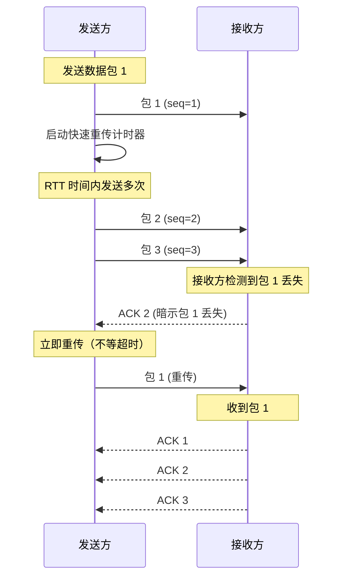
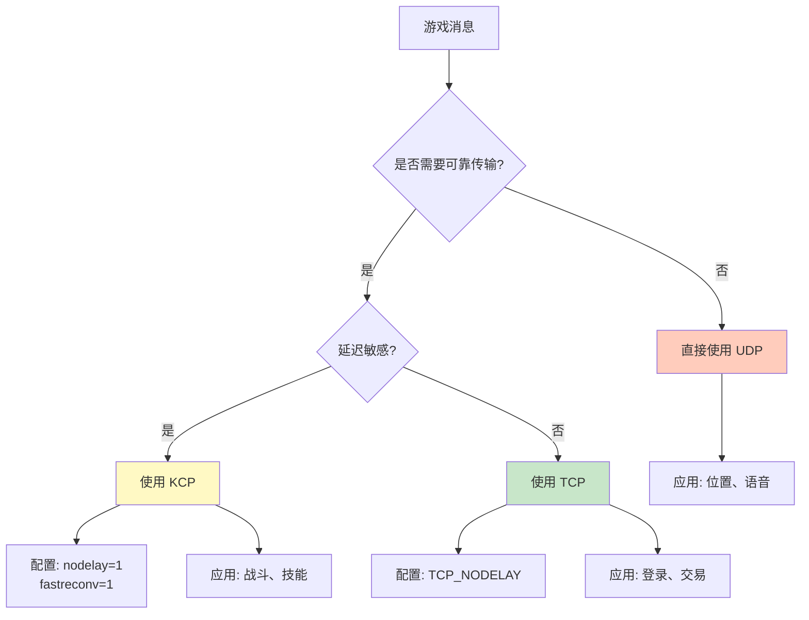

# Q11: TCP vs UDP vs KCP，MMO 中各自的使用场景是什么？

## 问题分析

本题考察对网络传输协议的理解：
- TCP、UDP、KCP 的本质区别
- 各自的优缺点和适用场景
- KBEngine 为什么选择 TCP
- MMO 游戏中的协议选择策略

---

## 一、协议基础

### 1.1 三层协议模型

```
┌─────────────────────────────────────────────────────────────┐
│                    传输协议层次                              │
├─────────────────────────────────────────────────────────────┤
│                                                             │
│  ┌─────────────────────────────────────────────────┐       │
│  │              应用层                              │       │
│  │  (游戏逻辑: 移动、战斗、聊天等)                   │       │
│  └─────────────────────────────────────────────────┘       │
│                        │                                     │
│        ┌───────────────┼───────────────┐                    │
│        ▼               ▼               ▼                    │
│  ┌──────────┐    ┌──────────┐    ┌──────────┐              │
│  │   TCP    │    │   UDP    │    │   KCP    │              │
│  │可靠传输  │    │不可靠    │    │可靠UDP   │              │
│  │面向连接  │    │无连接    │    │面向连接  │              │
│  └──────────┘    └──────────┘    └──────────┘              │
│        │               │               │                    │
│        └───────────────┼───────────────┘                    │
│                        ▼                                     │
│  ┌─────────────────────────────────────────────────┐       │
│  │              IP 层 (网络层)                       │       │
│  └─────────────────────────────────────────────────┘       │
│                                                             │
└─────────────────────────────────────────────────────────────┘
```

### 1.2 协议特性对比

| 特性 | TCP | UDP | KCP |
|------|-----|-----|-----|
| **连接性** | 面向连接 | 无连接 | 面向连接 |
| **可靠性** | 可靠传输 | 不可靠 | 可靠传输 |
| **顺序保证** | ✅ 保证 | ❌ 不保证 | ✅ 保证 |
| **流量控制** | ✅ 滑动窗口 | ❌ 无 | ✅ 自定义窗口 |
| **拥塞控制** | ✅ 慢启动等 | ❌ 无 | ⚠️ 可配置 |
| **首部开销** | 20-60 字节 | 8 字节 | ~24 字节 |
| **延迟** | 较高 | 最低 | 中等 |
| **吞吐量** | 中等 | 最高 | 中高 |

---

## 二、TCP 协议详解

### 2.1 TCP 特点

```
┌─────────────────────────────────────────────────────────────┐
│                     TCP 特点                                │
├─────────────────────────────────────────────────────────────┤
│                                                             │
│  1. 三次握手建立连接                                         │
│     Client ──[SYN]──► Server                               │
│     Client ◄──[SYN+ACK]── Server                           │
│     Client ──[ACK]──► Server ✓ 连接建立                     │
│                                                             │
│  2. 可靠传输机制                                             │
│     ├── 序列号 (保证顺序)                                    │
│     ├── 确认应答 (ACK)                                       │
│     ├── 超时重传 (RTO)                                       │
│     ├── 滑动窗口 (流量控制)                                  │
│     └── 拥塞控制 (网络拥塞时降低发送速率)                     │
│                                                             │
│  3. 四次挥手断开连接                                         │
│     Client ──[FIN]──► Server                               │
│     Client ◄──[ACK]── Server                               │
│     Client ◄──[FIN]── Server                               │
│     Client ──[ACK]──► Server ✓ 连接关闭                     │
│                                                             │
└─────────────────────────────────────────────────────────────┘
```

### 2.2 TCP 的优缺点

```
优点：
✅ 可靠传输 - 保证数据不丢失
✅ 顺序保证 - 数据按序到达
✅ 流量控制 - 避免接收方溢出
✅ 拥塞控制 - 保护网络整体
✅ 通用性好 - 所有网络环境支持

缺点：
❌ 延迟较高 - 握手、确认、重传
❌ 首部开销大 - 至少 20 字节
❌ 粘包问题 - 应用层需要处理
❌ HEAD-OF-LINE BLOCKING - 丢包阻塞后续数据
```

### 2.3 TCP 在 MMO 中的应用

```
适用场景：
├── 登录认证       ✓ (不能丢，数据少)
├── 聊天消息       ✓ (可靠性重要)
├── 交易系统       ✓ (绝对不能丢)
├── 背包操作       ✓ (数据一致性)
├── 任务系统       ✓ (非实时)
└── 排行榜         ✓ (批量数据)

不适用场景：
├── 实时移动       ✗ (延迟敏感)
├── 实时战斗       ✗ (频率高，容忍丢包)
└── 位置同步       ✗ (容忍丢包，新数据覆盖旧数据)
```

---

## 三、UDP 协议详解

### 3.1 UDP 特点

```
┌─────────────────────────────────────────────────────────────┐
│                     UDP 特点                                │
├─────────────────────────────────────────────────────────────┤
│                                                             │
│  1. 无连接                                                   │
│     直接发送，无需握手                                       │
│     Client ──[数据包]──► Server                             │
│                                                             │
│  2. 不可靠                                                   │
│     ├── 不保证到达                                           │
│     ├── 不保证顺序                                           │
│     ├── 不重传丢失包                                         │
│     └── 不进行流量控制                                       │
│                                                             │
│  3. 轻量级                                                   │
│     ├── 首部仅 8 字节                                        │
│     ├── 无状态维护                                           │
│     └── 发送速率无限制                                       │
│                                                             │
│  UDP 首部结构：                                              │
│  ┌──────────────────────────────────────────────────┐       │
│  │ 源端口(16) │ 目标端口(16) │ 长度(16) │ 校验和(16) │       │
│  └──────────────────────────────────────────────────┘       │
│                                                             │
└─────────────────────────────────────────────────────────────┘
```

### 3.2 UDP 的优缺点

```
优点：
✅ 延迟最低 - 无握手，无等待
✅ 首部开销小 - 仅 8 字节
✅ 发送速率高 - 无拥塞控制
✅ 支持广播/组播
✅ 穿透性好 - NAT 穿透容易

缺点：
❌ 不可靠 - 数据可能丢失
❌ 无序 - 可能乱序到达
❌ 无流量控制 - 可能淹没接收方
❌ 需要应用层实现可靠性
```

### 3.3 UDP 在 MMO 中的应用

```
适用场景：
├── 实时移动       ✓ (新位置覆盖旧位置)
├── 位置同步       ✓ (容忍丢包)
├── 战斗动作       ✓ (实时性重要)
├── 语音聊天       ✓ (容忍丢包)
└── 状态广播       ✓ (高频更新)

不适用场景：
├── 交易系统       ✗ (必须可靠)
├── 道具获取       ✗ (不能丢)
└── 账号操作       ✗ (安全性)
```

---

## 四、KCP 协议详解

### 4.1 KCP 简介

KCP 是一个快速可靠传输协议（ARQ，自动重传请求），以比 TCP 浪费带宽 10%-20% 的代价换取更低的延迟。

```
┌─────────────────────────────────────────────────────────────┐
│                      KCP 协议                               │
├─────────────────────────────────────────────────────────────┤
│                                                             │
│  KCP = RTO (超时重传) + 快速重传 + 独特前向纠错               │
│                                                             │
│  核心特性：                                                  │
│  ├── 降低延迟：RTT 时间内发送多次                            │
│  ├── 快速重传：不依赖超时，立即重传                          │
│  ├── 独特 FEC：前向纠错，恢复丢失数据                        │
│  └── 可配置：根据场景调整参数                                │
│                                                             │
│  与 TCP 对比：                                              │
│  ┌─────────────────────────────────────────────────┐       │
│  │  指标          │ TCP  │ KCP  │ 改善            │       │
│  ├─────────────────────────────────────────────────┤       │
│  │  延迟 (30%丢包) │ 200ms│ 50ms │ ↓ 75%          │       │
│  │  延迟 (10%丢包) │ 130ms│ 30ms │ ↓ 77%          │       │
│  │  流量 (30%丢包) │ 100% │ 120% │ ↑ 20%          │       │
│  └─────────────────────────────────────────────────┘       │
│                                                             │
└─────────────────────────────────────────────────────────────┘
```

### 4.2 KCP 工作原理



### 4.3 KCP 参数配置

```c
// KCP 核心参数

// 1. nodelay (是否启用 nodelay 模式)
//    0: 不启用（默认，类似 TCP）
//    1: 启用（RTT 内多次发送，降低延迟）
ikcp_nodelay(kcp, 1);          // 启用 nodelay
ikcp_interval(kcp, 10);         // 内部更新时钟间隔 (ms)

// 2. 快速重传限制
//    0: 关闭快速重传（传统 RTO）
//    1: 原始快速重传（触发后立即重传）
//    2: 激进快速重传（连续触发）
ikcp_fastreconv(kcp, 1);        // 启用快速重传

// 3. 拥塞控制窗口
//    0: 不启用拥塞控制
//    1: 启用（类似 TCP）
ikcp_setmtu(kcp, 1400);         // MTU 大小
ikcp_wndsize(kcp, 128, 128);   // 发送/接收窗口大小
```

### 4.4 KCP 在 MMO 中的应用

```
适用场景：
├── 实时战斗       ✓ (低延迟 + 可靠)
├── 技能释放       ✓ (不能丢但要求低延迟)
├── 伤害结算       ✓ (可靠性重要)
├── 移动同步       ✓ (位置更新)
└── 状态同步       ✓ (需要可靠但实时)

不适用场景：
├── 大文件传输     ✗ (带宽浪费)
└── 非实时数据     ✗ (TCP 更合适)
```

---

## 五、KBEngine 的协议选择

### 5.1 KBEngine 为什么选择 TCP

根据 [KBEngine 源码分析](https://github.com/kbengine/kbengine)：

```cpp
// KBEngine 使用 TCP 作为传输协议
// src/server/network/endpoint.h

class Endpoint {
public:
    // 只支持 TCP
    enum Protocol {
        TCP = 0,
    };

    // 创建 TCP socket
    bool initTCP(int addressFamily = AF_INET);
};
```

**选择 TCP 的原因**：

1. **可靠性优先** - 账号、数据不能丢失
2. **开发简单** - 无需实现可靠性层
3. **通用性好** - 所有环境支持
4. **调试方便** - 可用 Wireshark 直接分析
5. **延迟可接受** - 本地通信延迟 < 1ms

### 5.2 KBEngine 的 TCP 优化

```cpp
// KBEngine 对 TCP 的优化
// src/server/network/channel.h

class Channel {
public:
    // 启用 TCP_NODELAY (禁用 Nagle 算法)
    void setNoDelay(bool noDelay) {
        int flag = noDelay ? 1 : 0;
        setsockopt(socket_, IPPROTO_TCP, TCP_NODELAY,
                   (char*)&flag, sizeof(int));
    }

    // 启用 SO_KEEPALIVE
    void setKeepAlive(bool keepAlive) {
        int flag = keepAlive ? 1 : 0;
        setsockopt(socket_, SOL_SOCKET, SO_KEEPALIVE,
                   (char*)&flag, sizeof(int));
    }
};
```

### 5.3 KBEngine 的可靠 UDP 实现

KBEngine 内部有可靠 UDP 的实现（未默认启用）：

```cpp
// KBEngine 可靠 UDP (可选)
// src/server/network/reliable_udp.h

class ReliableUDP {
public:
    // 序列号
    uint16_t sequence_;

    // 确认号
    uint16_t ack_;

    // 重传队列
    std::queue<Packet*> retransmitQueue_;

    // 发送数据（带可靠保证）
    void sendReliable(Packet* packet) {
        packet->sequence = ++sequence_;
        retransmitQueue_.push(packet);

        // 发送
        socket_->send(packet);
    }

    // 处理 ACK
    void onAck(uint16_t ack) {
        while (!retransmitQueue_.empty() &&
               retransmitQueue_.front()->sequence <= ack) {
            delete retransmitQueue_.front();
            retransmitQueue_.pop();
        }
    }
};
```

---

## 六、协议选择策略

### 6.1 决策树



### 6.2 场景对照表

| 游戏系统 | 推荐协议 | 原因 |
|----------|----------|------|
| **登录认证** | TCP | 安全性、可靠性 |
| **角色创建** | TCP | 数据一致性 |
| **聊天系统** | TCP | 可靠性重要 |
| **好友系统** | TCP | 数据不能丢 |
| **背包操作** | TCP | 物品不能丢 |
| **交易系统** | TCP | 绝对可靠 |
| **任务系统** | TCP | 非实时 |
| **移动同步** | UDP/KCP | 实时性、容错 |
| **战斗动作** | KCP | 低延迟 + 可靠 |
| **技能释放** | KCP | 低延迟 + 可靠 |
| **伤害结算** | KCP/TCP | 可靠性 |
| **位置广播** | UDP | 容错、高频 |
| **状态同步** | KCP | 实时可靠 |
| **语音聊天** | UDP | 容错、实时 |

### 6.3 混合协议架构

```
MMO 服务器混合协议架构：

┌─────────────────────────────────────────────────────────────┐
│                      游戏服务器                              │
├─────────────────────────────────────────────────────────────┤
│                                                             │
│   Client                                                    │
│     │                                                       │
│     ├── TCP 连接 (可靠数据)                                 │
│     │    ├── 登录/认证                                      │
│     │    ├── 背包/交易                                      │
│     │    ├── 聊天/社交                                      │
│     │    └── 任务/成就                                      │
│     │                                                       │
│     ├── KCP 连接 (战斗数据)                                 │
│     │    ├── 技能释放                                       │
│     │    ├── 伤害结算                                       │
│     │    └── 战斗状态                                       │
│     │                                                       │
│     └── UDP 连接 (实时数据)                                 │
│          ├── 位置同步                                       │
│          ├── 动作广播                                       │
│          └── 语音聊天                                       │
│                                                             │
└─────────────────────────────────────────────────────────────┘
```

---

## 七、性能对比

### 7.1 延迟对比

```
网络环境：30% 丢包率，RTT = 100ms

┌─────────────────────────────────────────────────────────────┐
│  协议    │ 平均延迟 │ 最大延迟 │ 丢包恢复 │ 带宽利用率      │
├─────────────────────────────────────────────────────────────┤
│  TCP    │  200ms   │  500ms   │  1-2s   │     80%         │
│  UDP    │  100ms   │  100ms   │   N/A   │    100%         │
│  KCP    │   50ms   │  150ms   │  200ms  │     95%         │
└─────────────────────────────────────────────────────────────┘
```

### 7.2 带宽对比

```
发送 1000 个小包 (每包 50 字节)

┌─────────────────────────────────────────────────────────────┐
│  协议    │ 首部开销 │ 总流量    │ 相比 TCP              │
├─────────────────────────────────────────────────────────────┤
│  TCP    │  20KB    │  70KB    │  100%                 │
│  UDP    │   8KB    │  58KB    │  83%                  │
│  KCP    │  24KB    │  74KB    │  106%                 │
└─────────────────────────────────────────────────────────────┘
```

---

## 八、实现建议

### 8.1 TCP 优化建议

```cpp
// TCP 连接优化

// 1. 禁用 Nagle 算法 (TCP_NODELAY)
int flag = 1;
setsockopt(socket, IPPROTO_TCP, TCP_NODELAY, &flag, sizeof(flag));

// 2. 启用 Keep-Alive
int keepalive = 1;
setsockopt(socket, SOL_SOCKET, SO_KEEPALIVE, &keepalive, sizeof(keepalive));

// 3. 设置发送/接收缓冲区
int buf_size = 256 * 1024;  // 256KB
setsockopt(socket, SOL_SOCKET, SO_SNDBUF, &buf_size, sizeof(buf_size));
setsockopt(socket, SOL_SOCKET, SO_RCVBUF, &buf_size, sizeof(buf_size));

// 4. 设置重用地址
int reuse = 1;
setsockopt(socket, SOL_SOCKET, SO_REUSEADDR, &reuse, sizeof(reuse));
```

### 8.2 KCP 使用建议

```c
// KCP 配置建议

// MMO 实时战斗配置
ikcp_nodelay(kcp, 1);        // 启用 nodelay
ikcp_interval(kcp, 10);       // 10ms 更新间隔
ikcp_fastreconv(kcp, 1);      // 启用快速重传
ikcp_fastack(kcp, 1);         // 启用快速 ACK
ikcp_wndsize(kcp, 256, 256);  // 大窗口

// MMO 移动同步配置
ikcp_nodelay(kcp, 1);
ikcp_interval(kcp, 20);       // 20ms 更新间隔
ikcp_wndsize(kcp, 128, 128);  // 中等窗口
```

### 8.3 混合协议实现

```cpp
// 混合协议管理器

class HybridNetworkManager {
public:
    // TCP 连接 (可靠数据)
    TCPChannel* tcpChannel_;

    // KCP 连接 (低延迟可靠)
    KCPChannel* kcpChannel_;

    // UDP 连接 (实时数据)
    UDPChannel* udpChannel_;

    // 发送消息
    void sendMessage(Message* msg) {
        switch (msg->type) {
            case MsgType::LOGIN:
            case MsgType::TRADE:
            case MsgType::CHAT:
                tcpChannel_->send(msg);
                break;

            case MsgType::SKILL:
            case MsgType::DAMAGE:
                kcpChannel_->send(msg);
                break;

            case MsgType::MOVE:
            case MsgType::POSITION:
                udpChannel_->send(msg);
                break;
        }
    }
};
```

---

## 九、总结

### 协议选择总结

| 场景 | 推荐协议 | 配置要点 |
|------|----------|----------|
| **KBEngine 默认** | TCP | TCP_NODELAY |
| **实时战斗** | KCP | nodelay=1, fastreconv=1 |
| **位置同步** | UDP | 无需可靠性 |
| **交易系统** | TCP | 绝对可靠 |
| **语音聊天** | UDP | 容错性 |

### 最佳实践

```
1. 默认使用 TCP
   - 开发简单
   - 调试方便
   - 可靠性好

2. 延迟敏感场景用 KCP
   - 实时战斗
   - 技能释放
   - 状态同步

3. 容错场景用 UDP
   - 位置同步
   - 状态广播
   - 语音数据

4. 混合使用
   - 根据消息类型选择通道
   - 互不干扰
   - 各取所长
```

---

## 参考资料

- [KBEngine GitHub - 网络层源码](https://github.com/kbengine/kbengine/tree/master/kbe/src/server/network)
- [KCP 协议官网](https://github.com/skywind3000/kcp)
- [TCP/IP 详解](https://en.wikipedia.org/wiki/Transmission_Control_Protocol)
- [UDP 协议详解](https://en.wikipedia.org/wiki/User_Datagram_Protocol)
