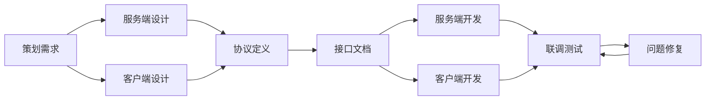

# Q111: 如何与客户端同学协作？

## 问题分析

本题考察跨团队协作能力：
- 接口设计
- 协议定义
- 联调流程
- 问题排查

---

## 一、协作模式

### 1.1 协作流程



---

## 二、协议设计

### 2.1 Protobuf 定义

```protobuf
// 游戏协议定义

// 基础定义
syntax = "proto3";

package game;

// ========== 通用消息 ==========

message Empty {}

// 错误信息
message Error {
    int32 code = 1;
    string message = 2;
}

// 位置信息
message Vector3 {
    float x = 1;
    float y = 2;
    float z = 3;
}

// ========== 登录协议 ==========

// 登录请求
message LoginRequest {
    string account = 1;
    string password = 2;
    string device_id = 3;
    string client_version = 4;
}

// 登录响应
message LoginResponse {
    int32 code = 1;
    string message = 2;
    string token = 3;
    repeated ServerInfo servers = 4;
}

message ServerInfo {
    int32 server_id = 1;
    string server_name = 2;
    string address = 3;
    int32 port = 4;
    int32 load = 5;
    bool is_recommend = 6;
}

// ========== 角色协议 ==========

// 创建角色请求
message CreateCharacterRequest {
    string name = 1;
    int32 class_id = 2;
    int32 gender = 3;
}

// 角色信息
message CharacterInfo {
    int64 character_id = 1;
    string name = 2;
    int32 level = 3;
    int32 class_id = 4;
    int32 exp = 5;
    Vector3 position = 6;
    int64 gold = 7;
}

// 创建角色响应
message CreateCharacterResponse {
    int32 code = 1;
    string message = 2;
    CharacterInfo character = 3;
}

// ========== 游戏消息 ==========

// 位置同步
message PositionSync {
    int64 entity_id = 1;
    Vector3 position = 2;
    float yaw = 3;
    uint32 timestamp = 4;
}

// 技能释放
message CastSkillRequest {
    int32 skill_id = 1;
    int64 target_id = 2;
    Vector3 target_position = 3;
}

// 技能释放通知
message CastSkillNotify {
    int64 caster_id = 1;
    int32 skill_id = 2;
    int64 target_id = 3;
    Vector3 position = 4;
    uint32 timestamp = 5;
}

// 伤害通知
message DamageNotify {
    int64 target_id = 1;
    int64 attacker_id = 2;
    int32 damage = 3;
    int32 current_hp = 4;
    bool is_critical = 5;
}

// ========== 聊天协议 ==========

// 聊天请求
message ChatRequest {
    int32 channel = 1;  // 1:世界 2:公会 3:私聊
    string content = 2;
    int64 target_id = 3;  // 私聊时使用
}

// 聊天消息
message ChatMessage {
    int64 sender_id = 1;
    string sender_name = 2;
    int32 channel = 3;
    string content = 4;
    uint32 timestamp = 5;
}

// 服务端消息定义
message ServerMessage {
    uint32 msg_id = 1;
    uint64 sequence = 2;
    oneof body {
        LoginResponse login_response = 10;
        CreateCharacterResponse create_character_response = 11;
        CharacterInfo character_info = 12;
        PositionSync position_sync = 20;
        CastSkillNotify cast_skill_notify = 21;
        DamageNotify damage_notify = 22;
        ChatMessage chat_message = 30;
        Error error = 100;
    }
}
```

### 2.2 接口文档

```markdown
# 接口文档模板

## 消息: 登录

### 请求 (Client -> Server)
```protobuf
LoginRequest {
    string account;      // 账号
    string password;     // 密码 (MD5)
    string device_id;    // 设备 ID
    string client_version; // 客户端版本
}
```

### 响应 (Server -> Client)
```protobuf
LoginResponse {
    int32 code;         // 0:成功, 其他:失败
    string message;     // 提示信息
    string token;       // 登录令牌
    repeated ServerInfo servers; // 可选服务器列表
}
```

### 错误码
| Code | 说明 |
|------|------|
| 0 | 成功 |
| 1001 | 账号不存在 |
| 1002 | 密码错误 |
| 1003 | 账号被封禁 |
| 1004 | 版本不匹配 |
| 1005 | 服务器已满 |

### 注意事项
1. 密码需要 MD5 加密后传输
2. token 有效期 24 小时
3. 建议客户端缓存最近登录的服务器
```

---

## 三、联调工具

### 3.1 测试工具

```python
# 联调测试工具

import socket
import struct
import json
import time

class GameClientTester:
    """游戏客户端测试器"""

    def __init__(self, host, port):
        self.host = host
        self.port = port
        self.socket = None
        self.sequence = 0

    def connect(self):
        """连接服务器"""
        self.socket = socket.socket(socket.AF_INET, socket.SOCK_STREAM)
        self.socket.connect((self.host, self.port))
        print(f"Connected to {self.host}:{self.port}")

    def disconnect(self):
        """断开连接"""
        if self.socket:
            self.socket.close()

    def send_message(self, msg_id, body):
        """发送消息"""
        self.sequence += 1

        # 序列化消息体
        if isinstance(body, str):
            body_bytes = body.encode('utf-8')
        else:
            body_bytes = json.dumps(body).encode('utf-8')

        # 构造消息头
        header = struct.pack('>IHH',
            len(body_bytes),  # 消息长度
            msg_id,           # 消息 ID
            self.sequence     # 序列号
        )

        # 发送
        self.socket.sendall(header + body_bytes)
        print(f"Sent: msg_id={msg_id}, seq={self.sequence}")

    def receive_message(self, timeout=5):
        """接收消息"""
        self.socket.settimeout(timeout)

        try:
            # 接收消息头 (8 字节)
            header = self._recv_all(8)
            if not header:
                return None

            length, msg_id, sequence = struct.unpack('>IHH', header)

            # 接收消息体
            body = self._recv_all(length)
            if body:
                body_data = json.loads(body.decode('utf-8'))
                print(f"Recv: msg_id={msg_id}, seq={sequence}")
                return {'msg_id': msg_id, 'sequence': sequence, 'body': body_data}

        except socket.timeout:
            print("Receive timeout")
            return None

    def _recv_all(self, size):
        """接收指定大小数据"""
        data = b''
        while len(data) < size:
            packet = self.socket.recv(size - len(data))
            if not packet:
                return None
            data += packet
        return data


# 使用示例
def test_login():
    """测试登录"""
    client = GameClientTester('localhost', 9999)
    client.connect()

    # 发送登录请求
    login_request = {
        'account': 'test_user',
        'password': 'md5_hash_here',
        'device_id': 'test_device',
        'client_version': '1.0.0'
    }
    client.send_message(1001, login_request)

    # 接收响应
    response = client.receive_message()
    if response:
        print(f"Response: {response['body']}")

    client.disconnect()


if __name__ == '__main__':
    test_login()
```

---

## 四、问题排查

### 4.1 常见问题

```python
# 联调常见问题

class CollaborationIssues:
    """协作问题"""

    issues = {
        'Protocol_Mismatch': {
            '现象': '消息解析失败',
            '原因': [
                'Protobuf 版本不一致',
                '字段定义不同',
                '大小端问题'
            ],
            '解决': [
                '统一 Protobuf 定义文件',
                '版本号校验',
                '添加日志打印原始数据'
            ]
        },

        'State_Inconsistency': {
            '现象': '客户端显示和服务端不一致',
            '原因': [
                '客户端预测错误',
                '服务端校验失败',
                '网络延迟导致'
            ],
            '解决': [
                '增加服务端校正',
                '客户端显示服务端状态',
                '添加偏差日志'
            ]
        },

        'Timing_Issues': {
            '现象': '操作顺序不对',
            '原因': [
                '异步处理时序',
                '消息乱序',
                '并发竞争'
            ],
            '解决': [
                '添加序列号',
                '请求-响应匹配',
                '状态机检查'
            ]
        },

        'Performance_Issues': {
            '现象': '卡顿/掉帧',
            '原因': [
                '消息量过大',
                '处理不及时',
                '主线程阻塞'
            ],
            '解决': [
                '消息合并',
                '异步处理',
                '性能分析定位'
            ]
        }
    }
```

---

## 五、最佳实践

### 5.1 协作建议

| 实践 | 说明 |
|------|------|
| **协议优先** | 先定义协议再开发 |
| **文档同步** | 自动生成文档 |
| **版本兼容** | 支持多版本协议 |
| **联调环境** | 独立的测试环境 |
| **日志规范** | 统一的日志格式 |
| **定期同步** | 每周例会同步进度 |

---

## 六、总结

### 协作核心

```
客户端协作 = 协议统一 + 文档完善 + 联调工具 + 问题快速响应
- Protobuf 统一定义
- 自动生成文档和代码
- 测试工具辅助开发
- 及时沟通解决问题
```

---

## 参考资料

- [Protocol Buffers Guide](https://developers.google.com/protocol-buffers)
- [Game Client-Server Communication](https://www.gabrielgambetta.com/client-server-game-architecture/)
