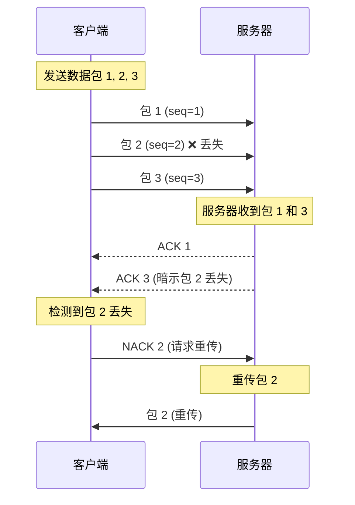

# Q12: 如何处理网络抖动和丢包？

## 问题分析

本题考察对网络不稳定的处理能力：
- 网络抖动（Jitter）和丢包的本质
- 抖动缓冲和预测技术
- KBEngine 的处理方式
- 前端插值与后端补偿

---

## 一、网络问题概述

### 1.1 网络问题分类

```
┌─────────────────────────────────────────────────────────────┐
│                    网络问题分类                              │
├─────────────────────────────────────────────────────────────┤
│                                                             │
│  1. 延迟 (Latency)                                          │
│     ├── 传播延迟   = 物理距离 / 光速                        │
│     ├── 传输延迟   = 数据大小 / 带宽                        │
│     ├── 处理延迟   = 服务器处理时间                         │
│     └── 排队延迟   = 网络设备排队                           │
│                                                             │
│  2. 抖动 (Jitter)                                           │
│     └── 延迟的变化 - RTT 忽高忽低                           │
│                                                             │
│  3. 丢包 (Packet Loss)                                      │
│     ├── 网络拥塞   → 路由器丢弃                             │
│     ├── 链路错误   → 数据损坏                               │
│     └── 缓冲溢出   → 接收方来不及处理                       │
│                                                             │
│  4. 乱序 (Out of Order)                                     │
│     └── 数据包到达顺序不一致                               │
│                                                             │
└─────────────────────────────────────────────────────────────┘
```

### 1.2 问题影响

| 问题 | 影响 | 典型场景 |
|------|------|----------|
| **延迟** | 操作响应慢 | 跨国服务器 |
| **抖动** | 画面卡顿、跳跃 | 移动网络 |
| **丢包** | 操作无响应、瞬移 | 弱网环境 |
| **乱序** | 状态不一致 | 多路径路由 |

---

## 二、抖动处理

### 2.1 抖动缓冲 (Jitter Buffer)

```
┌─────────────────────────────────────────────────────────────┐
│                    抖动缓冲原理                              │
├─────────────────────────────────────────────────────────────┤
│                                                             │
│  无抖动缓冲：                                                │
│  ┌─────────────────────────────────────────────────┐       │
│  │ 到达时间: 10ms  │ 15ms │ 40ms │ 12ms │ 35ms    │       │
│  │ 播放时间: 10ms  │ 15ms │ 40ms │ 12ms │ 35ms    │       │
│  │ 结果:  不均匀，画面卡顿                       │       │
│  └─────────────────────────────────────────────────┘       │
│                                                             │
│  有抖动缓冲：                                                │
│  ┌─────────────────────────────────────────────────┐       │
│  │ 到达时间: 10ms  │ 15ms │ 40ms │ 12ms │ 35ms    │       │
│  │         ↓         ↓      ↓      ↓      ↓       │       │
│  │ 缓冲队列: [10] [15] [40] [12] [35]             │       │
│  │         ↓         ↓      ↓      ↓      ↓       │       │
│  │ 播放时间: 50ms  │ 55ms │ 60ms │ 65ms │ 70ms   │       │
│  │ 结果:  均匀输出，流畅                       │       │
│  └─────────────────────────────────────────────────┘       │
│                                                             │
│  代价：增加固定延迟 (buffer_size = 最大抖动)                │
└─────────────────────────────────────────────────────────────┘
```

### 2.2 自适应抖动缓冲

```cpp
// 自适应抖动缓冲实现

class AdaptiveJitterBuffer {
public:
    // 最小/最大缓冲大小
    static constexpr int MIN_BUFFER_MS = 20;
    static constexpr int MAX_BUFFER_MS = 200;

    // 当前缓冲大小
    int currentBufferSizeMs_ = MIN_BUFFER_MS;

    // 包队列
    std::deque<Packet> packetQueue_;

    // 统计数据
    uint64_t totalJitter_ = 0;
    uint32_t jitterCount_ = 0;

    void addPacket(const Packet& packet, int receiveTimeMs) {
        // 计算抖动
        if (!packetQueue_.empty()) {
            int expectedTime = packetQueue_.back().sendTimeMs +
                              (receiveTimeMs - packet.sendTimeMs);
            int jitter = abs(receiveTimeMs - expectedTime);

            // 更新统计
            totalJitter_ += jitter;
            jitterCount_++;

            // 自适应调整缓冲大小
            adjustBufferSize();
        }

        packetQueue_.push_back(packet);
    }

    void adjustBufferSize() {
        // 计算平均抖动
        int avgJitter = totalJitter_ / jitterCount_;

        // 缓冲大小 = 2 * 平均抖动 (经验公式)
        int targetSize = avgJitter * 2;

        // 限制在合理范围内
        targetSize = std::clamp(targetSize,
                                MIN_BUFFER_MS,
                                MAX_BUFFER_MS);

        // 平滑调整 (避免频繁变化)
        currentBufferSizeMs_ = currentBufferSizeMs_ * 0.8 +
                               targetSize * 0.2;
    }

    // 获取当前应该播放的包
    Packet* getPacketToPlay(int currentTimeMs) {
        int playTimeMs = currentTimeMs + currentBufferSizeMs_;

        if (packetQueue_.empty()) {
            return nullptr;
        }

        // 检查是否有包应该播放
        if (packetQueue_.front().sendTimeMs >= playTimeMs) {
            Packet& packet = packetQueue_.front();
            packetQueue_.pop_front();
            return &packet;
        }

        return nullptr;
    }
};
```

### 2.3 动态延迟补偿

```
┌─────────────────────────────────────────────────────────────┐
│                 动态延迟补偿策略                             │
├─────────────────────────────────────────────────────────────┤
│                                                             │
│  RTT 测量：                                                  │
│  ┌─────────────────────────────────────────────────┐       │
│  │  时刻    │ RTT   │ 加权 RTT │ 补偿延迟          │       │
│  ├─────────────────────────────────────────────────┤       │
│  │  T0     │ 50ms  │   50ms   │   25ms            │       │
│  │  T1     │ 60ms  │   52ms   │   26ms            │       │
│  │  T2     │ 200ms │   81ms   │   40ms   ↑ 抖动!  │       │
│  │  T3     │ 55ms  │   76ms   │   38ms            │       │
│  │  T4     │ 50ms  │   71ms   │   35ms   ↓ 恢复   │       │
│  └─────────────────────────────────────────────────┘       │
│                                                             │
│  加权公式：RTT_avg = RTT_avg * 0.8 + RTT_new * 0.2          │
│  补偿延迟：RTT_avg / 2                                      │
│                                                             │
└─────────────────────────────────────────────────────────────┘
```

---

## 三、丢包处理

### 3.1 丢包检测

```cpp
// 丢包检测机制

class PacketLossDetector {
public:
    // 期望的序列号
    uint16_t expectedSeq_ = 0;

    // 丢包统计
    uint32_t totalPackets_ = 0;
    uint32_t lostPackets_ = 0;

    void onPacketReceived(uint16_t seq) {
        totalPackets_++;

        // 检测丢包
        if (seq != expectedSeq_) {
            uint16_t gap = (seq - expectedSeq_) & 0xFFFF;

            if (gap < 1000) {  // 防止序列号回绕导致的误判
                // 检测到丢包
                lostPackets_ += gap;

                // 请求重传
                for (uint16_t missing = expectedSeq_;
                     missing != seq;
                     missing = (missing + 1) & 0xFFFF) {
                    requestRetransmit(missing);
                }
            }
        }

        expectedSeq_ = (seq + 1) & 0xFFFF;
    }

    // 获取丢包率
    float getLossRate() const {
        if (totalPackets_ == 0) return 0.0f;
        return (float)lostPackets_ / totalPackets_;
    }
};
```

### 3.2 重传机制



### 3.3 FEC 前向纠错

```
FEC (Forward Error Correction) 原理：

┌─────────────────────────────────────────────────────────────┐
│                     FEC 原理                                │
├─────────────────────────────────────────────────────────────┤
│                                                             │
│  发送端：                                                    │
│  ┌─────────────────────────────────────────────────┐       │
│  │  原始数据: D1, D2, D3, D4                       │       │
│  │           ↓                                     │       │
│  │  计算 FEC: F1 = D1 ⊕ D2 ⊕ D3 ⊕ D4 (异或)        │       │
│  │           ↓                                     │       │
│  │  发送: D1, D2, D3, D4, F1                      │       │
│  └─────────────────────────────────────────────────┘       │
│                                                             │
│  接收端（D2 丢失）：                                        │
│  ┌─────────────────────────────────────────────────┐       │
│  │  收到: D1, X, D3, D4, F1                        │       │
│  │           ↓                                     │       │
│  │  恢复: D2 = D1 ⊕ D3 ⊕ D4 ⊕ F1                  │       │
│  │           ↓                                     │       │
│  │  成功恢复丢失数据！                              │       │
│  └─────────────────────────────────────────────────┘       │
│                                                             │
│  限制：只能恢复单个包丢失，多个包丢失需要更强 FEC           │
└─────────────────────────────────────────────────────────────┘
```

```cpp
// FEC 实现

class FECCodec {
public:
    // 编码（发送端）
    std::vector<uint8_t> encode(const std::vector<Packet>& packets) {
        std::vector<uint8_t> fecData;

        // 所有包异或
        for (const auto& packet : packets) {
            if (fecData.empty()) {
                fecData = packet.data;
            } else {
                for (size_t i = 0; i < packet.data.size(); ++i) {
                    fecData[i] ^= packet.data[i];
                }
            }
        }

        return fecData;
    }

    // 解码（接收端）
    bool decode(std::vector<Packet>& packets,
                const std::vector<uint8_t>& fecData) {
        // 找出丢失的包
        for (size_t i = 0; i < packets.size(); ++i) {
            if (packets[i].lost) {
                // 使用 FEC 恢复
                packets[i].data = fecData;
                for (size_t j = 0; j < packets.size(); ++j) {
                    if (j != i && !packets[j].lost) {
                        for (size_t k = 0; k < packets[i].data.size(); ++k) {
                            packets[i].data[k] ^= packets[j].data[k];
                        }
                    }
                }
                packets[i].recovered = true;
                return true;
            }
        }
        return false;
    }
};
```

---

## 四、客户端补偿

### 4.1 位置插值

```cpp
// 客户端位置插值

class PositionInterpolator {
public:
    // 位置样本
    struct Sample {
        Vector3 position;
        uint32_t timestamp;
    };

    std::deque<Sample> samples_;

    // 添加位置样本
    void addSample(const Vector3& pos, uint32_t timestamp) {
        samples_.push_back({pos, timestamp});

        // 只保留最近 500ms 的样本
        uint32_t now = getTime();
        while (!samples_.empty() &&
               (now - samples_.front().timestamp) > 500) {
            samples_.pop_front();
        }
    }

    // 获取插值位置
    Vector3 getInterpolatedPosition(uint32_t timestamp) {
        if (samples_.size() < 2) {
            return samples_.empty() ? Vector3() : samples_.back().position;
        }

        // 找到前后两个样本
        Sample* prev = nullptr;
        Sample* next = nullptr;

        for (size_t i = 0; i < samples_.size() - 1; ++i) {
            if (samples_[i].timestamp <= timestamp &&
                samples_[i + 1].timestamp >= timestamp) {
                prev = &samples_[i];
                next = &samples_[i + 1];
                break;
            }
        }

        if (!prev || !next) {
            return samples_.back().position;
        }

        // 线性插值
        float t = (float)(timestamp - prev->timestamp) /
                  (next->timestamp - prev->timestamp);

        return lerp(prev->position, next->position, t);
    }

    // 线性插值
    Vector3 lerp(const Vector3& a, const Vector3& b, float t) {
        return a + (b - a) * t;
    }
};
```

### 4.2 速度外推

```cpp
// 速度外推（处理丢包）

class VelocityExtrapolator {
public:
    struct State {
        Vector3 position;
        Vector3 velocity;
        uint32_t timestamp;
    };

    State lastState_;

    // 更新状态
    void update(const Vector3& pos, uint32_t timestamp) {
        if (!lastState_.timestamp) {
            lastState_ = {pos, Vector3(), timestamp};
            return;
        }

        // 计算速度
        float dt = (timestamp - lastState_.timestamp) / 1000.0f;
        if (dt > 0) {
            lastState_.velocity = (pos - lastState_.position) / dt;
        }

        lastState_.position = pos;
        lastState_.timestamp = timestamp;
    }

    // 外推位置（丢包时使用）
    Vector3 extrapolate(uint32_t currentTime) {
        float dt = (currentTime - lastState_.timestamp) / 1000.0f;

        // 限制外推时间（避免误差累积）
        dt = std::min(dt, 0.5f);  // 最多外推 500ms

        return lastState_.position + lastState_.velocity * dt;
    }
};
```

---

## 五、服务端处理

### 5.1 KBEngine 的可靠性机制

```cpp
// KBEngine 的可靠传输机制
// src/server/network/channel.h

class Channel {
public:
    // 发送可靠消息
    bool send(Message* msg) {
        if (msg->isReliable()) {
            // 添加到可靠队列
            reliableQueue_.push(msg);

            // 设置超时重传
            msg->timeout_ = currentTime_ + RTO;
            msg->retries_ = 0;
        }

        return socket_->send(msg);
    }

    // 处理 ACK
    void onAck(uint16_t seq) {
        // 移除已确认的消息
        while (!reliableQueue_.empty() &&
               reliableQueue_.front()->seq_ <= seq) {
            delete reliableQueue_.front();
            reliableQueue_.pop();
        }
    }

    // 超时重传
    void checkRetransmit() {
        uint64_t now = currentTime_;

        for (auto* msg : reliableQueue_) {
            if (now >= msg->timeout_) {
                if (msg->retries_ < MAX_RETRIES) {
                    // 重传
                    socket_->send(msg);
                    msg->retries_++;
                    msg->timeout_ = now + RTO * (1 << msg->retries_);
                } else {
                    // 超过最大重传次数，断开连接
                    onTimeout();
                    return;
                }
            }
        }
    }

private:
    std::queue<Message*> reliableQueue_;
    static constexpr uint64_t RTO = 100;  // 100ms
    static constexpr int MAX_RETRIES = 5;
};
```

### 5.2 拥塞控制

```cpp
// KBEngine 的流量控制

class FlowController {
public:
    // 发送窗口
    uint32_t sendWindow_ = 10;
    uint32_t unackedCount_ = 0;

    // 判断是否可以发送
    bool canSend() const {
        return unackedCount_ < sendWindow_;
    }

    // 发送消息
    void onSend() {
        unackedCount_++;
    }

    // 收到 ACK
    void onAck() {
        unackedCount_--;

        // 动态调整窗口
        if (unackedCount_ < sendWindow_ / 2) {
            // 网络空闲，增大窗口
            sendWindow_ = std::min(sendWindow_ * 2, 256u);
        }
    }

    // 发生超时
    void onTimeout() {
        // 减小窗口
        sendWindow_ = std::max(sendWindow_ / 2, 1u);
    }
};
```

---

## 六、综合处理策略

### 6.1 分层处理

```
┌─────────────────────────────────────────────────────────────┐
│                  网络问题分层处理                             │
├─────────────────────────────────────────────────────────────┤
│                                                             │
│  ┌─────────────────────────────────────────────────┐       │
│  │  应用层     │  预测、插值、外推、补偿               │       │
│  └─────────────────────────────────────────────────┘       │
│                    │                                         │
│  ┌─────────────────────────────────────────────────┐       │
│  │  可靠层     │  ACK/NACK、重传、FEC                │       │
│  └─────────────────────────────────────────────────┘       │
│                    │                                         │
│  ┌─────────────────────────────────────────────────┐       │
│  │  传输层     │  TCP/KCP/UDP                       │       │
│  └─────────────────────────────────────────────────┘       │
│                    │                                         │
│  ┌─────────────────────────────────────────────────┐       │
│  │  网络层     │  IP 路由、分片                       │       │
│  └─────────────────────────────────────────────────┘       │
│                                                             │
└─────────────────────────────────────────────────────────────┘
```

### 6.2 自适应策略

```cpp
// 网络自适应策略

class NetworkAdaptiveController {
public:
    enum class NetworkCondition {
        EXCELLENT,  // RTT < 50ms, 丢包 < 1%
        GOOD,       // RTT < 100ms, 丢包 < 3%
        FAIR,       // RTT < 200ms, 丢包 < 10%
        POOR,       // RTT > 200ms, 丢包 > 10%
    };

    NetworkCondition condition_ = NetworkCondition::GOOD;

    // 更新网络状态
    void updateNetworkStatus(uint16_t rtt, float lossRate) {
        if (rtt < 50 && lossRate < 0.01f) {
            condition_ = NetworkCondition::EXCELLENT;
        } else if (rtt < 100 && lossRate < 0.03f) {
            condition_ = NetworkCondition::GOOD;
        } else if (rtt < 200 && lossRate < 0.10f) {
            condition_ = NetworkCondition::FAIR;
        } else {
            condition_ = NetworkCondition::POOR;
        }

        // 根据网络状态调整策略
        adjustStrategy();
    }

    void adjustStrategy() {
        switch (condition_) {
            case NetworkCondition::EXCELLENT:
                // 高质量网络：降低延迟优先
                jitterBufferMs_ = 20;
                sendRate_ = 60;  // 60 fps
                enableFEC_ = false;
                break;

            case NetworkCondition::GOOD:
                // 良好网络：平衡
                jitterBufferMs_ = 50;
                sendRate_ = 30;
                enableFEC_ = false;
                break;

            case NetworkCondition::FAIR:
                // 一般网络：增加可靠性
                jitterBufferMs_ = 100;
                sendRate_ = 20;
                enableFEC_ = true;
                break;

            case NetworkCondition::POOR:
                // 差网络：可靠性优先
                jitterBufferMs_ = 200;
                sendRate_ = 10;
                enableFEC_ = true;
                break;
        }
    }

private:
    int jitterBufferMs_;
    int sendRate_;
    bool enableFEC_;
};
```

---

## 七、总结

### 处理策略总结

| 问题 | 处理方法 | 适用层 |
|------|----------|--------|
| **抖动** | 抖动缓冲 | 客户端 |
| **丢包** | 重传、FEC | 传输层 |
| **延迟** | 预测、插值 | 应用层 |
| **乱序** | 序列号重排 | 传输层 |

### 最佳实践

```
1. 客户端处理
   - 抖动缓冲（平滑播放）
   - 位置插值（平滑移动）
   - 速度外推（丢包补偿）

2. 服务器处理
   - 可靠传输（ACK/重传）
   - 流量控制（窗口机制）
   - 拥塞避免（动态调整）

3. 协议选择
   - TCP：可靠但延迟高
   - KCP：低延迟可靠
   - UDP：最快但不可靠

4. 自适应策略
   - 根据网络质量调整
   - 动态选择处理策略
   - 平衡延迟与可靠性
```

---

## 参考资料

- [KBEngine GitHub - 网络层源码](https://github.com/kbengine/kbengine/tree/master/kbe/src/server/network)
- [KCP 协议丢包处理](https://github.com/skywind3000/kcp)
- [网络抖动处理技术](https://en.wikipedia.org/wiki/Jitter_buffer)
- [FEC 前向纠错原理](https://en.wikipedia.org/wiki/Forward_error_correction)
