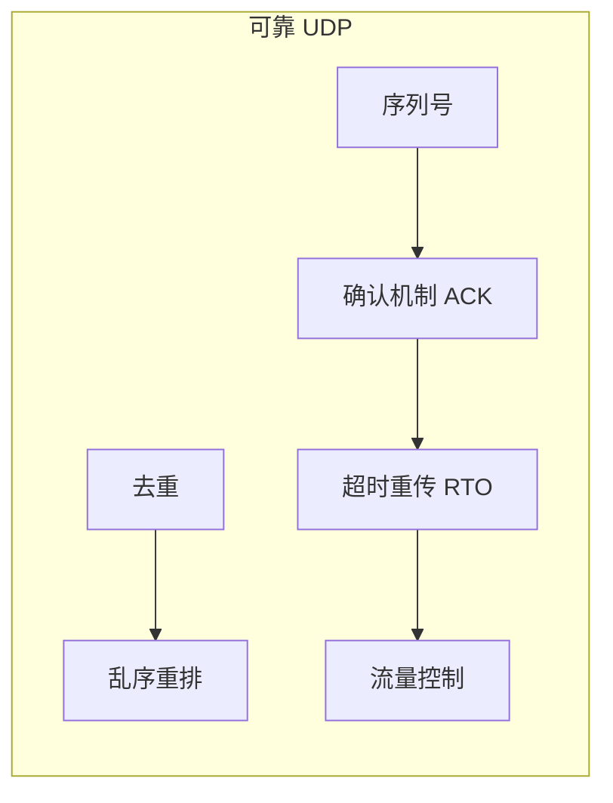

# Q13: 什么是可靠 UDP？如何实现？

## 问题分析

本题考察对可靠 UDP 的理解：
- 为什么需要可靠 UDP
- 可靠 UDP 的实现原理
- KBEngine 的可靠 UDP 实现
- 与 TCP 的对比

---

## 一、可靠 UDP 概述

### 1.1 为什么需要可靠 UDP

```
┌─────────────────────────────────────────────────────────────┐
│                  TCP vs UDP 的困境                          │
├─────────────────────────────────────────────────────────────┤
│                                                             │
│  TCP 的问题：                                                │
│  ├── HEAD-OF-LINE BLOCKING - 丢包阻塞后续数据               │
│  ├── 拥塞控制保守 - 发送速率受限                            │
│  ├── 连接建立开销 - 三次握手                                │
│  └── 固定重传超时 - 延迟高                                  │
│                                                             │
│  UDP 的问题：                                                │
│  ├── 不可靠 - 数据可能丢失                                  │
│  ├── 无序 - 数据可能乱序                                    │
│  ├── 无流量控制 - 可能淹没接收方                            │
│  └── 无拥塞控制 - 可能导致网络拥塞                          │
│                                                             │
│  解决方案：可靠 UDP                                          │
│  ├── 保留 UDP 的低延迟特性                                  │
│  ├── 在应用层实现可靠性                                     │
│  ├── 可根据场景定制策略                                     │
│  └── 避免 TCP 的固有缺陷                                    │
│                                                             │
└─────────────────────────────────────────────────────────────┘
```

### 1.2 可靠 UDP 的设计目标

| 特性 | TCP | UDP | 可靠 UDP |
|------|-----|-----|----------|
| **延迟** | 高 | 最低 | 低 |
| **可靠性** | 高 | 无 | 高 |
| **顺序** | 保证 | 无 | 保证 |
| **拥塞控制** | 内置 | 无 | 可选 |
| **灵活性** | 低 | 高 | 高 |

---

## 二、可靠 UDP 实现原理

### 2.1 核心机制



### 2.2 数据包格式

```
┌─────────────────────────────────────────────────────────────┐
│                  可靠 UDP 数据包格式                         │
├─────────────────────────────────────────────────────────────┤
│                                                             │
│  ┌─────────────────────────────────────────────────┐       │
│  │  UDP 首部 (8 字节)                               │       │
│  │  ┌────────┬────────┬──────┬──────┐              │       │
│  │  │源端口  │目标端口│ 长度  │校验和 │              │       │
│  │  └────────┴────────┴──────┴──────┘              │       │
│  ├─────────────────────────────────────────────────┤       │
│  │  可靠层 首部                                    │       │
│  │  ┌──────────┬──────────┬──────────┬──────────┐ │       │
│  │  │ 序列号    │ 确认号    │ 标志     │ 窗口     │ │       │
│  │  │ (16bit)  │ (16bit)  │ (8bit)   │ (16bit)  │ │       │
│  │  └──────────┴──────────┴──────────┴──────────┘ │       │
│  ├─────────────────────────────────────────────────┤       │
│  │  数据负载                                        │       │
│  └─────────────────────────────────────────────────┘       │
│                                                             │
│  标志位：                                                  │
│  ├── bit 0: SYN (同步)                                     │
│  ├── bit 1: ACK (确认)                                     │
│  ├── bit 2: FIN (结束)                                     │
│  └── bit 3: NACK (负确认)                                  │
│                                                             │
└─────────────────────────────────────────────────────────────┘
```

### 2.3 状态机

```
┌─────────────────────────────────────────────────────────────┐
│                  可靠 UDP 连接状态机                        │
├─────────────────────────────────────────────────────────────┤
│                                                             │
│    ┌─────────┐                                             │
│    │ CLOSED  │                                             │
│    └────┬────┘                                             │
│         │ 发送 SYN                                          │
│         ▼                                                   │
│    ┌─────────┐   收到 SYN/ACK   ┌─────────┐                │
│    │ SYN_SENT │ ───────────────►│ ESTAB   │                │
│    └─────────┘                  └────┬────┘                │
│         ▲                              │                    │
│         │    收到 SYN                 │ 发送 FIN            │
│         └─────────────────────────────┼─────────────────┐  │
│                                        ▼                 │  │
│                                  ┌─────────┐             │  │
│                                  │FIN_WAIT │             │  │
│                                  └────┬────┘             │  │
│                                       │ 收到 FIN/ACK      │  │
│                                       ▼                  │  │
│                                  ┌─────────┐             │  │
│                                  │ CLOSED  │◄────────────┘  │
│                                  └─────────┘                │
│                                                             │
└─────────────────────────────────────────────────────────────┘
```

---

## 三、核心机制实现

### 3.1 序列号与确认

```cpp
// 可靠 UDP 实现

class ReliableUDP {
public:
    // 发送窗口
    struct SendWindow {
        struct Slot {
            Packet packet;
            bool acked;
            uint64_t sendTime;
            int retries;
        };

        std::array<Slot, 256> slots;
        uint16_t base;      // 窗口起始序列号
        uint16_t next;      // 下一个待发送序列号
        uint16_t size;      // 窗口大小
    };

    // 接收窗口
    struct RecvWindow {
        struct Slot {
            Packet packet;
            bool received;
        };

        std::array<Slot, 256> slots;
        uint16_t base;      // 期望接收序列号
        uint16_t size;      // 窗口大小
    };

    // 发送数据
    bool send(const void* data, size_t len) {
        if (sendWindow_.next - sendWindow_.base >= sendWindow_.size) {
            // 发送窗口已满
            return false;
        }

        // 创建数据包
        Packet packet;
        packet.seq = sendWindow_.next;
        packet.data.assign((char*)data, (char*)data + len);

        // 存入发送窗口
        auto& slot = sendWindow_.slots[packet.seq % 256];
        slot.packet = packet;
        slot.acked = false;
        slot.sendTime = getCurrentTime();
        slot.retries = 0;

        // 发送
        udpSocket_->sendTo(packet.data, destAddr_);

        sendWindow_.next++;
        return true;
    }

    // 接收数据
    void onPacketReceived(const Packet& packet) {
        uint16_t seq = packet.seq;

        // 检查是否在接收窗口内
        if (seq - recvWindow_.base < recvWindow_.size) {
            auto& slot = recvWindow_.slots[seq % 256];
            slot.packet = packet;
            slot.received = true;

            // 发送 ACK
            sendAck(seq);

            // 处理可交付的数据
            deliverPackets();
        }
    }

    // 处理 ACK
    void onAckReceived(uint16_t ack) {
        // 标记已确认
        for (uint16_t seq = sendWindow_.base;
             seq != ack;
             seq = (seq + 1) & 0xFFFF) {
            auto& slot = sendWindow_.slots[seq % 256];
            slot.acked = true;
        }

        // 滑动窗口
        while (sendWindow_.base != ack) {
            auto& slot = sendWindow_.slots[sendWindow_.base % 256];
            if (!slot.acked) break;
            sendWindow_.base++;
        }
    }

    // 交付已接收的数据
    void deliverPackets() {
        while (recvWindow_.base < recvWindow_.base + recvWindow_.size) {
            auto& slot = recvWindow_.slots[recvWindow_.base % 256];
            if (!slot.received) break;

            // 交付给应用层
            onDataReceived(slot.packet.data);

            recvWindow_.base++;
        }
    }

private:
    UDPSocket* udpSocket_;
    SendWindow sendWindow_;
    RecvWindow recvWindow_;
};
```

### 3.2 超时重传

```cpp
// 超时重传实现

class RetransmissionManager {
public:
    // RTO (Retransmission Timeout) 计算
    static constexpr uint64_t MIN_RTO = 100;   // 100ms
    static constexpr uint64_t MAX_RTO = 3000;  // 3s
    static constexpr float G = 0.125f;          // 增益因子

    uint64_t srtt_ = 0;   // 平滑 RTT
    uint64_t rttvar_ = 0; // RTT 变化量
    uint64_t rto_ = MIN_RTO;

    // 更新 RTT 估算
    void updateRTT(uint64_t measuredRTT) {
        if (srtt_ == 0) {
            // 第一次测量
            srtt_ = measuredRTT;
            rttvar_ = measuredRTT / 2;
        } else {
            // 更新平滑 RTT
            rttvar_ = (3 * rttvar_ + abs(measuredRTT - srtt_)) / 4;
            srtt_ = (7 * srtt_ + measuredRTT) / 8;
        }

        // 计算 RTO
        rto_ = std::clamp(srtt_ + 4 * rttvar_, MIN_RTO, MAX_RTO);
    }

    // 检查超时重传
    void checkTimeouts(uint64_t currentTime) {
        for (uint16_t seq = sendWindow_.base;
             seq != sendWindow_.next;
             seq = (seq + 1) & 0xFFFF) {
            auto& slot = sendWindow_.slots[seq % 256];

            if (slot.acked) continue;

            if (currentTime - slot.sendTime >= rto_) {
                // 超时，重传
                if (slot.retries < MAX_RETRIES) {
                    retransmit(slot);
                    slot.retries++;
                    slot.sendTime = currentTime;

                    // 指数退避
                    rto_ = std::min(rto_ * 2, MAX_RTO);
                } else {
                    // 超过最大重传次数，连接超时
                    onTimeout();
                    return;
                }
            }
        }
    }

    void retransmit(SendWindow::Slot& slot) {
        // 重传数据包
        udpSocket_->sendTo(slot.packet.data, destAddr_);
    }

private:
    static constexpr int MAX_RETRIES = 5;
};
```

### 3.3 快速重传

```cpp
// 快速重传（类似 TCP）

class FastRetransmit {
public:
    // 重复 ACK 计数
    std::unordered_map<uint16_t, int> dupAckCount_;

    // 处理 ACK
    void onAck(uint16_t ack) {
        if (ack == lastAck_) {
            // 重复 ACK
            dupAckCount_[ack]++;

            // 3 次重复 ACK，立即重传
            if (dupAckCount_[ack] >= 3) {
                fastRetransmit(ack);
                dupAckCount_.clear();
            }
        } else {
            // 新 ACK
            lastAck_ = ack;
            dupAckCount_.clear();
        }
    }

    // 快速重传
    void fastRetransmit(uint16_t ack) {
        // 重传从 ack 开始的未确认数据
        for (uint16_t seq = ack;
             seq != sendWindow_.next;
             seq = (seq + 1) & 0xFFFF) {
            auto& slot = sendWindow_.slots[seq % 256];
            if (!slot.acked) {
                retransmit(slot);
                break;  // 只重传一个包
            }
        }
    }

private:
    uint16_t lastAck_ = 0;
};
```

---

## 四、KBEngine 的可靠 UDP

### 4.1 KBEngine 实现

根据 [KBEngine 源码](https://github.com/kbengine/kbengine)：

```cpp
// KBEngine 可靠 UDP 实现
// src/server/network/reliable_udp.h

class ReliableUDP : public Channel {
public:
    // 数据包标志
    enum PacketFlags {
        FLAG_HAS_RECV_PACKET = 1,    // 已接收包
        FLAG_IS_SENDING = 2,         // 发送中
        FLAG_HAS_SEND_PACKET = 4,    // 已发送包
    };

    // 发送数据包
    bool send(Packet* pPacket) {
        if (pPacket->isReliable()) {
            // 可靠包需要处理
            pPacket->seq = sequence_++;

            // 添加到发送队列
            sendQueue_.push(pPacket);

            // 立即发送
            pPacket->flags |= FLAG_IS_SENDING;
            pPacket->sentTimes = 1;
            pPacket->sentTime = getTime();

            channel_->send(pPacket);
        } else {
            // 不可靠包直接发送
            channel_->send(pPacket);
        }

        return true;
    }

    // 处理 ACK
    void processAck(uint16_t seq) {
        // 从发送队列移除已确认的包
        auto iter = sendQueue_.begin();
        while (iter != sendQueue_.end()) {
            if ((*iter)->seq == seq) {
                delete *iter;
                iter = sendQueue_.erase(iter);
                break;
            }
            ++iter;
        }
    }

    // 超时重传
    void checkSendTimeOut() {
        uint64_t now = getTime();
        uint64_t timeout = resendTimeout_ * 1000;  // 微秒

        for (auto* pPacket : sendQueue_) {
            if (pPacket->flags & FLAG_IS_SENDING) {
                if (now - pPacket->sentTime >= timeout) {
                    // 超时重传
                    if (pPacket->sentTimes < maxResendTimes_) {
                        channel_->send(pPacket);
                        pPacket->sentTimes++;
                        pPacket->sentTime = now;
                    } else {
                        // 超过最大重传次数
                        onPacketLoss(pPacket);
                    }
                }
            }
        }
    }

private:
    std::list<Packet*> sendQueue_;
    uint16_t sequence_ = 0;
    uint32_t resendTimeout_ = 500;  // 500ms
    uint32_t maxResendTimes_ = 5;
};
```

### 4.2 与 TCP 的对比

```
┌─────────────────────────────────────────────────────────────┐
│              KBEngine 可靠 UDP vs TCP                       │
├─────────────────────────────────────────────────────────────┤
│                                                             │
│  KBEngine 可靠 UDP 优势：                                    │
│  ├── 无连接建立延迟                                         │
│  ├── 更灵活的重传策略                                       │
│  ├── 可选择性地启用可靠性                                   │
│  └── 避免 TCP 的 HOLE 问题                                  │
│                                                             │
│  KBEngine 默认使用 TCP：                                     │
│  ├── 开发更简单                                             │
│  ├── 调试更方便                                             │
│  ├── 兼容性更好                                             │
│  └── 对于大多数场景足够                                     │
│                                                             │
└─────────────────────────────────────────────────────────────┘
```

---

## 五、高级特性

### 5.1 选择性确认 (SACK)

```
┌─────────────────────────────────────────────────────────────┐
│                  SACK (Selective ACK)                       │
├─────────────────────────────────────────────────────────────┤
│                                                             │
│  场景：发送方发送 1-5 号包，其中 2、4 丢失                  │
│                                                             │
│  传统 ACK：                                                 │
│  ┌─────────────────────────────────────────────────┐       │
│  │  接收方: ACK 1                                   │       │
│  │  接收方: ACK 1 (等待 2)                          │       │
│  │  接收方: ACK 3 (暗示 2 丢失)                     │       │
│  │  发送方: 重传 2                                   │       │
│  │  接收方: ACK 4 (暗示 4 丢失)                     │       │
│  │  发送方: 重传 4                                   │       │
│  └─────────────────────────────────────────────────┘       │
│                                                             │
│  SACK：                                                     │
│  ┌─────────────────────────────────────────────────┐       │
│  │  接收方: ACK 1, SACK {1}                         │       │
│  │  接收方: ACK 3, SACK {1, 3} (暗示 2 丢失)        │       │
│  │  发送方: 重传 2, 4 (一次性重传所有丢失包)         │       │
│  └─────────────────────────────────────────────────┘       │
│                                                             │
└─────────────────────────────────────────────────────────────┘
```

### 5.2 FEC 前向纠错

```cpp
// FEC + 可靠 UDP 组合

class FECReliableUDP {
public:
    // 编码窗口
    struct FECWindow {
        std::vector<Packet> dataPackets;
        Packet fecPacket;
        uint16_t baseSeq;
    };

    // 发送数据
    void send(const std::vector<Packet>& packets) {
        FECWindow window;
        window.dataPackets = packets;
        window.baseSeq = nextSeq_;

        // 发送数据包
        for (auto& packet : packets) {
            packet.seq = nextSeq_++;
            udpSocket_->send(packet);
        }

        // 计算 FEC 包
        window.fecPacket = calculateFEC(packets);
        window.fecPacket.seq = nextSeq_++;
        window.fecPacket.isFEC = true;

        // 发送 FEC 包
        udpSocket_->send(window.fecPacket);

        fecWindows_.push_back(window);
    }

    // 接收数据
    void onPacketReceived(const Packet& packet) {
        if (packet.isFEC) {
            // FEC 包，存储备用
            fecPackets_[packet.seq] = packet;
        } else {
            // 数据包
            dataPackets_[packet.seq] = packet;

            // 检查是否有 FEC 窗口可以恢复
            checkFECRecovery();
        }
    }

    // 检查 FEC 恢复
    void checkFECRecovery() {
        for (auto& window : fecWindows_) {
            bool allReceived = true;
            Packet* missingPacket = nullptr;

            for (auto& packet : window.dataPackets) {
                auto it = dataPackets_.find(packet.seq);
                if (it == dataPackets_.end()) {
                    allReceived = false;
                    missingPacket = &packet;
                    break;
                }
            }

            // 如果只有一个包丢失，尝试恢复
            if (!allReceived && missingPacket) {
                auto fecIt = fecPackets_.find(window.fecPacket.seq);
                if (fecIt != fecPackets_.end()) {
                    recoverPacket(missingPacket, window, fecIt->second);
                }
            }
        }
    }

private:
    std::vector<FECWindow> fecWindows_;
    std::unordered_map<uint16_t, Packet> dataPackets_;
    std::unordered_map<uint16_t, Packet> fecPackets_;
};
```

---

## 六、总结

### 实现对比

| 特性 | TCP | KCP | 自研可靠 UDP |
|------|-----|-----|-------------|
| **实现复杂度** | 低 | 中 | 高 |
| **延迟** | 中 | 低 | 可定制 |
| **可靠性** | 高 | 高 | 可控 |
| **灵活性** | 低 | 中 | 高 |
| **维护成本** | 低 | 中 | 高 |

### 最佳实践

```
1. 大多数情况使用 TCP
   - KBEngine 默认选择
   - 开发简单、调试方便

2. 延迟敏感场景使用 KCP
   - 实时战斗
   - 状态同步

3. 特殊需求自研可靠 UDP
   - 有专门的协议团队
   - 需要深度定制
   - 长期投入维护
```

---

## 参考资料

- [KBEngine GitHub - reliable_udp.h](https://github.com/kbengine/kbengine/blob/master/kbe/src/server/network/reliable_udp.h)
- [KCP 协议](https://github.com/skywind3000/kcp)
- [TCP 拥塞控制](https://en.wikipedia.org/wiki/TCP_congestion_control)
- [RFC 2018 - TCP Selective Acknowledgment Options](https://tools.ietf.org/html/rfc2018)
