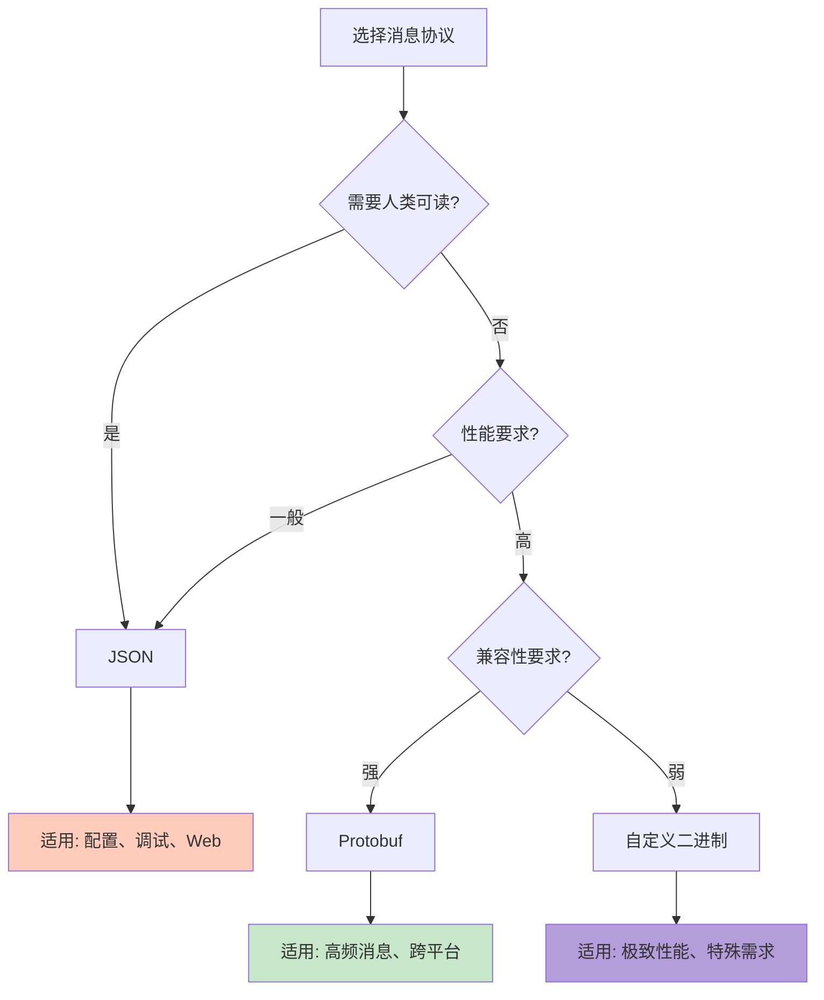

# Q14: 如何设计消息协议？Protobuf vs JSON vs 自定义协议？

## 问题分析

本题考察对消息协议设计的理解：
- 消息协议的核心需求
- Protobuf、JSON、自定义协议的对比
- KBEngine 的消息协议设计
- 不同场景的最佳选择

---

## 一、消息协议需求

### 1.1 核心需求

```
┌─────────────────────────────────────────────────────────────┐
│                  消息协议的核心需求                          │
├─────────────────────────────────────────────────────────────┤
│                                                             │
│  1. 性能需求                                                │
│     ├── 序列化/反序列化速度                                 │
│     ├── 数据大小（带宽占用）                                │
│     └── 内存占用                                           │
│                                                             │
│  2. 开发效率                                                │
│     ├── 可读性（调试方便）                                   │
│     ├── 易用性（开发体验）                                   │
│     └── 工具支持（代码生成）                                 │
│                                                             │
│  3. 兼容性                                                  │
│     ├── 向后兼容（老版本能解析新版本数据）                    │
│     ├── 跨语言支持                                          │
│     └── 平台支持                                           │
│                                                             │
│  4. 安全性                                                  │
│     ├── 数据验证                                           │
│     ├── 防篡改                                             │
│     └── 加密支持                                           │
│                                                             │
└─────────────────────────────────────────────────────────────┘
```

### 1.2 协议对比概览

| 维度 | JSON | XML | Protobuf | FlatBuffers | MsgPack |
|------|------|-----|----------|-------------|---------|
| **可读性** | ⭐⭐⭐⭐⭐ | ⭐⭐⭐⭐⭐ | ⭐ | ⭐ | ⭐⭐ |
| **序列化速度** | ⭐⭐ | ⭐ | ⭐⭐⭐⭐ | ⭐⭐⭐⭐⭐ | ⭐⭐⭐⭐ |
| **数据大小** | ⭐ | ⭐ | ⭐⭐⭐⭐ | ⭐⭐⭐⭐⭐ | ⭐⭐⭐⭐ |
| **向后兼容** | ⭐⭐⭐⭐⭐ | ⭐⭐⭐⭐⭐ | ⭐⭐⭐⭐⭐ | ⭐⭐⭐⭐ | ⭐⭐⭐⭐ |
| **跨语言** | ⭐⭐⭐⭐⭐ | ⭐⭐⭐⭐⭐ | ⭐⭐⭐⭐ | ⭐⭐⭐ | ⭐⭐⭐⭐ |
| **工具支持** | ⭐⭐⭐⭐⭐ | ⭐⭐⭐⭐ | ⭐⭐⭐⭐ | ⭐⭐⭐ | ⭐⭐⭐ |

---

## 二、JSON 协议

### 2.1 JSON 示例

```json
// 玩家登录请求
{
  "msgId": 1001,
  "seq": 1,
  "timestamp": 1640000000,
  "data": {
    "username": "player1",
    "password": "hashed_password",
    "version": "1.0.0",
    "device": {
      "type": "ios",
      "model": "iPhone 12",
      "osVersion": "15.0"
    }
  }
}

// 玩家移动请求
{
  "msgId": 2001,
  "seq": 2,
  "timestamp": 1640000100,
  "data": {
    "entityId": 12345,
    "position": {
      "x": 100.5,
      "y": 0.0,
      "z": 200.3
    },
    "rotation": 45.0
  }
}
```

### 2.2 JSON 优缺点

```
优点：
✅ 可读性强 - 人类可读，调试方便
✅ 易于使用 - 所有语言都有成熟库
✅ 灵活性高 - 动态添加字段
✅ Web 友好 - 前后端统一格式

缺点：
❌ 数据量大 - 大量重复的键名和引号
❌ 解析慢 - 需要完整的解析过程
❌ 无类型 - 类型信息丢失
❌ 不支持二进制数据
```

### 2.3 性能测试

```
测试：序列化 10000 次玩家对象

┌─────────────────────────────────────────────────────────────┐
│  格式   │ 序列化(ms) │ 反序列化(ms) │ 数据大小(KB) │         │
├─────────────────────────────────────────────────────────────┤
│  JSON   │    45      │     52      │     125      │         │
│  Protobuf│    8       │     12      │      35      │         │
│  MsgPack│    12      │     18      │      42      │         │
└─────────────────────────────────────────────────────────────┘
```

---

## 三、Protobuf 协议

### 3.1 Protobuf 示例

```protobuf
// player.proto

syntax = "proto3";

package game;

// 玩家信息
message PlayerInfo {
    uint64 player_id = 1;
    string username = 2;
    int32 level = 3;
    int64 exp = 4;
    int32 hp = 5;
    int32 max_hp = 6;

    message Position {
        float x = 1;
        float y = 2;
        float z = 3;
    }

    Position position = 7;
}

// 登录请求
message LoginRequest {
    string username = 1;
    string password = 2;
    string version = 3;
}

// 登录响应
message LoginResponse {
    int32 code = 1;
    string message = 2;
    PlayerInfo player_info = 3;
}

// 移动请求
message MoveRequest {
    uint64 entity_id = 1;
    Position position = 2;
    float rotation = 3;
}
```

### 3.2 Protobuf 编码原理

```
┌─────────────────────────────────────────────────────────────┐
│                  Protobuf 编码结构                          │
├─────────────────────────────────────────────────────────────┤
│                                                             │
│  每个 Tag-Length-Value (TLV):                              │
│  ┌─────────────────────────────────────────────────┐       │
│  │  Tag (1-5 bytes) │ Length │ Value (n bytes)    │       │
│  └─────────────────────────────────────────────────┘       │
│                                                             │
│  Tag 结构：                                                 │
│  ┌─────────────────────────────────────────────────┐       │
│  │  Field Number (高位) │ Wire Type (低位)        │       │
│  │  (field_id >> 3)      │ (field_id & 0x07)      │       │
│  └─────────────────────────────────────────────────┘       │
│                                                             │
│  Wire Type:                                                │
│  ├── 0: Varint (变长整数)                                  │
│  ├── 1: 64-bit (固定 8 字节)                               │
│  ├── 2: Length-delimited (字符串、嵌套消息)                 │
│  ├── 5: 32-bit (固定 4 字节)                               │
│                                                             │
│  示例：int32 x = 150;                                      │
│  ├── field_id = 1, wire_type = 0 (Varint)                 │
│  ├── tag = (1 << 3) | 0 = 0x08                            │
│  ├── value = 150 = 0x96 0x01 (Varint 编码)                │
│  └── 编码结果: 0x08 0x96 0x01 (3 bytes)                   │
│                                                             │
└─────────────────────────────────────────────────────────────┘
```

### 3.3 Protobuf 优缺点

```
优点：
✅ 高效 - 编码紧凑，解析快速
✅ 跨语言 - 支持所有主流语言
✅ 向后兼容 - 可安全添加/删除字段
✅ 强类型 - 有完整的类型定义
✅ 代码生成 - 自动生成序列化代码

缺点：
❌ 不可读 - 二进制格式，调试困难
❌ 需要 .proto 文件 - 增加编译步骤
❌ 不支持动态结构 - 修改需要重新编译
❌ 学习成本 - 需要了解 proto 语法
```

---

## 四、KBEngine 消息协议

### 4.1 KBEngine 协议格式

根据 [KBEngine 源码](https://github.com/kbengine/kbengine)：

```
┌─────────────────────────────────────────────────────────────┐
│                  KBEngine 消息协议                           │
├─────────────────────────────────────────────────────────────┤
│                                                             │
│  ┌─────────────────────────────────────────────────┐       │
│  │  消息头 (Message Header)                         │       │
│  │  ┌────────┬────────┬────────┬────────┐          │       │
│  │  │MsgType │ MsgID  │ Length │ ...    │          │       │
│  │  │(2bytes)│(2bytes)│(2bytes)│        │          │       │
│  │  └────────┴────────┴────────┴────────┘          │       │
│  ├─────────────────────────────────────────────────┤       │
│  │  消息体 (Message Body)                           │       │
│  │  ┌─────────────────────────────────────────┐    │       │
│  │  │  实体ID │ 参数列表 │ ...                 │    │       │
│  │  │(4 bytes)│ (变长)   │                     │    │       │
│  │  └─────────────────────────────────────────┘    │       │
│  └─────────────────────────────────────────────────┘       │
│                                                             │
│  消息类型 (MsgType):                                        │
│  ├── 0x01: 客户端 → 服务器                                  │
│  ├── 0x02: 服务器 → 客户端                                  │
│  ├── 0x03: 服务器内部                                       │
│  └── 0x04: 广播消息                                         │
│                                                             │
└─────────────────────────────────────────────────────────────┘
```

### 4.2 KBEngine 源码实现

```cpp
// KBEngine 消息定义
// src/server/network/message.h

class Message {
public:
    // 消息 ID
    MessageID id_;

    // 消息类型
    MessageType msgType_;

    // 消息长度
    uint16_t length_;

    // 实体 ID
    EntityID entityID_;

    // 参数列表
    MemoryStream args_;
};

// 消息打包器
class Bundle : public MemoryStream {
public:
    // 开始写入新消息
    void newMessage(MessageID msgID) {
        // 写入消息 ID
        (*this) << msgID;

        // 写入消息长度（占位）
        uint16_t length = 0;
        uint16_t* lengthPos = (uint16_t*)(wpos() + sizeof(msgID));
        (*this) << length;
    }

    // 结束消息写入
    void finishMessage() {
        // 回填消息长度
        uint16_t* lengthPos = ...;
        *lengthPos = wpos() - startPos_;
    }
};
```

### 4.3 KBEngine 参数序列化

```cpp
// KBEngine 参数序列化
// src/lib/python/Serialization/PyMemberDef.h

class PyMemberDef {
public:
    // 类型枚举
    enum DataType {
        UINT8, UINT16, UINT32, UINT64,
        INT8, INT16, INT32, INT64,
        FLOAT, DOUBLE,
        STRING, UNICODE,
        PYTHON, BLOB,
        ARRAY, FIXED_DICT,
        ENTITYCALL, MAILBOX
    };

    // 序列化
    void addToStream(MemoryStream* stream, PyObject* value) {
        switch (type_) {
            case UINT8:
                stream->writeUint8(PyLong_AsLong(value));
                break;
            case UINT16:
                stream->writeUint16(PyLong_AsLong(value));
                break;
            case UINT32:
                stream->writeUint32(PyLong_AsUnsignedLongMask(value));
                break;
            case STRING:
                stream->writeString(PyUnicode_AsUTF8(value));
                break;
            // ... 其他类型
        }
    }

    // 反序列化
    PyObject* createFromStream(MemoryStream* stream) {
        switch (type_) {
            case UINT8:
                return PyLong_FromLong(stream->readUint8());
            case STRING:
                return PyUnicode_FromString(stream->readString().c_str());
            // ... 其他类型
        }
    }
};
```

---

## 五、自定义协议设计

### 5.1 混合协议设计

```
┌─────────────────────────────────────────────────────────────┐
│              混合协议设计（推荐）                            │
├─────────────────────────────────────────────────────────────┤
│                                                             │
│  协议分层：                                                 │
│  ┌─────────────────────────────────────────────────┐       │
│  │  应用层 (Application)                            │       │
│  │  ├── 业务逻辑 (Protobuf 定义)                     │       │
│  │  └── 类型安全 (代码生成)                          │       │
│  ├─────────────────────────────────────────────────┤       │
│  │  传输层 (Transport)                               │       │
│  │  ├── 消息 ID (uint16)                             │       │
│  │  ├── 序列号 (uint16)                              │       │
│  │  ├── 时间戳 (uint32)                              │       │
│  │  └── 数据体 (Protobuf binary)                    │       │
│  ├─────────────────────────────────────────────────┤       │
│  │  网络层 (Network)                                 │       │
│  │  └── TCP/UDP/KCP                                  │       │
│  └─────────────────────────────────────────────────┘       │
│                                                             │
└─────────────────────────────────────────────────────────────┘
```

### 5.2 协议头设计

```cpp
// 统一消息头

#pragma pack(push, 1)

struct MessageHeader {
    // 魔数 (用于校验)
    uint32_t magic;        // 0x4D534747 ("MSGG")

    // 协议版本
    uint16_t version;      // 当前版本 1

    // 消息类型
    uint16_t msgType;      // 请求/响应/推送

    // 消息 ID
    uint16_t msgId;

    // 序列号 (用于匹配请求响应)
    uint16_t sequence;

    // 时间戳
    uint32_t timestamp;

    // 会话 ID
    uint64_t sessionId;

    // 数据长度
    uint32_t bodyLength;

    // 校验和 (CRC16)
    uint16_t checksum;

    // 保留字段
    uint16_t reserved;
};

#pragma pack(pop)

// 消息类型枚举
enum class MsgType : uint16_t {
    // 客户端请求
    REQUEST = 0x0001,

    // 服务器响应
    RESPONSE = 0x0002,

    // 服务器推送
    PUSH = 0x0003,

    // 广播消息
    BROADCAST = 0x0004,
};

// 消息 ID 定义
enum class MessageID : uint16_t {
    // 认证相关 (1000-1999)
    LOGIN_REQUEST = 1001,
    LOGIN_RESPONSE = 1002,
    LOGOUT_REQUEST = 1003,
    LOGOUT_RESPONSE = 1004,

    // 玩家相关 (2000-2999)
    PLAYER_INFO_REQUEST = 2001,
    PLAYER_INFO_RESPONSE = 2002,
    PLAYER_MOVE_REQUEST = 2003,
    PLAYER_MOVE_NOTIFY = 2004,

    // 战斗相关 (3000-3999)
    SKILL_CAST_REQUEST = 3001,
    SKILL_CAST_NOTIFY = 3002,
    DAMAGE_NOTIFY = 3003,

    // ... 更多消息
};
```

### 5.3 消息编解码器

```cpp
// 消息编解码器

class MessageCodec {
public:
    // 编码消息
    std::vector<uint8_t> encode(MsgType type,
                               MessageID msgId,
                               uint16_t sequence,
                               uint64_t sessionId,
                               const google::protobuf::Message& body) {
        // 1. 序列化消息体
        std::string bodyData;
        body.SerializeToString(&bodyData);

        // 2. 构建消息头
        MessageHeader header;
        header.magic = 0x4D534747;
        header.version = 1;
        header.msgType = static_cast<uint16_t>(type);
        header.msgId = static_cast<uint16_t>(msgId);
        header.sequence = sequence;
        header.timestamp = getTime();
        header.sessionId = sessionId;
        header.bodyLength = bodyData.size();
        header.checksum = calculateChecksum(&header, bodyData);
        header.reserved = 0;

        // 3. 组合完整消息
        std::vector<uint8_t> buffer;
        buffer.resize(sizeof(MessageHeader) + bodyData.size());
        memcpy(buffer.data(), &header, sizeof(MessageHeader));
        memcpy(buffer.data() + sizeof(MessageHeader),
               bodyData.data(), bodyData.size());

        return buffer;
    }

    // 解码消息
    bool decode(const std::vector<uint8_t>& buffer,
                MessageHeader& outHeader,
                std::string& outBody) {
        if (buffer.size() < sizeof(MessageHeader)) {
            return false;
        }

        // 解析消息头
        memcpy(&outHeader, buffer.data(), sizeof(MessageHeader));

        // 校验魔数
        if (outHeader.magic != 0x4D534747) {
            return false;
        }

        // 校验长度
        if (buffer.size() != sizeof(MessageHeader) + outHeader.bodyLength) {
            return false;
        }

        // 校验校验和
        uint16_t calculatedChecksum = calculateChecksum(
            &outHeader,
            std::string(buffer.begin() + sizeof(MessageHeader),
                       buffer.end())
        );
        if (calculatedChecksum != outHeader.checksum) {
            return false;
        }

        // 提取消息体
        outBody.assign(buffer.begin() + sizeof(MessageHeader),
                       buffer.end());

        return true;
    }

private:
    // 计算 CRC16 校验和
    static uint16_t calculateChecksum(const MessageHeader* header,
                                      const std::string& body) {
        // 简化的 CRC16 计算
        uint16_t crc = 0;

        const uint8_t* data = reinterpret_cast<const uint8_t*>(header);
        size_t len = sizeof(MessageHeader) - sizeof(uint16_t);

        for (size_t i = 0; i < len; ++i) {
            crc ^= (data[i] << 8);
            for (int j = 0; j < 8; ++j) {
                if (crc & 0x8000) {
                    crc = (crc << 1) ^ 0x1021;
                } else {
                    crc = crc << 1;
                }
            }
        }

        return crc;
    }
};
```

---

## 六、协议选择策略

### 6.1 决策树



### 6.2 场景推荐

| 场景 | 推荐协议 | 原因 |
|------|----------|------|
| **配置文件** | JSON | 可读、易编辑 |
| **日志输出** | JSON | 结构化、可读 |
| **Web API** | JSON | 前后端通用 |
| **客户端通信** | Protobuf | 高效、跨平台 |
| **服务器内部** | 自定义 | 极致性能 |
| **调试接口** | JSON | 可读、通用 |
| **高频位置更新** | 自定义 | 最小开销 |

---

## 七、实战建议

### 7.1 混合使用策略

```
实际项目中的混合策略：

┌─────────────────────────────────────────────────────────────┐
│                   消息类型分类处理                           │
├─────────────────────────────────────────────────────────────┤
│                                                             │
│  高频消息 → 自定义二进制                                     │
│  ├── 位置更新 (100ms/次)                                    │
│  ├── 状态同步 (50ms/次)                                     │
│  └── AOI 广播 (实时)                                        │
│                                                             │
│  中频消息 → Protobuf                                         │
│  ├── 技能释放                                              │
│  ├── 伤害结算                                              │
│  └── 物品操作                                              │
│                                                             │
│  低频消息 → JSON                                            │
│  ├── 登录认证                                              │
│  ├── 配置加载                                              │
│  └── GM 命令                                               │
│                                                             │
└─────────────────────────────────────────────────────────────┘
```

### 7.2 版本兼容

```protobuf
// Protobuf 向后兼容示例

syntax = "proto3";

message PlayerInfo {
    uint64 player_id = 1;          // 不要删除已有字段
    string username = 2;           // 保留字段序号
    int32 level = 3;

    // V2 添加新字段
    int32 vip_level = 4;           // 新字段不影响老版本

    // V3 添加嵌套消息
    message Equipment {
        uint64 item_id = 1;
        int32 slot = 2;
    }
    repeated Equipment equipments = 5;

    // V4 标记旧字段为废弃
    int32 deprecated_field = 6 [deprecated = true];

    // V5 添加新字段
    string avatar_url = 7;
}
```

---

## 八、总结

### 协议对比总结

| 维度 | JSON | Protobuf | 自定义 |
|------|------|----------|--------|
| **开发效率** | ⭐⭐⭐⭐⭐ | ⭐⭐⭐ | ⭐⭐ |
| **运行效率** | ⭐⭐ | ⭐⭐⭐⭐ | ⭐⭐⭐⭐⭐ |
| **可调试性** | ⭐⭐⭐⭐⭐ | ⭐⭐⭐ | ⭐⭐ |
| **兼容性** | ⭐⭐⭐⭐⭐ | ⭐⭐⭐⭐⭐ | ⭐⭐ |

### 最佳实践

```
1. 默认选择 Protobuf
   - 平衡性能和开发效率
   - 良好的工具支持
   - 自然的版本兼容

2. 特殊场景使用 JSON
   - 配置文件
   - 调试接口
   - Web 兼容

3. 极致性能考虑自定义
   - 高频位置更新
   - 有足够开发资源
   - 愿意承担维护成本
```

---

## 参考资料

- [KBEngine GitHub - 消息定义](https://github.com/kbengine/kbengine/tree/master/kbe/src/server/messages)
- [Protobuf 官方文档](https://developers.google.com/protocol-buffers)
- [FlatBuffers 对比](https://google.github.io/flatbuffers/)
- [MessagePack 规范](https://msgpack.org/index.html)
