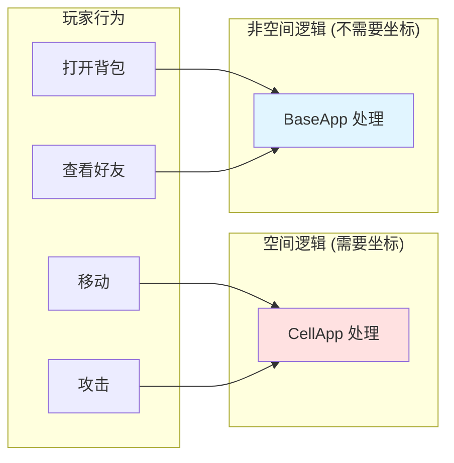
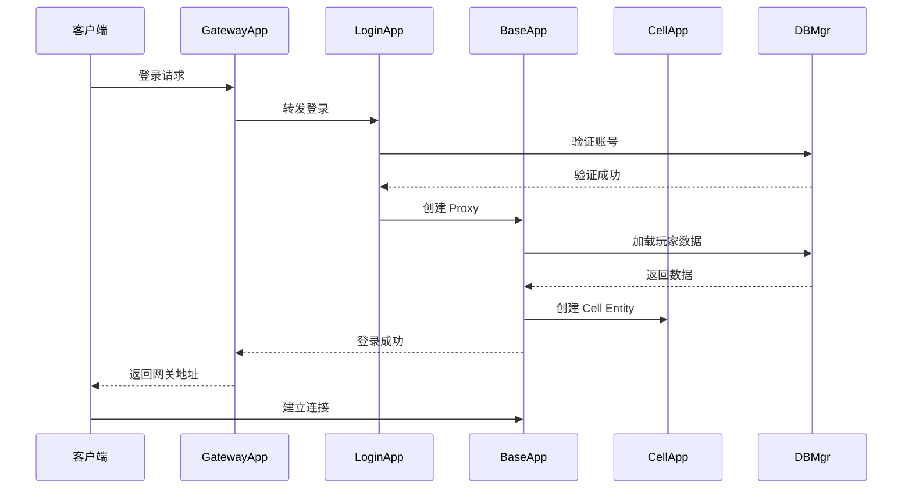
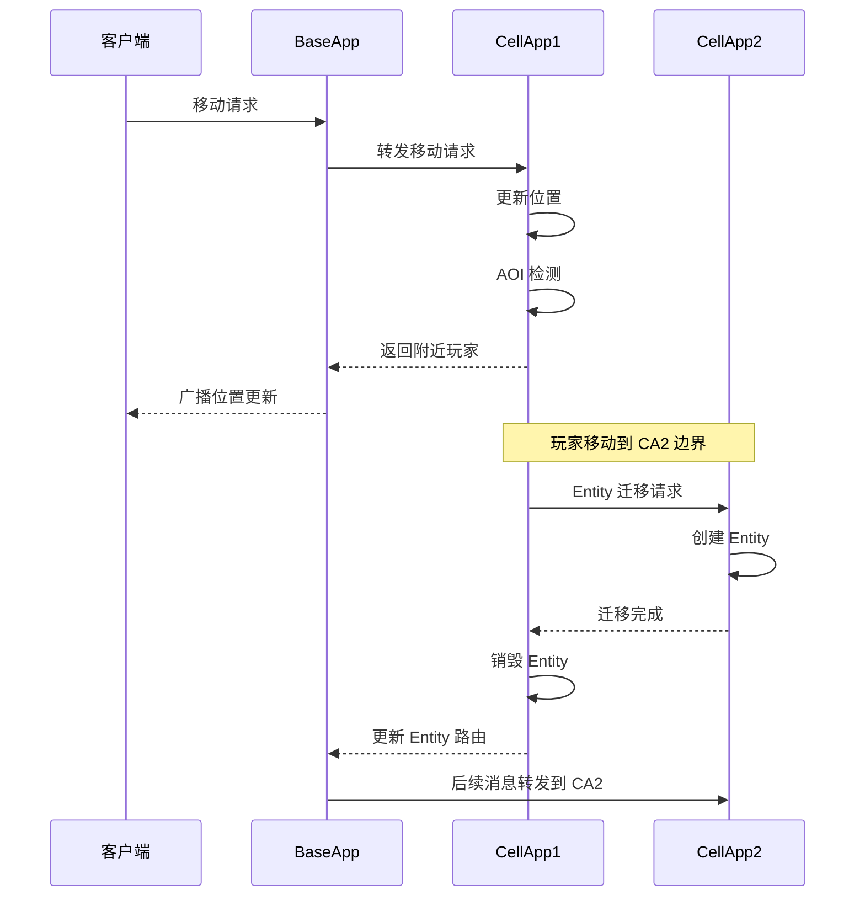
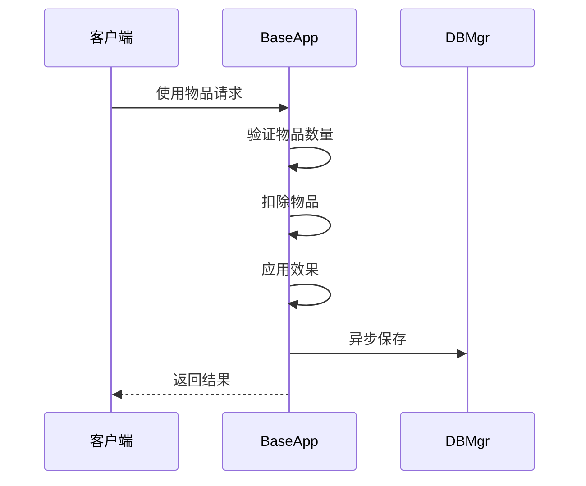

# Q2: BigWorld 架构中的 CellApp 和 BaseApp 分别负责什么？为什么这样分离？

## 问题分析

本题考察对 BigWorld/KBEngine 架构中 **空间分离设计** 的理解：
- CellApp 和 BaseApp 的职责划分
- 为什么要这样分离
- 这种设计的优势和挑战

---

## CellApp vs BaseApp 对比

### 职责对比表

| 维度 | BaseApp | CellApp |
|------|---------|---------|
| **核心职责** | 管理非空间 Entity | 管理空间 Entity |
| **是否有坐标** | ❌ 无 | ✅ 有 (x, y, z) |
| **Entity 特性** | 固定不变 | 会迁移（跨 CellApp） |
| **客户端锚点** | ✅ Proxy 作为通信锚点 | ❌ 不直接对接客户端 |
| **典型功能** | 背包、好友、任务、邮件 | 战斗、移动、AOI、AI |
| **数量** | 多个（负载均衡） | 多个（空间分区）|
| **扩展方式** | 增加实例分摊玩家 | 增加实例分摊空间 |

### 详细职责

#### BaseApp 职责

```
┌─────────────────────────────────────────────────────────────┐
│                        BaseApp                              │
├─────────────────────────────────────────────────────────────┤
│  1. 玩家 Proxy 管理                                         │
│     - 每个 Proxy 对应一个客户端                             │
│     - 作为客户端的通信锚点                                   │
│     - 负责消息重定向                                         │
├─────────────────────────────────────────────────────────────┤
│  2. 非空间逻辑                                              │
│     ├── 背包系统（物品、装备）                              │
│     ├── 好友系统（好友列表、关系）                          │
│     ├── 邮件系统（收发邮件、附件）                          │
│     ├── 任务系统（任务状态、进度）                          │
│     ├── 商城系统（购买、出售）                              │
│     ├── 排行榜系统                                          │
│     └── 公会系统（基础管理）                                │
├─────────────────────────────────────────────────────────────┤
│  3. 数据持久化协调                                          │
│     - 定期保存玩家数据到 DBMgr                              │
│     - 脏数据检测与同步                                      │
├─────────────────────────────────────────────────────────────┤
│  4. 消息路由                                                │
│     - 将客户端消息转发到正确的 CellApp                      │
│     - 接收 CellApp 的消息并转发给客户端                     │
└─────────────────────────────────────────────────────────────┘
```

#### CellApp 职责

```
┌─────────────────────────────────────────────────────────────┐
│                        CellApp                              │
├─────────────────────────────────────────────────────────────┤
│  1. 空间区域管理                                            │
│     - 管理 Cell（空间区域）                                 │
│     - 维护 Entity 位置信息                                  │
│     - 处理 Cell 边界                                        │
├─────────────────────────────────────────────────────────────┤
│  2. AOI 系统                                                │
│     - 九宫格/十字链表                                      │
│     - 视野管理                                              │
│     - 进入/离开事件                                        │
├─────────────────────────────────────────────────────────────┤
│  3. 空间逻辑                                                │
│     ├── 玩家移动                                            │
│     ├── 战斗系统（技能、伤害）                              │
│     ├── NPC AI 行为                                        │
│     ├── 寻路系统                                            │
│     ├── 场景对象管理                                        │
│     └── 状态同步（位置、动画）                              │
├─────────────────────────────────────────────────────────────┤
│  4. Entity 迁移                                             │
│     - 跨 CellApp 迁移                                      │
│     - 跨 Cell 边界处理                                      │
├─────────────────────────────────────────────────────────────┤
│  5. Ghost 同步                                              │
│     - 跨边界的 Entity 只读拷贝                              │
│     - 保证交互一致性                                        │
└─────────────────────────────────────────────────────────────┘
```

---

## 为什么这样分离？

### 原因 1：空间与非空间逻辑的本质差异



| 特性 | 空间逻辑 | 非空间逻辑 |
|------|----------|------------|
| **依赖坐标** | 是 | 否 |
| **计算密集** | 是（AOI、碰撞、寻路） | 否 |
| **Entity 迁移** | 频繁 | 几乎没有 |
| **通信模式** | 区域广播 | 点对点 |

### 原因 2：支持动态负载均衡

```
空间场景：
┌─────────────────────────────────────────────────────────────┐
│                     游戏世界地图                            │
│                                                              │
│  ┌────────────┐  ┌────────────┐  ┌────────────┐            │
│  │ CellApp 1  │  │ CellApp 2  │  │ CellApp 3  │            │
│  │  负载 30%  │  │  负载 85%  │  │  负载 20%  │            │
│  │  新手村    │  │  主城      │  │  野外      │            │
│  └────────────┘  └────────────┘  └────────────┘            │
│                                                              │
│  CellApp 2 过载 → 动态分割 → 新增 CellApp 4                 │
└─────────────────────────────────────────────────────────────┘

非空间逻辑：
┌─────────────────────────────────────────────────────────────┐
│                      BaseApp 集群                           │
│                                                              │
│  ┌──────────┐  ┌──────────┐  ┌──────────┐  ┌──────────┐   │
│  │BaseApp 1 │  │BaseApp 2 │  │BaseApp 3 │  │BaseApp 4 │   │
│  │ 1000人   │  │ 1000人   │  │ 1000人   │  │ 1000人   │   │
│  └──────────┘  └──────────┘  └──────────┘  └──────────┘   │
│                                                              │
│  玩家 A 登录 → BaseAppMgr 分配 → 负载最低的 BaseApp         │
└─────────────────────────────────────────────────────────────┘
```

### 原因 3：Entity 迁移的复杂性

**玩家 Entity 的双重性**：
```
┌─────────────────────────────────────────────────────────────┐
│                        玩家 Entity                          │
├─────────────────────────────┬───────────────────────────────┤
│      Base Entity (Proxy)    │      Cell Entity              │
│      (在 BaseApp 上)         │      (在 CellApp 上)          │
├─────────────────────────────┼───────────────────────────────┤
│ - 固定不变                   │ - 会迁移（跨 CellApp）         │
│ - 无坐标                     │ - 有坐标 (x, y, z)           │
│ - 客户端的通信锚点           │ - 空间相关逻辑                │
│ - 背包、好友、邮件等         │ - 战斗、移动、AOI 等          │
└─────────────────────────────┴───────────────────────────────┘
```

**迁移时只需迁移 Cell Entity**：
```
玩家从 CellApp1 移动到 CellApp2：

┌─────────────┐                    ┌─────────────┐
│  BaseApp    │                    │  BaseApp    │
│  (不变)     │                    │  (不变)     │
│  ┌──────┐   │                    │  ┌──────┐   │
│  │Proxy │◄──┼────────────────────┼──┤Proxy │   │
│  └──────┘   │   通信锚点始终不变  │  └──────┘   │
└─────────────┘                    └─────────────┘
       ▲                                   ▲
       │ 消息重定向                         │ 消息重定向
       │                                   │
┌───────┴────────┐              ┌─────────┴────────┐
│   CellApp 1    │              │   CellApp 2     │
│  Cell Entity   │ ───────────► │   Cell Entity   │
│  (旧位置)      │   迁移       │   (新位置)      │
└────────────────┘              └─────────────────┘
```

### 原因 4：网络通信优化

```
客户端通信模式：

┌─────────┐                              ┌─────────┐
│ 客户端   │ ──────────────────────────►│ BaseApp │
│         │   所有消息都发到这里         │  Proxy  │
└─────────┘                              └────────┘
                                              │
                    ┌─────────────────────────┼─────────────────────────┐
                    │                         │                         │
                    ▼                         ▼                         ▼
            ┌───────────┐             ┌───────────┐             ┌───────────┐
            │ CellApp 1 │             │ CellApp 2 │             │ CellApp 3 │
            │ (附近玩家) │             │  (空区域)  │             │ (附近玩家) │
            └───────────┘             └───────────┘             └───────────┘

优势：
1. 客户端只需知道一个地址（BaseApp/Proxy）
2. Proxy 负责消息路由，客户端无需关心 Entity 在哪个 CellApp
3. Entity 迁移对客户端透明
```

---

## 优势与挑战

### 优势

| 优势 | 说明 |
|------|------|
| **独立扩展** | CellApp 按空间扩展，BaseApp 按玩家数扩展 |
| **故障隔离** | 一个 CellApp 故障只影响局部区域 |
| **灵活部署** | 可根据负载情况动态调整各组件数量 |
| **透明迁移** | Entity 迁移对客户端透明 |
| **职责清晰** | 空间与非空间逻辑分离，代码组织清晰 |

### 挑战

| 挑战 | 说明 |
|------|------|
| **复杂性增加** | 需要管理两套 Entity 及其关系 |
| **跨组件通信** | BaseApp ↔ CellApp 通信开销 |
| **数据一致性** | Base/Cell 数据同步问题 |
| **调试困难** | 问题可能跨越多个组件 |
| **Ghost 机制** | 跨边界 Entity 需要额外同步 |

---

## 数据流转示例

### 玩家登录流程



### 玩家移动流程



### 使用背包流程



---

## 参考资料

- [KBEngine 技术概览 - 软件组件](https://imgamer.gitbooks.io/kbengine-overview/content/content/5_2DesignIntroduction.html)
- [BigWorld Cell 架构设计介绍](https://blog.csdn.net/monokai/article/details/151142091)
- [BigWorld服务器架构：框架与实现](https://developer.baidu.com/article/details/3089473)
