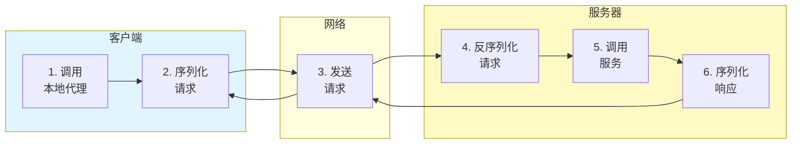

# Q23: 如何实现 RPC 调用？

## 问题分析

本题考察对 RPC（Remote Procedure Call）的理解：
- RPC 的核心概念和原理
- 同步 RPC vs 异步 RPC
- KBEngine 的 EntityCall 机制
- 常见 RPC 框架对比

---

## 一、RPC 基础概念

### 1.1 什么是 RPC

```
┌─────────────────────────────────────────────────────────────┐
│                      RPC 概念                               │
├─────────────────────────────────────────────────────────────┤
│                                                             │
│  RPC (Remote Procedure Call) - 远程过程调用                 │
│                                                             │
│  目标：让远程调用像本地调用一样简单                          │
│                                                             │
│  本地调用：                                                 │
│  ┌─────────────────────────────────────────────────┐       │
│  │  result = player.getName();                    │       │
│  │           ↓                                     │       │
│  │      直接调用函数                                │       │
│  └─────────────────────────────────────────────────┘       │
│                                                             │
│  远程调用 (RPC)：                                           │
│  ┌─────────────────────────────────────────────────┐       │
│  │  result = player.getName();                    │       │
│  │           ↓                                     │       │
│  │   ┌─────────────────────────────────────┐      │       │
│  │   │  1. 序列化请求                       │      │       │
│  │   │  2. 发送到远程服务器                  │      │       │
│  │   │  3. 服务器执行函数                   │      │       │
│  │   │  4. 序列化响应                       │      │       │
│  │   │  5. 返回结果                         │      │       │
│  │   └─────────────────────────────────────┘      │       │
│  └─────────────────────────────────────────────────┘       │
│                                                             │
└─────────────────────────────────────────────────────────────┘
```

### 1.2 RPC 核心组件



---

## 二、KBEngine 的 EntityCall

### 2.1 EntityCall 架构

根据 [KBEngine Lab - EntityCall](https://www.kbelab.com/manual/entitycall.html)：

```
┌─────────────────────────────────────────────────────────────┐
│                  KBEngine EntityCall                        │
├─────────────────────────────────────────────────────────────┤
│                                                             │
│  EntityCall 是 KBEngine 中实现 RPC 的核心机制：              │
│                                                             │
│  ┌─────────────────────────────────────────────────┐       │
│  │  Client                                         │       │
│  │    │                                            │       │
│  │    │ player.moveTo(x, y, z)                    │       │
│  │    │ ↓ (看起来像本地调用)                       │       │
│  │  Proxy (BaseApp)                                │       │
│  │    │                                            │       │
│  │    │ → EntityCall 远程调用                     │       │
│  │    │                                            │       │
│  │  Entity (CellApp)                               │       │
│  │    │                                            │       │
│  │    │ → 真实执行 moveTo 函数                     │       │
│  └─────────────────────────────────────────────────┘       │
│                                                             │
└─────────────────────────────────────────────────────────────┘
```

### 2.2 EntityCall 源码实现

```cpp
// KBEngine EntityCall 实现
// src/server/entitydef/entity_call.h

class EntityCall {
public:
    // 目标实体 ID
    EntityID id_;

    // 目标组件类型
    Components::COMPONENT_TYPE type_;

    // 调用方式
    enum CallType {
        CALL_TYPE_CLIENT = 0,      // 调用客户端
        CALL_TYPE_CELL = 1,       // 调用 CellApp
        CALL_TYPE_BASE = 2,       // 调用 BaseApp
    };

    // 生成 RPC 调用
    template<typename... Args>
    void call(const char* methodName, Args... args) {
        // 1. 创建消息
        Message* msg = createMessage(methodName);

        // 2. 打包参数
        packArgs(msg, args...);

        // 3. 发送到目标
        sendToEntity(msg);
    }

private:
    void packArgs(Message* msg) {
        // 递归终止
    }

    template<typename T, typename... Args>
    void packArgs(Message* msg, T first, Args... rest) {
        // 打包第一个参数
        msg->write<T>(first);

        // 递归打包剩余参数
        packArgs(msg, rest...);
    }
};

// 使用示例
class Account : public Entity {
public:
    // 远程调用客户端
    void onLoginSuccessfully() {
        // 调用客户端方法
        EntityCall* clientCall = this->clientEntity();
        if (clientCall) {
            clientCall->call("onLoginSuccessfully",
                           this->id(),
                           this->name());
        }
    }

    // 远程调用 CellApp
    void enterSpace(SpaceID spaceID) {
        EntityCall* cellCall = this->cellEntity();
        if (cellCall) {
            cellCall->call("enterSpace", spaceID);
        }
    }
};
```

### 2.3 EntityCall 消息格式

```
┌─────────────────────────────────────────────────────────────┐
│              EntityCall 消息格式                            │
├─────────────────────────────────────────────────────────────┤
│                                                             │
│  ┌─────────────────────────────────────────────────┐       │
│  │  消息头 (Message Header)                         │       │
│  │  ┌──────────┬──────────┬──────────┐              │       │
│  │  │ MsgType  │ MethodID │ EntityID │              │       │
│  │  └──────────┴──────────┴──────────┘              │       │
│  ├─────────────────────────────────────────────────┤       │
│  │  参数列表 (Arguments)                            │       │
│  │  ┌──────────┬──────────┬──────────┐              │       │
│  │  │ Arg1     │ Arg2     │ ...      │              │       │
│  │  │(变长)    │(变长)    │          │              │       │
│  │  └──────────┴──────────┴──────────┘              │       │
│  └─────────────────────────────────────────────────┘       │
│                                                             │
└─────────────────────────────────────────────────────────────┘
```

---

## 三、RPC 实现方式

### 3.1 同步 RPC

```cpp
// 同步 RPC 实现

class SynchronousRPC {
public:
    // 同步调用
    template<typename T>
    T call(const std::string& method, const Args& args) {
        // 1. 生成请求 ID
        uint32_t requestId = generateRequestId();

        // 2. 序列化请求
        std::string request = serializeRequest(method, args);

        // 3. 发送请求
        channel_->send(requestId, request);

        // 4. 等待响应（阻塞）
        ResponseFuture future = pendingRequests_[requestId];
        future.wait();

        // 5. 获取结果
        std::string response = future.get();

        // 6. 反序列化结果
        return deserializeResult<T>(response);
    }

private:
    std::unordered_map<uint32_t, ResponseFuture> pendingRequests_;
};
```

### 3.2 异步 RPC

```cpp
// 异步 RPC 实现

class AsynchronousRPC {
public:
    // 异步调用
    template<typename T>
    std::future<T> callAsync(const std::string& method,
                             const Args& args) {
        // 1. 生成请求 ID
        uint32_t requestId = generateRequestId();

        // 2. 创建 Promise
        auto promise = std::make_shared<std::promise<T>>();
        std::future<T> future = promise->get_future();

        // 3. 注册回调
        pendingRequests_[requestId] = [promise](const std::string& response) {
            try {
                T result = deserializeResult<T>(response);
                promise->set_value(result);
            } catch (...) {
                promise->set_exception(std::current_exception());
            }
        };

        // 4. 发送请求
        std::string request = serializeRequest(method, args);
        channel_->send(requestId, request);

        return future;
    }

    // 处理响应
    void onResponse(uint32_t requestId, const std::string& response) {
        auto it = pendingRequests_.find(requestId);
        if (it != pendingRequests_.end()) {
            it->second(response);
            pendingRequests_.erase(it);
        }
    }

private:
    std::unordered_map<uint32_t, std::function<void(const std::string&)>> pendingRequests_;
};
```

### 3.3 使用示例

```cpp
// 异步 RPC 使用示例

class GameClient {
public:
    // 异步登录
    std::future<PlayerInfo> loginAsync(const std::string& username,
                                       const std::string& password) {
        return rpc_->callAsync<PlayerInfo>("login", username, password);
    }

    // 异步移动
    std::future<bool> moveAsync(float x, float y, float z) {
        return rpc_->callAsync<bool>("move", x, y, z);
    }
};

// 使用
auto future = client->loginAsync("player1", "password");

// 做其他事情...
doSomethingElse();

// 获取结果
try {
    PlayerInfo info = future.get();
    onLoginSuccess(info);
} catch (const std::exception& e) {
    onLoginFailed(e.what());
}
```

---

## 四、常见 RPC 框架

### 4.1 框架对比

| 框架 | 语言 | 协议 | 特点 |
|------|------|------|------|
| **gRPC** | 多语言 | HTTP/2 + Protobuf | Google 出品，高性能 |
| **Thrift** | 多语言 | 二进制/TCP | Facebook 出品，成熟 |
| **dubbo** | Java | Hessian + TCP | 阿里出品，Java 生态 |
| **brpc** | C++/Java | HTTP/2 | 百度出品，高性能 |
| **envoy** | C++ | HTTP/2/gRPC | 服务网格 |

### 4.2 gRPC 示例

```protobuf
// service.proto

syntax = "proto3";

package game;

service GameService {
    // 登录
    rpc Login(LoginRequest) returns (LoginResponse);

    // 移动
    rpc Move(MoveRequest) returns (MoveResponse);

    // 服务器推送
    rpc StreamEvents(StreamRequest) returns (stream Event);
}

message LoginRequest {
    string username = 1;
    string password = 2;
}

message LoginResponse {
    int32 code = 1;
    string message = 2;
    PlayerInfo player_info = 3;
}
```

```cpp
// gRPC 服务端实现

class GameServiceImpl : public GameService::Service {
public:
    Status Login(ServerContext* context,
                const LoginRequest* request,
                LoginResponse* response) override {
        // 处理登录
        std::string username = request->username();
        std::string password = request->password();

        // 验证
        if (authenticate(username, password)) {
            PlayerInfo* info = response->mutable_player_info();
            fillPlayerInfo(username, info);
            response->set_code(0);
            response->set_message("Login success");
        } else {
            response->set_code(1);
            response->set_message("Login failed");
        }

        return Status::OK;
    }
};
```

---

## 五、最佳实践

### 5.1 超时处理

```cpp
// RPC 超时处理

class TimeoutRPC {
public:
    template<typename T>
    std::future<T> callWithTimeout(const std::string& method,
                                   const Args& args,
                                   uint32_t timeoutMs) {
        auto promise = std::make_shared<std::promise<T>>();
        std::future<T> future = promise->get_future();

        uint32_t requestId = generateRequestId();

        // 注册超时定时器
        timer_->schedule(timeoutMs, [this, requestId, promise]() {
            auto it = pendingRequests_.find(requestId);
            if (it != pendingRequests_.end()) {
                it->second();  // 触发超时
                pendingRequests_.erase(it);
                promise->set_exception(
                    std::make_exception_ptr(RpcTimeoutException())
                );
            }
        });

        // 发送请求
        pendingRequests_[requestId] = [promise](const std::string& response) {
            // 取消超时
            timer_->cancel(requestId);

            // 设置结果
            T result = deserializeResult<T>(response);
            promise->set_value(result);
        };

        return future;
    }
};
```

### 5.2 重试机制

```cpp
// RPC 重试机制

class RetryRPC {
public:
    template<typename T>
    T callWithRetry(const std::string& method,
                    const Args& args,
                    int maxRetries = 3) {
        int attempt = 0;
        RpcException lastException;

        while (attempt < maxRetries) {
            try {
                return rpc_->call<T>(method, args);
            } catch (const RpcException& e) {
                lastException = e;
                attempt++;

                if (attempt < maxRetries) {
                    // 指数退避
                    int delayMs = 100 * (1 << (attempt - 1));
                    std::this_thread::sleep_for(
                        std::chrono::milliseconds(delayMs)
                    );
                }
            }
        }

        throw lastException;
    }
};
```

---

## 六、总结

### RPC 实现选择

| 场景 | 推荐方案 | 原因 |
|------|----------|------|
| **游戏服务器内部** | KBEngine EntityCall | 深度集成 |
| **跨服务通信** | gRPC | 高性能、跨语言 |
| **Web 服务** | REST/JSON | 简单、通用 |
| **微服务** | gRPC/Thrift | 高性能 |

### 最佳实践

```
1. 优先使用异步 RPC
   - 避免阻塞线程
   - 提高并发能力

2. 设置合理超时
   - 避免无限等待
   - 及时释放资源

3. 实现重试机制
   - 处理暂时性故障
   - 指数退避

4. 记录调用日志
   - 方便调试
   - 性能分析
```

---

## 参考资料

- [KBEngine Lab - EntityCall](https://www.kbelab.com/manual/entitycall.html)
- [gRPC 官方文档](https://grpc.io/docs/)
- [Thrift 官方文档](https://thrift.apache.org/)
