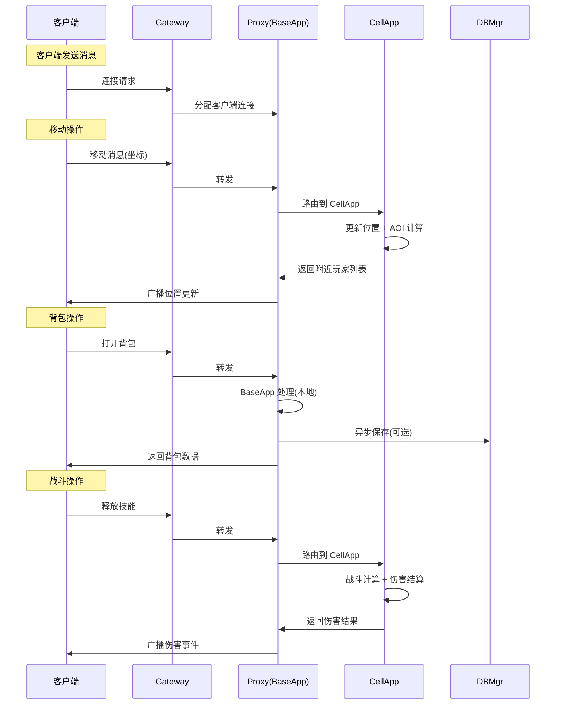
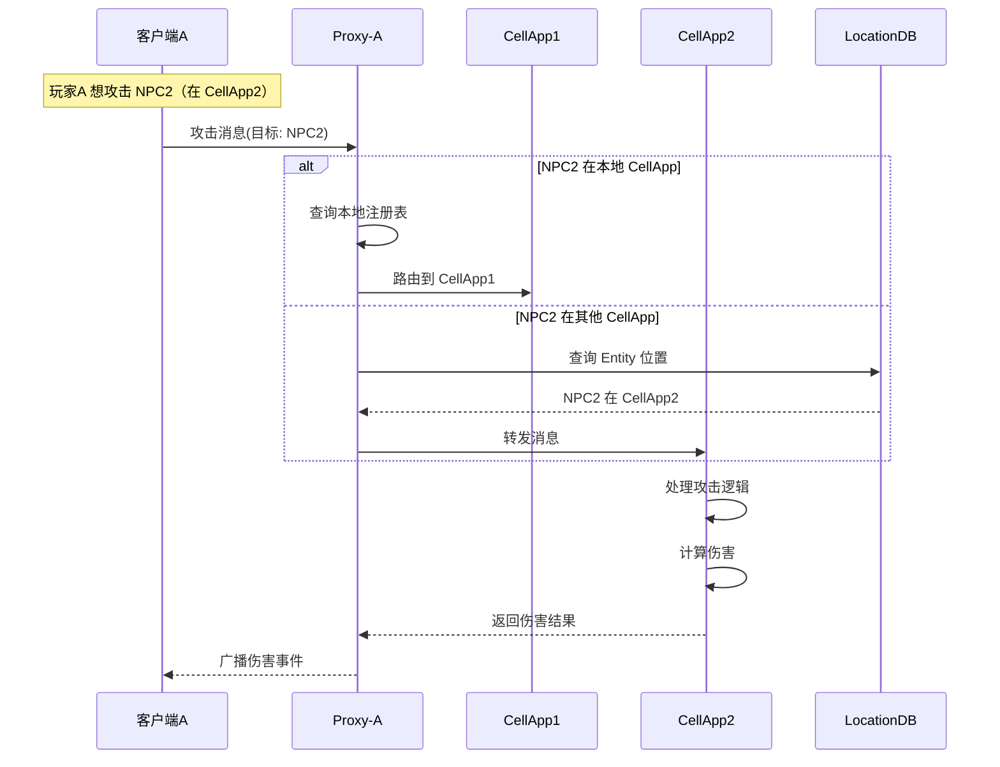

# Q26: KBEngine 消息路由机制：Gateway、Proxy、CellApp 之间如何高效转发？

## 问题分析

本题考察对 KBEngine 消息路由机制的理解：
- Gateway、Proxy、CellApp 的通信架构
- 是否统一网关转发
- Proxy 在消息路由中的核心作用
- 如何实现高效的消息路由

---

## 整体架构

```
┌─────────────────────────────────────────────────────────────┐
│                        客户端层                              │
│  ┌─────────┐  ┌─────────┐  ┌─────────┐  ┌─────────┐   │
│  │ Player A │  │ Player B │  │ Player C │  │ Player D │   │
│  └────┬────┘  └────┬────┘  └────┬────┘  └────┬────┘   │
└───────┼────────────┼────────────┼────────────┼────────────┘
        │            │            │            │
        └────────────┴────────────┴────────────┘
                             │
                    ┌────────▼────────┐
                    │   GatewayApp    │
                    │  (负载均衡器)     │
                    │   不理解消息     │
                    └────────┬────────┘
                             │
        ┌────────────────────┼────────────────────┐
        │                    │                    │
┌───────▼────────┐  ┌────────▼────────┐  ┌────────▼────────┐
│  BaseApp1      │  │  BaseApp2        │  │  BaseApp3        │
│  (Proxy 管理器) │  │  (Proxy 管理器)   │  │  (Proxy 管理器)   │
└───────┬────────┘  └────────┬────────┘  └────────┬────────┘
        │                    │                    │
        └────────────────────┼────────────────────┘
                             │
        ┌────────────────────┼────────────────────┐
        │                    │                    │
┌───────▼────────┐  ┌────────▼────────┐  ┌────────▼────────┐
│  CellApp1      │  │  CellApp2        │  │  CellApp3        │
│  (空间逻辑)     │  │  (空间逻辑)       │  │  (空间逻辑)       │
└────────────────┘  └──────────────────┘  └──────────────────┘
```

---

## Gateway vs Proxy 的区别

| 组件 | 职责 | 理解消息 | 连接对象 |
|------|------|----------|----------|
| **GatewayApp** | 负载均衡、连接管理 | ❌ 不理解 | 客户端 |
| **BaseApp (Proxy)** | 消息路由、业务逻辑 | ✅ 理解 | Gateway |

**GatewayApp 的特点**：
- 只做 TCP 连接管理和负载均衡
- 不解析消息内容
- 将客户端连接分配给合适的 BaseApp
- 类似 LVS/Nginx 的作用

**Proxy 的特点**：
- 每个 Proxy 对应一个客户端
- 理解消息协议和业务逻辑
- 决定消息的路由目标
- 是客户端唯一的通信锚点

---

## 消息路由流程

### 全局流程图



---

## Proxy 路由机制详解

### 消息路由规则

```cpp
class Proxy {
public:
    // 消息路由类型
    enum class RouteType {
        SELF,           // Proxy 自己处理（非空间逻辑）
        CELL,           // 转发到 CellApp（空间逻辑）
        FORWARD_BASE,   // 转发到其他 BaseApp
        BROADCAST       // 广播
    };

    // 消息类型 → 路由规则映射
    RouteType getRouteType(Message* msg) {
        switch (msg->type) {
            // 空间相关消息 → 转发到 CellApp
            case MsgType::MOVE:
            case MsgType::ROTATE:
            case MsgType::ATTACK:
            case MsgType::CAST_SKILL:
            case MsgType::PICK_ITEM:
            case MsgType::JUMP:
                return RouteType::CELL;

            // 非空间消息 → Proxy 自己处理
            case MsgType::OPEN_BAG:
            case MsgType::CLOSE_BAG:
            case MsgType::USE_ITEM:
            case MsgType::DROP_ITEM:
            case MsgType::MOVE_ITEM:
            case MsgType::GET_FRIEND_LIST:
            case MsgType::ADD_FRIEND:
            case MsgType::REMOVE_FRIEND:
            case MsgType::GET_MAIL_LIST:
            case MsgType::SEND_MAIL:
                return RouteType::SELF;

            // 广播消息
            case MsgType::CHAT:
            case MsgType::WORLD_CHAT:
            case MsgType::GUILD_CHAT:
                return RouteType::BROADCAST;

            default:
                return RouteType::SELF;
        }
    }

    // 处理客户端消息
    void handleClientMessage(Message* msg) {
        auto routeType = getRouteType(msg);

        switch (routeType) {
            case RouteType::SELF:
                handleSelf(msg);
                break;

            case RouteType::CELL: {
                EntityID targetId = msg->receiverId;
                CellApp* targetCell = findCellAppByEntity(targetId);
                if (targetCell) {
                    forwardToCellApp(msg, targetCell);
                }
                break;
            }

            case RouteType::FORWARD_BASE: {
                EntityID targetId = msg->receiverId;
                BaseApp* targetBase = findBaseAppByEntity(targetId);
                if (targetBase && targetBase != this) {
                    forwardToBaseApp(msg, targetBase);
                }
                break;
            }

            case RouteType::BROADCAST:
                broadcastToAOI(msg);
                break;
        }
    }
};
```

### Entity 位置映射表

```cpp
class Proxy {
private:
    // Entity ID → 所属 CellApp 映射
    std::unordered_map<EntityID, CellApp*> entityCellAppMap;

    // Entity ID → 所属 BaseApp 映射（跨 BaseApp 查询）
    std::unordered_map<EntityID, BaseApp*> entityBaseAppMap;

    // 定期同步 Entity 位置信息
    void syncEntityLocations() {
        for (auto& [id, cell] : entityCellAppMap) {
            // 更新映射表
        }
    }

    CellApp* findCellAppByEntity(EntityID id) {
        auto it = entityCellAppMap.find(id);
        return it != entityCellAppMap.end() ? it->second : nullptr;
    }

    BaseApp* findBaseAppByEntity(EntityID id) {
        auto it = entityBaseAppMap.find(id);
        return it != entityBaseAppMap.end() ? it->second : nullptr;
    }
};
```

---

## 为什么必须通过 Proxy 转发？

### 原因分析

#### 1. Entity 迁移透明性

```
场景：玩家从 CellApp1 移动到 CellApp2

┌─────────────────┐                    ┌─────────────────┐
│   BaseApp       │                    │   BaseApp       │
│  ┌───────────┐   │                    │  ┌───────────┐   │
│  │   Proxy   │◄──┼────────────────────┼──┤   Proxy   │   │
│  │ (固定不变) │   │ 客户端连接始终在这里 │  │ (固定不变) │   │
│  └───────────┘   │                    │  └───────────┘   │
└─────────────────┘                    └─────────────────┘
        ▼                                        △
┌───────────────┐                          ┌───────────────┐
│  CellApp1     │   迁移   ─────────────►   │  CellApp2     │
│  Cell Entity   │                          │  Cell Entity   │
└───────────────┘                          └───────────────┘

客户端 → 始终向 Proxy 发送消息
         ↓
    Proxy 查询路由表 → 找到 CellApp2
         ↓
    转发到 CellApp2
```

**优势**：客户端完全不知道 Entity 迁移，连接始终指向 Proxy。

#### 2. 统一消息入口

```
┌─────────────────────────────────────────────────────────────┐
│                      客户端                                  │
│                         │                                  │
│                    ┌──────▼──────┐                           │
│                    │ 只知道 Proxy │                           │
│                    │   的地址     │                           │
│                    └──────┬──────┘                           │
└─────────────────────────┼─────────────────────────────────────┘
                          │
                          ▼
┌─────────────────────────────────────────────────────────────┐
│                    Proxy (BaseApp)                         │
│  ┌───────────────────────────────────────────────────────┐ │
│  │  所有消息入口：                                        │ │
│  │  - 权限验证                                              │ │
│  │  - 消息过滤                                              │ │
│  │  - 速率限制                                              │ │
│  │  - 路由决策                                              │ │
│  └───────────────────────────────────────────────────────┘ │
└─────────────────────────────────────────────────────────────┘
```

#### 3. 安全性

| 安全措施 | 说明 |
|----------|------|
| **权限验证** | Proxy 验证客户端是否有权限执行操作 |
| **消息过滤** | 过滤非法或作弊消息 |
| **速率限制** | 防止客户端刷消息 |
| **作弊检测** | 检测异常行为（如瞬移、超速攻击） |

---

## 消息"信封"格式详解

### KBEngine 网络协议帧结构

```
┌─────────────────────────────────────────────────────────────────────────────────────────┐
│                              KBEngine 数据包格式                                      │
├──────────┬──────────┬──────────┬──────────┬──────────┬────────────────────────────────┤
│  Length  │ MsgType  │  EntityID│   MsgID  │   Data   │             Checksum         │
│ (2 bytes) │ (2 bytes) │ (4 bytes) │ (2 bytes) │(Variable)│           (2 bytes)          │
├──────────┴──────────┴──────────┴──────────┴──────────┴────────────────────────────────┤
│            │            │            │            │                                │
│   包总长度   │  消息类型   │  实体ID    │  消息ID    │     实际消息数据              │
│             │            │            │            │                                │
│  负载均衡器    │   业务类型   │   接收者   │   操作     │    Protobuf 序列化数据         │
│  不需要此字段  │            │   默认0   │            │                                │
└─────────────────────────────────────────────────────────────────────────────────────────┘
```

### 字段详细说明

| 字段 | 大小 | 说明 |
|------|------|------|
| **Length** | 2 bytes | 整个数据包的长度（不含 Length 字段本身） |
| **MsgType** | 2 bytes | 消息类型，标识业务类别（登录、移动、战斗等）|
| **EntityID** | 4 bytes | 目标实体 ID，0 表示服务器 |
| **MsgID** | 2 bytes | 具体消息 ID（在某 MsgType 下的操作）|
| **Data** | 变长 | Protobuf 序列化的实际数据 |
| **Checksum** | 2 bytes | CRC16 校验和，防止数据损坏 |

### 消息类型（MsgType）枚举

```cpp
enum class MsgType : uint16_t {
    // 客户端 → 服务器
    CLIENT_CONNECT            = 1,   // 连接请求
    CLIENT_DISCONNECT         = 2,   // 断开连接
    CLIENT_LOGIN              = 3,   // 登录
    CLIENT_LOGOUT             = 4,   // 登出

    // 位置相关
    CLIENT_MOVE               = 10,  // 移动
    CLIENT_ROTATE             = 11,  // 旋转
    CLIENT_JUMP               = 12,  // 跳跃
    CLIENT_SET_DIRECTION      = 13,  // 设置朝向

    // 战斗相关
    CLIENT_ATTACK             = 20,  // 攻击
    CLIENT_CAST_SKILL         = 21,  // 释放技能
    CLIENT_USE_ITEM           = 22,  // 使用物品

    // 背包相关
    CLIENT_OPEN_BAG           = 30,  // 打开背包
    CLIENT_CLOSE_BAG          = 31,  // 关闭背包
    CLIENT_MOVE_ITEM          = 32,  // 移动物品
    CLIENT_USE_ITEM           = 33,  // 使用物品

    // 社交相关
    CLIENT_CHAT                = 40,  // 聊天
    CLIENT_ADD_FRIEND         = 41,  // 添加好友
    CLIENT_REMOVE_FRIEND      = 42,  // 删除好友

    // 服务器 → 客户端
    SERVER_MESSAGE            = 100, // 通用消息
    SERVER_ENTITY_VISIBLE     = 101, // 实体可见列表
    SERVER_ENTITY_DESTROY     = 102, // 实体销毁
    SERVER_PROPERTY_UPDATE    = 103, // 属性更新
    SERVER_DAMAGE             = 104, // 伤害通知
};
```

---

## 多 CellApp 场景下的路由处理

### 问题：玩家在多个 CellApp 的 AOI 范围内

```
场景：玩家 A 在 CellApp1 和 CellApp2 的交界处

┌─────────────────────────────────────────────────────────────┐
│                        游戏世界                               │
│                                                              │
│    ┌────────────────────┬────────────────────┐              │
│    │    CellApp1        │    CellApp2        │              │
│    ├────────────────────┼────────────────────┤              │
│    │                    │                    │              │
│    │   👁️ 玩家 A          │  👁️ 玩家 B          │              │
│    │   (Proxy-A)         │   (Proxy-B)         │              │
│    │                    │                    │              │
│    │   ⚔️️ NPC 1           │   ⚔️️ NPC 2           │              │
│    │                    │                    │              │
│    └────────────────────┴────────────────────┘              │
│                          ▲                             │
│                          │ AOI 重叠区               │
│                    ┌─────┴───────┐                      │
│                    │   Ghost     │                      │
│                    │   同步      │                      │
│                    └─────────────┘                      │
└─────────────────────────────────────────────────────────────┘

问题：
1. 玩家 A 攻击 NPC 2（跨 CellApp）
2. 玩家 A 如何找到 NPC 2 在 CellApp2？
3. 如何确保消息正确路由到目标？
```

### 解决方案：Entity 位置注册表

```cpp
class Proxy {
private:
    // Entity 位置注册表
    struct EntityLocation {
        EntityID id;
        CellApp* cellApp;      // 所属 CellApp
        BaseApp* baseApp;      // 所属 BaseApp
        Vector3 position;      // 当前位置
        uint32_t lastUpdate;   // 更新时间
    };

    std::unordered_map<EntityID, EntityLocation> entityRegistry;

    // 当 Entity 移动时更新位置
    void onEntityMoved(EntityID id, Vector3 newPos, CellApp* newCell) {
        auto& loc = entityRegistry[id];
        loc.position = newPos;
        loc.lastUpdate = now();

        // 如果跨 CellApp，更新映射
        if (loc.cellApp != newCell) {
            loc.cellApp = newCell;
            // 通知所有相关 Proxy 更新路由表
            broadcastLocationUpdate(id, newCell);
        }
    }

    // 查找 Entity 所属 CellApp
    CellApp* findCellApp(EntityID targetId) {
        auto it = entityRegistry.find(targetId);
        if (it != entityRegistry.end()) {
            return it->second.cellApp;
        }
        return nullptr;
    }
};
```

### 跨 CellApp 消息处理流程



### 分布式位置服务

```cpp
// 分布式 Entity 位置服务（类似 Redis Pub/Sub）
class LocationService {
    // 每个实体发布位置信息
    void publishLocation(EntityID id, CellApp* cell, Vector3 pos) {
        LocationInfo info;
        info.id = id;
        info.cellApp = cell->getId();
        info.position = pos;
        info.timestamp = now();

        // 发布到 Redis/ETCD
        redis->publish("entity:location:" + std::to_string(id), info);
    }

    // 订阅实体位置变化
    void subscribeLocation(EntityID id, std::function<void(LocationInfo)> callback) {
        redis->subscribe("entity:location:" + std::to_string(id), callback);
    }

    // 快速查询（带缓存）
    CellApp* findCellApp(EntityID id) {
        // 先查本地缓存
        auto it = locationCache.find(id);
        if (it != locationCache.end() && now() - it->second.timestamp < 1s) {
            return it->second.cellApp;
        }

        // 缓存未命中，查询全局服务
        LocationInfo info = redis->get("entity:" + std::to_string(id));
        locationCache[id] = info;
        return getCellAppById(info.cellAppId);
    }
};
```

---

## 完整的消息路由示例

### 玩家攻击跨 CellApp 的 NPC

```cpp
// 1. 客户端发送攻击消息
// MsgType = CLIENT_ATTACK
// EntityID = NPC2_ID

class Proxy {
    void handleAttack(Message* msg) {
        EntityID targetId = msg->receiverId;

        // 2. 查找目标所属 CellApp
        CellApp* targetCell = findCellApp(targetId);

        if (targetCell == nullptr) {
            // 目标不存在
            sendErrorResponse(msg->clientId, "目标不存在");
            return;
        }

        // 3. 检查距离（可选）
        if (!isInRange(msg->clientId, targetId)) {
            sendErrorResponse(msg->clientId, "目标超出范围");
            return;
        }

        // 4. 转发到目标 CellApp
        forwardToCellApp(msg, targetCell);

        // 5. 等待结果并通知客户端
        pendingAttacks[msg->sequenceId] = msg->clientId;
    }

    // 收到攻击结果
    void onAttackResult(AttackResult* result) {
        auto it = pendingAttacks.find(result->sequenceId);
        if (it != pendingAttacks.end()) {
            EntityID clientId = it->second;
            sendToClient(clientId, result);
            pendingAttacks.erase(it);
        }
    }
};
```

---

## 优化：热点 Entity 的路由

### 问题：热门 NPC 被大量玩家同时访问

```
场景：主城 NPC 商人，1000 个玩家同时交易

┌─────────────────────────────────────────────────────────────┐
│                        CellApp1                            │
│  ┌──────────────────────────────────────────────────────┐   │
│  │  👁️ NPC 商人                                         │   │
│  │     │                                               │   │
│  │  ⬆️⬆️⬆️⬆️⬆️⬆️⬆️⬆️                                    │   │
│  │  1000 个玩家攻击请求                                 │   │
│  └──────────────────────────────────────────────────────┘   │
│                          │                              │
│                     CellApp 过载！                          │
└─────────────────────────────────────────────────────────────┘
```

### 解决方案：请求合并与排队

```cpp
class HotspotManager {
    struct PendingRequest {
        Message* msg;
        EntityID clientId;
        uint32_t timestamp;
    };

    std::unordered_map<EntityID, std::queue<PendingRequest>> pendingRequests;

    // 合并同一目标的请求
    void processHotspot(EntityID targetId) {
        auto& queue = pendingRequests[targetId];

        // 批量处理，最多一次处理 100 个
        int batchSize = 100;
        std::vector<Message*> batch;

        while (!queue.empty() && batchSize-- > 0) {
            batch.push_back(queue.front().msg);
            queue.pop();
        }

        if (!batch.empty()) {
            // 批量发送到 CellApp
            sendBatch(batch);
        }
    }

    // 定时处理热点
    void tick() {
        for (auto& [targetId, queue] : pendingRequests) {
            if (!queue.empty()) {
                processHotspot(targetId);
            }
        }
    }
};
```

---

## 总结：协议帧与多 CellApp 路由

### 协议帧格式速查表

| 字段 | 大小 | 取值范围 | 说明 |
|------|------|----------|------|
| **Length** | 2 bytes | 0-65535 | 数据包总长度 |
| **MsgType** | 2 bytes | 0-65535 | 消息类型 |
| **EntityID** | 4 bytes | 0-2^32-1 | 目标实体 ID |
| **MsgID** | 2 bytes | 0-65535 | 具体消息 ID |
| **Data** | 变长 | - | Protobuf 数据 |
| **Checksum** | 2 bytes | CRC16 | 校验和 |

### 多 CellApp 路由流程

```
1. Proxy 收到客户端消息
       ↓
2. 解析协议帧（MsgType + EntityID + MsgID）
       ↓
3. 查询 Entity 位置注册表
       ├─ 本地 BaseApp → 自己处理
       ├─ 本地 CellApp → 转发
       └─ 其他 CellApp → 跨进程转发
       ↓
4. 添加路由头（SenderID + Timestamp + Sequence）
       ↓
5. 发送到目标 CellApp
       ↓
6. 等待响应并通知客户端
```

---

## 参考资料

- [KBEngine Lab - 引擎概览](https://www.kbelab.com/manual/engine-overview.html)
- [KBEngine 源码 - GitHub](https://github.com/kbengine/kbengine)
- [KBEngine 网络协议分析](https://blog.csdn.net/boiled_water123/article/details/104803928)

```cpp
struct MessageEnvelope {
    // 基础信息
    uint16_t length;       // 消息总长度
    uint16_t msgType;      // 消息类型

    // 路由信息（内部使用）
    EntityID senderId;     // 发送者 Entity ID
    EntityID receiverId;    // 接收者 Entity ID（-1 表示广播）

    // 转发信息（服务间通信）
    uint8_t  hops;         // 已转发跳数
    uint8_t  maxHops;      // 最大跳数（防止环路）

    // 时间戳（用于去重和超时）
    uint32_t timestamp;
    uint32_t sequence;    // 序列号
};
```

---

## 高效路由优化

### 1. Entity ID 编码

将 CellApp ID 编入 Entity ID，快速定位所属 CellApp：

```cpp
// Entity ID = (CellAppID << 32) | LocalEntityID
EntityID makeEntityID(uint16_t cellAppId, uint32_t localId) {
    return ((uint64_t)cellAppId << 32) | localId;
}

uint16_t getCellAppId(EntityID id) {
    return (uint16_t)(id >> 32);
}

uint32_t getLocalEntityId(EntityID id) {
    return (uint32_t)(id & 0xFFFFFFFF);
}

// 快速定位
CellApp* findCellApp(EntityID id) {
    uint16_t cellId = getCellAppId(id);
    return cellAppMap[cellId];
}
```

### 2. 长连接复用

```
┌─────────────────────────────────────────────────────────────┐
│                    BaseApp ↔ CellApp                        │
│                                                             │
│  ┌─────────────────────────────────────────────────────┐   │
│  │           TCP 长连接 (持久化)                       │   │
│  │  ┌─────────┬─────────┬─────────┬─────────┐         │   │
│  │  │ 消息队列 │ 消息队列 │ 消息队列 │ 消息队列 │         │   │
│  │  └────┬────┴────┬────┴────┬────┴────┬────┘         │   │
│  │       │         │         │         │               │   │
│  │  每个连接有独立的发送队列，减少锁竞争            │   │
│  └─────────────────────────────────────────────────────┘   │
└─────────────────────────────────────────────────────────────┘
```

### 3. 消息批处理

```cpp
class MessageBatcher {
    std::vector<Message*> pendingMessages;
    size_t batchSize = 100;
    uint32_t lastFlushTime = 0;
    uint32_t flushInterval = 10; // 10ms

    void addMessage(Message* msg) {
        pendingMessages.push_back(msg);

        // 达到批量大小的触发发送
        if (pendingMessages.size() >= batchSize) {
            flush();
        }
    }

    void flush() {
        if (pendingMessages.empty()) return;

        // 批量发送
        sendMessageBatch(pendingMessages);
        pendingMessages.clear();
        lastFlushTime = now();
    }
};
```

### 4. 零拷贝转发

```cpp
// 使用共享内存或引用计数，避免数据复制
class SharedMessageBuffer {
    std::shared_ptr<std::vector<uint8_t>> data;

    void forwardTo(CellApp* target) {
        // 只传递智能指针，不拷贝数据
        target->receive(data);
    }
};
```

---

## 对比：统一网关 vs Proxy 转发

| 方案 | Gateway 理解消息 | 客户端知道 CellApp | Entity 迁移透明性 |
|------|-----------------|-------------------|------------------|
| **统一网关转发** | ✅ 理解并路由 | ❌ 不知道 | ⚠️ 需要通知客户端 |
| **Proxy 转发 (KBEngine)** | ❌ 只负载均衡 | ❌ 不知道 | ✅ 完全透明 |

### KBEngine 选择 Proxy 转发的原因

1. **简化客户端**：客户端只需知道一个地址
2. **Entity 迁移透明**：CellApp 变化对客户端不可见
3. **安全性**：Proxy 可以做权限验证和作弊检测
4. **负载均衡灵活**：可以根据 Proxy 负载动态调整

---

## 总结

| 问题 | 答案 |
|------|------|
| **Gateway 做什么？** | 只做负载均衡和连接管理，不理解消息 |
| **Proxy 做什么？** | 消息路由、业务逻辑、权限验证 |
| **必须通过 Proxy 吗？** | ✅ 是，Proxy 是客户端唯一的通信入口 |
| **消息如何路由？** | Proxy 根据消息类型和 ReceiverID 决定 |
| **如何高效？** | Entity ID 编码、长连接复用、消息批处理 |

---

## 参考资料

- [KBEngine Lab - 引擎概览](https://www.kbelab.com/manual/engine-overview.html)
- [KBEngine 源码 - GitHub](https://github.com/kbengine/kbengine)
