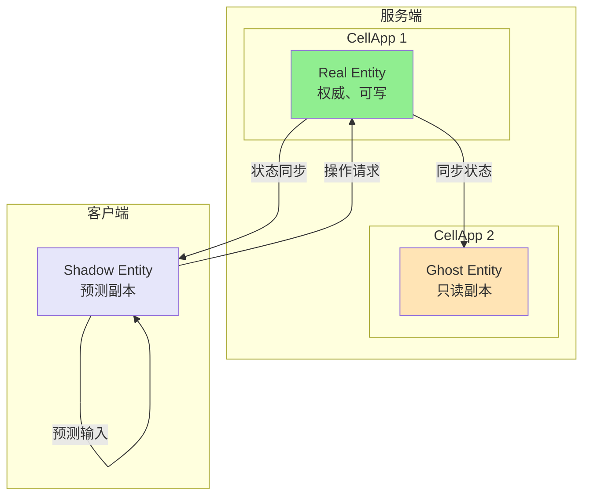
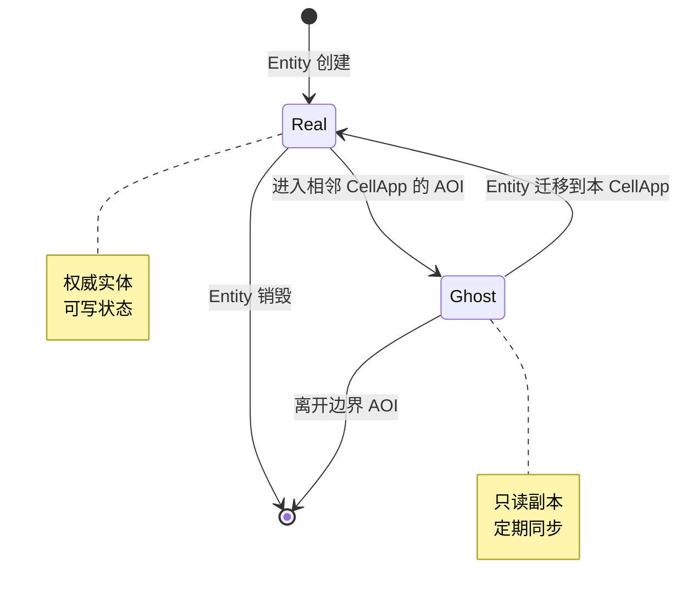
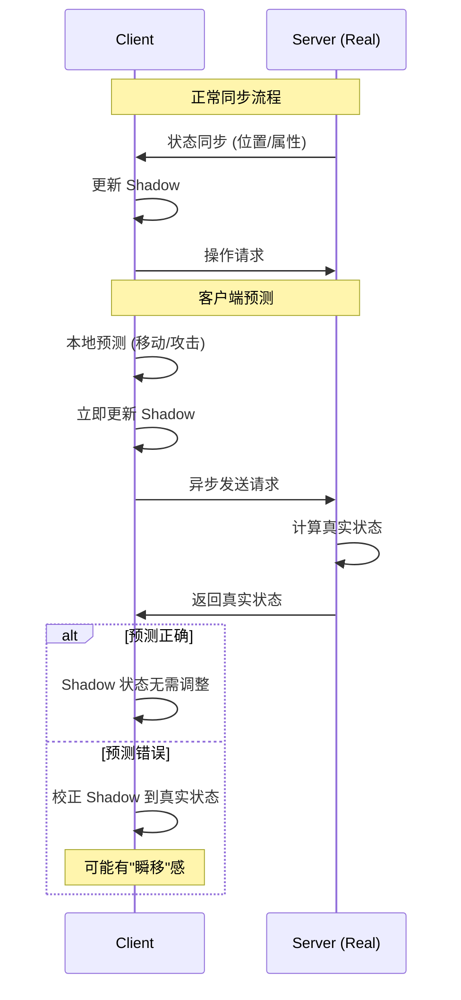
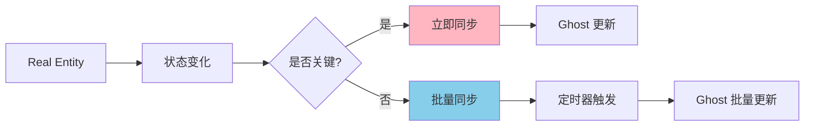
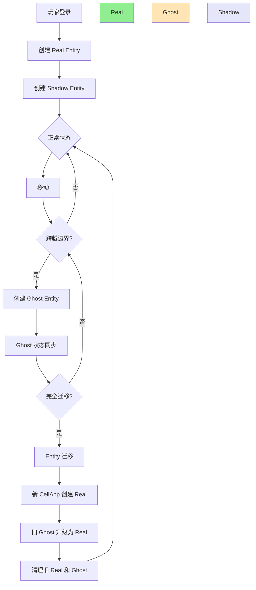

# Q27: Real、Ghost、Shadow Entity 之间如何转换？如何高效同步？

## 问题分析

本题考察对 BigWorld/KBEngine 中 **Entity 三态模型** 的深入理解：
- Real、Ghost、Shadow 的定义和区别
- 三者之间的转换条件和机制
- 高效同步的策略

---

## Entity 三态定义

### 概念对比表

| 维度 | Real Entity | Ghost Entity | Shadow Entity |
|------|-------------|--------------|---------------|
| **定义** | 权威的、可写的 Entity | 跨边界的只读副本 | 客户端预测的本地副本 |
| **位置** | 所属 CellApp 上 | 相邻 CellApp 上 | 客户端上 |
| **可写性** | ✅ 可写 | ❌ 只读 | ✅ 可写（预测） |
| **权威性** | 权威数据源 | 非权威，从 Real 同步 | 非权威，预测后需校验 |
| **同步方向** | Real → Ghost/Shadow | Real → Ghost | Client ↔ Server（预测校验） |
| **用途** | 实际逻辑处理 | 跨边界交互 | 客户端预测、减少延迟感 |

### 三态关系图



---

## 三种 Entity 详解

### Real Entity（权威实体）

**特性**：
- Entity 的"真身"，所有权威逻辑的执行者
- 只有 Real Entity 可以修改状态
- 每个 Entity 同时只能有一个 Real

**典型场景**：
```
玩家 A 在 CellApp1 管理的区域
├── Real Entity 在 CellApp1
├── 可以攻击、移动、拾取物品
└── 状态变化会同步到：
    ├── Ghost Entity（CellApp2）
    └── Shadow Entity（客户端）
```

### Ghost Entity（影子实体）

**特性**：
- 跨 CellApp 边界的只读副本
- 用于边界交互（如跨边界攻击）
- 状态由 Real 同步，不能本地修改

**为什么需要 Ghost**：
```
场景：玩家在边界攻击对面的人

┌─────────────────┬─────────────────┐
│   CellApp 1     │   CellApp 2     │
│                 │                 │
│  [Real: 玩家A]   │  [Real: 怪物B]   │
│       │         │       ▲         │
│       │ 攻击     │       │         │
│       ┼─────────┼───────┘         │
│       ▼         │                 │
│ [Ghost: 怪物B]  │                 │
│  (只读副本)      │                 │
└─────────────────┴─────────────────┘

如果没有 Ghost：
- 玩家A 无法"看到"怪物B 的引用
- 无法发起攻击
- 或者需要跨 CellApp 实时查询（性能差）
```

### Shadow Entity（阴影实体）

**特性**：
- 客户端的预测副本
- 本地可写，用于客户端预测
- 需要与服务器状态校验

**为什么需要 Shadow**：
```
客户端预测流程：

1. 玩家按下移动键
2. 客户端立即更新 Shadow 位置（无延迟感）
3. 同时发送移动请求到服务器
4. 服务器计算 Real 位置
5. 服务器将真实位置同步回客户端
6. 客户端校正 Shadow 位置（如有偏差）

没有 Shadow 的问题：
- 每次操作都要等服务器响应
- 100ms 延迟下操作感极其卡顿
```

---

## Entity 转换机制

### Real ↔ Ghost 转换

**触发条件**：Entity 跨越 CellApp 边界



**Real → Ghost（进入边界）**：
```
玩家从 CellApp1 移动到 CellApp2 边界：

1. CellApp1 检测到玩家进入边界区域
2. CellApp1 向 CellApp2 发送创建 Ghost 请求
3. CellApp2 创建 Ghost Entity
4. CellApp1 定期同步状态到 CellApp2

同步内容：
- 位置 (x, y, z)
- 朝向 (yaw, pitch, roll)
- 速度 (vx, vy, vz)
- 可见状态（血量、装备等）
```

**Ghost → Real（Entity 迁移）**：
```
玩家完全进入 CellApp2 区域：

1. CellApp1 开始迁移流程
2. CellApp1 将完整状态发送到 CellApp2
3. CellApp2 创建 Real Entity（从 Ghost 升级）
4. CellApp1 通知各相关方：Entity 已迁移
5. CellApp1 销毁 Real Entity
6. 其他 CellApp 上的 Ghost 更新目标
```

### Real ↔ Shadow 转换

**这是同步关系而非所有权转移**：



**Shadow 状态管理**：
```
Shadow 的几种状态：

1. 创建态
   - 玩家登录
   - 新 Entity 进入 AOI

2. 预测态
   - 客户端输入产生变化
   - 等待服务器确认

3. 同步态
   - 收到服务器确认
   - Shadow 与 Real 一致

4. 校正态
   - 预测与真实不符
   - 插值平滑过渡到正确状态
```

### Ghost ↔ Shadow 关系

```
Ghost 和 Shadow 都是非权威副本，但服务于不同目的：

Ghost（服务端）：
- 用于跨 CellApp 边界交互
- 服务端组件之间同步
- 保证服务端逻辑完整性

Shadow（客户端）：
- 用于客户端预测
- 服务器到客户端同步
- 提升用户体验
```

---

## 高效同步策略

### 1. 状态同步优化

**增量同步**：
```
每次只同步变化的状态：

不做：
- 每次发送整个 Entity 状态

要做：
- 维护脏标记（Dirty Flags）
- 只发送变化的属性
- 使用位掩码表示变化字段

示例协议：
struct EntitySync {
    uint64 entity_id;
    uint32 dirty_flags;    // 每个位代表一个属性
    float x, y, z;         // 仅当位置脏时发送
    uint32 hp;             // 仅当血量脏时发送
    // ...
};

Dirty Flags:
bit 0: 位置
bit 1: 朝向
bit 2: 速度
bit 3: 血量
// ...
```

**优先级同步**：
```
根据重要性分级同步：

高优先级（每帧）：
- 玩家自己
- 攻击目标

中优先级（每 3-5 帧）：
- 附近玩家
- 附近 NPC

低优先级（每 10+ 帧）：
- 远处 Entity
- 装饰品
```

### 2. Ghost 同步策略



**关键状态立即同步**：
```
立即同步：
- 血量变化
- 死亡状态
- 装备变化
- 技能释放

批量同步（每 50-100ms）：
- 位置微调
- 朝向变化
- 动画状态
```

### 3. Shadow 同步策略

**插值与外推**：
```
客户端位置同步：

1. 接收服务器位置更新
2. 不直接设置，而是插值过渡

插值算法：
current_pos = lerp(shadow_pos, server_pos, factor)

factor 取值：
- 0.1-0.3：平滑但延迟感强
- 0.5-0.8：响应快但可能有抖动
- 动态调整：根据网络状况自适应
```

**预测校正平滑**：
```
当预测错误时，不要直接跳转：

错误做法：
shadow_pos = server_pos  // 会导致瞬移

正确做法：
// 在若干帧内平滑过渡到正确位置
correction_speed = 0.2f
shadow_pos += (server_pos - shadow_pos) * correction_speed

当偏差过大时：
- 才使用强制校正
- 同时播放"传送"特效掩盖
```

### 4. 带宽优化

**量化压缩**：
```
浮点数量化：
float position → uint16 (量化到厘米级别)
float angle → uint8 (量化到 1-2 度)

示例：
原始：3 x float (12 bytes) → position
压缩：3 x uint16 (6 bytes) → position

节省 50% 带宽，精度足够游戏使用
```

**Delta 编码**：
```
对于连续值，发送变化量：

不用：
position_x = 1234.56

改用：
delta_x = current_x - last_x
         = 0.05  // 很小的值

小值可以用更少的字节编码
```

---

## 转换流程图

### Entity 完整生命周期



---

## 实现示例

### Ghost 创建代码示例

```cpp
// CellApp1: 玩家进入边界，需要创建 Ghost
void CellApp::onEntityEnterBoundary(Entity* entity, CellApp* neighborApp) {
    // 1. 序列化 Entity 状态
    MemoryStream stream;
    entity->serializeTo(stream);

    // 2. 发送创建 Ghost 请求
    CreateGhostPacket packet;
    packet.entity_id = entity->getId();
    packet.data = stream;

    neighborApp->send(packet);
}

// CellApp2: 接收创建 Ghost 请求
void CellApp::onCreateGhost(const CreateGhostPacket& packet) {
    // 1. 创建 Ghost Entity
    GhostEntity* ghost = new GhostEntity();
    ghost->setGhostMode(true);  // 标记为只读

    // 2. 反序列化状态
    MemoryStream stream(packet.data);
    ghost->deserializeFrom(stream);

    // 3. 注册到 Ghost 管理
    ghostEntities_[packet.entity_id] = ghost;

    // 4. 加入 AOI（只读，不触发进入事件）
    aoi_->addGhost(ghost);
}
```

### Shadow 同步代码示例

```cpp
// 客户端：接收服务器状态更新
void Client::onEntitySync(const EntitySyncPacket& packet) {
    Entity* entity = getEntity(packet.entity_id);

    if (entity) {
        // 不直接设置，而是记录服务器状态
        entity->setServerState(packet.state);
        entity->setLastSyncTime(now());

        // 插值平滑会在 update 中处理
    }
}

// 客户端：每帧更新
void Client::update(float delta_time) {
    for (auto* entity : entities_) {
        if (entity->hasServerState()) {
            // 平滑插值到服务器状态
            float t = std::min(delta_time * interpolation_speed, 1.0f);
            entity->setPosition(lerp(
                entity->getPosition(),
                entity->getServerPosition(),
                t
            ));
        }
    }
}
```

---

## 常见问题

### Q1: Ghost 和 Real 数据不一致怎么办？

```
问题：网络延迟导致 Ghost 状态落后

解决方案：
1. Ghost 只用于可见性，不做权威判断
2. 关键操作（攻击）通过 Real 验证
3. Ghost 定期全量同步（每 1-2 秒）
```

### Q2: Shadow 预测错误太多怎么办？

```
问题：频繁的预测校正导致画面抖动

解决方案：
1. 调整预测算法保守度
2. 提高服务器发送频率
3. 使用更平滑的校正曲线
4. 根据网络质量动态调整策略
```

### Q3: 边界频繁切换导致大量 Ghost 创建/销毁？

```
问题：玩家在边界反复横跳

解决方案：
1. 设置边界缓冲区
2. Ghost 进入后不立即销毁，延迟一段时间
3. 使用引用计数管理 Ghost 生命周期
```

---

## 参考资料

- [KBEngine Entity 机制](https://github.com/kbengine/kbengine)
- [BigWorld Entity Architecture](https://www.bigworldtech.com/)
- [Gaffer on Games - Networking](https://gafferongames.com/categories/networking/)
- [Unreal Network Replication](https://docs.unrealengine.com/5.0/en-us/Networking/Replication/)
