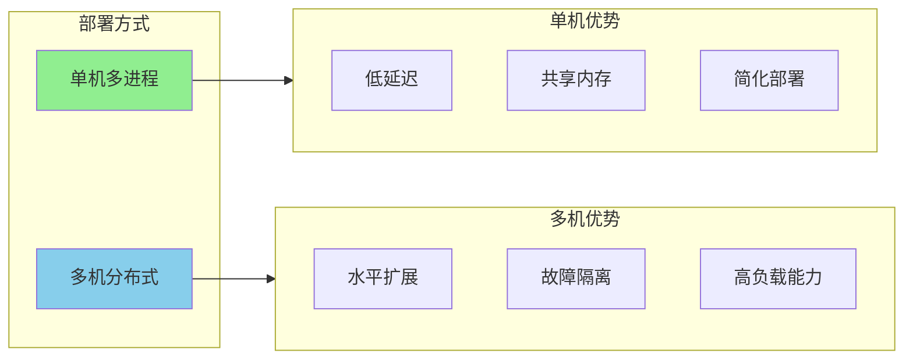
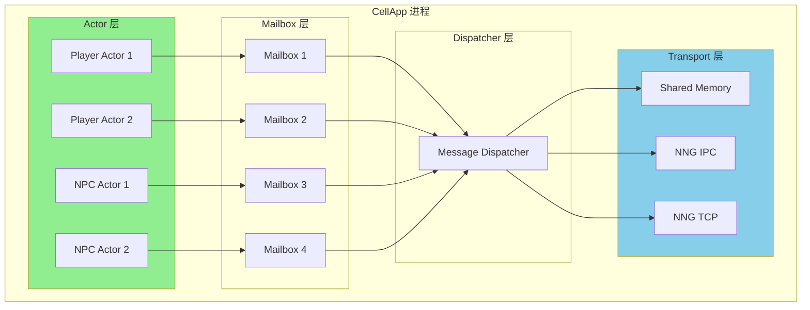

# Q28: KBEngine 是否存在注册中心？CellApp 如何部署和通信？Actor 模型适用吗？

## 问题分析

本题考察对 KBEngine/Apollo 内部通信架构的深入理解：
- 服务注册与发现机制
- CellApp 的部署策略
- 进程间通信方式
- Actor 模型在游戏服务器中的应用

---

## 一、服务注册中心

### KBEngine 的注册机制

**CellAppMgr 就是注册中心**：

```
┌─────────────────────────────────────────────────────────────────┐
│                        KBEngine 架构                            │
├─────────────────────────────────────────────────────────────────┤
│                                                                 │
│  ┌──────────────┐         ┌──────────────┐                    │
│  │  LoginApp    │         │   DBMgr      │                    │
│  └──────┬───────┘         └──────┬───────┘                    │
│         │                        │                             │
│         ▼                        ▼                             │
│  ┌──────────────────────────────────────────────┐            │
│  │            CellAppMgr (注册中心)               │            │
│  │  - 维护所有 CellApp 的地址信息                  │            │
│  │  - 负责空间分配                                │            │
│  │  - Entity 位置注册表                           │            │
│  └──────────────────────────────────────────────┘            │
│         │                        │                             │
│    ┌────┴────┐            ┌─────┴─────┐                         │
│    ▼         ▼            ▼           ▼                         │
│  ┌─────┐  ┌─────┐      ┌─────┐     ┌─────┐                    │
│  |CA 1 |  |CA 2 |      |CA 3 |     |CA 4 |  (CellApp)          │
│  └─────┘  └─────┘      └─────┘     └─────┘                    │
│                                                                 │
└─────────────────────────────────────────────────────────────────┘
```

**CellAppMgr 的注册中心职责**：

| 职责 | 说明 |
|------|------|
| **CellApp 注册** | CellApp 启动时向 CellAppMgr 注册 |
| **空间分配** | 记录每个 CellApp 负责的空间区域 |
| **Entity 位置** | 维护 EntityID → CellApp 的映射 |
| **负载均衡** | 新 Entity 创建时选择负载最低的 CellApp |
| **Entity 查找** | 响应 Entity 位置查询请求 |

### Apollo 的改进架构

Apollo 支持更灵活的服务注册/发现：

```cpp
// 支持多种注册中心后端
enum class DiscoveryBackend {
    SQLite,   // 本地/测试
    Redis,    // 分布式
    Etcd,     // 生产环境
    Consul    // 云原生
};
```

**注册信息示例**：
```json
{
  "server_id": "1-2-6-1",
  "service": "CellApp",
  "host": "10.0.0.5",
  "transports": [
    {
      "protocol": "nng-ipc",
      "address": "ipc://cellapp-1.ipc",
      "priority": 0,
      "attributes": {
        "locality": "same-host",
        "latency": "low"
      }
    },
    {
      "protocol": "nng-tcp",
      "address": "tcp://10.0.0.5:6100",
      "priority": 10,
      "attributes": {
        "bandwidth": "high"
      }
    }
  ],
  "metadata": {
    "load": 45,
    "entity_count": 1200,
    "space_bounds": "0-1024,0-1024"
  }
}
```

---

## 二、CellApp 部署策略

### 部署方式对比



### 单机多进程部署

**典型配置**：
```bash
# 服务器配置：32核 64GB 内存
# 部署方案：
# - 8 个 CellApp 进程
# - 4 个 BaseApp 进程
# - 1 个 CellAppMgr
# - 1 个 BaseAppMgr
# - 1 个 DBMgr
# - 1 个 LoginApp
# - 1 个 GatewayApp

# CPU 亲和性绑定
taskset -c 0-3   ./cellapp --port 50001  # CellApp 1 绑定 CPU 0-3
taskset -c 4-7   ./cellapp --port 50002  # CellApp 2 绑定 CPU 4-7
taskset -c 8-11  ./cellapp --port 50003  # CellApp 3 绑定 CPU 8-11
taskset -c 12-15 ./cellapp --port 50004  # CellApp 4 绑定 CPU 12-15
taskset -c 16-19 ./cellapp --port 50005  # CellApp 5 绑定 CPU 16-19
taskset -c 20-23 ./cellapp --port 50006  # CellApp 6 绑定 CPU 20-23
taskset -c 24-27 ./cellapp --port 50007  # CellApp 7 绑定 CPU 24-27
taskset -c 28-31 ./cellapp --port 50008  # CellApp 8 绑定 CPU 28-31
```

**CPU 亲和性配置**：
```cpp
// Linux 设置 CPU 亲和性
#include <sched.h>

void set_cpu_affinity(int core_id) {
    cpu_set_t cpuset;
    CPU_ZERO(&cpuset);
    CPU_SET(core_id, &cpuset);
    pthread_setaffinity_np(pthread_self(), sizeof(cpu_set_t), &cpuset);
}

// 设置 CPU 亲和性和线程数
void configure_thread_pool() {
    // 获取 CPU 核心数
    int num_cores = std::thread::hardware_concurrency();

    // 网络线程：绑定到核心 0
    set_cpu_affinity(0);

    // 逻辑线程：分散到其他核心
    for (int i = 0; i < num_cores - 1; ++i) {
        set_cpu_affinity(i + 1);
    }
}
```

### 多机分布式部署

**典型集群配置**：

```
┌─────────────────────────────────────────────────────────────────┐
│                        游戏服务器集群                            │
├─────────────────────────────────────────────────────────────────┤
│                                                                 │
│  ┌──────────────────┐  ┌──────────────────┐                   │
│  │   机器 A: 登录层  │  │  机器 B: 网关层   │                   │
│  │  ┌────────────┐  │  │  ┌────────────┐  │                   │
│  │  │ LoginApp 1 │  │  │  │ Gateway 1  │  │                   │
│  │  │ LoginApp 2 │  │  │  │ Gateway 2  │  │                   │
│  │  └────────────┘  │  │  └────────────┘  │                   │
│  └──────────────────┘  └──────────────────┘                   │
│                                                                 │
│  ┌──────────────────┐  ┌──────────────────┐                   │
│  │  机器 C: 空间层   │  │  机器 D: 空间层   │                   │
│  │  ┌────────────┐  │  │  ┌────────────┐  │                   │
│  │  │CellApp 1-4 │  │  │  │CellApp 5-8 │  │                   │
│  │  │(新区)     │  │  │  │(老区)     │  │                   │
│  │  └────────────┘  │  │  └────────────┘  │                   │
│  └──────────────────┘  └──────────────────┘                   │
│                                                                 │
│  ┌──────────────────┐  ┌──────────────────┐                   │
│  │  机器 E: 逻辑层   │  │  机器 F: 数据层   │                   │
│  │  ┌────────────┐  │  │  ┌────────────┐  │                   │
│  │  │BaseApp 1-4 │  │  │  │   DBMgr    │  │                   │
│  │  │CellMgr     │  │  │  │  BaseMgr   │  │                   │
│  │  │BaseMgr     │  │  │  │  Redis     │  │                   │
│  │  └────────────┘  │  │  └────────────┘  │                   │
│  └──────────────────┘  └──────────────────┘                   │
│                                                                 │
└─────────────────────────────────────────────────────────────────┘
```

---

## 三、CellApp 通信机制

### 通信方式对比

| 通信方式 | 延迟 | 带宽 | 适用场景 | 实现 |
|----------|------|------|----------|------|
| **共享内存** | ~1μs | 极高 | 同进程 | 自定义环形缓冲区 |
| **Unix Socket** | ~10μs | 高 | 同机 | NNG IPC |
| **TCP (回环)** | ~50μs | 高 | 同机/跨机 | NNG TCP |
| **TCP (跨机)** | ~100-500μs | 中 | 跨机 | NNG TCP |

### NNG 通信框架

Apollo 使用 **NNG (Nanomsg Next Gen)** 作为底层通信框架：

```cpp
// NNG 支持的协议模式
namespace apollo::protocol {

// 1. Pair 模式（点对点）
NngSocket pair_socket;
nng_pair0_open(&pair_socket.get());

// 2. Req/Rep 模式（请求响应）
NngSocket req_socket;
nng_req0_open(&req_socket.get());

// 3. Pub/Sub 模式（发布订阅）
NngSocket pub_socket;
nng_pub0_open(&pub_socket.get());

// 4. Bus 模式（多对多）
NngSocket bus_socket;
nng_bus0_open(&bus_socket.get());

} // namespace apollo::protocol
```

**传输优先级自动选择**：
```cpp
struct TransportEndpoint {
    std::string protocol;    // "nng-tcp", "nng-ipc", "shm"
    std::string address;     // "tcp://host:port", "ipc://path"
    int priority = 100;      // 越小越优先

    // 自动选择最佳传输
    std::string getBestAddress(const std::string& local_host) {
        if (protocol == "shm" && isSameProcess()) {
            return address;  // 共享内存优先
        }
        if (protocol == "nng-ipc" && isSameHost(local_host)) {
            return address;  // IPC 其次
        }
        return tcp_address;  // TCP 最后
    }
};
```

### 共享内存通道

Apollo 实现了零拷贝的共享内存通信：

```cpp
class SharedMemoryRingBuffer {
public:
    struct Header {
        std::atomic<size_t> writePos{0};
        std::atomic<size_t> readPos{0};
        std::atomic<size_t> count{0};
        size_t capacity{0};
        uint32_t magic{0};
    };

    // 零拷贝写入
    void* allocate(size_t size, uint32_t type = 0);
    void commit(size_t size);

    // 零拷贝读取
    struct ReadResult {
        const void* data;  // 直接指向共享内存
        size_t size;
        uint32_t type;
    };
    bool read(ReadResult& result);
    void consume();
};
```

**FlatBuffers 零拷贝集成**：
```cpp
class FlatBufferChannel {
    // 发送：直接在共享内存中构建 FlatBuffer
    template<typename BuilderFunc>
    bool send(BuilderFunc builder) {
        auto* buf = ringBuffer_->allocate(size, 0);
        // 在共享内存中直接构建，无需拷贝
        builder(fbb);
        std::memcpy(buf, fbb.GetBufferPointer(), fbb.GetSize());
        ringBuffer_->commit(fbb.GetSize());
        return true;
    }

    // 接收：直接从共享内存读取，无需拷贝
    template<typename T>
    const T* receiveAs() {
        Message msg;
        if (!receive(msg)) return nullptr;
        // 直接返回指向共享内存的指针
        return flatbuffers::GetRoot<T>(msg.data);
    }
};
```

---

## 四、Actor 模型应用

### Actor 模型与 CellApp



### Actor 模型适用性分析

| 特性 | Actor 模型 | 说明 |
|------|-----------|------|
| **并发模型** | 消息传递 | 每个玩家/NPC 一个 Actor |
| **状态隔离** | ✅ 天然支持 | Actor 状态互不影响 |
| **位置透明** | ✅ 支持 | 本地/远程 Actor 统一接口 |
| **容错性** | ✅ Let It Crash | Actor 崩溃可自动重启 |
| **热更新** | ✅ 支持 | Actor 代码可热替换 |

### CAF 框架对比

**CAF (C++ Actor Framework)** 是成熟的 Actor 框架：

| 特性 | CAF | Apollo Actor |
|------|-----|--------------|
| **同机通信** | 共享内存 | 共享内存 + NNG IPC |
| **跨机通信** | BASP 协议 | NNG TCP |
| **序列化** | 自定义 | FlatBuffers/JSON |
| **服务发现** | 内置 | 可插拔（SQLite/Redis/Etcd） |
| **监控** | 内置 | 可插拔 |

**CAF 通信架构**：
```
┌─────────────────────────────────────────────────────────────────┐
│                         CAF 通信层                              │
├─────────────────────────────────────────────────────────────────┤
│                                                                 │
│  ┌─────────────┐                                               │
│  │  Application│                                              │
│  │   (Actor)   │                                              │
│  └──────┬──────┘                                               │
│         │                                                       │
│         ▼                                                       │
│  ┌─────────────┐    ┌─────────────┐    ┌─────────────┐        │
│  │   Default   │    │   Forward   │    │   BASP      │        │
│  │  Multiplexer│───▶│ing Actor    │───▶│  Protocol   │        │
│  └──────┬──────┘    └─────────────┘    └──────┬──────┘        │
│         │                                      │               │
│         ▼                                      ▼               │
│  ┌─────────────────────────────────────────────────────────┐   │
│  │                   Transport Layer                       │   │
│  │  ┌─────────┐  ┌─────────┐  ┌─────────┐  ┌─────────┐   │   │
│  │  │  SHM    │  │ IPC     │  │ TCP     │  │ UDP     │   │   │
│  │  └─────────┘  └─────────┘  └─────────┘  └─────────┘   │   │
│  └─────────────────────────────────────────────────────────┘   │
│                                                                 │
└─────────────────────────────────────────────────────────────────┘
```

### Apollo Actor 实现

**位置透明的消息传递**：
```cpp
class ActorRef {
public:
    // 发送消息（自动选择最佳传输）
    void tell(const Message& msg);

    // 请求-响应
    template<typename Response>
    Future<Response> ask(const Message& msg, Duration timeout);

private:
    ActorPath path_;              // "sys://game-server/cellapp-1/player-123"
    std::shared_ptr<MessageBus> bus_;
};

class MessageBus {
public:
    // 根据目标地址自动选择传输
    void send(const ActorPath& target, const Message& msg) {
        if (target.isLocal()) {
            // 邮箱直接投递
            local_mailbox_->enqueue(msg);
        } else if (target.isSameHost()) {
            // 共享内存或 IPC
            shm_channel_->send(msg);
        } else {
            // TCP
            tcp_channel_->send(msg);
        }
    }
};
```

**Actor 与 Entity 的对应关系**：
```cpp
// 每个 Entity 对应一个 Actor
class EntityActor : public Actor {
protected:
    void receive(const Message& msg) override {
        if (msg.is<MoveRequest>()) {
            handleMove(msg.as<MoveRequest>());
        } else if (msg.is<AttackRequest>()) {
            handleAttack(msg.as<AttackRequest>());
        } else if (msg.is<GhostSync>()) {
            handleGhostSync(msg.as<GhostSync>());
        }
    }

private:
    Entity* entity_;  // 关联的游戏实体
};
```

---

## 五、通信优化策略

### 批量消息合并

```cpp
class BatchMessageBus {
public:
    // 批量发送
    void send_batch(const std::vector<Message>& msgs) {
        if (msgs.size() > batch_threshold_) {
            // 合并成一个批量消息
            BatchMessage batch;
            for (const auto& msg : msgs) {
                batch.add(msg);
            }
            channel_->send(batch);
        } else {
            // 单独发送
            for (const auto& msg : msgs) {
                channel_->send(msg);
            }
        }
    }
};
```

### 背压控制

```cpp
class Mailbox {
public:
    // 背压检测
    bool isUnderBackpressure() const {
        return queue_.size() > high_water_mark_;
    }

    // 限流
    bool try_enqueue(const Message& msg) {
        if (isUnderBackpressure()) {
            // 拒绝或延迟
            return false;
        }
        queue_.push(msg);
        return true;
    }
};
```

### 零拷贝优化

```cpp
// FlatBuffers 零拷贝示例
void send_position_update(const std::vector<PlayerPosition>& positions) {
    flatbuffers::FlatBufferBuilder fbb;

    // 直接在 FlatBuffer 中构建数组
    auto position_vec = fbb.CreateVector(positions);
    auto update = CreatePositionUpdate(fbb, position_vec);
    fbb.Finish(update);

    // 零拷贝发送到共享内存
    shm_channel_->send(fbb.GetBufferPointer(), fbb.GetSize());
}
```

---

## 六、部署建议

### 小规模部署（< 1000 人）

```
单机配置：
- 4 核 8GB
- 1 个 CellApp
- 1 个 BaseApp
- 1 个 DBMgr
- 1 个 Gateway
- 1 个 CellAppMgr/BaseAppMgr
```

### 中等规模（1000-5000 人）

```
单机多进程：
- 16 核 32GB
- 4 个 CellApp（各绑 4 核）
- 2 个 BaseApp
- 1 个 DBMgr
- 2 个 Gateway
- 1 个 CellAppMgr/BaseAppMgr
```

### 大规模（> 5000 人）

```
集群部署：
- 登录服务器（2 台）：LoginApp 集群
- 网关服务器（4 台）：Gateway 集群
- 游戏服务器（8 台）：CellApp + BaseApp 混合部署
- 数据服务器（2 台）：DBMgr + Redis + 基础服务管理器
- Etcd 集群（3 台）：服务注册中心
```

---

## 七、参考资料

- [NNG (Nanomsg Next Gen)](https://nanomsg.github.io/nng/)
- [CAF (C++ Actor Framework)](https://www.actor-framework.io/)
- [KBEngine 架构文档](https://github.com/kbengine/kbengine)
- [FlatBuffers 零拷贝序列化](https://google.github.io/flatbuffers/)
- [共享内存 IPC 设计](https://man7.org/linux/man-pages/man7/shm_overview.7.html)
