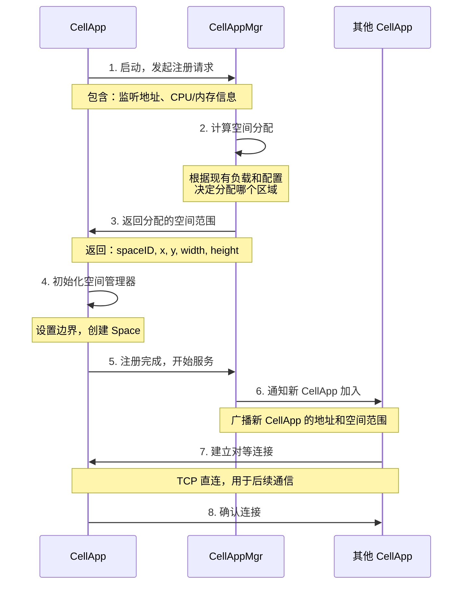

# Q29: KBEngine CellApp 之间如何通信？如何发现自己的空间位置？

## 问题分析

本题考察对 KBEngine/Apollo 中 **CellApp 间通信机制** 和 **空间划分策略** 的深入理解：
- CellApp 之间的通信方式
- CellApp 如何知道自己在空间中的位置
- 空间边界的动态调整机制

---

## 一、CellApp 通信架构

### 通信拓扑

```
┌─────────────────────────────────────────────────────────────────────┐
│                        CellApp 通信网络                             │
├─────────────────────────────────────────────────────────────────────┤
│                                                                     │
│   ┌─────────────┐                                                  │
│   │ CellAppMgr  │ ◄─────── 心跳/注册/空间查询                       │
│   └──────┬──────┘                                                  │
│          │                                                         │
│          │ 注册/发现                                                │
│          ▼                                                         │
│   ┌──────────────────────────────────────────────────────────────┐ │
│   │                    CellApp 集群                              │ │
│   │                                                              │ │
│   │   ┌─────────┐    ┌─────────┐    ┌─────────┐    ┌─────────┐  │ │
│   │   │CellApp1 │◄──►│CellApp2 │◄──►│CellApp3 │◄──►│CellApp4 │  │ │
│   │   │ [0,0)   │    │ [256,0) │    │ [0,256) │    │ [256,256)│ │ │
│   │   └─────────┘    └─────────┘    └─────────┘    └─────────┘  │ │
│   │        │              │              │              │        │ │
│   │        └──────────────┴──────────────┴──────────────┘        │ │
│   │                       全连接网状拓扑                            │ │
│   └──────────────────────────────────────────────────────────────┘ │
│                                                                     │
└─────────────────────────────────────────────────────────────────────┘
```

### 通信方式

| 方式 | 协议 | 用途 | 连接建立 |
|------|------|------|----------|
| **CellApp → CellAppMgr** | TCP | 注册、心跳、空间查询 | 启动时连接 |
| **CellApp ↔ CellApp** | TCP | Entity 迁移、Ghost 同步、边界通信 | 通过 Mgr 发现后直连 |

---

## 二、CellApp 启动与空间分配流程

### 启动流程



### 空间分配策略

#### 坐标系统说明

MMORPG 通常使用 **3D 坐标系**：

```
     Y (上/高度)
     ↑
     │
     │
     │─────→ X (右)
    ╱
   ╱
  ↓ Z (前/深度)

不同引擎的约定：
- KBEngine/BigWorld: Y 轴向上
- Unity: Y 轴向上
- Unreal Engine: Z 轴向上
```

**策略 1: 静态 2D 划分（最常用）**

大多数 MMO 只在 **XZ 平面** 划分空间，Y 轴（高度）不划分：

```
假设地图 512x512，4 个 CellApp（俯视图）：

           Z (前)
           ↑
           │
           │
     ┌─────┼─────┐
     │     │     │
     │  1  │  2  │
     │─────┼─────│
     │  3  │  4  │
     └─────┴─────┘
           │
           └─────────→ X (右)

每个 CellApp 的空间：
┌─────────────────────────────────────────────────────────────┐
│ CellApp1:                                                   │
│   X: [0, 256),    Z: [256, 512),    Y: [-∞, +∞]            │
│                                                             │
│   Y 轴不划分 → 整个垂直空间都由这个 CellApp 管理           │
│   适用于：玩家主要在地面上活动                               │
└─────────────────────────────────────────────────────────────┘

为什么只划分 XZ 平面？
- 玩家大部分时间在地面上
- 飞行坐骑/跳跃不需要跨 CellApp
- 简化边界计算和 Entity 迁移
```

**策略 2: 静态 3D 划分（有飞行系统的游戏）**

如果游戏有大量飞行内容，可以按 **3D 立方体** 划分：

```
3D 空间划分（8 个 CellApp）：

        Y (上)
        ↑
        │
   ┌────┼────┐
   │ 4  │ 5  │  高层
   ├────┼────┤
   │ 6  │ 7  │
   └────┴────┘
        │
        └──────────→ X
       ╱
      ↓ Z

     (俯视图)

层次划分：
┌─────────────────────────────────────────────────────────────┐
│                                                             │
│   Y ≥ 100m (高层):                                          │
│   ┌──────────┬──────────┐                                  │
│   │CellApp4  │CellApp5  │  飞行区域                        │
│   │XZ: 1-2象限│XZ: 3-4象限│                                  │
│   ├──────────┼──────────┤                                  │
│   │CellApp6  │CellApp7  │                                  │
│   └──────────┴──────────┘                                  │
│                                                             │
│   Y < 100m (低层):                                          │
│   ┌──────────┬──────────┐                                  │
│   │CellApp1  │CellApp2  │  地面活动                        │
│   ├──────────┼──────────┤                                  │
│   │CellApp3  │CellApp4  │                                  │
│   └──────────┴──────────┘                                  │
│                                                             │
└─────────────────────────────────────────────────────────────┘

问题：玩家从地面飞到空中 → 需要跨 CellApp 迁移
```

**策略 2: 动态负载均衡**
```
根据实际负载动态调整边界：

初始状态：
┌──────────────┬──────────────┐
│  CellApp1    │  CellApp2    │
│  负载: 200   │  负载: 2000  │ ← 过载
│  空间: 50%   │  空间: 50%   │
└──────────────┴──────────────┘

调整后：
┌────────────────┬──────────────┐
│  CellApp1      │  CellApp2    │
│  负载: 800     │  负载: 1400  │ ← 平衡
│  空间: 75% ▲   │  空间: 25% ▼ │
└────────────────┴──────────────┘
     边界移动 →
```

---

## 三、空间位置发现机制

### CellApp 的空间元数据

```cpp
// 3D 空间边界
struct SpaceBounds3D {
    uint32_t spaceID;         // 空间 ID

    // 3D 边界
    struct Vec3 { float x, y, z; };
    Vec3 min;                 // 最小坐标
    Vec3 max;                 // 最大坐标

    // 尺寸
    float width, height, depth;

    // 2D 划分时，Y 轴不限制
    bool unboundedY;

    // 相邻 CellApp 信息
    struct Neighbor {
        uint32_t cellAppID;
        std::string address;
        uint16_t port;

        // 3D 空间中的方向
        enum Direction {
            LEFT, RIGHT,      // -X, +X
            FRONT, BACK,      // -Z, +Z (或 BOTTOM, TOP 取决于坐标系)
            BELOW, ABOVE,     // -Y, +Y (仅 3D 划分时使用)
            LEFT_FRONT, LEFT_BACK, RIGHT_FRONT, RIGHT_BACK,  // 组合方向
            // ... 更多组合
        } direction;
    };
    std::vector<Neighbor> neighbors;
};

class CellApp {
private:
    SpaceBounds3D bounds_;           // 自己的空间范围
    std::map<uint32_t, Neighbor> neighborMap_;  // 邻居映射

public:
    // 判断坐标是否在自己的空间内
    bool contains(float x, float y, float z) const {
        // X 和 Z 必须在范围内
        if (x < bounds_.min.x || x >= bounds_.max.x) return false;
        if (z < bounds_.min.z || z >= bounds_.max.z) return false;

        // Y 轴检查（如果划分了）
        if (!bounds_.unboundedY) {
            if (y < bounds_.min.y || y >= bounds_.max.y) return false;
        }

        return true;
    }

    // 判断坐标是否在边界区域
    bool isNearBoundary(float x, float y, float z, float threshold = 50.0f) const {
        bool nearX = (x - bounds_.min.x < threshold) ||
                     (bounds_.max.x - x < threshold);
        bool nearZ = (z - bounds_.min.z < threshold) ||
                     (bounds_.max.z - z < threshold);

        // Y 轴边界检查（如果划分了）
        bool nearY = bounds_.unboundedY ? false :
                     (y - bounds_.min.y < threshold) ||
                     (bounds_.max.y - y < threshold);

        return nearX || nearZ || nearY;
    }

    // 根据坐标找到目标 CellApp
    uint32_t findTargetCellApp(float x, float y, float z) const {
        if (contains(x, y, z)) {
            return getCellAppID();  // 自己
        }

        // 判断移动方向，找到对应的邻居
        Direction dir = calculateDirection(x, y, z);
        for (const auto& [id, neighbor] : neighborMap_) {
            if (neighbor.direction == dir) {
                return id;
            }
        }

        // 不在相邻区域，询问 CellAppMgr
        return queryCellAppMgr(x, y, z);
    }

private:
    enum Direction {
        LEFT, RIGHT, FRONT, BACK, BELOW, ABOVE,
        LEFT_FRONT, LEFT_BACK, RIGHT_FRONT, RIGHT_BACK,
        // ... 更多组合
    };

    Direction calculateDirection(float x, float y, float z) const {
        // 计算相对于中心的位置
        float centerX = (bounds_.min.x + bounds_.max.x) / 2;
        float centerZ = (bounds_.min.z + bounds_.max.z) / 2;

        Direction dir = NONE;
        if (x < bounds_.min.x) dir |= LEFT;
        else if (x >= bounds_.max.x) dir |= RIGHT;

        if (z < bounds_.min.z) dir |= BACK;  // 或 FRONT
        else if (z >= bounds_.max.z) dir |= FRONT;  // 或 BACK

        if (!bounds_.unboundedY) {
            float centerY = (bounds_.min.y + bounds_.max.y) / 2;
            if (y < bounds_.min.y) dir |= BELOW;
            else if (y >= bounds_.max.y) dir |= ABOVE;
        }

        return dir;
    }
};
```

### 边界感知

```
边界区域定义（俯视图，XZ 平面）：

           Z (前)
           ↑
           │
     ┌─────┼─────┐
     │  1  │  2  │
     │ ┌───┼───┐ │
     │ │ █ │ █ │ │  █ = 边界区 (50m)
     │ ├───┼───┤ │  └─ 双方边界重叠
     │ │ █ │ █ │ │
     │ └───┴───┘ │
     │  3  │  4  │
     └─────┴─────┘
           │
           └─────────→ X (右)

3D 视图（Y 轴不划分的情况）：

         Y (上)
         ↑
         │
         │   ┌─────────────────────┐
         │   │                     │  整个 Y 轴
         │   │    CellApp1         │  都属于
         │   │   (XZ: 象限1)       │  CellApp1
         │   │                     │
         │   │   █ 边界区 █        │
         │   ├─────────────────────┤
         │   │   正常区域          │
         │   │                     │
         │   └─────────────────────┘
         │
         └─────────────────→ X
        ╱
       ╱
      ↓ Z

Y 轴（高度）处理：

┌─────────────────────────────────────────────────────────────┐
│                                                             │
│  方案 A: Y 轴不划分（推荐）                                  │
│  ┌─────────────────────────────────────────────────────┐    │
│  │                 Y → 无限高度                        │    │
│  │  天空 (∞) ────────────────────────────────────      │    │
│  │                                                      │    │
│  │  飞行区 (100m) ────────────────                    │    │
│  │                                                      │    │
│  │  地面 (0m) ────────────────────────                │    │
│  │                                                      │    │
│  │  地下 (-50m) ───────────────────────                │    │
│  │                                                      │    │
│  │  深层 (-∞) ─────────────────────────────            │    │
│  │                                                      │    │
│  │  → 所有高度的 Entity 都在同一个 CellApp            │    │
│  └─────────────────────────────────────────────────────┘    │
│                                                             │
│  方案 B: Y 轴划分（有大量飞行内容）                          │
│  ┌─────────────────────────────────────────────────────┐    │
│  │                 Y → 分层管理                        │    │
│  │  天空层 (200m+) ──→ CellApp 高层组                  │    │
│  │  飞行层 (50-200m) ──→ CellApp 中层组                │    │
│  │  地面层 (-50~50m) ──→ CellApp 地面组                │    │
│  │  地下层 (<-50m) ──→ CellApp 地下组                  │    │
│  │                                                      │    │
│  │  → Entity 上升/下降需要跨 CellApp 迁移              │    │
│  └─────────────────────────────────────────────────────┘    │
│                                                             │
│  大多数 MMO 使用方案 A：                                      │
│  - Y 轴不划分，简化逻辑                                      │
│  - AOI 在 XZ 平面计算                                        │
│  - Y 轴只用于视线遮挡、碰撞检测                              │
│                                                             │
└─────────────────────────────────────────────────────────────┘

当 Entity 进入边界区域时：
1. 在 XZ 平面进入边界 → 创建 Ghost 给相邻 CellApp
2. Y 轴移动 → 不触发 Ghost（Y 轴不划分）
3. 完全离开 XZ 区域 → 迁移 Entity
```

### 邻居方向定义（3D）

```cpp
// 8 个基本方向（2D 划分）
enum class Direction2D : uint8_t {
    NONE = 0,
    LEFT = 1 << 0,      // -X
    RIGHT = 1 << 1,     // +X
    FRONT = 1 << 2,     // -Z 或 +Z
    BACK = 1 << 3,      // +Z 或 -Z
};

// 组合方向（对角线）
constexpr Direction2D LEFT_FRONT = LEFT | FRONT;
constexpr Direction2D LEFT_BACK = LEFT | BACK;
constexpr Direction2D RIGHT_FRONT = RIGHT | FRONT;
constexpr Direction2D RIGHT_BACK = RIGHT | BACK;

// 3D 划分时增加 Y 轴方向
enum class Direction3D : uint8_t {
    // ... 2D 方向 ...
    BELOW = 1 << 4,      // -Y
    ABOVE = 1 << 5,      // +Y
};

// 邻居表结构
struct Neighbor3D {
    uint32_t cellAppID;
    Direction3D direction;
    SpaceBounds3D bounds;
    TCPConnection* connection;
};

// 示例：4 个 CellApp 的邻居关系
// CellApp1 (X: [0,256), Z: [256,512)) 的邻居：
neighbors = {
    { 2, RIGHT,   {X: [256,512), Z: [256,512)} },   // 右侧
    { 3, BACK,    {X: [0,256),   Z: [0,256)} },     // 后方
    { 4, RIGHT_BACK, {X: [256,512), Z: [0,256)} },  // 右后对角
};
```

---

## 四、CellApp 间通信协议

### 通信类型

```cpp
// CellApp 间消息类型
enum class CellAppMessageType : uint16_t {
    // Entity 迁移
    ENTITY_MIGRATE_REQUEST,      // 迁移请求
    ENTITY_MIGRATE_RESPONSE,      // 迁移响应
    ENTITY_MIGRATE_DATA,          // 迁移数据
    ENTITY_MIGRATE_COMPLETE,      // 迁移完成

    // Ghost 同步
    GHOST_CREATE_REQUEST,         // 创建 Ghost 请求
    GHOST_CREATE_RESPONSE,        // 创建 Ghost 响应
    GHOST_UPDATE,                 // Ghost 状态更新
    GHOST_DESTROY,                // 销毁 Ghost

    // 边界交互
    BOUNDARY_CROSS_REQUEST,       // 跨边界请求
    BOUNDARY_CROSS_APPROVE,       // 跨边界批准

    // 广播转发
    BROADCAST_FORWARD,            // 广播转发

    // 负载均衡
    LOAD_BALANCE_QUERY,           // 负载查询
    LOAD_BALANCE_REPORT,          // 负载报告
    BOUNDARY_ADJUST,              // 边界调整
};
```

### Entity 迁移协议

```
迁移流程：

┌──────────────────┐                    ┌──────────────────┐
│   CellApp A      │                    │   CellApp B      │
│   (源)           │                    │   (目标)         │
└─────────┬────────┘                    └────────┬─────────┘
          │                                      │
          │ 1. ENTITY_MIGRATE_REQUEST           │
          │    (entityID, entityData)           │
          ├─────────────────────────────────────>│
          │                                      │
          │           2. 创建 Real Entity        │
          │                                      │
          │ 3. ENTITY_MIGRATE_RESPONSE          │
          │    (success, newEntityID)            │
          │<─────────────────────────────────────┤
          │                                      │
          │ 4. 通知相关方 Entity 已迁移          │
          │    (更新路由表)                      │
          │                                      │
          │ 5. ENTITY_MIGRATE_COMPLETE           │
          ├─────────────────────────────────────>│
          │                                      │
          │           6. 销毁旧 Entity            │
          │                                      │
```

### Ghost 同步协议

```cpp
// Ghost 创建请求
struct GhostCreateRequest {
    uint64_t entityID;          // Entity ID
    uint64_t ownerCellAppID;    // 所属 CellApp
    Position position;          // 初始位置
    EntityType type;            // Entity 类型
    std::vector<uint8_t> initialState;  // 初始状态
};

// Ghost 更新（增量）
struct GhostUpdate {
    uint64_t entityID;
    uint32_t dirtyFlags;        // 变化标记
    Position position;          // 如果位置脏
    uint32_t hp;                // 如果血量脏
    // ... 其他属性
};
```

---

## 五、边界协调机制

### 边界宽度设计

```
边界宽度权衡：

┌─────────────────────────────────────────────────────────────┐
│                                                             │
│  窄边界 (10m)                    宽边界 (100m)             │
│  ┌─────┬─────┐                 ┌─────────────┬───────────┐ │
│  │ CA1 │ CA2 │                 │    CA1      │   CA2     │ │
│  │ ────┼─────│                 │ ────────────┼───────────│ │
│  │     │     │                 │             │           │ │
│  └─────┴─────┘                 └─────────────┴───────────┘ │
│                                                             │
│  优点: Ghost 少                  优点: 减少频繁迁移           │
│  缺点: 频繁迁移                  缺点: Ghost 多，同步开销大  │
│                                                             │
│  推荐值: 30-50 米（根据 AOI 半径调整）                       │
│                                                             │
└─────────────────────────────────────────────────────────────┘
```

### 跨边界判断

```cpp
class BoundaryManager {
public:
    // 检查 Entity 是否需要迁移
    bool shouldMigrate(Entity* entity, SpaceBounds& targetBounds) {
        float x = entity->getPosition().x;
        float y = entity->getPosition().y;

        // 已离开当前空间
        if (!bounds_.contains(x, y)) {
            // 找到目标 CellApp
            targetBounds = findTargetBounds(x, y);
            return true;
        }

        // 在边界区域，判断移动趋势
        if (isInBoundaryZone(x, y)) {
            auto velocity = entity->getVelocity();
            auto futurePos = entity->getPosition() + velocity * 2.0f;  // 2秒后位置

            if (!bounds_.contains(futurePos.x, futurePos.y)) {
                targetBounds = findTargetBounds(futurePos.x, futurePos.y);
                return true;
            }
        }

        return false;
    }
};
```

---

## 六、邻居发现与维护

### 邻居表维护

```cpp
class NeighborTable {
private:
    struct NeighborInfo {
        uint32_t cellAppID;
        std::string host;
        uint16_t port;
        SpaceBounds bounds;

        // TCP 连接
        std::shared_ptr<TCPConnection> connection;

        // 心跳
        std::chrono::steady_clock::time_point lastHeartbeat;

        // 统计
        uint64_t messagesSent;
        uint64_t messagesReceived;
        double avgLatency;
    };

    std::map<uint32_t, NeighborInfo> neighbors_;

public:
    // 添加邻居（由 CellAppMgr 通知）
    void addNeighbor(const NeighborInfo& info) {
        neighbors_[info.cellAppID] = info;
        connectToNeighbor(info);
    }

    // 移除邻居
    void removeNeighbor(uint32_t cellAppID) {
        auto it = neighbors_.find(cellAppID);
        if (it != neighbors_.end()) {
            it->second.connection->close();
            neighbors_.erase(it);
        }
    }

    // 获取目标方向的邻居
    NeighborInfo* getNeighborInDirection(float dx, float dy) {
        for (auto& [id, info] : neighbors_) {
            if (dx > 0 && info.bounds.minX > bounds_.maxX) return &info;
            if (dx < 0 && info.bounds.maxX < bounds_.minX) return &info;
            if (dy > 0 && info.bounds.minY > bounds_.maxY) return &info;
            if (dy < 0 && info.bounds.maxY < bounds_.minY) return &info;
        }
        return nullptr;
    }

    // 心跳检测
    void checkHeartbeats() {
        auto now = std::chrono::steady_clock::now();
        for (auto& [id, info] : neighbors_) {
            auto elapsed = now - info.lastHeartbeat;
            if (elapsed > std::chrono::seconds(10)) {
                // 心跳超时，重新连接或上报
                reconnectNeighbor(id);
            }
        }
    }
};
```

### 邻居变化通知

```
CellApp 加入/退出时的广播：

CellAppMgr → 所有 CellApp:
{
    "type": "NEIGHBOR_UPDATE",
    "action": "ADD",  // 或 "REMOVE"
    "cellApp": {
        "id": 5,
        "host": "10.0.0.5",
        "port": 6005,
        "bounds": {
            "spaceID": 1,
            "minX": 256,
            "minY": 0,
            "maxX": 512,
            "maxY": 256
        }
    }
}
```

---

## 七、动态空间调整

### 负载触发的边界调整

```
场景：CellApp2 负载过高（俯视图，XZ 平面）

调整前：                         调整后：
┌──────────────┬──────────────┐  ┌──────────────┬─────────┐
│CellApp1      │CellApp2      │  │CellApp1      │CellApp2 │
│负载: 500     │负载: 2000 ★  │  │负载: 1000    │负载: 1500│
│50%           │50%           │  │60% ▲         │40% ▼    │
└──────────────┴──────────────┘  └──────────────┴─────────┘

           Z                           Z
           ↑                           ↑
     ┌─────┼─────┐              ┌─────┼─────┐
     │  1  │  2  │              │  1  │  2  │
     │500  │2000 │              │1000 │1500 │
     │─────│─────│  → 调整 →    │─────│─────│
     │  3  │  4  │              │  3  │  4  │
     └─────┴─────┘              └─────┴─────┘
           │                           │
           └─────────→ X               └─────────→ X

边界移动（虚线是新边界）：
     ┌───────────┬───────────┐
     │           │       │   │
     │     1     │   2   │   │  ← 边界右移
     │           │       │   │
     ├───────────┼───────┴───┤
     │           │           │
     │     3     │     4     │
     │           │           │
     └───────────┴───────────┘

Y 轴负载均衡（如果使用 3D 划分）：

调整前（按高度分层）：        调整后：
┌─────────────────────┐      ┌─────────────────────┐
│ 高层: 负载 1500 ★   │      │ 高层: 负载 800      │
│ ← 瓶颈               │      │ ← 降低分界线         │
├─────────────────────┤      ├─────────────────────┤
│ 低层: 负载 500       │      │ 低层: 负载 1200     │
└─────────────────────┘      └─────────────────────┘

     Y →                    Y →
    200m ─────────        200m ─────────
          高层组                 高层组
    100m ─════════        150m ─════════  ← 分界线下移
          地面组                 地面组
      0m ─────────         0m ─────────

流程：
1. CellApp 定期上报负载（Entity 数量、CPU、内存）
2. CellAppMgr 检测到负载不均衡
3. CellAppMgr 计算新的 XZ 边界（或 Y 分界线）
4. CellAppMgr 通知相关 CellApp 边界变化
5. Entity 根据新边界迁移
6. 稳定后继续监控
```

### 边界调整协议

```cpp
struct BoundaryAdjustMessage {
    uint32_t fromCellApp;
    uint32_t toCellApp;

    // 新边界
    float newBoundaryX;  // 或 newBoundaryY

    // 迁移的 Entity 列表
    std::vector<uint64_t> entityIDs;

    // 时间戳
    uint64_t timestamp;
};
```

---

## 八、通信优化

### 批量 Ghost 更新

```cpp
// 批量发送 Ghost 更新
class GhostSyncManager {
private:
    struct PendingUpdate {
        uint64_t entityID;
        std::vector<uint8_t> data;
    };

    // 每个 CellApp 一个批量队列
    std::map<uint32_t, std::vector<PendingUpdate>> pendingUpdates_;

public:
    // 添加更新（暂存）
    void queueUpdate(uint32_t targetCellApp, uint64_t entityID,
                     const std::vector<uint8_t>& data) {
        pendingUpdates_[targetCellApp].push_back({entityID, data});
    }

    // 定时批量发送（每 50ms）
    void flush() {
        for (auto& [targetCellApp, updates] : pendingUpdates_) {
            if (!updates.empty()) {
                BatchGhostUpdate msg;
                msg.updates = std::move(updates);
                sendToCellApp(targetCellApp, msg);
            }
        }
        pendingUpdates_.clear();
    }
};
```

### 消息优先级

```cpp
enum class MessagePriority : uint8_t {
    CRITICAL = 0,    // Entity 迁移、边界变化
    HIGH = 1,        // 战斗相关、血量变化
    NORMAL = 2,      // 位置更新
    LOW = 3          // 非关键状态同步
};

class PriorityMessageQueue {
public:
    void enqueue(const Message& msg, MessagePriority priority) {
        queues_[priority].push(msg);
    }

    Message dequeue() {
        // 按优先级出队
        for (int i = 0; i < 4; ++i) {
            if (!queues_[i].empty()) {
                auto msg = queues_[i].front();
                queues_[i].pop();
                return msg;
            }
        }
        return {};  // 空
    }
};
```

---

## 九、故障处理

### CellApp 故障检测

```cpp
class FailureDetector {
private:
    std::map<uint32_t, std::chrono::steady_clock::time_point> lastSeen_;

public:
    void updateHeartbeat(uint32_t cellAppID) {
        lastSeen_[cellAppID] = std::chrono::steady_clock::now();
    }

    std::vector<uint32_t> detectFailures() {
        std::vector<uint32_t> failed;
        auto now = std::chrono::steady_clock::now();

        for (auto& [id, lastTime] : lastSeen_) {
            auto elapsed = now - lastTime;
            if (elapsed > std::chrono::seconds(15)) {
                failed.push_back(id);
            }
        }

        return failed;
    }
};
```

### 故障恢复策略

| 场景 | 策略 |
|------|------|
| **相邻 CellApp 故障** | 冻结边界区域，等待恢复 |
| **CellAppMgr 故障** | 使用本地缓存，选举新 Mgr |
| **网络分区** | 多数派继续服务，标记少数派为不可用 |

---

## 十、参考资料

- [KBEngine CellApp 通信机制](https://github.com/kbengine/kbengine)
- [BigWorld 空间分区算法](https://www.bigworldtech.com/)
- [动态负载均衡策略](https://dl.acm.org/doi/10.1145/3190508.3190521)
- [分布式系统故障检测](https://www.cs.cornell.edu/home/rvr/CS614/Files/fd.pdf)
