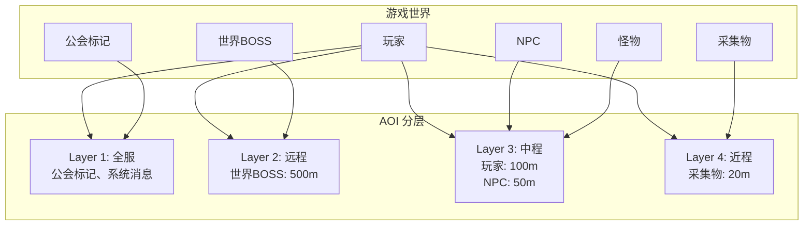
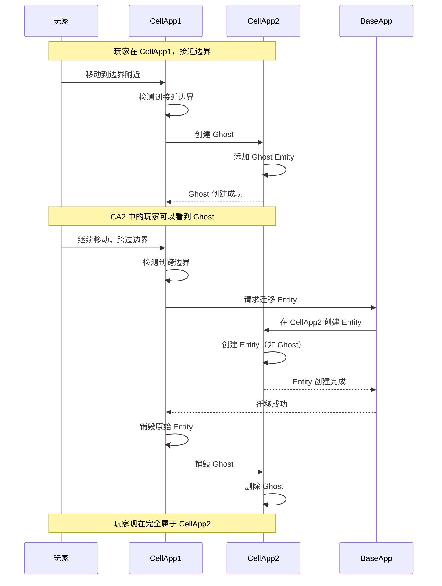

# Q3: 什么是 AOI（Area of Interest）？有哪些实现方式？各有什么优缺点？

## 问题分析

AOI（Area of Interest，兴趣区域/视野管理）是 MMORPG 中至关重要的技术：
- 决定玩家能看到哪些其他玩家/NPC
- 影响网络同步的范围
- 直接影响服务器性能

本题考察：
1. AOI 的概念和作用
2. 分层 AOI 设计
3. CellApp 中的 AOI 实现
4. CellApp 重叠部分的处理

---

## AOI 基本概念

### 什么是 AOI？

```
┌─────────────────────────────────────────────────────────────┐
│                        游戏世界                              │
│                                                              │
│        👁️                                                   │
│       ┌───┐                                                  │
│       │玩家│ ────► AOI 半径 100m                           │
│       └───┘                                                  │
│         ╱                                                  │
│        ╱ 100m                                              │
│       ╱                                                    │
│      ⚪️ ⚪️ ⚪️                                             │
│     (可见的玩家/NPC)                                        │
│                                                              │
│      🔴 🔴 🔴                                              │
│    (AOI 范围外，不可见)                                      │
└─────────────────────────────────────────────────────────────┘
```

**定义**：AOI 决定一个实体能够"感知"到哪些其他实体（看到、交互）。

### AOI 的作用

| 功能 | 说明 |
|------|------|
| **视野管理** | 决定玩家能看到哪些其他玩家/NPC |
| **消息广播** | 只向 AOI 内的玩家广播消息 |
| **事件通知** | 进入/离开 AOI 时触发事件 |
| **性能优化** | 避免全局同步，减少网络开销 |

---

## 分层 AOI 设计

### 为什么需要分层？

不同类型的实体，需要不同的 AOI 范围：

| 实体类型 | AOI 半径 | 原因 |
|----------|----------|------|
| 玩家 | 100m | 需要看到周围玩家、NPC |
| NPC | 50m | 只需要与附近玩家交互 |
| 采集物 | 20m | 只有靠近才能采集 |
| 世界 BOSS | 500m | 需要被远处玩家看到 |
| 公会标记 | 全服 | 公会成员可见 |

### 分层 AOI 架构



### 分层 AOI 实现

```cpp
// 分层 AOI 设计
class LayeredAOI {
public:
    // 定义 AOI 层级
    enum Layer {
        LAYER_GLOBAL = 0,    // 全服范围（公会、世界BOSS）
        LAYER_REMOTE = 1,    // 远程范围（500m）
        LAYER_NORMAL = 2,    // 正常范围（100m）
        LAYER_NEARBY = 3,    // 近距离范围（20m）
        LAYER_COUNT
    };

    // 每层使用不同的数据结构
    struct LayerConfig {
        float viewRadius;           // 视野半径
        bool useGrid;               // 是否使用网格
        bool useTower;              // 是否使用兴趣索引
    };

    LayerConfig configs[LAYER_COUNT] = {
        {FLT_MAX, false, false},    // 全服：使用列表
        {500.0f,  true,  false},    // 远程：大网格
        {100.0f,  true,  true },    // 正常：网格 + 索引
        {20.0f,   true,  true }     // 近距离：小网格
    };

    // 实体可以属于多个层级
    struct EntityLayers {
        std::bitset<LAYER_COUNT> layers;
    };

    // 查询某个实体的可见实体
    std::vector<Entity*> queryVisible(Entity* entity) {
        std::vector<Entity*> result;
        auto& layers = getEntityLayers(entity);

        for (int i = 0; i < LAYER_COUNT; ++i) {
            if (layers.test(i)) {
                auto visible = queryInLayer(entity, i);
                result.insert(result.end(), visible.begin(), visible.end());
            }
        }

        return result;
    }
};
```

### 分层 AOI 的优势

| 优势 | 说明 |
|------|------|
| **性能优化** | 不同类型实体使用不同算法，避免一刀切 |
| **灵活配置** | 可以为每层独立配置视野范围 |
| **精确控制** | 重要事件（如世界BOSS）可以广播更远 |
| **减少冗余** | 采集物等小范围对象不需要全局同步 |

### 分层 AOI 不只是“半径不同”

很多人把分层 AOI 理解成“给不同对象配置不同可见半径”，这还不够。

真正工程上的分层，通常至少分成三层：

#### 1. 实体层分层

不同类型对象使用不同关注范围：

- 玩家：100m 左右
- 普通怪：30m 到 50m
- 采集物：10m 到 20m
- 世界事件/BOSS：300m 到 500m

#### 2. 算法层分层

不同层可以用不同空间索引：

- 近距离高频对象：九宫格/空间哈希
- 中距离常规对象：十字链表或网格
- 低频大范围对象：四叉树/R-Tree/全局索引

#### 3. 更新频率分层

不是所有 AOI 层都要每 tick 精确更新：

- 玩家移动层：高频更新
- 怪物感知层：中频更新
- 世界标记/大事件层：低频更新

### 一个更合理的分层 AOI 架构

```text
Layer 0: Global Layer
- 系统公告、公会标记、世界事件
- 查询方式：订阅列表 / 全局索引
- 更新频率：低

Layer 1: Long-range Layer
- 世界 BOSS、攻城器械、远距离可见目标
- 查询方式：四叉树 / R-Tree
- 更新频率：中低

Layer 2: Normal Gameplay Layer
- 玩家、怪物、可战斗对象
- 查询方式：九宫格 / 十字链表 / 空间哈希
- 更新频率：高

Layer 3: Near-interaction Layer
- 采集物、掉落物、交互点
- 查询方式：小网格 / 小半径邻域
- 更新频率：中
```

### 更完整的关键点

如果被问“为什么要分层 AOI”，更好的回答不是“因为半径不同”，而是：

1. 不同实体的可见需求不同
2. 不同实体的移动频率不同
3. 不同实体的广播价值不同
4. 不同实体适合的数据结构不同

也就是说，分层 AOI 的本质不是“多套半径”，而是“多套索引 + 多套更新策略 + 多套广播策略”。

---

## AOI 实现方式对比

### 1. 九宫格算法

```
┌─────────┬─────────┬─────────┬─────────┬─────────┐
│   (0,0) │   (1,0) │   (2,0) │   (3,0) │   (4,0) │
├─────────┼─────────┼─────────┼─────────┼─────────┤
│   (0,1) │   (1,1) │   (2,1) │   (3,1) │   (4,1) │
├─────────┼─────────┼─────────┼─────────┼─────────┤
│   (0,2) │   (1,2) │   (2,2) │   (3,2) │   (4,2) │
├─────────┼─────────┼─────────┼─────────┼─────────┤
│   (0,3) │   (1,3) │   (2,3) │   (3,3) │   (4,3) │
├─────────┼─────────┼─────────┼─────────┼─────────┤
│   (0,4) │   (1,4) │   (2,4) │   (3,4) │   (4,4) │
└─────────┴─────────┴─────────┴─────────┴─────────┘

玩家在 (2,2) 格子，视野覆盖周围 9 个格子：
  (1,1) (2,1) (3,1)
  (1,2) (2,2) (3,2)
  (1,3) (2,3) (3,3)
```

**实现代码**：
```cpp
class GridAOI {
    struct Grid {
        std::unordered_set<Entity*> entities;
    };

    // 网格大小 = AOI 半径
    const float GRID_SIZE = 100.0f;
    int gridWidth, gridHeight;
    std::vector<std::vector<Grid>> grids;

    // 获取实体所在格子
    std::pair<int, int> getGridPos(float x, float y) {
        return {
            (int)(x / GRID_SIZE),
            (int)(y / GRID_SIZE)
        };
    }

    // 获取九宫格范围内的实体
    std::vector<Entity*> getVisibleEntities(Entity* entity) {
        auto [gx, gy] = getGridPos(entity->x, entity->y);
        std::vector<Entity*> result;

        // 遍历九宫格
        for (int dy = -1; dy <= 1; ++dy) {
            for (int dx = -1; dx <= 1; ++dx) {
                int nx = gx + dx;
                int ny = gy + dy;
                if (isValidGrid(nx, ny)) {
                    auto& grid = grids[ny][nx];
                    result.insert(result.end(),
                               grid.entities.begin(),
                               grid.entities.end());
                }
            }
        }

        return result;
    }

    // 移动实体
    void onEntityMove(Entity* entity, float newX, float newY) {
        auto [oldGx, oldGy] = getGridPos(entity->x, entity->y);
        auto [newGx, newGy] = getGridPos(newX, newY);

        if (oldGx != newGx || oldGy != newGy) {
            // 跨格子移动
            removeFromGrid(entity, oldGx, oldGy);
            addToGrid(entity, newGx, newGy);

            // 检查九宫格变化，触发进入/离开事件
            checkAOIChange(entity, oldGx, oldGy, newGx, newGy);
        }
    }
};
```

### 2. 十字链表

```
         Y 轴链表
          │
    ┌───┬───┼───┬───┐
    │   │   │   │   │
    ├───┼───┼───┼───┤
    │   │ 👁️│   │   │
    ├───┼───┼───┼───┤
    │   │   │   │   │
    └───┴───┼───┴───┘
          │
         X 轴链表

每个实体维护:
- xPrev, xNext (X轴方向的前后节点)
- yPrev, yNext (Y轴方向的前后节点)
```

**实现代码**：
```cpp
class CrossListAOI {
    struct Node {
        Entity* entity;
        Node* xPrev = nullptr;
        Node* xNext = nullptr;
        Node* yPrev = nullptr;
        Node* yNext = nullptr;
    };

    std::unordered_map<EntityID, Node*> nodes;

    // 获取 X 轴方向的可见实体
    std::vector<Entity*> getXAxisVisible(Entity* entity, float range) {
        std::vector<Entity*> result;
        Node* node = nodes[entity->id];

        // 向 X 正方向查找
        Node* p = node->xNext;
        while (p && p->entity->x - entity->x <= range) {
            if (abs(p->entity->y - entity->y) <= range) {
                result.push_back(p->entity);
            }
            p = p->xNext;
        }

        // 向 X 负方向查找
        p = node->xPrev;
        while (p && entity->x - p->entity->x <= range) {
            if (abs(p->entity->y - entity->y) <= range) {
                result.push_back(p->entity);
            }
            p = p->xPrev;
        }

        return result;
    }
};
```

### 3. 空间哈希

```cpp
class SpatialHashAOI {
    // 使用哈希表而非二维数组
    struct SpatialHash {
        std::unordered_map<uint64_t, std::unordered_set<Entity*>> buckets;

        // 空间坐标转哈希键
        uint64_t hash(int gx, int gy) {
            return (uint64_t)gx << 32 | (uint32_t)gy;
        }
    };
};
```

### 4. 四叉树

四叉树适合二维地图中“局部密、整体稀”的场景。它的核心思想是：

- 一个区域里实体少，就保持叶子节点
- 一个区域里实体多，就继续拆成四个子区域
- 查询时只访问与视野范围相交的节点

#### 四叉树示意

```text
整个地图
┌───────────────────────────────┐
│               root            │
│   ┌───────────┬───────────┐   │
│   │ NW        │ NE        │   │
│   │     ┌─────┼─────┐     │   │
│   │     │细分 │细分 │     │   │
│   ├───────────┼───────────┤   │
│   │ SW        │ SE        │   │
│   └───────────┴───────────┘   │
└───────────────────────────────┘
```

#### 四叉树实现思路

```cpp
class QuadTreeAOI {
    struct Rect {
        float minX, minY, maxX, maxY;

        bool intersectsCircle(float x, float y, float radius) const;
        bool contains(float x, float y) const;
    };

    struct Node {
        Rect bounds;
        std::vector<Entity*> entities;
        std::unique_ptr<Node> nw;
        std::unique_ptr<Node> ne;
        std::unique_ptr<Node> sw;
        std::unique_ptr<Node> se;
        bool divided = false;
    };

public:
    std::vector<Entity*> queryCircle(float x, float y, float radius) {
        std::vector<Entity*> result;
        queryCircle(root_.get(), x, y, radius, result);
        return result;
    }

private:
    void queryCircle(Node* node, float x, float y, float radius,
                     std::vector<Entity*>& out) {
        if (node == nullptr || !node->bounds.intersectsCircle(x, y, radius)) {
            return;
        }

        for (auto* entity : node->entities) {
            if (distance(entity->x, entity->y, x, y) <= radius) {
                out.push_back(entity);
            }
        }

        if (!node->divided) {
            return;
        }

        queryCircle(node->nw.get(), x, y, radius, out);
        queryCircle(node->ne.get(), x, y, radius, out);
        queryCircle(node->sw.get(), x, y, radius, out);
        queryCircle(node->se.get(), x, y, radius, out);
    }

    std::unique_ptr<Node> root_;
};
```

#### 四叉树优缺点

| 维度 | 表现 |
|------|------|
| 优点 | 适合分布不均匀地图，热点区域可继续细分 |
| 优点 | 查询范围比固定大网格更精细 |
| 缺点 | 高频移动时，节点插入/删除/分裂/合并有维护成本 |
| 缺点 | 实现复杂度高于九宫格 |
| 缺点 | 对“超大半径查询”并不友好 |

#### 四叉树适用场景

- 大地图
- 实体分布明显不均匀
- 希望避免固定网格在热点区域过粗
- 但实体移动频率不能高到让树持续重构成为瓶颈

#### 实际使用时的关键判断

四叉树“能不能用”，关键不在于查询复杂度写成了 `O(log N)`，而在于：

- 你的实体是不是高频移动
- 你的地图是不是动态变化很大
- 你的热点区域是不是很密集

如果对象移动极高频，很多 MMO 实际上还是会优先选简单网格，而不是四叉树。

### 5. R-Tree

R-Tree 更适合做“矩形/包围盒”的空间索引，典型特点是：

- 节点维护多个最小外接矩形（MBR）
- 查询时根据矩形相交关系递归裁剪
- 天然适合矩形区域、范围查询、碰撞候选筛选

它在 GIS、地图检索、矩形对象管理里非常常见。

#### 为什么 MMO 里有时会提到 R-Tree

因为 MMO 里有不少对象不是“一个点”：

- 建筑
- 城墙
- 大型怪物
- 触发区
- 安全区 / 禁战区
- 采集区 / 任务区域

这些对象更像“区域”，而不是点坐标。R-Tree 处理这类数据会比普通点网格更自然。

#### R-Tree 示例

```cpp
class RTreeAOI {
    struct AABB {
        float minX, minY, maxX, maxY;
    };

    struct Entry {
        AABB box;
        Entity* entity;
    };

public:
    void insert(Entity* entity, const AABB& box) {
        // 插入到最合适的叶子，必要时分裂节点
    }

    std::vector<Entity*> queryRange(const AABB& range) {
        std::vector<Entity*> result;
        // 遍历与 range 相交的节点
        return result;
    }
};
```

#### R-Tree 优缺点

| 维度 | 表现 |
|------|------|
| 优点 | 非常适合矩形范围查询、区域对象管理 |
| 优点 | 对复杂地形块、建筑块、触发区比较自然 |
| 缺点 | 实现和维护复杂度高 |
| 缺点 | 高频移动点对象未必比网格更划算 |
| 缺点 | 在玩家/NPC 这种大量移动点对象场景下，常常不是首选 |

#### R-Tree 在 MMO 中更适合做什么

更合理的定位通常不是“主 AOI 算法”，而是：

- 地图静态区域索引
- 建筑/障碍物/安全区索引
- 大型矩形触发器检索
- 低频更新的大对象检索

也就是说，R-Tree 往往是“辅助空间索引”，而不一定是“玩家视野主索引”。

### 对比总结

| 算法 | 查询特点 | 更新成本 | 更适合的场景 |
|------|----------|----------|----------------|
| **九宫格** | 常数级邻域查询 | 低 | 玩家/NPC 高频移动，规则地图 |
| **十字链表** | 适合按坐标有序裁剪 | 中 | 稀疏分布，要求较精细的邻域筛选 |
| **空间哈希** | 平均 O(1) | 低 | 无限地图、动态区域、哈希桶方案 |
| **四叉树** | 区域裁剪较强 | 中高 | 分布不均匀的二维地图 |
| **R-Tree** | 矩形范围检索强 | 中高 | 区域对象、建筑、触发区、大对象 |

### 实战里的一个常见结论

很多 MMO 最终不会“只选一种 AOI”。

更常见的是混合方案：

- 玩家/NPC：九宫格或空间哈希
- 大型静态区域：R-Tree
- 非均匀热点区域：四叉树或动态分块
- 跨 Cell 边界对象：Ghost / Shadow

所以更成熟的回答通常不是“最优算法是哪一个”，而是：

> 主流程用最稳定、更新成本最低的结构，复杂对象和特殊查询交给辅助索引处理。

---

## CellApp 中的 AOI

### CellApp 中的 AOI 职责

```
┌─────────────────────────────────────────────────────────────┐
│                        CellApp                              │
│  ┌──────────────────────────────────────────────────────┐  │
│  │                    AOI Manager                         │  │
│  │  ├── 管理本 Cell 内的所有 Entity                       │  │
│  │  ├── 检测 Entity 之间的可见关系                         │  │
│  │  ├── 触发进入/离开事件                                 │  │
│  │  └── 维护 Ghost Entity（跨边界）                       │  │
│  └──────────────────────────────────────────────────────┘  │
└─────────────────────────────────────────────────────────────┘
```

### CellApp AOI 实现

```cpp
class CellAppAOI {
    // 本 Cell 的 AOI 管理
    GridAOI localAOI;

    // Ghost 管理：跨边界的 Entity
    struct GhostEntity {
        Entity* original;       // 原始 Entity（在其他 Cell）
        Entity* ghost;          // 本 Cell 的只读拷贝
        CellApp* owner;         // 所属 CellApp
    };
    std::unordered_map<EntityID, GhostEntity> ghosts;

    // 获取玩家可见的所有 Entity
    std::vector<Entity*> getVisibleEntities(Player* player) {
        std::vector<Entity*> result;

        // 1. 本 Cell 内的可见 Entity
        auto local = localAOI.getVisibleEntities(player);
        result.insert(result.end(), local.begin(), local.end());

        // 2. 来自相邻 Cell 的 Ghost Entity
        for (auto& [id, ghost] : ghosts) {
            if (isInAOI(player, ghost.ghost)) {
                result.push_back(ghost.ghost);
            }
        }

        return result;
    }

    // 当玩家移动时
    void onPlayerMove(Player* player, float newX, float newY) {
        // 1. 更新本 Cell AOI
        auto oldVisible = localAOI.getVisibleEntities(player);
        localAOI.updatePosition(player, newX, newY);
        auto newVisible = localAOI.getVisibleEntities(player);

        // 2. 计算差异
        auto entered = difference(newVisible, oldVisible);
        auto left = difference(oldVisible, newVisible);

        // 3. 触发事件
        for (auto* e : entered) {
            player->onEnterAOI(e);
            e->onEnterAOI(player);
        }
        for (auto* e : left) {
            player->onLeaveAOI(e);
            e->onLeaveAOI(player);
        }

        // 4. 检查是否跨 CellApp 边界
        if (isCrossCellAppBoundary(newX, newY)) {
            handleCrossCellApp(player);
        }
    }
};
```

---

## CellApp 重叠部分的处理

### 问题：边界处的 Entity

```
┌─────────────────────────────────────────────────────────────┐
│                     CellApp 1 区域                          │
│  ┌────────────────────────────────────┐                     │
│  │                                    │     ┌──────────────┐│
│  │        👁️ 玩家在边界处            │◄────┤ CellApp 2    ││
│  │                                    │     │              ││
│  └────────────────────────────────────┘     │              ││
│                                           │              ││
│                                           └──────────────┘│
│                                            CellApp 2 区域  │
└─────────────────────────────────────────────────────────────┘

问题：
1. 玩家应该属于哪个 CellApp？
2. 两个 CellApp 中的玩家能否互相看到？
3. 玩家跨边界移动时如何处理？
```

### 解决方案：Ghost 机制

#### 什么是 Ghost？

```
正常情况：
┌─────────────────┐         ┌─────────────────┐
│   CellApp 1     │         │   CellApp 2     │
│  ┌───────────┐  │         │  ┌───────────┐  │
│  │ Entity A  │  │         │  │ Entity B  │  │
│  └───────────┘  │         │  └───────────┘  │
└─────────────────┘         └─────────────────┘
      各自管理各自的 Entity

边界情况：
┌─────────────────┐         ┌─────────────────┐
│   CellApp 1     │         │   CellApp 2     │
│  ┌───────────┐  │   Ghost │  ┌───────────┐  │
│  │ Entity A  │  │◄───────►│  │Ghost A    │  │
│  │ (主实体)  │  │  (只读)  │  │ (只读拷贝)│  │
│  └───────────┘  │         │  └───────────┘  │
└─────────────────┘         └─────────────────┘

同步：
- CellApp 1 的 Entity A 数据变化 → 同步到 CellApp 2 的 Ghost A
- CellApp 2 的玩家可以看到 Ghost A
- 对 CellApp 2 的玩家来说，Ghost A 是只读的
```

#### Ghost 实现代码

```cpp
class GhostManager {
    // Ghost 管理
    struct GhostData {
        EntityID originalId;       // 原始 Entity ID
        Entity* ghost;             // 本 Cell 的只读拷贝
        CellApp* sourceCellApp;    // 来源 CellApp
        Vector3 lastPosition;      // 最后同步的位置
        uint64_t lastSyncTime;     // 最后同步时间
    };

    std::unordered_map<EntityID, GhostData> ghosts;

    // 创建 Ghost
    void createGhost(Entity* original, CellApp* targetCellApp) {
        GhostData ghost;
        ghost.originalId = original->id;
        ghost.sourceCellApp = original->ownerCellApp;
        ghost.lastPosition = original->position;
        ghost.lastSyncTime = now();

        // 创建只读拷贝
        ghost.ghost = new Entity();
        ghost.ghost->id = original->id;
        ghost.ghost->position = original->position;
        ghost.ghost->isGhost = true;
        ghost.ghost->readonly = true;

        ghosts[original->id] = ghost;

        // 通知目标 CellApp 创建 Ghost
        targetCellApp->addGhost(ghost.ghost);
    }

    // 同步 Ghost 数据
    void syncGhost(Entity* original) {
        auto it = ghosts.find(original->id);
        if (it == ghosts.end()) return;

        auto& ghost = it->second;

        // 同步关键数据
        ghost.ghost->position = original->position;
        ghost.ghost->rotation = original->rotation;
        ghost.ghost->health = original->health;
        ghost.ghost->mana = original->mana;

        // ... 其他需要同步的数据

        ghost.lastSyncTime = now();
    }

    // 检测边界并创建 Ghost
    void checkBoundaryAndCreateGhost(Entity* entity) {
        float boundaryMargin = entity->aoiRadius;

        // 检查是否接近边界
        if (isNearBoundary(entity, boundaryMargin)) {
            // 获取相邻的 CellApp
            auto neighbors = getNeighborCellApps(entity->position);

            for (auto* neighbor : neighbors) {
                EntityID id = entity->id;
                // 如果该 CellApp 没有这个 Entity 的 Ghost
                if (!neighbor->hasGhost(id)) {
                    createGhost(entity, neighbor);
                }
            }
        }
    }
};
```

#### 跨边界移动处理



#### 边界判断算法

```cpp
class BoundaryManager {
    struct CellBoundary {
        float minX, maxX;
        float minY, maxY;
        CellApp* owner;
        CellApp* neighbor;  // 相邻的 CellApp（如果有）
    };

    std::vector<CellBoundary> boundaries;

    // 判断是否接近边界
    bool isNearBoundary(Entity* entity, float margin) {
        auto* cell = entity->ownerCell;
        auto bounds = getCellBounds(cell);

        return (entity->x - bounds.minX < margin ||
                bounds.maxX - entity->x < margin ||
                entity->y - bounds.minY < margin ||
                bounds.maxY - entity->y < margin);
    }

    // 判断是否跨过边界
    bool isCrossBoundary(Entity* entity, float newX, float newY) {
        auto* cell = entity->ownerCell;
        auto bounds = getCellBounds(cell);

        // 超出当前 Cell 的边界
        return (newX < bounds.minX || newX > bounds.maxX ||
                newY < bounds.minY || newY > bounds.maxY);
    }

    // 获取目标 CellApp
    CellApp* getTargetCellApp(float x, float y) {
        for (auto& boundary : boundaries) {
            if (x >= boundary.minX && x <= boundary.maxX &&
                y >= boundary.minY && y <= boundary.maxY) {
                return boundary.owner;
            }
        }
        return nullptr;
    }
};
```

---

## 性能优化

### 1. 分帧处理

```cpp
class AOIOptimizer {
    // 不要每帧都检测所有 Entity
    void update() {
        // 分帧处理 Entity 移动
        int batchSize = entities.size() / 10;
        int start = (frameCount % 10) * batchSize;

        for (int i = start; i < start + batchSize && i < entities.size(); ++i) {
            checkAndUpdateAOI(entities[i]);
        }

        frameCount++;
    }
};
```

### 2. 空间索引

```cpp
// 使用 R-Tree 或四叉树加速空间查询
class IndexedAOI {
    RTree rtree;

    std::vector<Entity*> query(float x, float y, float radius) {
        return rtree.queryCircle(x, y, radius);
    }
};
```

### 3. 事件合并

```cpp
// 不要每个移动都发送事件，批量处理
class EventBatcher {
    struct PendingEvent {
        Entity* entity;
        EntityType type;
        std::vector<Entity*> entered;
        std::vector<Entity*> left;
    };

    std::vector<PendingEvent> pendingEvents;

    void flush() {
        for (auto& event : pendingEvents) {
            sendAOIChangeEvent(event);
        }
        pendingEvents.clear();
    }
};
```

---

## 参考资料

- [BigWorld AOI 系统设计](https://blog.csdn.net/monokai/article/details/151142091)
- [MMO 游戏服务器 AOI 实现对比](https://zhuanlan.zhihu.com/p/432778921)
- [九宫格 AOI 算法详解](https://blog.csdn.net/u014417568/article/details/84635472)
