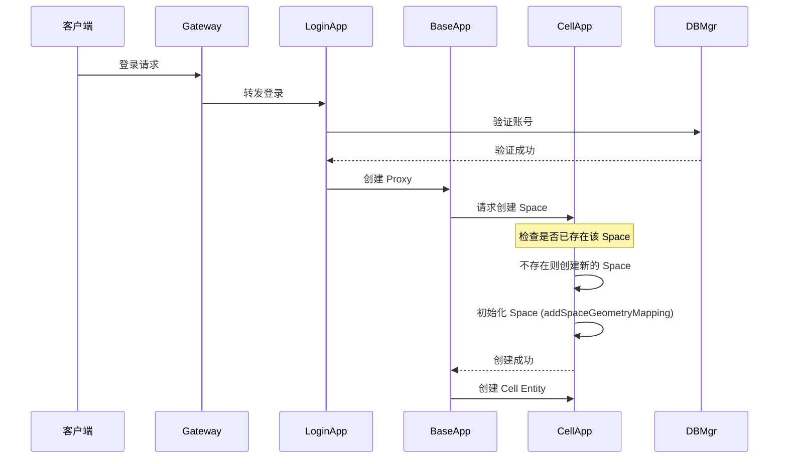

# Q30: KBEngine 的 Space 是什么？与物理空间划分有什么区别？

## 问题分析

本题考察对 **KBEngine Space 概念** 的准确理解：
- Space 的真实定义和作用
- Space 与物理坐标的关系
- Space 与 CoordinateSystem 的区别
- 多 Space 管理机制

---

## 一、Space 的真实定义

### 官方定义

根据 [KBEngine Lab 官方文档](https://www.kbelab.com/guide/space/)：

> **Space 是一个抽象概念，只存在于 CellApp 的内存中**
>
> Space 的具体含义由用户定义，可以是：
> - 一个游戏场景（如新手村、主城）
> - 一个副本实例（如地下城）
> - 一个房间（如战场房间）
> - 任何逻辑上的空间分组

### 关键特性

| 特性 | 说明 |
|------|------|
| **抽象概念** | Space 不是物理空间划分，是逻辑分组 |
| **内存存在** | 只存在于 CellApp 内存，不持久化 |
| **用户定义** | 开发者决定 Space 的含义 |
| **独立管理** | 每个 Space 独立管理其中的 Entity |
| **多 Space** | 一个 CellApp 可以有多个 Space |

### 源码证据

根据 [KBEngine 源码分析](https://blog.csdn.net/kbengine/article/details/78327185)：

```python
# spaces.py - KBEngine 默认脚本
def initAlloc():
    """
    创建 Space 实体的示例
    """
    # 创建不同类型的 Space
    createSpace("Newbie", "SpaceNewbie")     # 新手村
    createSpace("MainCity", "SpaceCity")      # 主城
    createSpace("Dungeon", "SpaceDungeon")    # 副本
```

```cpp
// space.h 核心定义
class Space : public Entity {
public:
    // Space 是一种特殊的 Entity
    // 由 CellApp 管理，不直接暴露给客户端

    // 几何映射（用于导航、寻路）
    bool addSpaceGeometryMapping(const std::string& path);

    // Space 边界（用于物理检测，不是空间划分）
    void setBounds(const AABB& bounds);
};
```

---

## 二、Space vs 物理空间划分

### 常见误解

```
误解：CellApp 按物理坐标划分空间

┌─────────────────────────────────────────────────────────────┐
│                    错误的理解                                │
│                                                             │
│   CellApp1                    CellApp2                       │
│   ┌────────────┐              ┌────────────┐                 │
│   │ X: [0,256)  │              │ X: [256,512) │                │
│   │ Z: [0,256)  │              │ Z: [0,256)  │                 │
│   │            │              │            │                 │
│   │ 固定物理区域│              │ 固定物理区域│                 │
│   └────────────┘              └────────────┘                 │
│                                                             │
│   ✗ 这不是 KBEngine 的设计                                  │
└─────────────────────────────────────────────────────────────┘
```

### KBEngine 的实际设计

```
实际情况：CellApp 包含多个逻辑 Space

┌─────────────────────────────────────────────────────────────┐
│                      CellApp                                │
│                                                             │
│  ┌─────────────┐  ┌─────────────┐  ┌─────────────┐        │
│  │  Space A    │  │  Space B    │  │  Space C    │        │
│  │  (新手村)    │  │  (副本1)    │  │  (副本2)    │        │
│  │             │  │             │  │             │        │
│  │ Entity1-100 │  │ Entity101-150│  │ Entity151-200│       │
│  │             │  │             │  │             │        │
│  │ 独立 AOI    │  │ 独立 AOI    │  │ 独立 AOI    │        │
│  └─────────────┘  └─────────────┘  └─────────────┘        │
│                                                             │
│  ┌─────────────────────────────────────────────────────┐   │
│  │              CoordinateSystem                        │   │
│  │        (用于所有 Space 的 AOI 计算)                  │   │
│  └─────────────────────────────────────────────────────┘   │
│                                                             │
└─────────────────────────────────────────────────────────────┘

✓ Space 是逻辑分组，不是物理区域划分
✓ 一个 CellApp 可以有多个 Space
✓ 每个 Space 独立管理 Entity 和 AOI
```

---

## 三、Space 与 CoordinateSystem 的区别

这是两个完全不同的概念：

### 对比表

| 维度 | Space | CoordinateSystem |
|------|-------|------------------|
| **用途** | 逻辑分组（副本/场景） | AOI 计算 |
| **数量** | 一个 CellApp 多个 | 一个 CellApp 一个 |
| **源码** | space.cpp/h | coordinate_system.cpp/h |
| **坐标** | 可以有独立坐标系 | 3D 世界坐标系统 |
| **持久化** | 不持久化，重启消失 | 不持久化 |
| **客户端** | 客户端不知道 Space | 客户端感知 AOI |

### CoordinateSystem 的实际作用

根据 [coordinate_system.cpp 源码](https://github.com/kbengine/kbengine/blob/master/kbe/src/server/cellapp/coordinate_system.cpp)：

```cpp
// CoordinateSystem 用于 AOI (感兴趣区域) 管理
class CoordinateSystem {
public:
    // 插入节点（Entity 进入世界）
    bool insert(CoordinateNode* pNode);

    // 更新节点位置
    void update(CoordinateNode* pNode);

    // XYZ 轴独立移动
    void moveNodeX(CoordinateNode* pNode, float px, CoordinateNode* pCurrNode);
    void moveNodeY(CoordinateNode* pNode, float py, CoordinateNode* pCurrNode);
    void moveNodeZ(CoordinateNode* pNode, float pz, CoordinateNode* pCurrNode);

private:
    // 使用分层空间划分算法（类似八叉树）
    // 用于快速查找附近的 Entity
    SpaceNodes _spaceNodes;
};

// CoordinateNode 是每个 Entity 在 AOI 系统中的节点
class CoordinateNode {
    Position3D pos;      // 3D 坐标
    Entity* pEntity;     // 关联的 Entity
    float viewRadius;    // 感知半径
};
```

**CoordinateSystem 不负责 Space 划分**，它负责：
- Entity 在 3D 世界中的位置管理
- AOI 计算（查找附近的 Entity）
- 进入/离开视野事件

---

## 四、Space 的创建和管理

### Space 创建流程



### Space 负载均衡

根据 [KBEngine Lab - 负载均衡文档](https://www.kbelab.com/guide/space/howtos/balance.html)：

```
Space 创建的负载均衡策略：

1. 默认：CellAppMgr 自动选择负载最低的 CellApp
   ┌─────────────────────────────────────────────────────────────┐
│   CellAppMgr 选择逻辑：                                          │
│   ┌─────────────────────────────────────────────────────────┐  │
│   │ 遍历所有 CellApp，选择：                                   │  │
│   │ 1. 负载最低的（Entity 数量最少）                           │  │
│   │ 2. 或者已经存在该 Space 的（复用）                         │  │
│   └─────────────────────────────────────────────────────────┘  │
└─────────────────────────────────────────────────────────────┘

2. 指定：创建到特定 CellApp
   // 脚本配置
   KBEngine.setAppFlags(KBEngine.APP_FLAGS_NOT_PARTicipate_BALANCE)

   // 这样配置的 CellApp 不会参与自动负载均衡
   // 只能显式指定 Space 创建到上面
```

### 指定 Space 到特定 CellApp

根据 [KBEngine Lab - 指定 Space 文档](https://www.kbelab.com/guide/space/howtos/target.html)：

```python
# 配置不参与负载均衡
# kbengine_defs.xml
<cellapp>
    <address>                            # 内网地址
        <internalHost>192.168.1.10</internalHost>
        <externalAddress>                # 外网地址(如果有)
            <externalHost>1.2.3.4</externalHost>
        </externalAddress>
        <port>20013</port>
    </address>
    # 不参与负载均衡
    <flags>0x00000010</flags>            # APP_FLAGS_NOT_PARTicipate_BALANCE
</cellapp>

# 脚本中显式指定
KBEngine.createEntityAnywhere(
    "Space",
    spaceID,
    {"cellapp": specifiedCellAppID}  # 指定 CellApp
)
```

---

## 五、Space 的边界管理

### Space 边界 vs 物理边界

```cpp
// space.h 中的边界定义
class Space {
public:
    // 设置几何边界（用于物理检测）
    void setBounds(const AABB& bounds) {
        bounds_ = bounds;
    }

    // 添加几何映射（导航网格）
    bool addSpaceGeometryMapping(const std::string& path) {
        // 加载导航网格文件
        return loadNavigationMesh(path);
    }

private:
    AABB bounds_;  // 轴对齐包围盒
    // 用于：
    // 1. 物理碰撞检测
    // 2. 寻路限制
    // 3. 不是用于 Space 划分！
};
```

### 边界的用途

```
Space 边界的实际用途：

┌─────────────────────────────────────────────────────────────┐
│                                                             │
│  AABB (Axis-Aligned Bounding Box)                            │
│  ┌─────────────────────────────────────────────────────┐    │
│  │                                                     │    │
│  │    Space Bounds (用于物理检测)                      │    │
│  │    ┌───────────────────────────────────┐            │    │
│  │    │  导航网格 (Navigation Mesh)       │            │    │
│  │    │                                   │            │    │
│  │    │  [可行走区域]                     │            │    │
│  │    │                                   │            │    │
│  │    └───────────────────────────────────┘            │    │
│  │                                                     │    │
│  └─────────────────────────────────────────────────────┘    │
│                                                             │
│  用途：                                                      │
│  1. 物理碰撞检测 - Entity 是否超出边界                       │
│  2. 寻路限制 - AI 只在边界内移动                              │
│  3. 不用于 Space 划分！                                      │
│                                                             │
└─────────────────────────────────────────────────────────────┘
```

---

## 六、多 Space 管理

### 一个 CellApp 多 Space 示例

```
CellApp 上的实际 Space 分布：

CellApp (进程 ID: 1234)
│
├── Space 1: "Newbie_Village_001"
│   ├── Entity: Player_1 (玩家)
│   ├── Entity: Player_2 (玩家)
│   ├── Entity: NPC_Guard_1 (NPC)
│   ├── Entity: NPC_Guard_2 (NPC)
│   └── CoordinateNode 链表 (AOI)
│
├── Space 2: "Dungeon_Fire_001" (副本实例)
│   ├── Entity: Player_3 (玩家)
│   ├── Entity: Player_4 (玩家)
│   ├── Entity: Boss_Fire_Dragon (Boss)
│   └── CoordinateNode 链表 (AOI)
│
├── Space 3: "BattleGround_Arena_001"
│   ├── Entity: Player_5 (队伍A)
│   ├── Entity: Player_6 (队伍A)
│   ├── Entity: Player_7 (队伍B)
│   └── CoordinateNode 链表 (AOI)
│
└── CoordinateSystem (全局，管理所有 Entity 的 AOI)

每个 Space 的 Entity 是隔离的，不同 Space 之间不会产生 AOI 事件
```

### Space 之间 Entity 迁移

```
玩家从一个 Space 移动到另一个 Space：

┌─────────────────────────────────────────────────────────────┐
│                                                             │
│  Space A (新手村)                    Space B (主城)           │
│  ┌─────────────────┐                ┌─────────────────┐     │
│  │ Player_1        │     传送       │ Player_1        │     │
│  │                 │ ─────────────► │                 │     │
│  │ x=100, y=0, z=50│                 │ x=500, y=0, z=500│     │
│  └─────────────────┘                └─────────────────┘     │
│                                                             │
│  迁移方式：                                                  │
│  1. 客户端请求切换 Space（如进入副本入口）                   │
│  2. 旧 Space 销毁玩家的 Entity                               │
│  3. 新 Space 创建玩家的 Entity                                │
│  4. 位置重置到新 Space 的入口点                               │
│                                                             │
│  注意：不是自动的物理边界迁移！需要脚本控制                    │
│                                                             │
└─────────────────────────────────────────────────────────────┘
```

---

## 七、与物理空间划分的对比

### 不同引擎的 Space 概念

| 引擎 | Space 概念 | 物理空间划分 |
|------|------------|-------------|
| **KBEngine** | 逻辑分组（副本/场景） | 不划分，全 3D 世界 |
| **BigWorld** | 逻辑分组 | CellApp 按物理空间划分 |
| **Unreal Server** | Level/World | 不划分 |
| **自定义** | 可自定义 | 可自定义 |

### KBEngine 的选择

```
KBEngine 为什么不用物理空间划分？

优点：
✓ 简化架构 - 不需要复杂的边界管理
✓ 灵活的副本系统 - Space 可以动态创建/销毁
✓ 负载均衡简单 - 按 Space 数量而非位置分配

缺点：
✗ 单 CellApp 内存上限 - 所有 Space 在同一进程
✗ 不支持超大世界 - 需要手动分割 Space
✗ 跨 Space 交互复杂 - 需要特殊处理
```

---

## 八、实际应用示例

### 场景：MMO 的多 Space 管理

```python
# 场景脚本示例

# 1. 主城 Space（固定，持久）
class SpaceCity(Space):
    def __init__(self):
        Space.__init__(self)
        # 设置城市边界
        self.setBounds({
            "minX": -500, "maxX": 500,
            "minY": -100, "maxY": 100,
            "minZ": -500, "maxZ": 500
        })
        # 加载导航网格
        self.addSpaceGeometryMapping("spaces/city/navmesh")

# 2. 副本 Space（动态创建/销毁）
class SpaceDungeon(Space):
    def __init__(self, dungeonID):
        Space.__init__(self)
        self.dungeonID = dungeonID
        self.addSpaceGeometryMapping(f"spaces/dungeon{dungeonID}/navmesh")

        # 副本结束条件
        self.registerTimePeriod(1, 0, self.checkTimeout)

    def checkTimeout(self):
        if len(self.players) == 0:
            # 无玩家时销毁副本
            self.destroy()

# 3. 战场 Space（限时）
class SpaceBattle(Space):
    def __init__(self, battleID, duration=1800):
        Space.__init__(self)
        self.battleID = battleID
        self.addSpaceGeometryMapping(f"spaces/battle/navmesh")

        # 倒计时销毁
        self.registerTimePeriod(duration, 0, self.endBattle)

    def endBattle(self):
        # 战场结束，统计结果
        self.calculateScore()
        # 传送所有玩家回主城
        for player in self.players:
            player.teleport("SpaceCity", 100, 0, 100)
        # 销毁战场
        self.destroy()
```

---

## 九、常见问题

### Q1: Entity 如何跨 Space 移动？

```
不是自动的！需要脚本控制：

方法 1: 传送门
def onEnter(self, entity):
    # 从主城传送到副本
    entity.teleport(
        "SpaceDungeon",    # 目标 Space
        100, 0, 100,       # 目标位置
        {}                 # 额外数据
    )

方法 2: 脚本直接调用
entity.moveToSpace(spaceID, position)
```

### Q2: 不同 Space 的 Entity 能交互吗？

```
默认不能！

不同 Space 的 Entity 互不可见，不会产生 AOI 事件。

如果需要跨 Space 交互：
1. 使用聊天系统（BaseApp 层）
2. 使用全局广播（BaseApp 转发）
3. 使用特殊机制（如跨服战场）
```

### Q3: CoordinateSystem 是全局的还是每个 Space 独立？

```
CoordinateSystem 是 CellApp 全局的！

但 AOI 计算会考虑 Space 隔离：
- 不同 Space 的 Entity 不会互相触发 AOI
- 同一 Space 的 Entity 才会触发 AOI

这通过 SpaceID 过滤实现。
```

---

## 十、参考资料

- [KBEngine Lab - Space 空间](https://www.kbelab.com/guide/space/)
- [KBEngine Lab - 负载均衡](https://www.kbelab.com/guide/space/howtos/balance.html)
- [KBEngine Lab - 指定 Space](https://www.kbelab.com/guide/space/howtos/target.html)
- [KBEngine 源码分析笔记](https://blog.csdn.net/kbengine/article/details/78327185)
- [KBEngine 源码：Space 空间](https://www.cnblogs.com/losophy/p/9575792.html)
- [KBEngine GitHub - space.cpp](https://github.com/kbengine/kbengine/blob/master/kbe/src/server/cellapp/space.cpp)
- [KBEngine GitHub - coordinate_system.cpp](https://github.com/kbengine/kbengine/blob/master/kbe/src/server/cellapp/coordinate_system.cpp)
