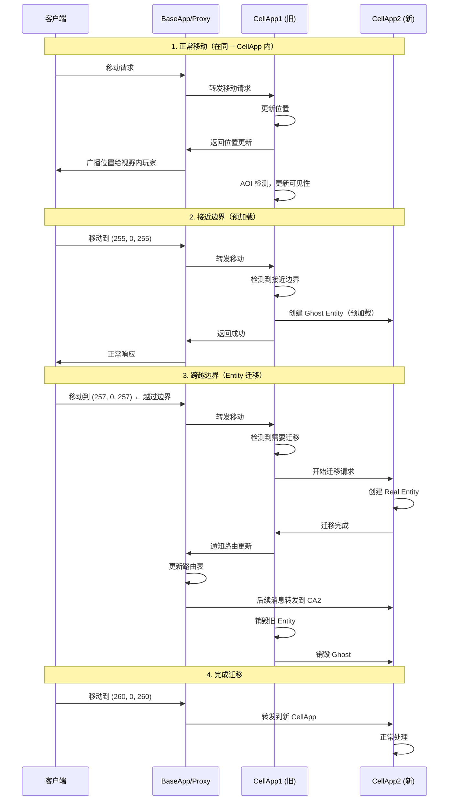

# Q4: 如何实现大地图的无缝切换？如何处理跨服务器的玩家移动？

## 问题分析

本题考察大世界 MMORPG 的 **无缝世界设计**：
- 大地图的无缝切换机制
- 跨 CellApp 的玩家移动处理
- 边界过渡的用户体验优化

---

## 一、大地图无缝切换的概念

### 什么是无缝切换

```
非无缝 vs 无缝：

┌─────────────────────────────────────────────────────────────┐
│  非无缝切换（传统方式）                                        │
│                                                             │
│  ┌─────────┐        ┌─────────┐                                 │
│  │ 地图 A   │        │  地图 B   │                                 │
│  │         │        │         │                                 │
│  │  玩家   │        │  野外   │                                 │
│  └────┬────┘        └────┬────┘                                 │
│       │                  │                                     │
│   传送门 ◄───────────────►                                     │
│                                                             │
│  体验问题：                                                   │
│  - 需要点击传送门/读取进入                                     │
│  - 有加载画面（黑屏几秒）                                     │
│  - 世界不连贯                                                │
│                                                             │
└─────────────────────────────────────────────────────────────┘

┌─────────────────────────────────────────────────────────────┐
│  无缝切换（大世界方式）                                        │
│                                                             │
│    ┌─────────────────────────────────────────┐              │
│    │         一个连续的大世界地图                  │              │
│    │                                             │              │
│    │  新手村    主城    野外    副本            │              │
│    │    │       │       │       │                │              │
│    │    └───────┴───────┴───────┴────────►        │              │
│    │              玩家可以无缝走到任何地方          │              │
│    │              没有加载画面                    │              │
│    │              世界是连续的                      │              │
│    └─────────────────────────────────────────┘              │
│                                                             │
│  体验优势：                                                   │
│  - 自由探索，无需传送                                            │
│  - 世界连贯，沉浸感强                                          │
│  - 支持动态扩容                                                │
│                                                             │
└─────────────────────────────────────────────────────────────┘
```

### 技术挑战

| 挑战 | 说明 |
|------|------|
| **空间划分** | 如何将大地图划分到多个 CellApp |
| **边界处理** | 玩家跨越 CellApp 边界时的过渡 |
| **Entity 迁移** | 如何无缝迁移 Entity 到新 CellApp |
| **状态同步** | 如何保证迁移期间状态一致性 |
| **客户端感知** | 如何让客户端无感知 |

---

## 二、空间划分策略

### 单一大地图 vs 多地图

```
传统多地图（魔兽世界早期设计）：
┌─────────────────────────────────────────────────────────────┐
│                                                             │
│   LoginScreen → 选择角色 → 进入主城 → 传送副本 → 传送回城    │
│                                                             │
│  每个地图是独立的实例：                                       │
│  - 主城地图 = 一个或多个 CellApp（固定）                        │
│  - 副本地图 = 动态创建的 Space，可以是任意 CellApp                │
│  - 野外地图 = 一个或多个 CellApp（固定）                        │
│                                                             │
│  缺点：世界不连贯，需要传送                                      │
│                                                             │
└─────────────────────────────────────────────────────────────┘

无缝大世界（Black Desert / Ark 等）：
┌─────────────────────────────────────────────────────────────┐
│                                                             │
│   一个连续的大世界地图                                         │
│                                                             │
│  ┌─────────────────────────────────────────────────────────┐   │
│  │                                                         │   │
│  │   新手村 ─────► 主城 ─────► 野外 ─────► 副本               │   │
│  │     │           │          │          │                   │   │
│  │     │           │          │          │                   │   │
│  │     └───────────┴──────────┴──────────┘                   │   │
│  │                                                         │   │
│  └─────────────────────────────────────────────────────────┘   │
│                                                             │
│  地图被划分为多个 CellApp 管理：                               │
│  - CellApp1: 新手村 + 主城                                     │
│  - CellApp2: 野外西区                                           │
│  - CellApp3: 野外东区                                           │
│  - CellApp4: 副本区                                             │
│                                                             │
│  玩家可以无缝在这些区域间移动                                  │
│                                                             │
└─────────────────────────────────────────────────────────────┘
```

### CellApp 空间划分方案

**方案 1：固定区域划分**

```
大地图按区域划分给 CellApp：

┌─────────────────────────────────────────────────────────────┐
│                      大地图 (5120x5120)                         │
│                                                             │
│   ┌────────────┬────────────┬────────────┬────────────┐            │
│   │CellApp1    │CellApp2    │CellApp3    │CellApp4    │            │
│   │新手村+主城  │野外西区    │野外东区    │副本区      │            │
│   │1280x1280  │1280x1280  │1280x1280  │1280x1280  │            │
│   └────────────┴────────────┴────────────┴────────────┘            │
│                                                             │
│  优点：区域固定，配置简单                                      │
│  缺点：某些区域过载，其他区域空闲（负载不均）                   │
│                                                             │
└─────────────────────────────────────────────────────────────┘
```

**方案 2：动态负载均衡**

```
根据负载动态调整边界：

初始状态：
┌───────────────┬───────────────┐
│ CellApp1     │ CellApp2     │
│ 负载: 60%    │ 负载: 40%    │
│ 60% 地图     │ 40% 地图     │
└───────────────┴───────────────┘

主城玩家增多：
┌───────────────┬───────────────┐
│ CellApp1     │ CellApp2     │
│ 负载: 95% ★   │ 负载: 30%    │
│ 80% 地图     │ 20% 地图     │
└───────────────┴───────────────┘
        │ 调整
        ▼
┌───────────────┬───────────────┐
│ CellApp1     │ CellApp2     │
│ 负载: 75%    │ �载: 50%    │
│ 70% 地板 ▲    │ 30% 地板 ▲    │
└───────────────┴───────────────┘

边界移动 → Entity 迁移
```

---

## 三、跨 CellApp 玩家移动流程

### 核心机制



### 边界检测算法

```cpp
class CellApp {
private:
    SpaceBounds bounds_;  // 自己的空间边界

public:
    // 检查是否需要迁移
    MigrationCheck checkMigration(Entity* entity) {
        Position pos = entity->getPosition();

        // 已离开当前空间
        if (!bounds_.contains(pos.x, pos.z)) {
            // 找到目标 CellApp
            CellApp* target = findTargetCellApp(pos);
            if (target) {
                return Migrate(target);
            }
        }

        // 在边界区域，检查移动趋势
        if (isNearBoundary(pos, 50.0f)) {
            Velocity vel = entity->getVelocity();
            Position futurePos = pos + vel * 2.0f;  // 2秒后位置

            if (!bounds_.contains(futurePos)) {
                CellApp* target = findTargetCellApp(futurePos);
                if (target) {
                    return PreloadGhost(target);  // 预加载 Ghost
                }
            }
        }

        return None;
    }

private:
    bool isNearBoundary(Position pos, float threshold) {
        return (pos.x - bounds_.minX < threshold) ||
               (bounds_.maxX - pos.x < threshold) ||
               (pos.z - bounds_.minZ < threshold) ||
               (bounds_.maxZ - pos.z < threshold);
    }
};
```

---

## 四、Entity 迁移机制

### 迁移触发条件

```
迁移触发的三种情况：

1. 主动迁移（玩家移动跨边界）
   玩家从 CellApp1 移动到 CellApp2
   ↓
   触发 Entity 迁移

2. 负载均衡迁移
   CellApp1 负载过高
   ↓
   CellAppMgr 决定迁移部分玩家到 CellApp2

3. 故障迁移
   CellApp1 即将宕机
   ↓
   迁移玩家到其他 CellApp
```

### Entity 迁移详细流程

```cpp
// 迁移请求
class EntityMigration {
public:
    // 源 CellApp 发起迁移
    void migrateTo(CellApp* targetCellApp) {
        // 1. 冻结 Entity 状态
        freeze();

        // 2. 序列化状态
        MemoryStream stream;
        serializeTo(stream);

        // 3. 发送到目标 CellApp
        targetCellApp->receiveEntity(
            getEntityID(),
            stream.getData(),
            stream.size()
        );

        // 4. 等待确认
        // ... 等待目标 CellApp 完成
    }

    // 目标 CellApp 接收
    void receiveEntity(EntityID id, const void* data, size_t size) {
        // 1. 反序列化创建 Entity
        Entity* entity = deserializeEntity(id, data, size);

        // 2. 添加到 AOI 系统
        coordinateSystem_->insert(entity);

        // 3. 恢复状态
        entity->unfreeze();

        // 4. 通知源 CellApp
        sourceCellApp->onMigrationComplete(id);
    }
};
```

### 迁移过程中的状态处理

```
迁移期间的状态处理：

┌─────────────────────────────────────────────────────────────┐
│                                                             │
│   迁移时间轴：                                               │
│                                                             │
│   T0: CellApp1                                               │
│   ├─ Entity (Real) ──────► Ghost 创建到 CellApp2               │
│   │                   ──► 客户端开始接收 CellApp2 的消息         │
│   │                                                            │
│   T1: 迁移中                                                  │
│   ├─ CellApp1 Entity: 冻结，不接受新操作                         │
│   ├─ CellApp2 Entity: 激活，开始处理操作                          │
│   ├─ 客户端: 同时接收两个 CellApp 的消息（平滑过渡）                 │
│   │                                                            │
│   T2: 迁移完成                                                │
│   ├─ CellApp1: 销毁 Entity                                   │
│   ├─ CellApp2: Entity 成为唯一 Real                             │
│   ├─ 客户端: 只接收 CellApp2 的消息                             │
│   │                                                            │
│   └────────────────────────────────────────────────────────┘   │
│                                                             │
│  关键点：平滑过渡，避免卡顿                                    │
└─────────────────────────────────────────────────────────────┘
```

---

## 五、客户端无感知优化

### 1. 边界预加载

```
玩家接近边界时，提前准备：

┌─────────────────────────────────────────────────────────────┐
│                                                             │
│  CellApp1                   CellApp2                         │
│     │                           │                          │
│     │  Ghost                    │                          │
│     ├──────────────────────►│  预创建边界附近 Entity 的   │
│     │                         │  Ghost，让客户端提前加载     │
│     │                         │                          │
│     │    玩家 ─────────────►│                          │
│     │    移动到边界          │                          │
│     │                         │                          │
│     ▼                         ▼                          │
│   正在迁移                  接收新玩家                        │
│                                                             │
└─────────────────────────────────────────────────────────────┘

客户端感受：
- 没有"正在连接到服务器..."的等待
- 没有明显的卡顿
- 流畅的过渡
```

### 2. 双向缓冲

```cpp
// 迁移期间的双向缓冲
class MigrationBuffer {
private:
    EntityState state_;        // 当前状态
    EntityState shadowState_; // 影子状态

public:
    // 迁移开始
    void beginMigration() {
        // 保存快照
        shadowState_ = state_.snapshot();

        // 双写期间
        doubleWrite_ = true;
    }

    // 接收输入
    void onReceiveInput(Input input) {
        if (doubleWrite_) {
            // 写入两个状态
            state_.apply(input);
            shadowState_.apply(input);
        } else {
            state_.apply(input);
        }
    }

    // 迁移完成
    void endMigration() {
        doubleWrite_ = false;
        shadowState_.clear();
    }
};
```

### 3. 预测补偿

```
客户端预测迁移：

// 客户端逻辑
class ClientMovement {
public:
    void move(const Position& target) {
        // 检测是否接近边界
        if (isNearBoundary(target)) {
            // 预测可能需要迁移
            CellApp* targetApp = predictTargetCellApp(target);

            // 提前连接到目标 CellApp
            connectToCellApp(targetApp);
        }

        // 发送移动请求
        sendMoveRequest(target);

        // 客户端预测移动
        localPosition_ = target;
    }
};
```

---

## 六、Ghost 机制在边界的作用

### Ghost 的作用

```
Ghost 在边界的三种状态：

状态 1：正常（远离边界）
┌─────────────────┐              ┌─────────────────┐
│   CellApp1     │              │   CellApp2     │
│                 │              │                 │
│   Real Entity   │              │     无          │
│                 │              │                 │
└─────────────────┘              └─────────────────┘

状态 2：边界区域（预加载 Ghost）
┌─────────────────┐              ┌─────────────────┐
│   CellApp1     │              │   CellApp2     │
│                 │              │                 │
│   Real Entity   │◄────────────►│   Ghost Entity   │
│                 │  预加载        │                 │
└─────────────────┘              └─────────────────┘

状态 3：迁移中（双向可见）
┌─────────────────┐              ┌─────────────────┐
│   CellApp1     │              │   CellApp2     │
│                 │              │                 │
│   Ghost Entity   │◄────────────►│   Real Entity   │
│   (只读)        │  迁移中        │   (可写)        │
└─────────────────┘              └─────────────────┘

状态 4：迁移完成
┌─────────────────┐              ┌─────────────────┐
│   CellApp1     │              │   CellApp2     │
│                 │              │                 │
│     无          │              │   Real Entity   │
│                 │              │                 │
└─────────────────┘              └─────────────────┘
```

### Ghost 的创建和销毁

```cpp
// Ghost 管理
class GhostManager {
public:
    // 创建 Ghost（预加载）
    void createGhost(Entity* entity, CellApp* targetApp) {
        // 1. 创建只读副本
        GhostEntity* ghost = new GhostEntity(entity->getData());

        // 2. 发送到目标 CellApp
        targetApp->addGhost(ghost);

        // 3. 更新 AOI
        ghost->enterAOI();
    }

    // 销毁 Ghost（迁移完成后）
    void destroyGhost(Entity* entity, CellApp* oldApp) {
        // 1. 通知旧 CellApp 销毁 Ghost
        oldApp->removeGhost(entity->getID());
    }
};
```

---

## 七、不同场景的实现

### 场景 1：同一 Space 内跨 CellApp

```
┌─────────────────────────────────────────────────────────────┐
│                  单一大世界 Space                            │
│                                                             │
│  ┌─────────────────────────────────────────────────────────┐  │
│  │                                                         │  │
│  │   CellApp1        CellApp2        CellApp3            │  │
│  │     ├──────────────┼──────────────┐                   │  │
│  │     │              │              │                   │  │
│  │  ┌────┴────┐  ┌────┴────┐  ┌────┴────┐                  │  │
│  │  │EntityA │  │EntityB │  │EntityC │                  │  │
│  │  └─────┬───┘  └─────┬───┘  └─────┬───┘                  │  │
│  │        │         │         │        │                  │  │
│  │        └─────────┴─────────┘        │                  │  │
│  │                Entity 迁移时           │                  │  │
│  │                    │             │                   │  │
│  │  ┌───────────────────────────────┐                   │  │
│  │  │ 障形边界（CellApp 边界）      │                   │  │
│  │  └───────────────────────────────┘                   │  │
│  └─────────────────────────────────────────────────────────┘  │
│                                                             │
└─────────────────────────────────────────────────────────────┘

EntityA 从 CellApp1 移动到 CellApp2：
1. CellApp1 检测到 EntityA 跨越边界
2. CellApp1 向 CellApp2 发起迁移
3. CellApp2 创建 Real Entity
4. 客户端平滑过渡
```

### 场景 2：不同 Space 之间（传送）

```
┌─────────────────────────────────────────────────────────────┐
│                    Space 1 (主城)                          │
│                                                             │
│  ┌─────────────────────────────────────────────────────────┐  │
│  │                   CellApp1                              │  │
│  │  ┌─────────┐                                               │  │
│  │  │玩家A    │                                               │  │
│  │  └────┬────┘                                               │  │
│  │       │                                                    │  │
│  │       │ 点击副本入口 NPC                                      │  │
│  │       │                                                    │  │
└────────┼──────────────────────────────────────────────────────┘
         │
         │ 传送（不是物理移动）
         ▼
┌─────────────────────────────────────────────────────────────┐
│                    Space 2 (副本)                          │
│                                                             │
│  ┌─────────────────────────────────────────────────────────┐  │
│  │                   CellApp2                              │  │
│  │  ┌─────────┐                                               │  │
│  │  │玩家A    │  ← 新创建的 Entity（不是迁移）                   │  │
│  │  └─────────┘                                               │  │
│  └─────────────────────────────────────────────────────────┘  │
│                                                             │
└─────────────────────────────────────────────────────────────┘

不同 Space 之间是传送，不是无缝移动：
- 旧的 Entity 被销毁
- 创建新的 Entity
- 位置重置到副本入口
- 客户端会有短暂的加载画面
```

---

## 八、技术难点与解决方案

### 难点 1：迁移期间的消息一致性

```
问题：迁移期间玩家可能同时发送操作

解决方案：消息重定向

┌─────────────────────────────────────────────────────────────┐
│                                                             │
│   T0: 玩家在 CellApp1，发送攻击指令                             │
│                                                             │
│   T1: 开始迁移                                               │
│       ├─ CellApp1: 停止接收新操作，转发到 CellApp2              │
│       └─ 客户端: 暂存操作到队列                                    │
│                                                             │
│   T2: 迁移完成                                               │
│       ├─ CellApp2: 开始接收操作，处理队列中的操作                 │
│       └─ 客户端: 发送队列中的操作                               │
│                                                             │
│   代码示例：                                                   │
│   class MessageRedirector {                                  │
│       std::queue<Message> pendingQueue_;                       │
│       bool migrating_ = false;                                  │
│       CellApp* targetApp_;                                      │
│                                                             │
│       void onReceiveMessage(Message& msg) {                     │
│           if (migrating_) {                                     │
│               pendingQueue_.push(msg);                       │
│           } else {                                               │
│               processMessage(msg);                           │
│           }                                                    │
│       }                                                      │
│   };                                                          │
└─────────────────────────────────────────────────────────────┘
```

### 难点 2：客户端卡顿优化

```
问题：迁移期间客户端可能卡顿

解决方案：多线程加载

// 客户端实现
class AsyncLoader {
public:
    // 预加载目标 CellApp 的资源
    void preloadTarget(CellApp* targetApp) {
        // 后台线程加载目标场景资源
        std::thread([targetApp]() {
            targetApp->loadSceneData();
            targetApp->loadEntityData();
        }).detach();
    }

    // 平滑过渡
    void smoothTransition(Entity* oldEntity, Entity* newEntity) {
        // 双端都显示一段时间
        oldEntity->setAlpha(1.0f);
        newEntity->setAlpha(0.0f);

        // 渐变淡入淡出
        for (int i = 0; i < 30; ++i) {
            float alpha = i / 30.0f;
            oldEntity->setAlpha(1.0f - alpha);
            newEntity->setAlpha(alpha);
            std::this_thread::sleep_for(std::chrono::milliseconds(16));
        }

        oldEntity->destroy();
    }
};
```

### 难点 3：边界回弹问题

```
问题：玩家在边界反复横跳

解决方案：边界滞后

┌─────────────────────────────────────────────────────────────┐
│                                                             │
│   CellApp1        边界线        CellApp2                 │
│       │ ◄─────────────┼────────────► │                      │
│       │                 │             │                      │
│   ┌───┴────┐         ┌───────┴─────┐                       │
│   │ 玩家   │         │   Ghost   │  ← 在边界附近            │
│ │        │         │        │  │  加载了 Ghost        │
│ └────────┘         └─────────────┘                       │
│                                                             │
│   滞后策略：                                                   │
│   - 进入边界距离：50m                                       │
│   - 离开边界距离：60m（滞后）                                │
│                                                             │
│   ─────────────────────────────────────────────               │
│     50m    10m    │    50m    60m                       │
│   ←────────────┼─────────────→                           │
│     CellApp1      │      CellApp2                             │
│                                                             │
│  玩家在 10m 缓冲区内时，即使往回走也不会立即迁移回来         │
│                                                             │
└─────────────────────────────────────────────────────────────┘
```

---

## 九、完整的跨边界移动示例

### 完整代码流程

```cpp
// CellApp 边界处理
class BoundaryHandler {
public:
    void onEntityMove(Entity* entity, const Position& newPos) {
        // 1. 检查是否在边界区域
        if (isInBoundaryZone(newPos)) {
            handleBoundaryZone(entity, newPos);
        }
        // 2. 检查是否需要迁移
        else if (shouldMigrate(entity, newPos)) {
            initiateMigration(entity, newPos);
        }
    }

private:
    void handleBoundaryZone(Entity* entity, const Position& pos) {
        // 在边界区域，检查是否需要预加载 Ghost
        CellApp* neighbor = findNeighborInDirection(pos);
        if (neighbor && !hasGhost(neighbor, entity->getID())) {
            createGhostFor(entity, neighbor);
        }
    }

    bool shouldMigrate(Entity* entity, const Position& pos) {
        // 已经离开当前空间
        if (!bounds_.contains(pos)) {
            return true;
        }
        // 正在快速离开边界
        if (isLeavingFast(pos)) {
            return true;
        }
        return false;
    }

    void initiateMigration(Entity* entity, const Position& pos) {
        CellApp* target = findTargetCellApp(pos);
        if (!target) {
            // 找不到目标 CellApp，返回
            handleMigrationFailed(entity);
            return;
        }

        // 开始迁移流程
        MigrationManager::instance().migrate(entity, target);
    }
};

// 迁移管理器
class MigrationManager {
public:
    void migrate(Entity* entity, CellApp* targetApp) {
        // 1. 冻结源 Entity
        entity->freeze();

        // 2. 序列化
        MemoryStream stream = serializeEntity(entity);

        // 3. 发送到目标
        targetApp->receiveEntity(stream);

        // 4. 创建 Ghost（平滑过渡）
        targetApp->createGhost(entity->getID());

        // 5. 通知客户端
        notifyClientMigration(entity->getClientID(), targetApp);

        // 6. 等待完成
        waitForCompletion();
    }
};
```

---

## 十、性能优化

### 优化 1：批量迁移

```
场景：大量玩家同时跨边界（如国战）

不优化：
玩家1 跨边界 → 迁移1
玩家2 跨边界 → 迁移2
...
玩家N 跨边界 → 迁移N

优化后：
检测到批量跨边界 → 批量迁移
                    ↓
CellApp1 → CellApp2: [玩家1, 玩家5, 玩家9, ...]
```

### 优化 2：边界缓存

```cpp
class BoundaryCache {
public:
    // 缓存边界附近的 Entity
    struct BoundaryEntity {
        Entity* entity;
        Position lastKnownPosition;
        Timestamp lastUpdate;
    };

    std::vector<BoundaryEntity> cached_;

    // 定期更新缓存
    void updateCache() {
        for (auto& entry : cached_) {
            entry.lastKnownPosition = entry.entity->getPosition();
            entry.lastUpdate = now();
        }
    }
};
```

### 优化 3：异步迁移

```
同步迁移的问题：

CellApp1:           CellApp2:
    Real Entity  ────────►  创建 Real
    │                  等待确认
    ▼                  ▼
    冻结              完成

问题：迁移期间 CellApp1 停止处理该玩家

异步迁移：

CellApp1:           CellApp2:
    Real Entity  ────► Shadow ──┐  创建 Real
    │                            │  │
    │  继续处理                │  │
    │  ┌─────────────────────┘ │
    │  └─────────────────────►│  同步状态
    │                            ↓
    │                        完成
    ▼
    销毁 Real

优势：玩家感知更流畅
```

---

## 十一、参考资料

- [BigWorld 无缝世界设计](https://www.bigworldtech.com/)
- [KBEngine Space 管理](https://www.kbelab.com/guide/space/)
- [KBEngine Entity 迁移](https://github.com/kbengine/kbengine)
- [Shadow Entity 预测机制](https://developer.valvesoftware.com/documentation/player-connection-and-shadow-migrating/)
- [网络延迟补偿技术](https://gafferongames.com/post/snapshot_interpolation/)
