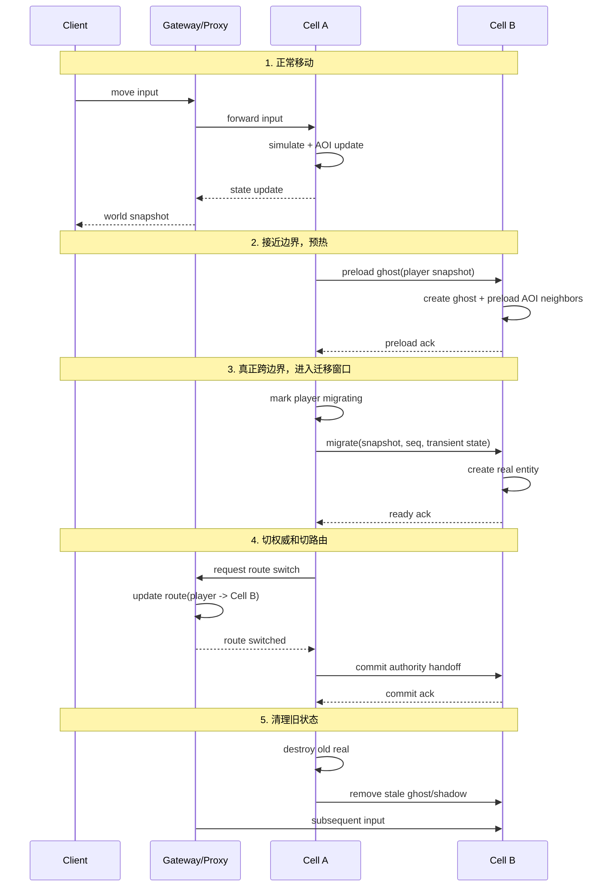

# Q4: 如何实现大地图的无缝切换？如何处理跨服务器的玩家移动？

## 问题分析

这个问题的核心不只是“玩家走过边界时怎么切服务器”，而是要同时讲清四件事：

1. 世界如何切分给多个 Cell/Scene 进程
2. 玩家接近边界时如何提前准备
3. 跨边界时谁是权威，何时切路由
4. 失败、回滚、重连时如何收敛

如果只说“到了边界就迁移 Entity”，答案通常不够。

---

## 一、先区分两个概念

### 1. 客户端无缝加载

这是客户端层面的“世界流式加载”：

- 提前加载地形块
- 提前加载建筑、植被、特效资源
- 避免黑屏和读条

它解决的是：

- 画面是否连续
- 资源是否提前到位
- 玩家是否感知到加载卡顿

### 2. 服务端无缝迁移

这是服务端层面的“Cell/Scene 所有权切换”：

- 旧 Cell 管理玩家
- 新 Cell 接管玩家
- 网关/Proxy 更新消息路由

它解决的是：

- 玩家逻辑归谁处理
- AOI 广播归谁负责
- 技能、移动、战斗状态如何连续

### 最容易犯的错

把“客户端流式加载”和“服务端跨 Cell 迁移”混成一件事。

更准确的说法应该是：

> 无缝体验来自客户端资源预加载；无缝逻辑来自服务端权威平滑切换。两者协同，但不是同一个问题。

---

## 二、什么叫大地图无缝切换

### 非无缝方式

典型表现：

- 通过传送门/副本入口切图
- 切换时读条
- 旧地图 Entity 全部销毁
- 新地图重新创建玩家

这种更像“Space 间传送”，不是物理连续移动。

### 无缝方式

典型表现：

- 玩家连续走路跨过区域边界
- 客户端没有明显读条
- 服务端在后台切换处理归属
- 玩家附近可见对象平滑变化

本质上是：

- 地图在视觉上连续
- 服务端在逻辑上分片
- 迁移过程对玩家尽量不可见

---

## 三、服务端空间划分怎么做

### 1. 固定分区

把大世界切成多个固定区域，每个区域由一个 CellApp 管理。

示意：

```text
+-------------+-------------+-------------+
| CellApp A   | CellApp B   | CellApp C   |
| 新手村      | 主城西区    | 主城东区    |
+-------------+-------------+-------------+
| CellApp D   | CellApp E   | CellApp F   |
| 野外西南    | 野外中央    | 野外东南    |
+-------------+-------------+-------------+
```

优点：

- 设计简单
- 配置明确
- 边界关系稳定

缺点：

- 热点区域容易过载
- 空闲区域浪费资源

### 2. 动态分区

根据负载动态调整 Cell 边界，或者把热点区域继续拆分。

常见方式：

- 主城单独切更多 Cell
- 热门地图临时横向拆分
- 大战场按热点区域二次切块

优点：

- 负载更均衡
- 资源利用率更高

缺点：

- 实现复杂
- 边界会变化
- 迁移量可能骤增

### 3. 工程上的常见结论

很多 MMO 的真实做法不是“纯固定”或“纯动态”，而是混合：

- 大框架用固定区域
- 热点场景局部动态拆分
- 副本类场景直接独立 Space/Instance

---

## 四、先统一术语

这类问题里术语必须统一，否则后面会讲乱。

### 1. Real Entity

真实权威实体。

特点：

- 只有一个 Cell 拥有写权限
- 负责战斗、移动、属性变更
- 负责 AOI 中的权威广播源

### 2. Ghost Entity

跨边界只读副本。

特点：

- 给相邻 Cell 做边界可见性预热
- 只读，不负责最终逻辑裁决
- 位置、朝向、部分状态由 Real 同步过来

### 3. Shadow State

迁移过程中的临时镜像状态或过渡态。

特点：

- 用于迁移窗口中的状态复制/追平
- 不是长期存在的 AOI 对象
- 更偏迁移协议内部概念

### 一个简化记法

- `Real`：唯一权威
- `Ghost`：边界只读副本
- `Shadow`：迁移中临时同步态

---

## 五、跨 Cell 无缝移动的标准流程

下面这套流程比“发现越界就直接迁移”更完整。

### 阶段 1：正常移动

- 玩家当前由 `Cell A` 处理
- Gateway/Proxy 把该玩家输入路由到 `Cell A`
- `Cell A` 负责移动、技能、AOI、广播

### 阶段 2：接近边界，开始预热

当玩家接近边界阈值时：

- `Cell A` 判断玩家朝向和速度
- 预测其短时间内可能跨入 `Cell B`
- 向 `Cell B` 发送“预热请求”
- `Cell B` 创建该玩家的 `Ghost`
- `Cell B` 开始提前准备边界附近 AOI 数据

这个阶段的目标不是迁移，而是减少真正切换时的突兀感。

### 阶段 3：进入迁移窗口

当玩家真正跨过迁移阈值时：

- `Cell A` 将玩家标记为 `migrating`
- 暂停新的复杂状态变更入口
- 对玩家做一次状态快照
- 把快照发送给 `Cell B`

注意：

- 这里不是立刻销毁旧实体
- 也不是立刻让新 Cell 成为权威

### 阶段 4：目标 Cell 建立 Real

`Cell B` 接收快照后：

- 基于快照创建新的 `Real Entity`
- 恢复必要状态
- 建立 AOI 订阅关系
- 回 ACK 给 `Cell A`

这时候系统进入最关键的一步：

> 目标 Cell 已具备接管能力，但旧 Cell 还没完全释放。

### 阶段 5：切换权威和路由

推荐顺序是：

1. `Cell B` 准备完成
2. `Proxy/Base/Gateway` 更新玩家路由到 `Cell B`
3. 新输入只发给 `Cell B`
4. `Cell B` 成为唯一权威
5. `Cell A` 降级为只读过渡或直接清理

这里的关键点是：

- **先确认目标可接管**
- **再切输入路由**
- **最后释放旧权威**

不要反过来。

### 阶段 6：清理旧状态

切换完成后：

- `Cell A` 销毁旧 `Real`
- `Cell B` 删除不再需要的 `Ghost/Shadow`
- AOI 关系稳定到新拓扑

---

## 六、一个更合理的时序图



---

## 七、边界检测不能只看当前位置

如果只在“已经越界”时才迁移，用户体验通常会变差。

更合理的判断要结合：

- 当前位置
- 速度向量
- 面向方向
- 最近几帧轨迹
- 滞后阈值

### 伪代码示例

```cpp
class BoundaryDetector {
public:
    enum class Result {
        None,
        Preload,
        Migrate,
    };

    Result check(const Entity& entity, const Bounds& bounds) {
        const auto pos = entity.position();
        const auto vel = entity.velocity();

        if (!bounds.contains(pos)) {
            return Result::Migrate;
        }

        if (isNearBoundary(pos, bounds, preloadMargin_)) {
            auto futurePos = pos + vel * predictSeconds_;
            if (!bounds.contains(futurePos)) {
                return Result::Preload;
            }
        }

        return Result::None;
    }

private:
    float preloadMargin_ = 50.0f;
    float predictSeconds_ = 1.0f;
};
```

### 为什么要有滞后区

否则玩家在边界附近反复横跳会导致：

- 迁移抖动
- Ghost 频繁创建销毁
- 路由频繁切换
- 大量无意义广播

所以通常要设置：

- 预热阈值
- 实际迁移阈值
- 回退阈值

这三个阈值不应完全相同。

---

## 八、真正困难的是权威切换

很多人容易把重点放在“怎么序列化 Entity”，但真正更难的是：

> 迁移窗口里到底谁说了算？

### 一个推荐原则

在任意时刻，只允许一个 Cell 拥有最终写权限。

也就是：

- `Cell A` 写，`Cell B` 只读预热
- 或者 `Cell B` 写，`Cell A` 只读收尾
- 不能长期双写

### 为什么不能长期双写

否则很快会出现：

- 技能结算两边都算
- 位置各自推进
- Buff 时间不一致
- 同一玩家被两边都广播

所以迁移协议最好显式拆成三个阶段：

1. `prepare`
2. `route-switch`
3. `commit`

必要时还要支持：

4. `rollback`

---

## 九、失败路径一定要讲

这部分是区分中高级理解深度的关键。

### 失败场景 1：目标 Cell 创建成功，但路由切换失败

处理方式：

- `Cell B` 保留临时实体但不接管权威
- `Cell A` 继续作为权威处理
- 系统重试切路由
- 超时则 `rollback`，删除 `Cell B` 临时态

### 失败场景 2：路由已切到新 Cell，但旧 Cell 没来得及释放

处理方式：

- 以新 Cell 为唯一权威
- 旧 Cell 进入只读/墓碑态
- 禁止旧 Cell 再产生新的逻辑写入
- 后台延迟清理

### 失败场景 3：迁移过程中源 Cell 宕机

这是最难的场景。

因为这时你通常拿不到一个完整优雅的 `freeze + serialize`。

更现实的做法是：

- 依赖最近一次快照或最小恢复态
- 由 Base/DB/Session 服务保留关键状态
- 玩家重连后在新 Cell 重建
- 必要时回退到安全点/最近检查点

这说明：

> “主动迁移”和“故障迁移”不是一套流程。

### 失败场景 4：玩家迁移中断线

推荐做法：

- 由 Session/Proxy 记录玩家迁移状态
- 标记该玩家当前目标 Cell
- 重连时优先向目标 Cell 查询
- 若目标 Cell 未完成接管，则回源 Cell 或恢复点

---

## 十、不同类型切换要分开讲

### 1. 同一 Space 内跨 Cell

特点：

- 地图连续
- 位置连续
- 玩家通常无感
- 需要 Ghost、边界预热、权威切换

这才是严格意义上的“无缝跨服/跨 Cell 移动”。

### 2. 不同 Space 之间切换

例如：

- 主城进副本
- 野外进战场
- 跨服大厅进比赛服

这通常不是物理连续移动，而是“传送/实例切换”。

特点：

- 旧 Space 的 Entity 生命周期结束
- 新 Space 中重新创建角色实体
- 允许读条或短暂切换动画

这里要主动说清：

> 不是所有跨服务器移动都追求完全无缝。大世界边界跨越和副本传送，设计目标不同。

---

## 十一、客户端该做什么，不该做什么

### 客户端应该做

- 地形块/场景资源流式加载
- 边界附近对象提前展示
- 位置平滑插值
- 迁移瞬间做视觉连续性处理

### 客户端不应该承担

- 直接理解 Cell 拓扑
- 直接与多个 Cell 建立复杂业务连接
- 参与权威裁决

更合理的网络模型通常是：

- 客户端只连 Gateway/Proxy
- Gateway/Proxy 内部转发到当前权威 Cell

这样客户端无需感知 Cell 迁移细节。

---

## 十二、继续深入时通常还会扩展哪些问题

如果已经理解到这一步，通常还会继续扩展：

1. 边界迁移时技能释放到一半怎么办？
2. Buff 和 DOT 在迁移窗口里由谁结算？
3. 大规模国战时边界迁移如何防雪崩？
4. 如果热点区域持续爆满，边界动态调整策略是什么？
5. AOI 进入/离开事件如何避免重复触发？

所以一个更成熟的回答要主动补一句：

> 迁移方案不只是移动逻辑问题，本质上还涉及战斗结算权威、消息顺序、AOI 去重和故障恢复。

---

## 十三、推荐组织方式

可以按下面的方式组织答案：

### 第一层：先定性

无缝切换分为两部分：

- 客户端流式加载，保证画面连续
- 服务端跨 Cell 迁移，保证逻辑连续

### 第二层：讲主流程

- 玩家在旧 Cell 正常移动
- 接近边界时在新 Cell 预创建 Ghost
- 真正跨界时做快照迁移
- 目标 Cell 准备好后切路由
- 路由切完再释放旧权威

### 第三层：讲关键原则

- 同一时刻只有一个 Real Entity 拥有写权限
- Ghost 只做边界可见性，不做最终裁决
- 路由切换必须晚于目标准备完成
- 必须设计 rollback 和重连恢复路径

### 第四层：讲工程取舍

- 大世界边界跨越追求无缝
- 副本/战场切换允许半无缝甚至读条
- 固定分区简单，动态分区更灵活但实现复杂

---

## 十四、总结

无缝大地图的核心不是“玩家过线就搬家”，而是：

- 先预热
- 再迁移
- 明确权威切换点
- 最后清理旧状态

真正难的地方不在序列化，而在：

- AOI 交接
- 权威切换
- 路由切换
- 失败回滚
- 故障恢复

如果把这些讲清楚，这个问题基本就已经达到较高水位的 MMO 服务端说明深度了。

---

## 参考资料

- [BigWorld 无缝世界设计](https://www.bigworldtech.com/)
- [KBEngine Space 管理](https://www.kbelab.com/guide/space/)
- [KBEngine Entity 迁移](https://github.com/kbengine/kbengine)
- [网络延迟补偿技术](https://gafferongames.com/post/snapshot_interpolation/)
