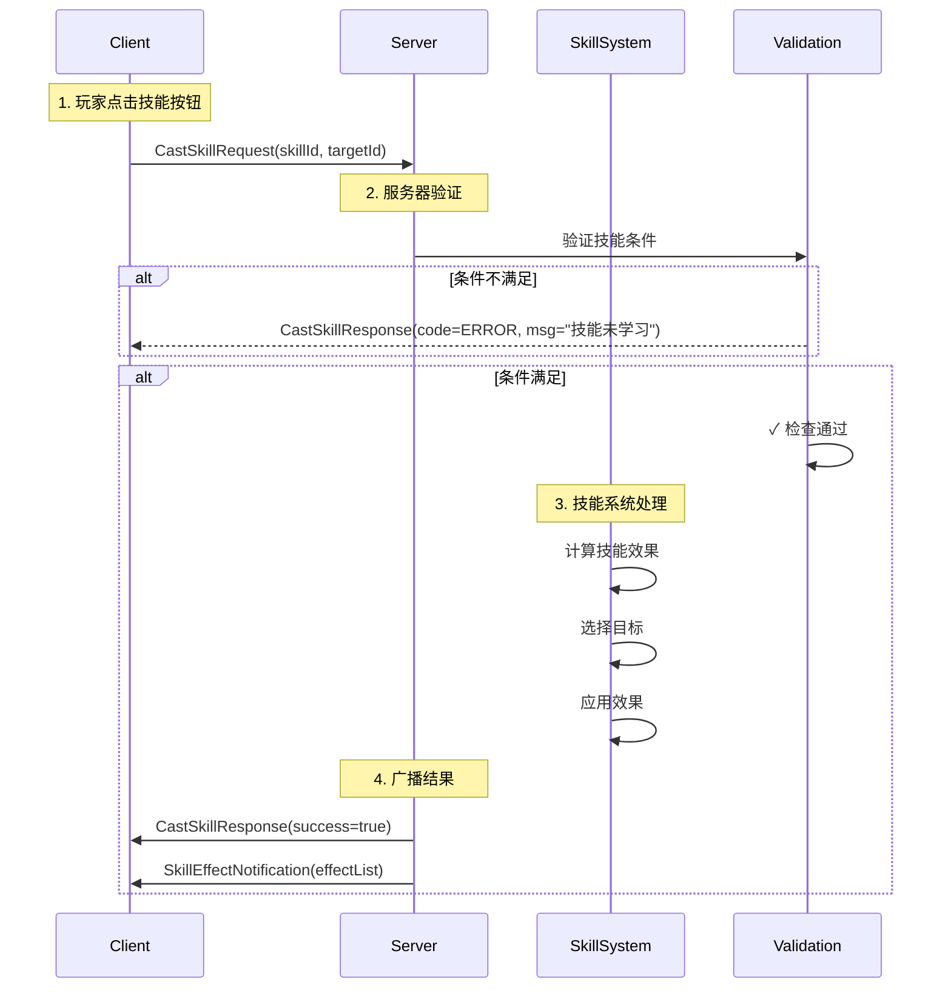

# Q41: 如何设计技能系统？

## 问题分析

本题考察对技能系统设计的理解：
- 技能系统的核心要素
- 数据驱动设计
- 服务器验证
- KBEngine 的技能实现

---

## 一、技能系统核心

### 1.1 核心要素

```
┌─────────────────────────────────────────────────────────────┐
│                    技能系统核心要素                           │
├─────────────────────────────────────────────────────────────┤
│                                                             │
│  1. 技能定义                                                │
│     ├── 技能 ID                                            │
│     ├── 技能名称                                            │
│     ├── 技能类型 (主动/被动/通道)                           │
│     ├── 技能图标                                            │
│     └── 冷却时间                                            │
│                                                             │
│  2. 技能效果                                                │
│     ├── 伤害效果                                            │
│     ├── Buff/Debuff                                         │
│     ├── 治疗/恢复                                           │
│     ├── 召唤/创造                                           │
│     └── 移动/位移                                           │
│                                                             │
│  3. 释放条件                                                │
│     ├── 等级要求                                            │
│     ├── 消耗资源 (MP/Item)                                 │
│     ├── 武器/装备要求                                       │
│     ├── 状态要求 (战斗中/骑乘中)                           │
│     └── 位置/方向要求                                       │
│                                                             │
│  4. 目标选择                                                │
│     ├── 自身                                               │
│     ├── 选中目标                                           │
│     ├── 区域内目标                                         │
│     └── 指定位置                                           │
│                                                             │
└─────────────────────────────────────────────────────────────┘
```

---

## 二、数据驱动设计

### 2.1 技能配置表

```
┌─────────────────────────────────────────────────────────────┐
│                    技能配置表设计                             │
├─────────────────────────────────────────────────────────────┤
│                                                             │
│  技能基础表 (skill_base)：                                   │
│  ┌──────┬────────┬──────────┬─────────┬──────────┐         │
│  │ id   │  name   │   type    │ icon_id  │ cooldown  │         │
│  ├──────┼────────┼──────────┼─────────┼──────────┤         │
│  │ 1001 │ 火球术 │  ACTIVE   │ icon_101 │    3000  │         │
│  │ 1002 │ 治疗术 │  ACTIVE   │ icon_102 │    5000  │         │
│  │ 1003 │ 强力攻击│ PASSIVE  │ icon_103 │    0     │         │
│  │ 1004 │ 烈剑    │ CHANNEL  │ icon_104 │    0     │         │
│  └──────┴────────┴──────────┴─────────┴──────────┘         │
│                                                             │
│  技能效果表 (skill_effect)：                                  │
│  ┌──────┬──────────┬─────────┬──────────┬─────────────┐    │
│  │ id   │ effect_id │ target  │ value     │ duration     │    │
│  ├──────┼──────────┼─────────┼──────────┼─────────────┤    │
│  │ 1001 │ 1         │ ENEMY   │ -100      │ 0           │    │
│  │ 1001 │ 2         │ ENEMY   │ DOT_FIRE  │ 5000        │    │
│  │ 1002 │ 3         │ FRIEND  │ 100       │ 0           │    │
│  │ 1004 │ 4         │ SELF    │ ATK_UP    │ 10000       │    │
│  └──────┴──────────┴─────────┴──────────┴─────────────┘    │
│                                                             │
│  技能需求表 (skill_requirement)：                              │
│  ┌──────┬──────────┬──────────┬──────────┬─────────────┐    │
│  │ id   │ level    │ mp_cost  │ item_cost │ weapon_type │    │
│  ├──────┼──────────┼──────────┼──────────┼─────────────┤    │
│  │ 1001 │ 10       │ 50       │ 0         │ STAFF       │    │
│  │ 1002 │ 5        │ 100      │ 0         │ STAFF       │    │
│  │ 1003 │ 1        │ 0        │ 0         │ ANY         │    │
│  └──────┴──────────┴──────────┴──────────┴─────────────┘    │
│                                                             │
└─────────────────────────────────────────────────────────────┘
```

### 2.2 数据结构设计

```cpp
// 技能数据结构

// 技能类型
enum class SkillType : uint8_t {
    ACTIVE = 0,    // 主动技能：需要手动释放
    PASSIVE = 1,    // 被动技能：自动触发
    CHANNEL = 2,    // 通道技能：持续释放
    TOGGLE = 3      // 开关技能：切换状态
};

// 目标类型
enum class TargetType : uint8_t {
    NONE = 0,       // 无需目标
    SELF = 1,       // 自身
    SINGLE = 2,     // 单个目标
    AREA = 3,       // 区域内目标
    DIRECTION = 4,  // 方向
    POSITION = 5    // 指定位置
};

// 技能定义
struct SkillConfig {
    uint32_t skillId;
    std::string name;
    SkillType type;
    TargetType targetType;
    uint32_t cooldownMs;
    uint32_t castTimeMs;
    float mpCost;
    float minRange;
    float maxRange;
    float radius;           // 区域半径
    std::vector<uint32_t> effectIds;
};

// 技能效果
struct SkillEffect {
    uint32_t effectId;
    enum class Type : uint8_t {
        DAMAGE,        // 伤害
        HEAL,          // 治疗
        BUFF,          // Buff
        DEBUFF,        // Debuff
        SUMMON,        // 召唤
        TELEPORT,      // 位移
        KNOCKBACK,     // 击退
        STUN           // 眩晕
    };

    Type type;
    float value;
    uint32_t duration;
    uint32_t buffId;
};

// 玩家技能状态
struct SkillState {
    std::unordered_map<uint32_t, uint64_t> lastCastTime;  // skill_id -> timestamp
    std::unordered_map<uint32_t, bool> learnedSkills;      // skill_id -> learned
    std::unordered_map<uint32_t, uint8_t> skillLevels;       // skill_id -> level
};
```

---

## 三、技能释放流程

### 3.1 释放流程图



### 3.2 验证逻辑

```cpp
// 技能验证

class SkillValidator {
public:
    // 验证是否可以释放
    enum class CastResult : uint8_t {
        SUCCESS = 0,
        NOT_LEARNED,
        COOLDOWN,
        NO_MP,
        INVALID_TARGET,
        OUT_OF_RANGE,
        CASTING_INTERRUPTED,
        SILENCED,
        STUNNED
    };

    CastResult canCastSkill(Entity* caster, uint32_t skillId,
                             Entity* target) {
        // 1. 检查技能是否学习
        if (!hasLearnedSkill(caster, skillId)) {
            return CastResult::NOT_LEARNED;
        }

        // 2. 检查冷却
        if (isOnCooldown(caster, skillId)) {
            return CastResult::COOLDOWN;
        }

        // 3. 检查 MP
        auto* skillConfig = getSkillConfig(skillId);
        if (caster->getMP() < skillConfig->mpCost) {
            return CastResult::NO_MP;
        }

        // 4. 检查状态
        if (caster->hasState(State::STUNNED) ||
            caster->hasState(State::SILENCED)) {
            return CastResult::CASTING_INTERRUPTED;
        }

        // 5. 检查目标
        auto* validation = getTargetValidation(skillConfig->targetType);
        if (!validation->isValid(caster, target)) {
            return CastResult::INVALID_TARGET;
        }

        // 6. 检查距离
        float distance = getDistance(caster, target);
        if (distance < skillConfig->minRange ||
            distance > skillConfig->maxRange) {
            return CastResult::OUT_OF_RANGE;
        }

        return CastResult::SUCCESS;
    }

private:
    bool isOnCooldown(Entity* caster, uint32_t skillId) {
        auto* skillState = caster->getComponent<SkillState>();
        uint64_t now = getCurrentTime();
        uint64_t lastCast = skillState->lastCastTime[skillId];
        uint64_t cooldown = getSkillConfig(skillId)->cooldownMs;

        return (now - lastCast) < cooldown;
    }
};
```

---

## 四、技能效果实现

### 4.1 效果系统

```cpp
// 技能效果系统

class SkillEffectSystem {
public:
    // 应用技能效果
    void applyEffects(Entity* caster, const SkillConfig* skill,
                       const std::vector<Entity*>& targets) {
        for (uint32_t effectId : skill->effectIds) {
            auto* effect = getSkillEffect(effectId);

            for (Entity* target : targets) {
                switch (effect->type) {
                    case SkillEffect::Type::DAMAGE:
                        applyDamage(caster, target, effect);
                        break;

                    case SkillEffect::Type::HEAL:
                        applyHeal(caster, target, effect);
                        break;

                    case SkillEffect::Type::BUFF:
                        applyBuff(caster, target, effect);
                        break;

                    case SkillEffect::Type::DEBUFF:
                        applyDebuff(caster, target, effect);
                        break;

                    case SkillEffect::Type::SUMMON:
                        applySummon(caster, effect);
                        break;

                    case SkillEffect::Type::TELEPORT:
                        applyTeleport(caster, effect);
                        break;

                    case SkillEffect::Type::STUN:
                        applyStun(caster, target, effect);
                        break;
                }
            }
        }
    }

    // 伤害效果
    void applyDamage(Entity* caster, Entity* target,
                     const SkillEffect* effect) {
        // 计算伤害
        float baseDamage = effect->value;
        float attackPower = caster->getAttackPower();
        float defense = target->getDefense();

        float finalDamage = calculateDamage(baseDamage, attackPower, defense);

        // 应用伤害
        target->takeDamage(finalDamage, caster->id());

        // 广播伤害事件
        broadcastDamageEvent(caster->id(), target->id(), finalDamage);
    }

    // Buff 效果
    void applyBuff(Entity* caster, Entity* target,
                    const SkillEffect* effect) {
        Buff* buff = new Buff();
        buff->buffId = effect->buffId;
        buff->casterId = caster->id();
        buff->duration = effect->duration;
        buff->value = effect->value;

        target->addBuff(buff);
    }

private:
    float calculateDamage(float base, float attack, float defense) {
        // 伤害公式：base * attack / (attack + defense)
        return base * attack / (attack + defense);
    }
};
```

### 4.2 目标选择

```cpp
// 目标选择系统

class TargetSelector {
public:
    // 根据目标类型选择目标
    std::vector<Entity*> selectTargets(Entity* caster,
                                       TargetType targetType,
                                       const Position& position) {
        switch (targetType) {
            case TargetType::SELF:
                return {caster};

            case TargetType::SINGLE:
                return selectSingleTarget(caster);

            case TargetType::AREA:
                return selectAreaTargets(caster, position);

            case TargetType::DIRECTION:
                return selectDirectionTargets(caster);

            default:
                return {};
        }
    }

    // 区域选择
    std::vector<Entity*> selectAreaTargets(Entity* caster,
                                         const Position& center) {
        std::vector<Entity*> targets;

        // 获取技能范围
        float radius = getCurrentSkillRadius(caster);

        // 查找范围内的实体
        auto entities = getEntitiesInArea(center, radius);

        // 过滤敌对实体
        for (auto* entity : entities) {
            if (isEnemy(caster, entity) && !entity->isDead()) {
                targets.push_back(entity);
            }
        }

        return targets;
    }

    // 方向选择 (扇形区域)
    std::vector<Entity*> selectDirectionTargets(Entity* caster) {
        std::vector<Entity*> targets;

        Position casterPos = caster->getPosition();
        float direction = caster->getRotation();
        float range = getCurrentSkillRange(caster);
        float angle = 60.0f;  // 60度扇形

        for (auto* entity : getVisibleEntities(caster)) {
            Position entityPos = entity->getPosition();

            // 计算距离和角度
            float distance = distance(casterPos, entityPos);
            float entityAngle = calculateAngle(casterPos, entityPos);

            if (distance <= range) {
                float angleDiff = normalizeAngle(entityAngle - direction);
                if (abs(angleDiff) <= angle / 2) {
                    targets.push_back(entity);
                }
            }
        }

        return targets;
    }
};
```

---

## 五、KBEngine 技能实现

### 5.1 KBEngine 技能定义

```python
# KBEngine 技能系统实现

class Skill:
    def __init__(self, skillId):
        self.skillId = skillId
        self.config = SkillConfig.getConfig(skillId)

    def canCast(self, player):
        """
        检查是否可以释放
        """
        # 检查是否学习
        if not player.hasSkill(self.skillId):
            return False, "技能未学习"

        # 检查冷却
        if self.isOnCooldown(player):
            return False, "技能冷却中"

        # 检查 MP
        if player.mp < self.config.mpCost:
            return False, "MP不足"

        # 检查状态
        if player.isStunned() or player.isSilenced():
            return False, "状态异常"

        return True, ""

    def cast(self, player, target):
        """
        释放技能
        """
        canCast, msg = self.canCast(player, target)
        if not canCast:
            return False, msg

        # 扣除 MP
        player.mp -= self.config.mpCost

        # 设置冷却
        player.setSkillCooldown(self.skillId, self.config.cooldown)

        # 应用效果
        for effect in self.config.effects:
            self.applyEffect(player, target, effect)

        return True, ""
```

### 5.2 KBEngine 技能效果

```python
# KBEngine 技能效果

class SkillEffect:
    @staticmethod
    def applyDamage(player, target, value):
        """
        伤害效果
        """
        # 计算伤害
        damage = value * player.attackPower / (player.attackPower + target.defense)

        # 扣除血量
        target.hp -= int(damage)

        # 通知客户端
        target.client.onDamage(player.id, damage)
        player.client.onDamageDealt(target.id, damage)

    @staticmethod
    def applyHeal(player, target, value):
        """
        治疗效果
        """
        heal = value * player.healPower

        target.hp = min(target.hp + int(heal), target.maxHp)

        # 通知客户端
        target.client.onHeal(player.id, heal)

    @staticmethod
    def applyBuff(player, target, buffId, duration):
        """
        Buff 效果
        """
        buff = KBEngine.createEntity(Buff)
        buff.buffId = buffId
        buff.casterId = player.id
        buff.duration = duration

        target.addBuff(buff)
```

---

## 六、性能优化

### 6.1 技能缓存

```cpp
// 技能配置缓存

class SkillConfigCache {
public:
    // 技能配置缓存
    std::unordered_map<uint32_t, SkillConfig*> configCache_;

    // 获取技能配置
    SkillConfig* getSkillConfig(uint32_t skillId) {
        auto it = configCache_.find(skillId);
        if (it != configCache_.end()) {
            return it->second;
        }

        // 从数据库加载
        SkillConfig* config = loadFromDB(skillId);
        if (config) {
            configCache_[skillId] = config;
        }

        return config;
    }

    // 预加载热门技能
    void preloadPopularSkills() {
        std::vector<uint32_t> popular = {1001, 1002, 1003, 1004};
        for (uint32_t skillId : popular) {
            getSkillConfig(skillId);
        }
    }
};
```

### 6.2 效果池化

```cpp
// 技能效果对象池

template<typename T>
class EffectPool {
public:
    T* acquire() {
        if (!freeList_.empty()) {
            T* effect = freeList_.back();
            freeList_.pop_back();
            return effect;
        }
        return new T();
    }

    void release(T* effect) {
        effect->reset();
        freeList_.push_back(effect);
    }

private:
    std::vector<T*> freeList_;
};

// 使用示例
EffectPool<SkillEffect> effectPool;

void applyEffect(Entity* target) {
    SkillEffect* effect = effectPool.acquire();
    // 使用效果
    effectPool.release(effect);
}
```

---

## 七、总结

### 技能系统设计要点

| 要点 | 说明 |
|------|------|
| **数据驱动** | 技能配置化，便于策划调整 |
| **服务器验证** | 所有计算在服务器端 |
| **状态检查** | 冷却、MP、状态等条件 |
| **目标选择** | 支持多种目标类型 |
| **效果系统** | 模块化效果，易于扩展 |
| **性能优化** | 缓存、池化、批量处理 |

### 最佳实践

```
1. 数据驱动设计
   - 技能配置表化
   - 策划可配置
   - 热更新支持

2. 服务器权威
   - 服务器计算所有效果
   - 客户端只显示结果
   - 防作弊验证

3. 模块化设计
   - 效果独立
   - 易于添加新效果
   - 代码复用

4. 性能优化
   - 技能配置缓存
   - 效果对象池
   - 批量处理
```

---

## 参考资料

- [KBEngine 技能系统](https://github.com/kbengine/kbengine/tree/master/kbe/src/server/skills)
- [游戏技能系统设计](https://www.gamedeveloper.com/12-awesome-game-ability-systems/)
