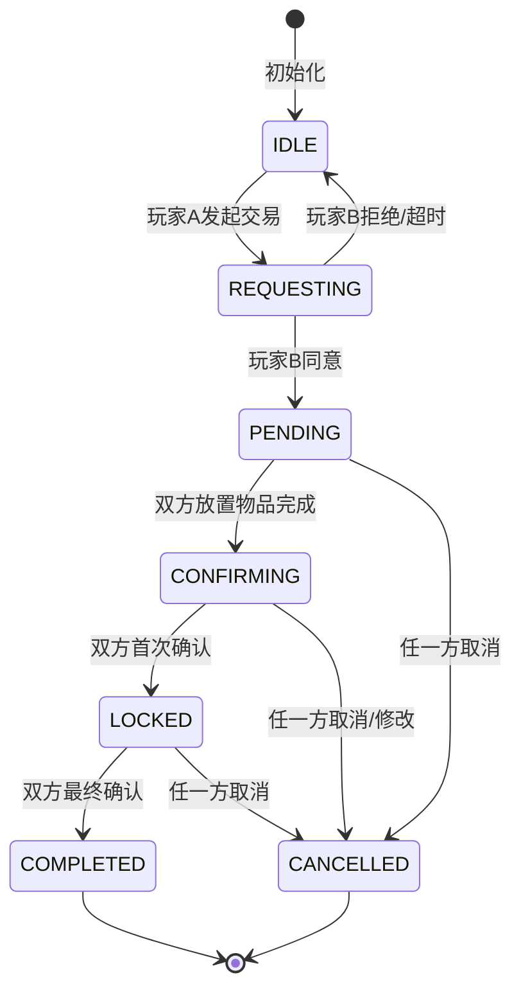

# Q45: 如何设计交易系统？

## 问题分析

本题考察对交易系统的理解：
- 玩家间交易流程
- 交易验证机制
- 交易安全防护
- KBEngine 的交易实现

---

## 一、交易系统架构

### 1.1 交易类型

```
┌─────────────────────────────────────────────────────────────┐
│                    交易系统类型                                │
├─────────────────────────────────────────────────────────────┤
│                                                             │
│  1. 面对面交易 (P2P Trade)                                  │
│  ┌─────────────────────────────────────────────────┐       │
│  │  玩家A ──────► 交互请求 ──────► 玩家B             │       │
│  │     │                              │             │       │
│  │     ▼                              ▼             │       │
│  │  放入物品                      放入物品           │       │
│  │     │                              │             │       │
│  │     ▼                              ▼             │       │
│  │  确认交易 ◄────── 确认交易 ──────► 确认交易       │       │
│  │     │                              │             │       │
│  │     └────────── 最终确认 ──────────┘             │       │
│  │                                                   │       │
│  │  特点:                                            │       │
│  │  - 双方在线                                       │       │
│  │  - 实时交互                                       │       │
│  │  - 可同时交易物品和货币                             │       │
│  │  - 需要双方确认                                     │       │
│  └─────────────────────────────────────────────────┘       │
│                                                             │
│  2. 拍卖行交易 (Auction House)                              │
│  ┌─────────────────────────────────────────────────┐       │
│  │  卖家 → 挂单 → 拍卖行 → 买家                     │       │
│  │                                                   │       │
│  │  特点:                                            │       │
│  │  - 异步交易                                       │       │
│  │  - 不需要双方在线                                 │       │
│  │  - 支持竞价                                       │       │
│  │  - 收取手续费                                     │       │
│  └─────────────────────────────────────────────────┘       │
│                                                             │
│  3. 商店交易 (NPC Shop)                                     │
│  ┌─────────────────────────────────────────────────┐       │
│  │  玩家 ←──→ NPC 商店                              │       │
│  │                                                   │       │
│  │  特点:                                            │       │
│  │  - 固定价格                                       │       │
│  │  - 无限库存 (卖家)                                 │       │
│  │  - 买入/卖出差价                                   │       │
│  └─────────────────────────────────────────────────┘       │
│                                                             │
│  4. 邮件交易 (Mail Trade)                                   │
│  ┌─────────────────────────────────────────────────┐       │
│  │  玩家A → 发送物品邮件 → 玩家B                     │       │
│  │                                                   │       │
│  │  特点:                                            │       │
│  │  - 单向交易                                       │       │
│  │  - 可离线接收                                     │       │
│  │  - 支持 COD (货到付款)                            │       │
│  └─────────────────────────────────────────────────┘       │
│                                                             │
└─────────────────────────────────────────────────────────────┘
```

### 1.2 交易状态机



---

## 二、面对面交易实现

### 2.1 交易数据结构

```cpp
// 交易系统数据结构

enum class TradeState {
    IDLE = 0,           // 空闲
    REQUESTING = 1,     // 请求中
    PENDING = 2,        // 等待确认
    CONFIRMING = 3,     // 确认中
    LOCKED = 4,         // 已锁定
    COMPLETED = 5,      // 已完成
    CANCELLED = 6,      // 已取消
};

// 交易物品
struct TradeItem {
    uint64_t uniqueId;      // 物品唯一ID
    int templateId;         // 物品模板ID
    int count;              // 数量
    BagType fromBag;        // 来源背包
    int fromSlot;           // 来源格子
};

// 交易货币
struct TradeCurrency {
    int gold = 0;           // 金币
    int diamond = 0;        // 钻石
};

// 交易方
struct TradeParticipant {
    uint64_t playerId;
    std::string playerName;
    TradeItem items[6];     // 最多6个物品位
    TradeCurrency currency;
    bool confirmed1 = false; // 第一次确认
    bool confirmed2 = false; // 第二次确认
    bool ready = false;      // 已准备好 (物品放置完成)
};

// 交易会话
struct TradeSession {
    uint64_t sessionId;
    TradeParticipant player1;
    TradeParticipant player2;
    TradeState state = TradeState::IDLE;
    uint64_t expireTime;    // 超时时间
    uint64_t createTime;
    uint64_t lastActionTime;
};
```

### 2.2 交易管理器

```cpp
// 交易系统

class TradeSystem {
public:
    static constexpr uint32_t TRADE_TIMEOUT = 60;      // 交易超时(秒)
    static constexpr uint32_t CONFIRM_TIMEOUT = 30;    // 确认超时(秒)
    static constexpr size_t MAX_TRADE_ITEMS = 6;       // 最大交易物品数

    // 发起交易请求
    uint64_t requestTrade(uint64_t requesterId, uint64_t targetId) {
        // 检查双方是否可以交易
        if (!canTrade(requesterId, targetId)) {
            return 0;
        }

        // 检查是否已有交易
        if (hasActiveTrade(requesterId) || hasActiveTrade(targetId)) {
            sendError(requesterId, "Already in trade");
            return 0;
        }

        // 创建交易会话
        uint64_t sessionId = generateSessionId();
        TradeSession session;
        session.sessionId = sessionId;
        session.player1.playerId = requesterId;
        session.player2.playerId = targetId;
        session.state = TradeState::REQUESTING;
        session.createTime = getCurrentTime();
        session.lastActionTime = getCurrentTime();
        session.expireTime = getCurrentTime() + TRADE_TIMEOUT * 1000;

        // 设置玩家名称
        session.player1.playerName = getPlayerName(requesterId);
        session.player2.playerName = getPlayerName(targetId);

        sessions_[sessionId] = session;
        playerToSession_[requesterId] = sessionId;
        playerToSession_[targetId] = sessionId;

        // 通知目标玩家
        sendTradeRequest(targetId, requesterId, session.player1.playerName);

        // 设置超时定时器
        scheduleTimeout(sessionId, TRADE_TIMEOUT);

        return sessionId;
    }

    // 响应交易请求
    bool respondToTrade(uint64_t playerId, uint64_t requesterId, bool accept) {
        uint64_t sessionId = getPlayerSession(playerId);
        if (!sessionId) return false;

        auto* session = getSession(sessionId);
        if (!session || session->player1.playerId != requesterId) {
            return false;
        }

        if (session->state != TradeState::REQUESTING) {
            return false;
        }

        if (accept) {
            session->state = TradeState::PENDING;
            sendTradeStarted(sessionId);
        } else {
            cancelTrade(sessionId, "Player declined");
        }

        return true;
    }

    // 添加交易物品
    bool addItem(uint64_t playerId, uint64_t uniqueId, int slot) {
        uint64_t sessionId = getPlayerSession(playerId);
        if (!sessionId) return false;

        auto* session = getSession(sessionId);
        if (!session || session->state != TradeState::PENDING) {
            return false;
        }

        TradeParticipant* participant = getParticipant(session, playerId);
        if (!participant) return false;

        // 检查是否已锁定
        if (participant->confirmed1 || participant->confirmed2) {
            return false;
        }

        // 检查物品数量限制
        size_t itemCount = 0;
        for (size_t i = 0; i < MAX_TRADE_ITEMS; ++i) {
            if (participant->items[i].uniqueId != 0) {
                itemCount++;
            }
        }
        if (itemCount >= MAX_TRADE_ITEMS) {
            sendError(playerId, "Trade slots full");
            return false;
        }

        // 检查物品是否可交易
        if (!isItemTradeable(playerId, uniqueId)) {
            sendError(playerId, "Item cannot be traded");
            return false;
        }

        // 获取物品信息
        auto* item = getItemInstance(playerId, uniqueId);
        if (!item) return false;

        // 添加到交易栏
        for (size_t i = 0; i < MAX_TRADE_ITEMS; ++i) {
            if (participant->items[i].uniqueId == 0) {
                participant->items[i] = {
                    .uniqueId = uniqueId,
                    .templateId = item->templateId,
                    .count = item->count,
                    .fromBag = item->bagType,
                    .fromSlot = item->slot
                };
                break;
            }
        }

        session->lastActionTime = getCurrentTime();

        // 通知双方
        sendTradeItemUpdate(sessionId, playerId, participant->items);

        // 检查是否双方都准备好
        checkBothReady(session);

        return true;
    }

    // 移除交易物品
    bool removeItem(uint64_t playerId, int tradeSlot) {
        uint64_t sessionId = getPlayerSession(playerId);
        if (!sessionId) return false;

        auto* session = getSession(sessionId);
        if (!session || session->state != TradeState::PENDING) {
            return false;
        }

        TradeParticipant* participant = getParticipant(session, playerId);
        if (!participant) return false;

        // 检查是否已锁定
        if (participant->confirmed1) {
            return false;
        }

        if (tradeSlot < 0 || tradeSlot >= MAX_TRADE_ITEMS) {
            return false;
        }

        participant->items[tradeSlot] = {};
        participant->ready = false;  // 需要重新准备

        session->lastActionTime = getCurrentTime();

        sendTradeItemUpdate(sessionId, playerId, participant->items);
        return true;
    }

    // 设置交易货币
    bool setCurrency(uint64_t playerId, int gold, int diamond) {
        uint64_t sessionId = getPlayerSession(playerId);
        if (!sessionId) return false;

        auto* session = getSession(sessionId);
        if (!session || session->state != TradeState::PENDING) {
            return false;
        }

        TradeParticipant* participant = getParticipant(session, playerId);
        if (!participant) return false;

        // 检查是否已锁定
        if (participant->confirmed1) {
            return false;
        }

        // 检查货币是否足够
        auto* entity = getEntity(playerId);
        if (!entity) return false;

        if (entity->getGold() < gold || entity->getDiamond() < diamond) {
            sendError(playerId, "Not enough currency");
            return false;
        }

        participant->currency.gold = gold;
        participant->currency.diamond = diamond;
        participant->ready = true;

        session->lastActionTime = getCurrentTime();

        sendTradeCurrencyUpdate(sessionId, playerId, participant->currency);

        // 检查是否双方都准备好
        checkBothReady(session);

        return true;
    }

    // 第一次确认
    bool confirm1(uint64_t playerId) {
        uint64_t sessionId = getPlayerSession(playerId);
        if (!sessionId) return false;

        auto* session = getSession(sessionId);
        if (!session || session->state != TradeState::PENDING) {
            return false;
        }

        TradeParticipant* participant = getParticipant(session, playerId);
        if (!participant || !participant->ready) {
            return false;
        }

        participant->confirmed1 = true;

        sendTradeConfirm(sessionId, playerId, 1);

        // 检查是否都确认了
        if (session->player1.confirmed1 && session->player2.confirmed1) {
            session->state = TradeState::CONFIRMING;
            // 重置第二次确认
            session->player1.confirmed2 = false;
            session->player2.confirmed2 = false;

            sendTradePhase2(sessionId);

            // 设置第二次确认超时
            scheduleTimeout(sessionId, CONFIRM_TIMEOUT);
        }

        return true;
    }

    // 第二次确认 (最终确认)
    bool confirm2(uint64_t playerId) {
        uint64_t sessionId = getPlayerSession(playerId);
        if (!sessionId) return false;

        auto* session = getSession(sessionId);
        if (!session || session->state != TradeState::CONFIRMING) {
            return false;
        }

        TradeParticipant* participant = getParticipant(session, playerId);
        if (!participant) return false;

        participant->confirmed2 = true;

        sendTradeConfirm(sessionId, playerId, 2);

        // 双方都确认，完成交易
        if (session->player1.confirmed2 && session->player2.confirmed2) {
            completeTrade(session);
        }

        return true;
    }

    // 取消交易
    bool cancelTrade(uint64_t playerId) {
        uint64_t sessionId = getPlayerSession(playerId);
        if (!sessionId) return false;

        return cancelTrade(sessionId, "Player cancelled");
    }

private:
    struct TradeSession;

    bool canTrade(uint64_t player1, uint64_t player2) {
        // 检查距离
        if (!isInRange(player1, player2, 5.0f)) {
            return false;
        }

        // 检查状态
        auto* entity1 = getEntity(player1);
        auto* entity2 = getEntity(player2);
        if (!entity1 || !entity2) {
            return false;
        }

        if (!entity1->isAlive() || !entity2->isAlive()) {
            return false;
        }

        if (entity1->isInCombat() || entity2->isInCombat()) {
            return false;
        }

        // 检查屏蔽
        if (isBlocked(player1, player2) || isBlocked(player2, player1)) {
            return false;
        }

        return true;
    }

    bool hasActiveTrade(uint64_t playerId) {
        return playerToSession_.find(playerId) != playerToSession_.end();
    }

    bool isItemTradeable(uint64_t playerId, uint64_t uniqueId) {
        auto* item = getItemInstance(playerId, uniqueId);
        if (!item) return false;

        // 检查绑定类型
        if (item->bindType == BindType::PICKUP ||
            item->bindType == BindType::EQUIP) {
            return false;
        }

        // 检查物品是否可交易
        ItemTemplate* tmpl = getItemTemplate(item->templateId);
        if (!tmpl || !tmpl->canTrade) {
            return false;
        }

        return true;
    }

    void checkBothReady(TradeSession* session) {
        if (session->player1.ready && session->player2.ready) {
            // 双方都准备好，进入确认阶段
            sendTradeReady(session->sessionId);
        }
    }

    void completeTrade(TradeSession* session) {
        session->state = TradeState::COMPLETED;

        uint64_t player1Id = session->player1.playerId;
        uint64_t player2Id = session->player2.playerId;

        // 验证交易 (最后检查一次)
        if (!validateTrade(session)) {
            cancelTrade(session->sessionId, "Trade validation failed");
            return;
        }

        // 执行交易
        database_->beginTransaction();

        try {
            // 交换物品
            for (size_t i = 0; i < MAX_TRADE_ITEMS; ++i) {
                // 玩家1的物品给玩家2
                if (session->player1.items[i].uniqueId != 0) {
                    transferItem(player1Id, player2Id,
                                session->player1.items[i].uniqueId);
                }

                // 玩家2的物品给玩家1
                if (session->player2.items[i].uniqueId != 0) {
                    transferItem(player2Id, player1Id,
                                session->player2.items[i].uniqueId);
                }
            }

            // 交换货币
            if (session->player1.currency.gold > 0) {
                transferGold(player1Id, player2Id,
                            session->player1.currency.gold);
            }
            if (session->player2.currency.gold > 0) {
                transferGold(player2Id, player1Id,
                            session->player2.currency.gold);
            }
            if (session->player1.currency.diamond > 0) {
                transferDiamond(player1Id, player2Id,
                               session->player1.currency.diamond);
            }
            if (session->player2.currency.diamond > 0) {
                transferDiamond(player2Id, player1Id,
                               session->player2.currency.diamond);
            }

            database_->commit();

            // 通知交易完成
            sendTradeCompleted(session->sessionId);

            // 清理交易
            cleanupTrade(session);

        } catch (const std::exception& e) {
            database_->rollback();
            ERROR("Trade failed: {}", e.what());
            cancelTrade(session->sessionId, "Trade execution failed");
        }
    }

    bool validateTrade(TradeSession* session) {
        // 验证物品是否还在且可交易
        for (const auto& item : session->player1.items) {
            if (item.uniqueId != 0) {
                if (!isItemTradeable(session->player1.playerId, item.uniqueId)) {
                    return false;
                }
            }
        }
        for (const auto& item : session->player2.items) {
            if (item.uniqueId != 0) {
                if (!isItemTradeable(session->player2.playerId, item.uniqueId)) {
                    return false;
                }
            }
        }

        // 验证货币是否足够
        auto* entity1 = getEntity(session->player1.playerId);
        auto* entity2 = getEntity(session->player2.playerId);
        if (!entity1 || !entity2) return false;

        if (entity1->getGold() < session->player1.currency.gold ||
            entity1->getDiamond() < session->player1.currency.diamond) {
            return false;
        }
        if (entity2->getGold() < session->player2.currency.gold ||
            entity2->getDiamond() < session->player2.currency.diamond) {
            return false;
        }

        return true;
    }

    bool cancelTrade(uint64_t sessionId, const std::string& reason) {
        auto* session = getSession(sessionId);
        if (!session) return false;

        session->state = TradeState::CANCELLED;

        // 取消超时定时器
        cancelTimeout(sessionId);

        // 通知双方
        sendTradeCancelled(sessionId, reason);

        // 清理交易
        cleanupTrade(session);

        return true;
    }

    void cleanupTrade(TradeSession* session) {
        playerToSession_.erase(session->player1.playerId);
        playerToSession_.erase(session->player2.playerId);
        sessions_.erase(session->sessionId);
    }

    void transferItem(uint64_t fromId, uint64_t toId, uint64_t uniqueId) {
        // 更新数据库
        database_->execute(fmt::format(
            "UPDATE player_bag SET player_id = {} WHERE id = {}",
            toId, uniqueId
        ));

        // 更新内存
        inventory_->removeFromMemory(fromId, uniqueId);
        inventory_->addToMemory(toId, uniqueId);
    }

    void transferGold(uint64_t fromId, uint64_t toId, int amount) {
        database_->execute(fmt::format(
            "UPDATE player SET gold = gold - {} WHERE id = {}",
            amount, fromId
        ));
        database_->execute(fmt::format(
            "UPDATE player SET gold = gold + {} WHERE id = {}",
            amount, toId
        ));

        auto* entity1 = getEntity(fromId);
        auto* entity2 = getEntity(toId);
        if (entity1) entity1->addGold(-amount);
        if (entity2) entity2->addGold(amount);
    }

    void transferDiamond(uint64_t fromId, uint64_t toId, int amount) {
        // 同 gold
    }

    void scheduleTimeout(uint64_t sessionId, uint32_t seconds) {
        timerManager_->schedule(
            seconds * 1000,
            [this, sessionId]() {
                auto* session = getSession(sessionId);
                if (session && session->state != TradeState::COMPLETED &&
                    session->state != TradeState::CANCELLED) {
                    cancelTrade(sessionId, "Trade timeout");
                }
            }
        );
    }

    void cancelTimeout(uint64_t sessionId) {
        // 取消定时器
    }

    TradeParticipant* getParticipant(TradeSession* session, uint64_t playerId) {
        if (session->player1.playerId == playerId) {
            return &session->player1;
        } else if (session->player2.playerId == playerId) {
            return &session->player2;
        }
        return nullptr;
    }

    TradeSession* getSession(uint64_t sessionId) {
        auto it = sessions_.find(sessionId);
        return it != sessions_.end() ? &it->second : nullptr;
    }

    uint64_t getPlayerSession(uint64_t playerId) {
        auto it = playerToSession_.find(playerId);
        return it != playerToSession_.end() ? it->second : 0;
    }

    // 网络通知
    void sendTradeRequest(uint64_t targetId, uint64_t requesterId,
                         const std::string& requesterName) {
        sendToClient(targetId, "onTradeRequest", requesterId, requesterName);
    }

    void sendTradeStarted(uint64_t sessionId) {
        auto* session = getSession(sessionId);
        if (!session) return;

        sendToClient(session->player1.playerId, "onTradeStarted",
                    sessionId, session->player2.playerId,
                    session->player2.playerName);
        sendToClient(session->player2.playerId, "onTradeStarted",
                    sessionId, session->player1.playerId,
                    session->player1.playerName);
    }

    void sendTradeItemUpdate(uint64_t sessionId, uint64_t playerId,
                            const TradeItem(&items)[MAX_TRADE_ITEMS]) {
        auto* session = getSession(sessionId);
        if (!session) return;

        uint64_t otherId = (session->player1.playerId == playerId) ?
                          session->player2.playerId :
                          session->player1.playerId;

        sendToClient(otherId, "onTradeItemsUpdate", playerId, items);
    }

    void sendTradeCurrencyUpdate(uint64_t sessionId, uint64_t playerId,
                                 const TradeCurrency& currency) {
        auto* session = getSession(sessionId);
        if (!session) return;

        uint64_t otherId = (session->player1.playerId == playerId) ?
                          session->player2.playerId :
                          session->player1.playerId;

        sendToClient(otherId, "onTradeCurrencyUpdate", playerId,
                    currency.gold, currency.diamond);
    }

    void sendTradeConfirm(uint64_t sessionId, uint64_t playerId, int phase) {
        auto* session = getSession(sessionId);
        if (!session) return;

        uint64_t otherId = (session->player1.playerId == playerId) ?
                          session->player2.playerId :
                          session->player1.playerId;

        sendToClient(otherId, "onTradeConfirm", playerId, phase);
    }

    void sendTradePhase2(uint64_t sessionId) {
        auto* session = getSession(sessionId);
        if (!session) return;

        sendToClient(session->player1.playerId, "onTradePhase2");
        sendToClient(session->player2.playerId, "onTradePhase2");
    }

    void sendTradeCompleted(uint64_t sessionId) {
        auto* session = getSession(sessionId);
        if (!session) return;

        sendToClient(session->player1.playerId, "onTradeCompleted");
        sendToClient(session->player2.playerId, "onTradeCompleted");
    }

    void sendTradeCancelled(uint64_t sessionId, const std::string& reason) {
        auto* session = getSession(sessionId);
        if (!session) return;

        sendToClient(session->player1.playerId, "onTradeCancelled", reason);
        sendToClient(session->player2.playerId, "onTradeCancelled", reason);
    }

    void sendTradeReady(uint64_t sessionId) {
        auto* session = getSession(sessionId);
        if (!session) return;

        sendToClient(session->player1.playerId, "onTradeReady");
        sendToClient(session->player2.playerId, "onTradeReady");
    }

    std::unordered_map<uint64_t, TradeSession> sessions_;
    std::unordered_map<uint64_t, uint64_t> playerToSession_;
};
```

---

## 三、交易安全

### 3.1 防作弊措施

```
┌─────────────────────────────────────────────────────────────┐
│                    交易安全措施                                │
├─────────────────────────────────────────────────────────────┤
│                                                             │
│  1. 物品锁定机制                                            │
│  ┌─────────────────────────────────────────────────┐       │
│  │  - 确认后锁定物品，不可修改                         │       │
│  │  - 第二次确认时验证物品状态                         │       │
│  │  - 防止确认后替换物品                               │       │
│  └─────────────────────────────────────────────────┘       │
│                                                             │
│  2. 双重确认                                                │
│  ┌─────────────────────────────────────────────────┐       │
│  │  - 第一次确认：检查交易内容                         │       │
│  │  - 第二次确认：最终确认                             │       │
│  │  - 中途修改重置确认状态                             │       │
│  └─────────────────────────────────────────────────┘       │
│                                                             │
│  3. 交易距离限制                                            │
│  ┌─────────────────────────────────────────────────┐       │
│  │  - 超出距离自动取消交易                            │       │
│  │  - 防止远程诈骗                                    │       │
│  └─────────────────────────────────────────────────┘       │
│                                                             │
│  4. 超时机制                                                │
│  ┌─────────────────────────────────────────────────┐       │
│  │  - 交易请求超时 (30秒)                             │       │
│  │  - 交易过程超时 (60秒)                             │       │
│  │  - 确认超时 (30秒)                                 │       │
│  └─────────────────────────────────────────────────┘       │
│                                                             │
│  5. 日志审计                                                │
│  ┌─────────────────────────────────────────────────┐       │
│  │  - 记录所有交易操作                               │       │
│  │  - 记录交易前后物品状态                           │       │
│  │  - 用于事后追溯                                   │       │
│  └─────────────────────────────────────────────────┘       │
│                                                             │
└─────────────────────────────────────────────────────────────┘
```

### 3.2 交易日志

```sql
-- 交易日志表
CREATE TABLE `trade_log` (
    `id` BIGINT UNSIGNED NOT NULL AUTO_INCREMENT,
    `trade_id` BIGINT UNSIGNED NOT NULL COMMENT '交易ID',
    `player1_id` BIGINT UNSIGNED NOT NULL COMMENT '玩家1 ID',
    `player2_id` BIGINT UNSIGNED NOT NULL COMMENT '玩家2 ID',
    `player1_items` JSON NOT NULL COMMENT '玩家1物品',
    `player2_items` JSON NOT NULL COMMENT '玩家2物品',
    `player1_gold` INT UNSIGNED NOT NULL DEFAULT 0 COMMENT '玩家1金币',
    `player2_gold` INT UNSIGNED NOT NULL DEFAULT 0 COMMENT '玩家2金币',
    `player1_diamond` INT UNSIGNED NOT NULL DEFAULT 0 COMMENT '玩家1钻石',
    `player2_diamond` INT UNSIGNED NOT NULL DEFAULT 0 COMMENT '玩家2钻石',
    `trade_time` DATETIME NOT NULL DEFAULT CURRENT_TIMESTAMP COMMENT '交易时间',
    `ip1` VARCHAR(64) DEFAULT NULL COMMENT '玩家1 IP',
    `ip2` VARCHAR(64) DEFAULT NULL COMMENT '玩家2 IP',
    PRIMARY KEY (`id`),
    KEY `idx_trade_id` (`trade_id`),
    KEY `idx_player1` (`player1_id`),
    KEY `idx_player2` (`player2_id`),
    KEY `idx_trade_time` (`trade_time`)
) ENGINE=InnoDB DEFAULT CHARSET=utf8mb4 COMMENT='交易日志表';
```

---

## 四、KBEngine 交易实现

### 4.1 KBEngine 交易示例

```python
# KBEngine 交易系统实现

# scripts/entities/avatar.py
import KBEngine
from KBEDebug import *

class Avatar(KBEngine.Entity):
    def __init__(self):
        KBEngine.Entity.__init__(self)

        self.tradeState = 0  # 0:空闲, 1:请求中, 2:交易中
        self.tradePartner = 0
        self.tradeItems = {}
        selfTradeGold = 0
        self.tradeConfirmed = False

    def requestTrade(self, targetID):
        """请求交易"""
        if self.tradeState != 0:
            self.client.onTradeRequestFailed("Already in trade")
            return

        target = KBEngine.entities.get(targetID)
        if not target or not hasattr(target, 'acceptTrade'):
            self.client.onTradeRequestFailed("Invalid target")
            return

        # 检查距离
        if self.position.distanceTo(target.position) > 5:
            self.client.onTradeRequestFailed("Target too far")
            return

        # 发送请求
        self.tradeState = 1
        self.tradePartner = targetID

        target.client.onTradeRequestReceived(self.id, self.playerName)
        DEBUG(f"{self.playerName} request trade with {target.playerName}")

    def acceptTrade(self, requesterID):
        """接受交易"""
        if self.tradeState != 0:
            return

        requester = KBEngine.entities.get(requesterID)
        if not requester:
            return

        # 双方进入交易状态
        self.tradeState = 2
        self.tradePartner = requesterID
        self.tradeItems = {}
        self.tradeGold = 0
        self.tradeConfirmed = False

        requester.tradeState = 2
        requester.tradeItems = {}
        requester.tradeGold = 0
        requester.tradeConfirmed = False

        # 通知双方
        self.client.onTradeStart(requesterID, requester.playerName)
        requester.client.onTradeStart(self.id, self.playerName)

        DEBUG(f"Trade started: {self.playerName} <-> {requester.playerName}")

    def declineTrade(self, requesterID):
        """拒绝交易"""
        requester = KBEngine.entities.get(requesterID)
        if requester:
            requester.client.onTradeDeclined(self.id, self.playerName)
            requester.tradeState = 0
            requester.tradePartner = 0

        self.client.onTradeDeclined(requesterID, "")

    def addTradeItem(self, slot, itemData):
        """添加交易物品"""
        if self.tradeState != 2:
            return

        if self.tradeConfirmed:
            return  # 已确认不能修改

        # 检查物品是否可交易
        if slot not in self.bagItems:
            return

        item = self.bagItems[slot]
        if not self.isItemTradeable(item):
            self.client.onTradeError("Item cannot be traded")
            return

        # 添加到交易
        self.tradeItems[slot] = item

        # 通知对方
        partner = KBEngine.entities.get(self.tradePartner)
        if partner:
            partner.client.onPartnerAddItem(slot, item)

        self.checkTradeReady()

    def addTradeGold(self, amount):
        """添加交易金币"""
        if self.tradeState != 2:
            return

        if self.tradeConfirmed:
            return

        if self.gold < amount:
            self.client.onTradeError("Not enough gold")
            return

        self.tradeGold = amount

        # 通知对方
        partner = KBEngine.entities.get(self.tradePartner)
        if partner:
            partner.client.onPartnerAddGold(amount)

        self.checkTradeReady()

    def confirmTrade(self):
        """确认交易"""
        if self.tradeState != 2:
            return

        self.tradeConfirmed = True

        # 通知对方
        partner = KBEngine.entities.get(self.tradePartner)
        if partner:
            partner.client.onPartnerConfirmed()

        # 检查双方都确认
        if partner and partner.tradeConfirmed:
            self.executeTrade()

    def cancelTrade(self):
        """取消交易"""
        if self.tradeState == 0:
            return

        partner = KBEngine.entities.get(self.tradePartner)
        if partner:
            partner.client.onTradeCancelled("Partner cancelled")
            partner.tradeState = 0
            partner.tradePartner = 0
            partner.tradeItems = {}
            partner.tradeGold = 0
            partner.tradeConfirmed = False

        self.client.onTradeCancelled("")
        self.tradeState = 0
        self.tradePartner = 0
        self.tradeItems = {}
        self.tradeGold = 0
        self.tradeConfirmed = False

    def executeTrade(self):
        """执行交易"""
        partner = KBEngine.entities.get(self.tradePartner)
        if not partner:
            self.cancelTrade()
            return

        # 最后验证
        if not self.validateTrade() or not partner.validateTrade():
            self.cancelTrade()
            return

        # 开始数据库事务
        # ... 交换物品和金币 ...

        # 通知双方
        self.client.onTradeComplete()
        partner.client.onTradeComplete()

        # 重置状态
        self.tradeState = 0
        partner.tradeState = 0

        INFO(f"Trade completed: {self.playerName} <-> {partner.playerName}")

    def validateTrade(self):
        """验证交易"""
        # 检查金币是否足够
        if self.gold < self.tradeGold:
            return False

        # 检查物品是否还在且可交易
        for slot, item in self.tradeItems.items():
            if slot not in self.bagItems:
                return False
            if self.bagItems[slot] != item:
                return False
            if not self.isItemTradeable(item):
                return False

        return True

    def isItemTradeable(self, item):
        """检查物品是否可交易"""
        tmpl = ItemTemplates.get(item["item_id"])
        if not tmpl:
            return False

        # 检查绑定
        if item.get("bind_type", 0) in (1, 2):  # 拾取绑定、装备绑定
            return False

        # 检查配置
        if not tmpl.get("can_trade", True):
            return False

        return True

    def checkTradeReady(self):
        """检查是否可以确认"""
        # 客户端用于UI状态更新
        self.client.onTradeReadyUpdate(True)
```

---

## 五、最佳实践

### 5.1 交易系统设计建议

| 实践 | 说明 |
|------|------|
| **双重确认** | 防止误操作，确认后锁定 |
| **物品验证** | 每次确认都验证物品状态 |
| **距离检查** | 交易期间持续检查距离 |
| **超时机制** | 防止交易挂起 |
| **详细日志** | 便于追溯和客服处理 |

### 5.2 防刷物品

```
防刷措施:
1. 数据库事务保证原子性
2. 先扣后加原则
3. 交易前锁定物品
4. 验证物品所有权
5. 异常回滚机制
```

---

## 六、总结

### 交易系统核心

```
交易系统 = 状态管理 + 物品验证 + 安全机制
- 双重确认防止误操作
- 物品锁定防止替换
- 超时机制防止挂起
- 日志记录便于追溯
```

---

## 参考资料

- [KBEngine 实体通信](https://kbengine.github.io/docs/programming/entity.html)
- [游戏交易系统设计](https://www.gamedev.net/)
- [MMO 交易防作弊](https://www.gamasutra.com/)
