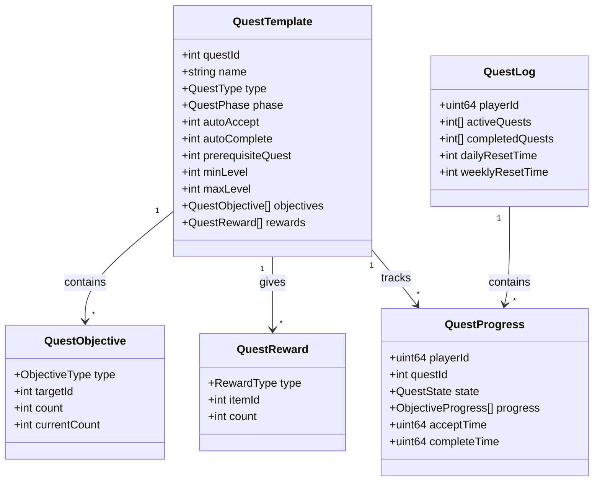

# Q48: 如何设计任务系统？

## 问题分析

本题考察对任务系统的理解：
- 任务数据模型设计
- 任务状态管理
- 任务条件检测
- 奖励发放机制

---

## 一、任务系统架构

### 1.1 系统组成

```
┌─────────────────────────────────────────────────────────────┐
│                    任务系统架构                                │
├─────────────────────────────────────────────────────────────┤
│                                                             │
│  任务类型:                                                   │
│  ├── 主线任务 (Main Quest) - 推动剧情                       │
│  ├── 支线任务 (Side Quest) - 额外奖励                       │
│  ├── 日常任务 (Daily Quest) - 每日重置                      │
│  ├── 周常任务 (Weekly Quest) - 每周重置                     │
│  ├── 成就任务 (Achievement) - 长期目标                      │
│  ├── 环形任务 (Chain Quest) - 连锁任务                      │
│  └── 动态任务 (Dynamic Quest) - 触发式                      │
│                                                             │
│  任务状态:                                                   │
│  ├── NOT_STARTED - 未接取                                   │
│  ├── ACCEPTED - 已接取                                      │
│  ├── IN_PROGRESS - 进行中                                   │
│  ├── COMPLETED - 已完成                                     │
│  ├── SUBMITTED - 已提交                                     │
│  └── FAILED - 已失败                                        │
│                                                             │
│  任务流程:                                                   │
│  ┌─────────────────────────────────────────────────┐       │
│  │  1. 任务接取                                       │       │
│  │     ├── NPC对话接取                                │       │
│  │     ├── 自动接取 (达到条件)                         │       │
│  │     └── 物品触发接取                                │       │
│  │     │                                              │       │
│  │     ▼                                              │       │
│  │  2. 任务目标                                       │       │
│  │     ├── 击杀怪物                                   │       │
│  │     ├── 收集物品                                   │       │
│  │     ├── 与NPC对话                                   │       │
│  │     ├── 探索区域                                   │       │
│  │     ├── 使用物品                                   │       │
│  │     └── 护送任务                                   │       │
│  │     │                                              │       │
│  │     ▼                                              │       │
│  │  3. 任务完成                                       │       │
│  │     ├── 达成所有目标                                │       │
│  │     │                                              │       │
│  │     ▼                                              │       │
│  │  4. 任务提交                                       │       │
│  │     ├── 找NPC提交                                   │       │
│  │     ├── 自动提交                                    │       │
│  │     └── 远程提交                                    │       │
│  │     │                                              │       │
│  │     ▼                                              │       │
│  │  5. 领取奖励                                       │       │
│  └─────────────────────────────────────────────────┘       │
│                                                             │
└─────────────────────────────────────────────────────────────┘
```

### 1.2 任务数据关系



---

## 二、数据模型设计

### 2.1 数据库表结构

```sql
-- 任务模板表
CREATE TABLE `quest_template` (
    `id` INT UNSIGNED NOT NULL AUTO_INCREMENT,
    `name` VARCHAR(128) NOT NULL COMMENT '任务名称',
    `type` TINYINT UNSIGNED NOT NULL DEFAULT 0 COMMENT '任务类型:0主线,1支线,2日常,3周常,4成就',
    `phase` TINYINT UNSIGNED NOT NULL DEFAULT 0 COMMENT '任务阶段',
    `auto_accept` TINYINT UNSIGNED NOT NULL DEFAULT 0 COMMENT '是否自动接取',
    `auto_complete` TINYINT UNSIGNED NOT NULL DEFAULT 0 COMMENT '是否自动完成',
    `prerequisite_quest` INT UNSIGNED DEFAULT NULL COMMENT '前置任务ID',
    `prerequisite_level` TINYINT UNSIGNED DEFAULT 1 COMMENT '需求等级',
    `max_level` TINYINT UNSIGNED DEFAULT 0 COMMENT '最高等级限制(0表示不限)',
    `accept_npc` INT UNSIGNED DEFAULT NULL COMMENT '接取NPC',
    `submit_npc` INT UNSIGNED DEFAULT NULL COMMENT '提交NPC',
    `next_quest` INT UNSIGNED DEFAULT NULL COMMENT '后续任务ID',
    `time_limit` INT UNSIGNED DEFAULT 0 COMMENT '时间限制(秒,0表示不限)',
    `shareable` TINYINT UNSIGNED NOT NULL DEFAULT 1 COMMENT '是否可共享',
    `description` TEXT DEFAULT NULL COMMENT '任务描述',
    `objective_data` JSON NOT NULL COMMENT '目标数据',
    `reward_data` JSON NOT NULL COMMENT '奖励数据',
    `exp_reward` INT UNSIGNED NOT NULL DEFAULT 0 COMMENT '经验奖励',
    `gold_reward` INT UNSIGNED NOT NULL DEFAULT 0 COMMENT '金币奖励',
    PRIMARY KEY (`id`),
    KEY `idx_type` (`type`),
    KEY `idx_prerequisite` (`prerequisite_quest`),
    KEY `idx_accept_npc` (`accept_npc`)
) ENGINE=InnoDB DEFAULT CHARSET=utf8mb4 COMMENT='任务模板表';

-- 玩家任务进度表
CREATE TABLE `player_quest` (
    `id` BIGINT UNSIGNED NOT NULL AUTO_INCREMENT,
    `player_id` BIGINT UNSIGNED NOT NULL COMMENT '玩家ID',
    `quest_id` INT UNSIGNED NOT NULL COMMENT '任务ID',
    `state` TINYINT UNSIGNED NOT NULL DEFAULT 0 COMMENT '0:进行中,1:已完成,2:已提交',
    `objective_progress` JSON NOT NULL COMMENT '目标进度',
    `accept_time` DATETIME NOT NULL DEFAULT CURRENT_TIMESTAMP COMMENT '接取时间',
    `complete_time` DATETIME DEFAULT NULL COMMENT '完成时间',
    `submit_time` DATETIME DEFAULT NULL COMMENT '提交时间',
    `expire_time` DATETIME DEFAULT NULL COMMENT '过期时间',
    PRIMARY KEY (`id`),
    UNIQUE KEY `uk_player_quest` (`player_id`, `quest_id`),
    KEY `idx_player_id` (`player_id`),
    KEY `idx_state` (`state`)
) ENGINE=InnoDB DEFAULT CHARSET=utf8mb4 COMMENT='玩家任务进度表';

-- 任务完成记录表 (用于已完成任务查询)
CREATE TABLE `player_quest_completed` (
    `player_id` BIGINT UNSIGNED NOT NULL COMMENT '玩家ID',
    `quest_id` INT UNSIGNED NOT NULL COMMENT '任务ID',
    `complete_count` INT UNSIGNED NOT NULL DEFAULT 1 COMMENT '完成次数',
    `last_complete_time` DATETIME NOT NULL DEFAULT CURRENT_TIMESTAMP ON UPDATE CURRENT_TIMESTAMP COMMENT '最后完成时间',
    PRIMARY KEY (`player_id`, `quest_id`),
    KEY `idx_player_id` (`player_id`)
) ENGINE=InnoDB DEFAULT CHARSET=utf8mb4 COMMENT='任务完成记录表';
```

### 2.2 数据结构

```cpp
// 任务系统数据结构

enum class QuestType {
    MAIN = 0,            // 主线任务
    SIDE = 1,            // 支线任务
    DAILY = 2,           // 日常任务
    WEEKLY = 3,          // 周常任务
    ACHIEVEMENT = 4,     // 成就任务
    CHAIN = 5,           // 环形任务
    DYNAMIC = 6,         // 动态任务
};

enum class QuestState {
    NOT_STARTED = 0,     // 未接取
    ACCEPTED = 1,        // 已接取
    IN_PROGRESS = 2,     // 进行中
    COMPLETED = 3,       // 已完成
    SUBMITTED = 4,       // 已提交
    FAILED = 5,          // 已失败
};

enum class ObjectiveType {
    KILL_MONSTER = 0,    // 击杀怪物
    COLLECT_ITEM = 1,    // 收集物品
    TALK_TO_NPC = 2,     // 与NPC对话
    ENTER_AREA = 3,      // 进入区域
    USE_ITEM = 4,        // 使用物品
    ESCORT_NPC = 5,      // 护送NPC
    CRAFT_ITEM = 6,      // 制作物品
    REACH_LEVEL = 7,     // 达到等级
    REACH_EXP = 8,       // 获得经验
};

enum class RewardType {
    ITEM = 0,            // 物品
    EXP = 1,             // 经验
    GOLD = 2,            // 金币
    DIAMOND = 3,         // 钻石
    BUFF = 4,            // Buff
    TITLE = 5,           // 称号
    SKILL = 6,           // 技能
};

// 任务目标
struct QuestObjective {
    ObjectiveType type;
    int targetId;              // 目标ID (怪物ID、物品ID、NPC ID等)
    int targetCount;           // 目标数量
    int currentCount;          // 当前数量
    std::string description;   // 描述

    bool isCompleted() const {
        return currentCount >= targetCount;
    }
};

// 任务奖励
struct QuestReward {
    RewardType type;
    int id;                    // 物品ID、BuffID等
    int count;
    std::string description;
};

// 任务模板
struct QuestTemplate {
    int questId;
    std::string name;
    std::string description;
    QuestType type;
    QuestState phase;

    // 接取/提交
    bool autoAccept;
    bool autoComplete;
    int prerequisiteQuest;
    int minLevel;
    int maxLevel;
    int acceptNpc;
    int submitNpc;
    int nextQuest;

    // 限制
    uint32_t timeLimit;        // 时间限制 (秒)
    bool shareable;

    // 内容
    std::vector<QuestObjective> objectives;
    std::vector<QuestReward> rewards;

    // 基础奖励
    uint32_t expReward;
    uint32_t goldReward;
};

// 任务进度
struct QuestProgress {
    uint64_t playerId;
    int questId;
    QuestState state;
    std::vector<QuestObjective> objectives;
    uint64_t acceptTime;
    uint64_t completeTime;
    uint64_t expireTime;
};
```

---

## 三、任务系统实现

### 3.1 任务管理器

```cpp
// 任务系统

class QuestSystem {
public:
    // 初始化任务系统
    void initialize() {
        loadAllQuestTemplates();
        checkAutoAcceptQuests();
    }

    // 加载所有任务模板
    void loadAllQuestTemplates() {
        auto results = database_->query("SELECT * FROM quest_template");

        for (const auto& row : results) {
            QuestTemplate template;
            template.questId = row["id"].get<int>();
            template.name = row["name"].get<std::string>();
            template.type = static_cast<QuestType>(row["type"].get<int>());
            template.autoAccept = row["auto_accept"].get<bool>();
            template.autoComplete = row["auto_complete"].get<bool>();
            template.prerequisiteQuest = row["prerequisite_quest"].get<int>();
            template.minLevel = row["prerequisite_level"].get<int>();
            template.acceptNpc = row["accept_npc"].get<int>();
            template.submitNpc = row["submit_npc"].get<int>();
            template.nextQuest = row["next_quest"].get<int>();
            template.timeLimit = row["time_limit"].get<uint32_t>();
            template.shareable = row["shareable"].get<bool>();
            template.expReward = row["exp_reward"].get<uint32_t>();
            template.goldReward = row["gold_reward"].get<uint32_t>();

            // 解析目标数据
            auto objectiveData = nlohmann::json::parse(row["objective_data"].get<std::string>());
            for (const auto& obj : objectiveData) {
                QuestObjective objective;
                objective.type = static_cast<ObjectiveType>(obj["type"].get<int>());
                objective.targetId = obj["target_id"].get<int>();
                objective.targetCount = obj["count"].get<int>();
                objective.currentCount = 0;
                objective.description = obj["description"].get<std::string>();
                template.objectives.push_back(objective);
            }

            // 解析奖励数据
            auto rewardData = nlohmann::json::parse(row["reward_data"].get<std::string>());
            for (const auto& reward : rewardData) {
                QuestReward r;
                r.type = static_cast<RewardType>(reward["type"].get<int>());
                r.id = reward["id"].get<int>();
                r.count = reward["count"].get<int>();
                template.rewards.push_back(r);
            }

            questTemplates_[template.questId] = template;
        }
    }

    // 检查并自动接取任务
    void checkAutoAcceptQuests() {
        // 遍历所有在线玩家
        for (auto* entity : getOnlinePlayers()) {
            checkPlayerAutoAcceptQuests(entity->getId());
        }
    }

    void checkPlayerAutoAcceptQuests(uint64_t playerId) {
        for (const auto& [questId, template] : questTemplates_) {
            if (!template.autoAccept) continue;

            // 检查是否已完成
            if (hasCompletedQuest(playerId, questId)) continue;

            // 检查是否正在做
            if (getActiveQuest(playerId, questId) != nullptr) continue;

            // 检查前置条件
            if (!canAcceptQuest(playerId, questId)) continue;

            // 自动接取
            acceptQuest(playerId, questId, true);
        }
    }

    // 接取任务
    bool acceptQuest(uint64_t playerId, int questId, bool autoAccept = false) {
        // 获取任务模板
        auto* template = getQuestTemplate(questId);
        if (!template) {
            sendError(playerId, "Quest not found");
            return false;
        }

        // 检查是否已完成
        if (hasCompletedQuest(playerId, questId) &&
            template->type != QuestType::DAILY &&
            template->type != QuestType::WEEKLY) {
            sendError(playerId, "Quest already completed");
            return false;
        }

        // 检查是否正在进行
        if (getActiveQuest(playerId, questId) != nullptr) {
            sendError(playerId, "Quest already in progress");
            return false;
        }

        // 检查接取条件
        if (!autoAccept && !canAcceptQuest(playerId, questId)) {
            return false;
        }

        // 创建任务进度
        QuestProgress progress;
        progress.playerId = playerId;
        progress.questId = questId;
        progress.state = QuestState::ACCEPTED;
        progress.objectives = template->objectives;  // 复制目标
        progress.acceptTime = getCurrentTime();

        // 设置过期时间
        if (template->timeLimit > 0) {
            progress.expireTime = progress.acceptTime + template->timeLimit * 1000;
        }

        // 保存到数据库
        database_->execute(fmt::format(
            "INSERT INTO player_quest "
            "(player_id, quest_id, state, objective_progress, accept_time, expire_time) "
            "VALUES ({}, {}, 0, '{}', NOW(), FROM_UNIXTIME({}))",
            playerId, questId, serializeObjectives(progress.objectives),
            progress.expireTime / 1000
        ));

        // 加载到内存
        addActiveQuest(playerId, progress);

        // 通知客户端
        sendToClient(playerId, "onQuestAccepted", questId, template->name);

        // 触发接取事件
        onQuestEvent(playerId, questId, "accept");

        return true;
    }

    // 放弃任务
    bool abandonQuest(uint64_t playerId, int questId) {
        QuestProgress* progress = getActiveQuest(playerId, questId);
        if (!progress) {
            return false;
        }

        // 主线任务不能放弃
        auto* template = getQuestTemplate(questId);
        if (template && template->type == QuestType::MAIN) {
            sendError(playerId, "Cannot abandon main quest");
            return false;
        }

        // 删除任务进度
        database_->execute(fmt::format(
            "DELETE FROM player_quest WHERE player_id = {} AND quest_id = {}",
            playerId, questId
        ));

        // 从内存移除
        removeActiveQuest(playerId, questId);

        // 通知客户端
        sendToClient(playerId, "onQuestAbandoned", questId);

        return true;
    }

    // 更新任务目标进度
    void updateObjectiveProgress(uint64_t playerId, ObjectiveType type,
                               int targetId, int count = 1) {
        auto* activeQuests = getPlayerActiveQuests(playerId);
        if (!activeQuests) return;

        for (auto& [questId, progress] : *activeQuests) {
            if (progress.state != QuestState::ACCEPTED &&
                progress.state != QuestState::IN_PROGRESS) {
                continue;
            }

            bool updated = false;
            bool allCompleted = true;

            for (auto& objective : progress.objectives) {
                // 检查目标类型
                if (objective.type != type) {
                    if (!objective.isCompleted()) {
                        allCompleted = false;
                    }
                    continue;
                }

                // 检查目标ID (0表示任意)
                if (objective.targetId != 0 && objective.targetId != targetId) {
                    if (!objective.isCompleted()) {
                        allCompleted = false;
                    }
                    continue;
                }

                // 已完成的目标跳过
                if (objective.isCompleted()) {
                    continue;
                }

                // 更新进度
                objective.currentCount += count;
                objective.currentCount = std::min(objective.currentCount,
                                                  objective.targetCount);
                updated = true;

                // 检查是否完成
                if (!objective.isCompleted()) {
                    allCompleted = false;
                }

                // 通知单个目标更新
                sendToClient(playerId, "onQuestObjectiveUpdate",
                           questId, objective.targetId,
                           objective.currentCount, objective.targetCount);
            }

            if (updated) {
                // 更新数据库
                database_->execute(fmt::format(
                    "UPDATE player_quest SET objective_progress = '{}' "
                    "WHERE player_id = {} AND quest_id = {}",
                    serializeObjectives(progress.objectives), playerId, questId
                ));

                // 检查任务是否完成
                if (allCompleted) {
                    completeQuest(playerId, questId);
                } else {
                    progress.state = QuestState::IN_PROGRESS;
                }
            }
        }
    }

    // 完成任务
    void completeQuest(uint64_t playerId, int questId) {
        QuestProgress* progress = getActiveQuest(playerId, questId);
        if (!progress) return;

        auto* template = getQuestTemplate(questId);
        if (!template) return;

        progress.state = QuestState::COMPLETED;
        progress.completeTime = getCurrentTime();

        // 更新数据库
        database_->execute(fmt::format(
            "UPDATE player_quest SET state = 3, complete_time = NOW() "
            "WHERE player_id = {} AND quest_id = {}",
            playerId, questId
        ));

        // 通知客户端
        sendToClient(playerId, "onQuestCompleted", questId);

        // 自动提交
        if (template->autoComplete) {
            submitQuest(playerId, questId);
        }

        // 触发完成事件
        onQuestEvent(playerId, questId, "complete");

        // 检查后续任务
        if (template->nextQuest > 0) {
            checkPlayerAutoAcceptQuests(playerId);
        }
    }

    // 提交任务
    bool submitQuest(uint64_t playerId, int questId) {
        QuestProgress* progress = getActiveQuest(playerId, questId);
        if (!progress || progress->state != QuestState::COMPLETED) {
            sendError(playerId, "Quest not completed yet");
            return false;
        }

        auto* template = getQuestTemplate(questId);
        if (!template) return false;

        // 检查是否在提交NPC处
        if (!template->autoComplete && template->submitNpc > 0) {
            if (!isNearNpc(playerId, template->submitNpc)) {
                sendError(playerId, "Too far from quest NPC");
                return false;
            }
        }

        // 发放奖励
        giveQuestRewards(playerId, *template);

        // 更新状态
        progress->state = QuestState::SUBMITTED;

        database_->execute(fmt::format(
            "UPDATE player_quest SET state = 4, submit_time = NOW() "
            "WHERE player_id = {} AND quest_id = {}",
            playerId, questId
        ));

        // 记录完成
        database_->execute(fmt::format(
            "INSERT INTO player_quest_completed (player_id, quest_id, complete_count) "
            "VALUES ({}, {}, 1) "
            "ON DUPLICATE KEY UPDATE complete_count = complete_count + 1, last_complete_time = NOW()",
            playerId, questId
        ));

        // 从活跃任务移除
        removeActiveQuest(playerId, questId);

        // 通知客户端
        sendToClient(playerId, "onQuestSubmitted", questId);

        // 触发提交事件
        onQuestEvent(playerId, questId, "submit");

        // 检查可接取的新任务
        checkPlayerAutoAcceptQuests(playerId);

        return true;
    }

    // 共享任务
    bool shareQuest(uint64_t playerId, int questId, uint64_t targetId) {
        QuestProgress* progress = getActiveQuest(playerId, questId);
        if (!progress) return false;

        auto* template = getQuestTemplate(questId);
        if (!template || !template->shareable) {
            sendError(playerId, "Quest cannot be shared");
            return false;
        }

        // 检查目标玩家
        auto* targetEntity = getEntity(targetId);
        if (!targetEntity) return false;

        // 检查距离
        if (!isInRange(playerId, targetId, 20.0f)) {
            sendError(playerId, "Target too far away");
            return false;
        }

        // 检查目标玩家是否已接取/完成
        if (getActiveQuest(targetId, questId) != nullptr) {
            sendError(playerId, "Target already has this quest");
            return false;
        }

        if (hasCompletedQuest(targetId, questId)) {
            sendError(playerId, "Target already completed this quest");
            return false;
        }

        // 检查目标玩家能否接取
        if (!canAcceptQuest(targetId, questId)) {
            sendError(playerId, "Target cannot accept this quest");
            return false;
        }

        // 发送共享请求
        sendToClient(targetId, "onQuestShareRequest",
                   playerId, getPlayerName(playerId), questId, template->name);

        return true;
    }

    // 获取玩家任务列表
    std::vector<QuestProgress> getPlayerQuests(uint64_t playerId) {
        std::vector<QuestProgress> result;

        auto* activeQuests = getPlayerActiveQuests(playerId);
        if (activeQuests) {
            for (const auto& [questId, progress] : *activeQuests) {
                result.push_back(progress);
            }
        }

        return result;
    }

    // 获取可接取任务列表
    std::vector<QuestTemplate> getAvailableQuests(uint64_t playerId, int npcId = 0) {
        std::vector<QuestTemplate> result;

        for (const auto& [questId, template] : questTemplates_) {
            // 检查NPC
            if (npcId > 0 && template.acceptNpc != npcId) {
                continue;
            }

            // 检查是否可接取
            if (!canAcceptQuest(playerId, questId)) {
                continue;
            }

            result.push_back(template);
        }

        return result;
    }

    // 每日重置
    void dailyReset() {
        // 清除日常任务进度
        database_->execute(
            "DELETE FROM player_quest WHERE quest_id IN "
            "(SELECT id FROM quest_template WHERE type = 2) "
            "AND state < 3"
        );

        // 清除内存中的日常任务
        for (auto& [playerId, quests] : playerQuests_) {
            for (auto it = quests.begin(); it != quests.end(); ) {
                auto* template = getQuestTemplate(it->first);
                if (template && template->type == QuestType::DAILY) {
                    it = quests.erase(it);
                } else {
                    ++it;
                }
            }
        }

        // 通知所有在线玩家
        broadcastToAll("onDailyQuestReset");
    }

private:
    bool canAcceptQuest(uint64_t playerId, int questId) {
        auto* template = getQuestTemplate(questId);
        if (!template) return false;

        auto* entity = getEntity(playerId);
        if (!entity) return false;

        // 检查等级
        if (entity->getLevel() < template->minLevel) {
            return false;
        }

        if (template->maxLevel > 0 && entity->getLevel() > template->maxLevel) {
            return false;
        }

        // 检查前置任务
        if (template->prerequisiteQuest > 0) {
            if (!hasCompletedQuest(playerId, template->prerequisiteQuest)) {
                return false;
            }
        }

        // 检查是否已完成 (非日常/周常)
        if (template->type != QuestType::DAILY &&
            template->type != QuestType::WEEKLY) {
            if (hasCompletedQuest(playerId, questId)) {
                return false;
            }
        }

        return true;
    }

    bool hasCompletedQuest(uint64_t playerId, int questId) {
        auto results = database_->query(fmt::format(
            "SELECT 1 FROM player_quest_completed WHERE player_id = {} AND quest_id = {}",
            playerId, questId
        ));
        return !results.empty();
    }

    void giveQuestRewards(uint64_t playerId, const QuestTemplate& template) {
        // 基础奖励
        if (template.expReward > 0) {
            addExp(playerId, template.expReward);
        }
        if (template.goldReward > 0) {
            addGold(playerId, template.goldReward);
        }

        // 额外奖励
        for (const auto& reward : template.rewards) {
            switch (reward.type) {
                case RewardType::ITEM:
                    addItem(playerId, reward.id, reward.count);
                    break;
                case RewardType::EXP:
                    addExp(playerId, reward.count);
                    break;
                case RewardType::GOLD:
                    addGold(playerId, reward.count);
                    break;
                case RewardType::DIAMOND:
                    addDiamond(playerId, reward.count);
                    break;
                case RewardType::BUFF:
                    addBuff(playerId, reward.id, reward.count);
                    break;
                case RewardType::TITLE:
                    grantTitle(playerId, reward.id);
                    break;
                case RewardType::SKILL:
                    teachSkill(playerId, reward.id);
                    break;
            }
        }
    }

    void onQuestEvent(uint64_t playerId, int questId, const std::string& event) {
        // 触发任务相关事件
        DEBUG("Quest event: player={}, quest={}, event={}", playerId, questId, event);
    }

    std::unordered_map<int, QuestTemplate> questTemplates_;
    std::unordered_map<uint64_t, std::unordered_map<int, QuestProgress>> playerQuests_;
};

// 游戏事件中调用任务系统更新
void onMonsterKilled(uint64_t killerId, int monsterId) {
    questSystem->updateObjectiveProgress(killerId, ObjectiveType::KILL_MONSTER, monsterId);
}

void onItemCollected(uint64_t playerId, int itemId, int count) {
    questSystem->updateObjectiveProgress(playerId, ObjectiveType::COLLECT_ITEM, itemId, count);
}

void onNpcTalked(uint64_t playerId, int npcId) {
    questSystem->updateObjectiveProgress(playerId, ObjectiveType::TALK_TO_NPC, npcId);
}

void onAreaEntered(uint64_t playerId, int areaId) {
    questSystem->updateObjectiveProgress(playerId, ObjectiveType::ENTER_AREA, areaId);
}
```

---

## 四、最佳实践

### 4.1 任务系统设计建议

| 实践 | 说明 |
|------|------|
| **数据驱动** | 任务配置化，便于策划调整 |
| **事件驱动** | 通过游戏事件自动更新进度 |
| **缓存优化** | 任务模板常驻内存 |
| **异步处理** | 任务检查异步执行 |
| **状态追踪** | 详细记录任务状态变化 |

### 4.2 性能优化

```
优化策略:
1. 任务模板只加载一次
2. 活跃任务内存缓存
3. 进度更新批量处理
4. 日常任务延迟加载
5. 完成记录定期归档
```

---

## 五、总结

### 任务系统核心

```
任务系统 = 模板配置 + 进度追踪 + 事件驱动 + 奖励发放
- 任务模板定义内容和规则
- 进度追踪玩家完成状态
- 事件驱动自动更新目标
- 奖励发放激励玩家参与
```

---

## 参考资料

- [魔兽世界任务系统](https://wowpedia.fandom.com/)
- [游戏任务设计指南](https://www.gamedev.net/)
