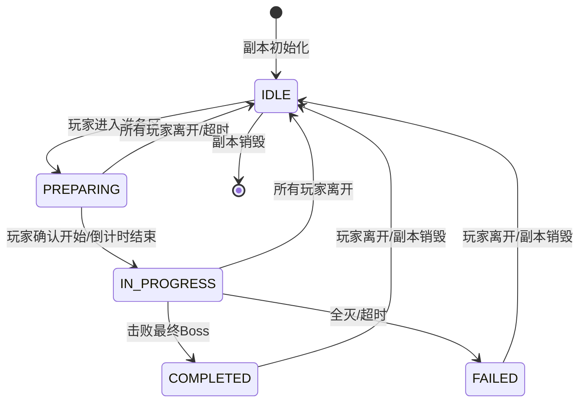

# Q49: 如何设计副本系统？

## 问题分析

本题考察对副本系统的理解：
- 副本类型与设计
- 副本创建与销毁
- 队伍匹配机制
- 副本进度保存

---

## 一、副本系统架构

### 1.1 副本类型

```
┌─────────────────────────────────────────────────────────────┐
│                    副本类型分类                                │
├─────────────────────────────────────────────────────────────┤
│                                                             │
│  按进入方式:                                                 │
│  ├── 单人副本 (Solo Instance)                               │
│  │   └── 玩家独自挑战，获取个人奖励                          │
│  ├── 组队副本 (Party Instance)                              │
│  │   └── 3-5人小队挑战，需要配合                            │
│  ├── 团队副本 (Raid Instance)                               │
│  │   └── 10-40人团队挑战，高难度                            │
│  └── 跨服副本 (Cross-Server Instance)                       │
│      └── 跨服匹配，缓解单服压力                              │
│                                                             │
│  按重置方式:                                                 │
│  ├── 普通副本 (Normal) - 随时可进                            │
│  ├── 日常副本 (Daily) - 每日重置次数                         │
│  ├── 周常副本 (Weekly) - 每周重置次数                        │
│  └── 一次性副本 (One-time) - 只能完成一次                    │
│                                                             │
│  按难度等级:                                                 │
│  ├── 普通模式 (Normal)                                      │
│  ├── 困难模式 (Hard)                                        │
│  ├── 史诗模式 (Epic)                                        │
│  └── 地狱模式 (Hell)                                        │
│                                                             │
└─────────────────────────────────────────────────────────────┘
```

### 1.2 副本生命周期



---

## 二、数据模型设计

### 2.1 数据库表结构

```sql
-- 副本模板表
CREATE TABLE `instance_template` (
    `id` INT UNSIGNED NOT NULL AUTO_INCREMENT,
    `name` VARCHAR(64) NOT NULL COMMENT '副本名称',
    `type` TINYINT UNSIGNED NOT NULL DEFAULT 0 COMMENT '类型:0单人,1组队,2团队',
    `min_players` TINYINT UNSIGNED NOT NULL DEFAULT 1 COMMENT '最少人数',
    `max_players` TINYINT UNSIGNED NOT NULL DEFAULT 5 COMMENT '最多人数',
    `min_level` TINYINT UNSIGNED NOT NULL DEFAULT 1 COMMENT '最低等级',
    `max_level` TINYINT UNSIGNED DEFAULT 0 COMMENT '最高等级(0不限)',
    `difficulty` TINYINT UNSIGNED NOT NULL DEFAULT 0 COMMENT '难度:0普通,1困难,2史诗',
    `reset_type` TINYINT UNSIGNED NOT NULL DEFAULT 0 COMMENT '重置类型:0随时,1日常,2周常',
    `daily_count` TINYINT UNSIGNED NOT NULL DEFAULT 0 COMMENT '每日次数',
    `weekly_count` TINYINT UNSIGNED NOT NULL DEFAULT 0 COMMENT '每周次数',
    `time_limit` INT UNSIGNED DEFAULT 0 COMMENT '时间限制(秒,0不限)',
    `map_id` INT UNSIGNED NOT NULL COMMENT '地图ID',
    `enter_pos_x` FLOAT NOT NULL DEFAULT 0 COMMENT '进入位置X',
    `enter_pos_y` FLOAT NOT NULL DEFAULT 0 COMMENT '进入位置Y',
    `enter_pos_z` FLOAT NOT NULL DEFAULT 0 COMMENT '进入位置Z',
    `boss_data` JSON NOT NULL COMMENT 'Boss配置',
    `reward_data` JSON NOT NULL COMMENT '奖励配置',
    PRIMARY KEY (`id`),
    KEY `idx_type` (`type`)
) ENGINE=InnoDB DEFAULT CHARSET=utf8mb4 COMMENT='副本模板表';

-- 副本实例表
CREATE TABLE `instance_record` (
    `id` BIGINT UNSIGNED NOT NULL AUTO_INCREMENT,
    `instance_id` BIGINT UNSIGNED NOT NULL COMMENT '副本实例ID',
    `template_id` INT UNSIGNED NOT NULL COMMENT '副本模板ID',
    `owner_id` BIGINT UNSIGNED DEFAULT NULL COMMENT '所属者ID(单人)',
    `team_id` BIGINT UNSIGNED DEFAULT NULL COMMENT '队伍ID(组队)',
    `difficulty` TINYINT UNSIGNED NOT NULL DEFAULT 0 COMMENT '难度',
    `state` TINYINT UNSIGNED NOT NULL DEFAULT 0 COMMENT '0:准备中,1:进行中,2:已完成,3:已失败',
    `create_time` DATETIME NOT NULL DEFAULT CURRENT_TIMESTAMP COMMENT '创建时间',
    `start_time` DATETIME DEFAULT NULL COMMENT '开始时间',
    `end_time` DATETIME DEFAULT NULL COMMENT '结束时间',
    `progress_data` JSON DEFAULT NULL COMMENT '进度数据',
    `player_data` JSON DEFAULT NULL COMMENT '玩家数据',
    PRIMARY KEY (`id`),
    UNIQUE KEY `uk_instance_id` (`instance_id`),
    KEY `idx_template_id` (`template_id`),
    KEY `idx_owner_id` (`owner_id`),
    KEY `idx_team_id` (`team_id`)
) ENGINE=InnoDB DEFAULT CHARSET=utf8mb4 COMMENT='副本实例表';

-- 玩家副本记录表
CREATE TABLE `player_instance` (
    `id` BIGINT UNSIGNED NOT NULL AUTO_INCREMENT,
    `player_id` BIGINT UNSIGNED NOT NULL COMMENT '玩家ID',
    `template_id` INT UNSIGNED NOT NULL COMMENT '副本模板ID',
    `difficulty` TINYINT UNSIGNED NOT NULL DEFAULT 0 COMMENT '难度',
    `daily_count` TINYINT UNSIGNED NOT NULL DEFAULT 0 COMMENT '今日已次数',
    `weekly_count` TINYINT UNSIGNED NOT NULL DEFAULT 0 COMMENT '本周已次数',
    `best_time` INT UNSIGNED DEFAULT NULL COMMENT '最佳用时(秒)',
    `last_reset_time` DATETIME NOT NULL DEFAULT CURRENT_TIMESTAMP COMMENT '上次重置时间',
    `progress_data` JSON DEFAULT NULL COMMENT '进度数据',
    PRIMARY KEY (`id`),
    UNIQUE KEY `uk_player_template_difficulty` (`player_id`, `template_id`, `difficulty`),
    KEY `idx_player_id` (`player_id`)
) ENGINE=InnoDB DEFAULT CHARSET=utf8mb4 COMMENT='玩家副本记录表';
```

### 2.2 数据结构

```cpp
// 副本系统数据结构

enum class InstanceType {
    SOLO = 0,            // 单人
    PARTY = 1,           // 组队
    RAID = 2,            // 团队
    CROSS_SERVER = 3,    // 跨服
};

enum class ResetType {
    ALWAYS = 0,          // 随时可进
    DAILY = 1,           // 日常
    WEEKLY = 2,          // 周常
    MONTHLY = 3,         // 月常
    ONCE = 4,            // 一次性
};

enum class InstanceState {
    PREPARING = 0,       // 准备中
    IN_PROGRESS = 1,     // 进行中
    COMPLETED = 2,       // 已完成
    FAILED = 3,          // 已失败
};

enum class Difficulty {
    NORMAL = 0,          // 普通
    HARD = 1,            // 困难
    EPIC = 2,            // 史诗
    HELL = 3,            // 地狱
};

// 副本模板
struct InstanceTemplate {
    int templateId;
    std::string name;
    InstanceType type;
    int minPlayers;
    int maxPlayers;
    int minLevel;
    int maxLevel;
    ResetType resetType;
    int dailyCount;
    int weeklyCount;
    uint32_t timeLimit;
    int mapId;
    Vector3 enterPos;

    struct BossConfig {
        int bossId;
        Vector3 position;
        int level;
        uint64_t hp;
        std::vector<int> skillIds;
    };
    std::vector<BossConfig> bosses;
};

// 副本实例
struct InstanceRecord {
    uint64_t instanceId;
    int templateId;
    uint64_t ownerId;            // 单人副本所有者
    uint64_t teamId;             // 组队副本队伍ID
    Difficulty difficulty;
    InstanceState state;
    uint64_t createTime;
    uint64_t startTime;
    uint64_t endTime;

    // 进度数据
    struct BossProgress {
        int bossId;
        bool killed;
        uint64_t killTime;
    };
    std::vector<BossProgress> bossProgress;

    // 玩家列表
    std::vector<uint64_t> players;
};

// 玩家副本记录
struct PlayerInstanceRecord {
    uint64_t playerId;
    int templateId;
    Difficulty difficulty;
    int dailyCount;
    int weeklyCount;
    uint32_t bestTime;
    uint64_t lastResetTime;

    // 保存的进度 (用于断点续玩)
    nlohmann::json progressData;
};
```

---

## 三、副本系统实现

### 3.1 副本管理器

```cpp
// 副本系统

class InstanceSystem {
public:
    static constexpr uint32_t INSTANCE_PREPARE_TIMEOUT = 300;  // 5分钟准备时间
    static constexpr uint32_t IDLE_DESTROY_TIMEOUT = 30;      // 30秒无玩家销毁

    // 进入副本
    bool enterInstance(uint64_t playerId, int templateId, Difficulty difficulty) {
        // 1. 获取副本模板
        auto* tmpl = getInstanceTemplate(templateId);
        if (!tmpl) {
            sendError(playerId, "Instance not found");
            return false;
        }

        // 2. 检查玩家条件
        if (!canEnterInstance(playerId, tmpl, difficulty)) {
            return false;
        }

        // 3. 检查是否有已有副本实例
        uint64_t instanceId = getPlayerInstanceId(playerId, templateId, difficulty);

        if (instanceId == 0) {
            // 创建新副本
            instanceId = createInstance(playerId, tmpl, difficulty);
            if (instanceId == 0) {
                return false;
            }
        }

        // 4. 获取副本实例
        auto* instance = getInstance(instanceId);
        if (!instance) {
            return false;
        }

        // 5. 检查副本状态
        if (instance->state == InstanceState::COMPLETED ||
            instance->state == InstanceState::FAILED) {
            sendError(playerId, "Instance already finished");
            return false;
        }

        // 6. 传送玩家进入副本
        teleportToInstance(playerId, instanceId, tmpl->enterPos);

        // 7. 添加玩家到副本
        addPlayerToInstance(instanceId, playerId);

        // 8. 通知客户端
        sendToClient(playerId, "onEnterInstance", instanceId, tmpl->name);

        // 9. 如果是单人副本且玩家准备好，自动开始
        if (tmpl->type == InstanceType::SOLO) {
            startInstance(instanceId);
        }

        return true;
    }

    // 离开副本
    bool leaveInstance(uint64_t playerId) {
        uint64_t instanceId = getPlayerCurrentInstance(playerId);
        if (instanceId == 0) {
            return false;
        }

        auto* instance = getInstance(instanceId);
        if (!instance) {
            return false;
        }

        // 从副本移除玩家
        removePlayerFromInstance(instanceId, playerId);

        // 获取副本模板
        auto* tmpl = getInstanceTemplate(instance->templateId);

        // 传送玩家回原位置
        teleportFromInstance(playerId, instanceId);

        // 清除玩家当前副本
        clearPlayerCurrentInstance(playerId);

        // 通知客户端
        sendToClient(playerId, "onLeaveInstance", instanceId);

        // 检查副本是否还有玩家
        if (instance->players.empty()) {
            // 启动销毁定时器
            scheduleInstanceDestroy(instanceId, IDLE_DESTROY_TIMEOUT);
        }

        return true;
    }

    // 开始副本 (组队副本队长手动开始)
    bool startInstance(uint64_t instanceId) {
        auto* instance = getInstance(instanceId);
        if (!instance || instance->state != InstanceState::PREPARING) {
            return false;
        }

        auto* tmpl = getInstanceTemplate(instance->templateId);

        // 检查人数
        if (instance->players.size() < tmpl->minPlayers) {
            sendError(instance->players[0], "Not enough players");
            return false;
        }

        // 开始副本
        instance->state = InstanceState::IN_PROGRESS;
        instance->startTime = getCurrentTime();

        // 保存到数据库
        database_->execute(fmt::format(
            "UPDATE instance_record SET state = 1, start_time = NOW() WHERE instance_id = {}",
            instanceId
        ));

        // 初始化副本内容
        initializeInstanceContent(instanceId);

        // 通知所有玩家
        broadcastToInstance(instanceId, "onInstanceStart");

        // 设置超时检查
        if (tmpl->timeLimit > 0) {
            scheduleInstanceTimeout(instanceId, tmpl->timeLimit);
        }

        return true;
    }

    // 创建副本实例
    uint64_t createInstance(uint64_t ownerId, const InstanceTemplate* tmpl,
                           Difficulty difficulty) {
        uint64_t instanceId = generateInstanceId();

        // 创建记录
        InstanceRecord record;
        record.instanceId = instanceId;
        record.templateId = tmpl->templateId;
        record.ownerId = ownerId;
        record.teamId = 0;
        record.difficulty = difficulty;
        record.state = InstanceState::PREPARING;
        record.createTime = getCurrentTime();

        // 保存到数据库
        database_->execute(fmt::format(
            "INSERT INTO instance_record "
            "(instance_id, template_id, owner_id, difficulty, state) "
            "VALUES ({}, {}, {}, {}, 0)",
            instanceId, tmpl->templateId, ownerId, static_cast<int>(difficulty)
        ));

        // 加载到内存
        instances_[instanceId] = record;

        // 创建副本场景
        createInstanceScene(instanceId, tmpl->mapId);

        // 设置准备超时
        scheduleInstanceTimeout(instanceId, INSTANCE_PREPARE_TIMEOUT);

        return instanceId;
    }

    // Boss被击杀
    void onBossKilled(uint64_t instanceId, int bossId) {
        auto* instance = getInstance(instanceId);
        if (!instance || instance->state != InstanceState::IN_PROGRESS) {
            return;
        }

        // 更新进度
        bool bossFound = false;
        bool allBossesKilled = true;

        for (auto& progress : instance->bossProgress) {
            if (progress.bossId == bossId) {
                progress.killed = true;
                progress.killTime = getCurrentTime();
                bossFound = true;
            }
            if (!progress.killed) {
                allBossesKilled = false;
            }
        }

        if (bossFound) {
            // 保存进度
            saveInstanceProgress(instanceId);

            // 通知玩家
            broadcastToInstance(instanceId, "onBossKilled", bossId);

            // 检查是否所有Boss都击杀了
            if (allBossesKilled) {
                completeInstance(instanceId);
            }
        }
    }

    // 玩家在副本中死亡
    void onPlayerDied(uint64_t playerId) {
        uint64_t instanceId = getPlayerCurrentInstance(playerId);
        if (instanceId == 0) return;

        auto* instance = getInstance(instanceId);
        if (!instance) return;

        // 检查是否所有玩家都死亡
        bool allDead = true;
        for (uint64_t pid : instance->players) {
            auto* entity = getEntity(pid);
            if (entity && entity->isAlive()) {
                allDead = false;
                break;
            }
        }

        // 如果所有人都死亡，副本失败
        if (allDead) {
            failInstance(instanceId);
        }
    }

    // 完成副本
    void completeInstance(uint64_t instanceId) {
        auto* instance = getInstance(instanceId);
        if (!instance) return;

        instance->state = InstanceState::COMPLETED;
        instance->endTime = getCurrentTime();

        // 更新数据库
        database_->execute(fmt::format(
            "UPDATE instance_record SET state = 2, end_time = NOW() WHERE instance_id = {}",
            instanceId
        ));

        // 计算用时
        uint32_t elapsedTime = (instance->endTime - instance->startTime) / 1000;

        // 发放奖励
        for (uint64_t playerId : instance->players) {
            giveInstanceRewards(playerId, instance->templateId,
                              instance->difficulty, elapsedTime);
        }

        // 更新玩家记录
        for (uint64_t playerId : instance->players) {
            updatePlayerRecord(playerId, instance->templateId,
                             instance->difficulty, elapsedTime);
        }

        // 通知所有玩家
        broadcastToInstance(instanceId, "onInstanceComplete", elapsedTime);

        // 60秒后传送玩家出去
        schedule([this, instanceId]() {
            kickAllPlayers(instanceId);
        }, 60000);
    }

    // 副本失败
    void failInstance(uint64_t instanceId) {
        auto* instance = getInstance(instanceId);
        if (!instance) return;

        instance->state = InstanceState::FAILED;
        instance->endTime = getCurrentTime();

        // 更新数据库
        database_->execute(fmt::format(
            "UPDATE instance_record SET state = 3, end_time = NOW() WHERE instance_id = {}",
            instanceId
        ));

        // 通知所有玩家
        broadcastToInstance(instanceId, "onInstanceFailed");

        // 30秒后传送玩家出去
        schedule([this, instanceId]() {
            kickAllPlayers(instanceId);
        }, 30000);
    }

    // 获取玩家副本次数
    int getPlayerInstanceCount(uint64_t playerId, int templateId,
                              Difficulty difficulty, ResetType resetType) {
        auto record = getPlayerRecord(playerId, templateId, difficulty);
        if (!record) return 0;

        // 检查是否需要重置
        checkAndResetRecord(playerId, templateId, difficulty, resetType);

        // 重新获取
        record = getPlayerRecord(playerId, templateId, difficulty);
        if (!record) return 0;

        if (resetType == ResetType::DAILY) {
            return record->dailyCount;
        } else if (resetType == ResetType::WEEKLY) {
            return record->weeklyCount;
        }

        return 0;
    }

    // 每日重置
    void dailyReset() {
        database_->execute(
            "UPDATE player_instance SET daily_count = 0, last_reset_time = NOW()"
        );

        // 清理内存中的过期记录
        // ...
    }

    // 每周重置
    void weeklyReset() {
        database_->execute(
            "UPDATE player_instance SET weekly_count = 0"
        );

        // 清理所有进行中的周常副本
        for (auto& [instanceId, instance] : instances_) {
            auto* tmpl = getInstanceTemplate(instance.templateId);
            if (tmpl && tmpl->resetType == ResetType::WEEKLY) {
                if (instance.state == InstanceState::PREPARING ||
                    instance.state == InstanceState::IN_PROGRESS) {
                    kickAllPlayers(instanceId);
                    destroyInstance(instanceId);
                }
            }
        }
    }

private:
    bool canEnterInstance(uint64_t playerId, const InstanceTemplate* tmpl,
                         Difficulty difficulty) {
        auto* entity = getEntity(playerId);
        if (!entity) return false;

        // 检查等级
        if (entity->getLevel() < tmpl->minLevel) {
            sendError(playerId, "Level too low");
            return false;
        }

        if (tmpl->maxLevel > 0 && entity->getLevel() > tmpl->maxLevel) {
            sendError(playerId, "Level too high");
            return false;
        }

        // 检查次数
        if (tmpl->resetType == ResetType::DAILY) {
            int count = getPlayerInstanceCount(playerId, tmpl->templateId,
                                             difficulty, ResetType::DAILY);
            if (count >= tmpl->dailyCount) {
                sendError(playerId, "Daily instance limit reached");
                return false;
            }
        } else if (tmpl->resetType == ResetType::WEEKLY) {
            int count = getPlayerInstanceCount(playerId, tmpl->templateId,
                                             difficulty, ResetType::WEEKLY);
            if (count >= tmpl->weeklyCount) {
                sendError(playerId, "Weekly instance limit reached");
                return false;
            }
        }

        return true;
    }

    void giveInstanceRewards(uint64_t playerId, int templateId,
                            Difficulty difficulty, uint32_t elapsedTime) {
        auto* tmpl = getInstanceTemplate(templateId);
        if (!tmpl) return;

        // 基础奖励
        uint64_t baseExp = 1000 * (1 + static_cast<int>(difficulty));
        uint64_t baseGold = 500 * (1 + static_cast<int>(difficulty));

        addExp(playerId, baseExp);
        addGold(playerId, baseGold);

        // 首通奖励
        auto* record = getPlayerRecord(playerId, templateId, difficulty);
        if (!record || record->weeklyCount == 0) {
            // 首通额外奖励
            addItem(playerId, tmpl->templateId * 1000, 1);  // 首通奖励物品
        }

        // Boss掉落
        // ...

        // 通知客户端
        sendToClient(playerId, "onInstanceReward", baseExp, baseGold);
    }

    void updatePlayerRecord(uint64_t playerId, int templateId,
                           Difficulty difficulty, uint32_t elapsedTime) {
        auto* tmpl = getInstanceTemplate(templateId);
        if (!tmpl) return;

        // 增加次数
        if (tmpl->resetType == ResetType::DAILY) {
            database_->execute(fmt::format(
                "INSERT INTO player_instance (player_id, template_id, difficulty, daily_count) "
                "VALUES ({}, {}, {}, 1) "
                "ON DUPLICATE KEY UPDATE daily_count = daily_count + 1",
                playerId, templateId, static_cast<int>(difficulty)
            ));
        } else if (tmpl->resetType == ResetType::WEEKLY) {
            database_->execute(fmt::format(
                "INSERT INTO player_instance (player_id, template_id, difficulty, weekly_count) "
                "VALUES ({}, {}, {}, 1) "
                "ON DUPLICATE KEY UPDATE weekly_count = weekly_count + 1",
                playerId, templateId, static_cast<int>(difficulty)
            ));
        }

        // 更新最佳用时
        database_->execute(fmt::format(
            "INSERT INTO player_instance (player_id, template_id, difficulty, best_time) "
            "VALUES ({}, {}, {}, {}) "
            "ON DUPLICATE KEY UPDATE best_time = IF(best_time IS NULL OR best_time > {}, {}, best_time)",
            playerId, templateId, static_cast<int>(difficulty),
            elapsedTime, elapsedTime, elapsedTime
        ));
    }

    void checkAndResetRecord(uint64_t playerId, int templateId,
                            Difficulty difficulty, ResetType resetType) {
        auto* record = getPlayerRecord(playerId, templateId, difficulty);
        if (!record) return;

        uint64_t now = getCurrentTime();
        uint64_t lastReset = record->lastResetTime * 1000;

        if (resetType == ResetType::DAILY) {
            // 检查是否跨天
            if (!isSameDay(lastReset, now)) {
                database_->execute(fmt::format(
                    "UPDATE player_instance SET daily_count = 0, last_reset_time = NOW() "
                    "WHERE player_id = {} AND template_id = {} AND difficulty = {}",
                    playerId, templateId, static_cast<int>(difficulty)
                ));
            }
        } else if (resetType == ResetType::WEEKLY) {
            // 检查是否跨周
            if (!isSameWeek(lastReset, now)) {
                database_->execute(fmt::format(
                    "UPDATE player_instance SET weekly_count = 0 "
                    "WHERE player_id = {} AND template_id = {} AND difficulty = {}",
                    playerId, templateId, static_cast<int>(difficulty)
                ));
            }
        }
    }

    void initializeInstanceContent(uint64_t instanceId) {
        auto* instance = getInstance(instanceId);
        if (!instance) return;

        auto* tmpl = getInstanceTemplate(instance->templateId);
        if (!tmpl) return;

        // 生成Boss
        for (const auto& bossConfig : tmpl->bosses) {
            spawnBoss(instanceId, bossConfig);
        }

        // 生成怪物
        // ...

        // 生成宝箱
        // ...
    }

    void spawnBoss(uint64_t instanceId, const InstanceTemplate::BossConfig& config) {
        // 创建Boss实体
        uint64_t bossId = createEntity(config.bossId, instanceId);

        // 设置位置
        auto* entity = getEntity(bossId);
        if (entity) {
            entity->setPosition(config.position);
            entity->setLevel(config.level);
            entity->setHP(config.hp);

            // 绑定死亡回调
            entity->setOnDeathCallback([this, instanceId, bossId = config.bossId]() {
                onBossKilled(instanceId, bossId);
            });
        }
    }

    void saveInstanceProgress(uint64_t instanceId) {
        auto* instance = getInstance(instanceId);
        if (!instance) return;

        nlohmann::json progress;
        for (const auto& p : instance->bossProgress) {
            progress.push_back({
                {"boss_id", p.bossId},
                {"killed", p.killed},
                {"kill_time", p.killTime}
            });
        }

        database_->execute(fmt::format(
            "UPDATE instance_record SET progress_data = '{}' WHERE instance_id = {}",
            progress.dump(), instanceId
        ));
    }

    void kickAllPlayers(uint64_t instanceId) {
        auto* instance = getInstance(instanceId);
        if (!instance) return;

        // 复制玩家列表，因为leaveInstance会修改
        auto players = instance->players;

        for (uint64_t playerId : players) {
            leaveInstance(playerId);
        }
    }

    void destroyInstance(uint64_t instanceId) {
        auto* instance = getInstance(instanceId);
        if (!instance) return;

        // 销毁副本场景
        destroyInstanceScene(instanceId);

        // 从内存移除
        instances_.erase(instanceId);

        // 从数据库删除记录
        database_->execute(fmt::format(
            "DELETE FROM instance_record WHERE instance_id = {}",
            instanceId
        ));
    }

    void scheduleInstanceTimeout(uint64_t instanceId, uint32_t seconds) {
        timerManager_->schedule(
            seconds * 1000,
            [this, instanceId]() {
                auto* instance = getInstance(instanceId);
                if (!instance) return;

                if (instance->state == InstanceState::PREPARING) {
                    // 准备超时，销毁副本
                    kickAllPlayers(instanceId);
                    destroyInstance(instanceId);
                } else if (instance->state == InstanceState::IN_PROGRESS) {
                    // 进行中超时，失败
                    failInstance(instanceId);
                }
            }
        );
    }

    void scheduleInstanceDestroy(uint64_t instanceId, uint32_t seconds) {
        timerManager_->schedule(
            seconds * 1000,
            [this, instanceId]() {
                auto* instance = getInstance(instanceId);
                if (!instance) return;

                if (instance->players.empty()) {
                    destroyInstance(instanceId);
                }
            }
        );
    }

    std::unordered_map<int, InstanceTemplate> templates_;
    std::unordered_map<uint64_t, InstanceRecord> instances_;
    std::unordered_map<uint64_t, uint64_t> playerToInstance_;  // playerId -> instanceId
};
```

---

## 四、组队副本匹配

### 4.1 匹配系统

```cpp
// 组队副本匹配

class InstanceMatchSystem {
public:
    struct MatchTicket {
        uint64_t playerId;
        int templateId;
        Difficulty difficulty;
        int playerLevel;
        int playerClass;
        uint64_t createTime;
    };

    struct MatchGroup {
        int templateId;
        Difficulty difficulty;
        std::vector<uint64_t> players;
        uint64_t createTime;
    };

    // 加入匹配队列
    bool joinMatchQueue(uint64_t playerId, int templateId, Difficulty difficulty) {
        // 检查是否已在队列中
        if (isInQueue(playerId)) {
            return false;
        }

        // 检查是否已有队伍
        if (getTeamId(playerId) > 0) {
            return false;
        }

        // 创建匹配票
        MatchTicket ticket;
        ticket.playerId = playerId;
        ticket.templateId = templateId;
        ticket.difficulty = difficulty;
        ticket.playerLevel = getPlayerLevel(playerId);
        ticket.playerClass = getPlayerClass(playerId);
        ticket.createTime = getCurrentTime();

        matchQueue_[playerId] = ticket;

        // 尝试匹配
        tryMatch(templateId, difficulty);

        // 通知客户端
        sendToClient(playerId, "onJoinMatchQueue", templateId);

        return true;
    }

    // 离开匹配队列
    bool leaveMatchQueue(uint64_t playerId) {
        auto it = matchQueue_.find(playerId);
        if (it == matchQueue_.end()) {
            return false;
        }

        matchQueue_.erase(it);

        sendToClient(playerId, "onLeaveMatchQueue");

        return true;
    }

    // 尝试匹配
    void tryMatch(int templateId, Difficulty difficulty) {
        auto* tmpl = getInstanceTemplate(templateId);
        if (!tmpl) return;

        // 查找符合条件的玩家
        std::vector<MatchTicket> candidates;

        for (const auto& [playerId, ticket] : matchQueue_) {
            if (ticket.templateId == templateId &&
                ticket.difficulty == difficulty) {
                // 检查等级范围
                if (ticket.playerLevel >= tmpl->minLevel - 5 &&
                    ticket.playerLevel <= tmpl->maxLevel + 5) {
                    candidates.push_back(ticket);
                }
            }
        }

        // 如果人数足够，创建匹配组
        if (candidates.size() >= tmpl->minPlayers) {
            // 简单匹配：取前 N 个
            MatchGroup group;
            group.templateId = templateId;
            group.difficulty = difficulty;
            group.createTime = getCurrentTime();

            for (size_t i = 0; i < tmpl->minPlayers; ++i) {
                group.players.push_back(candidates[i].playerId);
                matchQueue_.erase(candidates[i].playerId);
            }

            // 通知所有玩家
            for (uint64_t playerId : group.players) {
                sendToClient(playerId, "onMatchSuccess", templateId);
            }

            // 创建队伍
            createTeam(group.players);

            // 传送到副本
            // ...
        }
    }

    // 定期检查匹配
    void updateMatch() {
        std::map<std::pair<int, Difficulty>, int> templateCounts;

        // 统计每个副本的等待人数
        for (const auto& [playerId, ticket] : matchQueue_) {
            auto key = std::make_pair(ticket.templateId, ticket.difficulty);
            templateCounts[key]++;
        }

        // 对人数足够的副本进行匹配
        for (const auto& [key, count] : templateCounts) {
            auto* tmpl = getInstanceTemplate(key.first);
            if (tmpl && count >= tmpl->minPlayers) {
                tryMatch(key.first, key.second);
            }
        }
    }

private:
    std::unordered_map<uint64_t, MatchTicket> matchQueue_;
};
```

---

## 五、最佳实践

### 5.1 副本系统设计建议

| 实践 | 说明 |
|------|------|
| **独立场景** | 每个副本独立场景，互不干扰 |
| **进度保存** | 支持断点续玩 |
| **难度分级** | 多种难度满足不同玩家 |
| **次数限制** | 防止无限刷奖励 |
| **异步加载** | 副本内容异步加载 |

### 5.2 性能优化

```
优化策略:
1. 空闲副本延迟销毁
2. 副本内容按需加载
3. 玩家列表定期同步
4. 奖励异步发放
5. 进度数据压缩存储
```

---

## 六、总结

### 副本系统核心

```
副本系统 = 实例管理 + 进度追踪 + 匹配系统 + 奖励发放
- 独立场景确保队伍互不干扰
- 进度保存支持断点续玩
- 匹配系统帮助玩家组队
- 次数限制控制游戏节奏
```

---

## 参考资料

- [魔兽世界副本系统](https://wowpedia.fandom.com/)
- [游戏副本设计指南](https://www.gamedev.net/)
