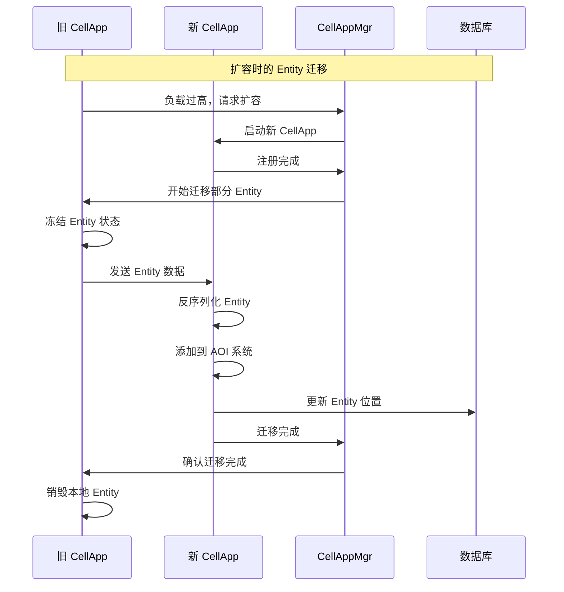

# Q5: 服务端如何设计才能支持动态扩容？

## 问题分析

本题考察服务端 **动态扩容（Dynamic Scaling）** 的设计：
- 如何架构才能支持水平扩展
- 负载均衡策略
- KBEngine/BigWorld 的具体实现和源码证据

---

## 一、动态扩容的核心概念

### 什么是动态扩容

```
静态扩容 vs 动态扩容：

┌─────────────────────────────────────────────────────────────┐
│  静态扩容（传统方式）                                        │
│                                                             │
│  服务器 A (固定) ──── 负载达到上限 ──── 停服维护 ───→        │
│  增加服务器 B ──── 重启服务 ──── 恢复                         │
│                                                             │
│  问题：                                                       │
│  - 需要停服维护                                               │
│  - 扩容不灵活                                               │
│  - 资源浪费（低峰期）                                         │
│                                                             │
└─────────────────────────────────────────────────────────────┘

┌─────────────────────────────────────────────────────────────┐
│  动态扩容（现代方式）                                        │
│                                                             │
│  服务器 A + B + C (池化)                                     │
│       │                                                      │
│       │  负载上升 ────→ 自动增加服务器 D                      │
│       │  负载下降 ────→ 自动移除服务器 D                      │
│       │                                                      │
│  优势：                                                       │
│  - 无需停服                                                 │
│  - 按需扩容/缩容                                             │
│  - 成本优化                                                 │
│                                                             │
└─────────────────────────────────────────────────────────────┘
```

### 扩容的两种类型

| 类型 | 说明 | 实现难度 |
|------|------|----------|
| **垂直扩容（Scale Up）** | 增加单机配置（CPU/内存） | 简单 |
| **水平扩容（Scale Out）** | 增加服务器数量 | 复杂 |

---

## 二、KBEngine 的动态扩容架构

### 官方设计理念

根据 [KBEngine GitHub](https://github.com/kbengine/kbengine) 官方描述：

> **底层架构被设计为多进程分布式动态负载均衡方案。理论上只需要不断扩展硬件就能够不断增加承载上限。单台机器的承载上限取决于游戏逻辑本身的复杂度。**

```
KBEngine 扩容架构：

                    ┌─────────────────────────────────────┐
                    │         KBEngine 集群                 │
                    │                                     │
                    │  ┌──────────┐  ┌──────────┐         │
                    │  │ LoginApp │  │ BaseApp  │         │
                    │  │  (可扩容) │  │  (可扩容) │         │
                    │  └──────────┘  └────┬─────┘         │
                    │                      │              │
                    │  ┌─────────────────────┴───────┐     │
                    │  │        CellAppMgr           │     │
                    │  │    (负载均衡协调器) ★        │     │
                    │  └─────────────────────┬───────┘     │
                    │                        │              │
                    │     ┌──────────────────┼──────────┐  │
                    │     │                  │          │  │
                    │  ┌───▼────┐  ┌────────▼──┐  ┌───▼──┐│
                    │  │CellApp1│  │  CellApp2 │  │Cell..││
                    │  │ 负载30%│  │  负载60%  │  │ 负载..││
                    │  └────────┘  └─────┬─────┘  └──────┘│
                    │                     │               │
                    └─────────────────────┴───────────────┘

                          可动态增加 CellApp 进程
```

### 源码证据：CellAppMgr 的负载均衡

根据 [KBEngine 源码分析](https://www.cnblogs.com/losophy/p/9416954.html)：

> **CellappMgr**：负责协调所有 Cellapp 的工作，包括负载均衡处理等。一个 KBE 架构中，只会出现一个 CellappMgr。

```cpp
// KBEngine 源码位置：kbe/src/server/cellappmgr/

// CellappMgr 类定义（简化版）
class CellappMgr : public ServerApp {
public:
    // 负载均衡核心方法
    COMPONENT_ID findFreeCellapp(void);

    // 管理 Cellapp 列表
    std::map<COMPONENT_ID, Cellapp> cellapps_;

    // 负载均衡定时器
    TimerHandle loadBalanceTimer_;
};

// 源码分析：findFreeCellapp 实现
COMPONENT_ID Cellappmgr::findFreeCellapp(void) {
    COMPONENT_ID bestCellapp = 0;
    float minLoad = 1.0f;

    // 遍历所有 Cellapp，找到负载最低的
    std::map<COMPONENT_ID, Cellapp>::iterator iter = cellapps_.begin();
    for (; iter != cellapps_.end(); ++iter) {
        Cellapp& cellapp = iter->second;

        // 跳过未初始化或过载的
        if (!cellapp.isInitialized() || cellapp.load() >= 1.0f)
            continue;

        if (cellapp.load() < minLoad) {
            minLoad = cellapp.load();
            bestCellapp = iter->first;
        }
    }

    return bestCellapp;
}
```

---

## 三、BigWorld 的动态负载均衡算法

根据 [BigWorld Load Balance 算法分析](https://blog.csdn.net/antsmall/article/details/139994315)：

### 核心算法：动态区域分割 + 动态边界调整

```
BigWorld 负载均衡流程：

┌─────────────────────────────────────────────────────────────┐
│  阶段 1：初始状态                                            │
│                                                             │
│     ┌─────────────────────────────────────┐                │
│     │                                      │                │
│     │         单个 Cell (CellApp1)         │                │
│     │         负载：60%                    │                │
│     │                                      │                │
│     └─────────────────────────────────────┘                │
│                                                             │
└─────────────────────────────────────────────────────────────┘
                            ↓
┌─────────────────────────────────────────────────────────────┐
│  阶段 2：负载过高，触发分割                                  │
│                                                             │
│     ┌────────────────┬────────────────┐                    │
│     │   Cell 1       │   Cell 2       │  ← 新增 Cell      │
│     │   CellApp1     │   CellApp2     │                    │
│     │   负载：85%     │   负载：0%     │  (初始面积为0)     │
│     └────────────────┴────────────────┘                    │
│                                                             │
│     平均负载 > 阈值 → metaLoadBalance() → addCell()         │
│                                                             │
└─────────────────────────────────────────────────────────────┘
                            ↓
┌─────────────────────────────────────────────────────────────┐
│  阶段 3：动态边界调整                                        │
│                                                             │
│     ┌────────────────┬────────────────┐                    │
│     │   Cell 1       │   Cell 2       │                    │
│     │   负载：50%     │   负载：35%    │  ← Entity 迁移     │
│     │   面积：60%     │   面积：40%     │                    │
│     └────────────────┴────────────────┘                    │
│                                                             │
│     loadBalance() → balance() → 调整边界使负载均衡            │
│                                                             │
└─────────────────────────────────────────────────────────────┘
```

### 源码证据：BSP 树分割

根据 BigWorld 源码分析：

| 类名 | 说明 | 源码文件 |
|------|------|----------|
| **BSPNode** | BSP 节点基类 | `cellappmgr/bsp_node.cpp` |
| **CellData** | BSP 叶子节点类 | `cellappmgr/cell_data.cpp` |
| **InternalNode** | BSP 中间节点类 | `cellappmgr/internal_node.cpp` |

```cpp
// BigWorld 源码：cellappmgr/cell_data.cpp

// CellData::balance - 动态边界调整
void CellData::balance(bool isHorizontal)
{
    // 计算左右子树的负载差
    float leftLoad = pLeft_->load();
    float rightLoad = pRight_->load();
    float diff = rightLoad - leftLoad;

    // 如果负载差异过大，调整边界
    if (fabs(diff) > loadBalanceThreshold_) {
        // 获取 EntityBoundLevels - 负载分布信息
        EntityBoundLevels& levels = entityBoundLevels_;

        // 根据负载分布决定移动多少边界
        float boundaryAdjust = calculateBoundaryAdjust(diff, levels);

        // 移动边界
        if (isHorizontal) {
            range_.x_ += boundaryAdjust;
        } else {
            range_.z_ += boundaryAdjust;
        }

        // 需要迁移 Entity
        markEntitiesForMigration();
    }
}
```

---

## 四、动态扩容的关键设计

### 1. 服务无状态化

```
有状态 vs 无状态：

┌─────────────────────────────────────────────────────────────┐
│  有状态服务（难以扩容）                                      │
│                                                             │
│  Server A: [玩家1数据, 玩家2数据, 玩家3数据]                 │
│                                                             │
│  扩容问题：                                                   │
│  - 玩家数据绑定到特定服务器                                   │
│  - 扩容需要迁移大量状态                                       │
│  - 宕机导致数据丢失                                           │
│                                                             │
└─────────────────────────────────────────────────────────────┘

┌─────────────────────────────────────────────────────────────┐
│  无状态服务（易于扩容）                                      │
│                                                             │
│  Server A: [处理逻辑]  ───→  Redis/DB [共享状态]            │
│  Server B: [处理逻辑]  ───→  Redis/DB [共享状态]            │
│  Server C: [处理逻辑]  ───→  Redis/DB [共享状态]            │
│                                                             │
│  优势：                                                       │
│  - 任意服务器可处理任意请求                                    │
│  - 扩容只需增加实例                                           │
│  - 宕机自动故障转移                                           │
│                                                             │
└─────────────────────────────────────────────────────────────┘
```

### KBEngine 的状态分离设计

根据 [KBEngine 组件方案](https://www.cnblogs.com/losophy/p/9416954.html)：

| 组件 | 状态 | 职责 | 扩容性 |
|------|------|------|--------|
| **LoginApp** | 无状态 | 登录验证 | 易扩容 |
| **BaseApp** | 有状态（玩家数据） | 玩家管理、数据同步 | 可扩容（需迁移） |
| **CellApp** | 有状态（空间数据） | 游戏、空间、位置逻辑 | 可扩容（需迁移） |
| **DBMgr** | 状态代理 | 数据库访问 | 可扩容（分库分表） |

```python
# KBEngine 脚本：动态创建实体到负载最低的进程

# scripts/base/spaces.py
def createSpaceOnTimer(self, tid, tno):
    """ 创建 Space 到负载最低的 BaseApp/CellApp """
    if len(self._tmpDatas) > 0:
        spaceUType = self._tmpDatas.pop(0)

        # createBaseAnywhere 会自动选择负载最低的 BaseApp
        self._spaceAllocs[spaceUType].init()

# KBEngine 内部实现（简化）
def createBaseAnywhere(entityType, params):
    """ 自动选择负载最低的进程创建实体 """
    if entityType == "Space":
        # 查询 BaseAppMgr 获取负载最低的 BaseApp
        bestBaseapp = BaseAppMgr.findBestBaseapp()
        return bestBaseapp.createEntity(entityType, params)
    elif entityType == "Avatar":
        # 查询 CellAppMgr 获取负载最低的 CellApp
        bestCellapp = CellAppMgr.findFreeCellapp()
        return bestCellapp.createEntity(entityType, params)
```

### 2. 服务发现机制

```
服务发现的两种方案：

┌─────────────────────────────────────────────────────────────┐
│  方案 1：中心化服务发现                                        │
│                                                             │
│     所有组件 ──注册──→  服务注册中心 (CellAppMgr/Machine)     │
│        │                         │                          │
│        │──查询服务列表──────────→│                          │
│        │←────────返回地址────────│                          │
│                                                             │
│  KBEngine 使用：                                             │
│  - CellAppMgr 作为 CellApp 的注册中心                        │
│  - BaseAppMgr 作为 BaseApp 的注册中心                        │
│  - Machine 服务作为硬件节点治理                               │
│                                                             │
└─────────────────────────────────────────────────────────────┘

┌─────────────────────────────────────────────────────────────┐
│  方案 2：去中心化服务发现（UDP 广播）                          │
│                                                             │
│     CellApp1  ◄────UDP 广播────►  CellApp2                  │
│         │                              │                     │
│         └──────────发现彼此──────────┘                     │
│                                                             │
│  KBEngine Machine 服务：                                     │
│  - 使用 UDP 广播通知所有 Machine 服务                         │
│  - 每个节点收集本机组件信息                                    │
│  - 提供组件查询接口                                           │
│                                                             │
└─────────────────────────────────────────────────────────────┘
```

### 源码证据：KBEngine 服务发现

根据 [KBEngine 组网逻辑分析](https://blog.csdn.net/u013272009/article/details/147629050)：

```cpp
// Machine 服务：UDP 广播服务发现
class Machine : public ServerApp {
public:
    // 接收组件的 UDP 广播
    void onReceiveUDPBroadcast(Bundle* bundle) {
        std::string componentType = bundle->readString();
        std::string address = bundle->readString();
        uint16_t port = bundle->readUint16();

        // 记录组件信息
        registerComponent(componentType, address, port);
    }

    // 向查询的组件返回组件列表
    void sendComponentList(const std::string& requestor) {
        for (auto& comp : components_) {
            sendComponentInfo(requestor, comp);
        }
    }
};

// 组件启动时的广播注册
void ServerApp::registerToMachine() {
    BundleBroadcast broadcast;
    broadcast.bind(udpPort);

    // 广播自己的信息
    broadcast.broadcast(componentType_, internalIP_, internalPort_);
}
```

### 3. 负载均衡策略

### 策略 1：最小负载优先

```cpp
// KBEngine: findFreeCellapp 实现
COMPONENT_ID Cellappmgr::findFreeCellapp(void) {
    COMPONENT_ID best = 0;
    float minLoad = FLT_MAX;

    for (auto& kv : cellapps_) {
        Cellapp& app = kv.second;

        if (app.isInitialized() && app.load() < minLoad) {
            minLoad = app.load();
            best = kv.first;
        }
    }

    return best;
}
```

### 策略 2：加权轮询

```cpp
// 加权轮询实现
class WeightedRoundRobin {
private:
    std::vector<Server> servers_;
    size_t currentIndex_ = 0;
    int currentWeight_ = 0;

public:
    Server* selectServer() {
        while (true) {
            currentIndex_ = (currentIndex_ + 1) % servers_.size();

            if (currentIndex_ == 0) {
                currentWeight_ -= gcdWeights();
                if (currentWeight_ <= 0) {
                    currentWeight_ = maxWeight();
                    if (currentWeight_ == 0) return nullptr;
                }
            }

            Server& server = servers_[currentIndex_];
            if (server.weight >= currentWeight_) {
                return &server;
            }
        }
    }
};
```

### 策略 3：一致性哈希

```cpp
// 一致性哈希：用于数据分片
class ConsistentHash {
private:
    std::map<size_t, Server> ring_;

public:
    void addServer(const Server& server, int replicas = 150) {
        for (int i = 0; i < replicas; ++i) {
            size_t hash = hashKey(server.id + "_" + std::to_string(i));
            ring_[hash] = server;
        }
    }

    Server* getServer(const std::string& key) {
        size_t hash = hashKey(key);
        auto it = ring_.lower_bound(hash);

        if (it == ring_.end()) {
            it = ring_.begin();  // 环形
        }

        return &it->second;
    }
};
```

---

## 五、动态扩容的实现步骤

### 步骤 1：监控负载

```cpp
// 负载监控接口
class LoadMonitor {
public:
    struct LoadInfo {
        float cpuUsage;        // CPU 使用率
        float memoryUsage;     // 内存使用率
        int entityCount;       // Entity 数量
        float networkBandwidth; // 网络带宽
    };

    virtual LoadInfo getLoad() = 0;
    virtual bool isOverloaded() = 0;
};

// CellApp 负载监控
class CellApp : public LoadMonitor {
public:
    LoadInfo getLoad() override {
        LoadInfo info;
        info.cpuUsage = calculateCPUUsage();
        info.memoryUsage = calculateMemoryUsage();
        info.entityCount = entities_.size();
        info.networkBandwidth = networkInterface_->getBandwidth();
        return info;
    }

    bool isOverloaded() override {
        return getLoad().cpuUsage > loadThreshold_;
    }
};
```

### 步骤 2：触发扩容

```cpp
// 扩容决策器
class ScalingDecision {
public:
    // 检查是否需要扩容
    bool shouldScaleUp(const std::vector<CellApp*>& apps) {
        float avgLoad = calculateAverageLoad(apps);

        // 条件 1：平均负载过高
        if (avgLoad > scaleUpThreshold_) {
            return true;
        }

        // 条件 2：所有应用都过载
        bool allOverloaded = true;
        for (auto* app : apps) {
            if (!app->isOverloaded()) {
                allOverloaded = false;
                break;
            }
        }

        return allOverloaded;
    }

    // 检查是否需要缩容
    bool shouldScaleDown(const std::vector<CellApp*>& apps) {
        if (apps.size() <= minInstances_) {
            return false;
        }

        // 检查是否有空闲实例
        for (auto* app : apps) {
            if (app->getLoad().cpuUsage < scaleDownThreshold_) {
                return true;
            }
        }

        return false;
    }
};
```

### 步骤 3：执行扩容

```cpp
// 扩容执行器
class ScalingExecutor {
public:
    // 扩容：新增 CellApp
    CellApp* scaleUp() {
        // 1. 通知 Machine 启动新进程
        Machine* targetMachine = selectBestMachine();

        // 2. 启动新的 CellApp 进程
        std::string command = "start_cellapp.sh";
        targetMachine->executeCommand(command);

        // 3. 等待新 CellApp 注册
        CellApp* newApp = waitForRegistration();

        // 4. 通知 CellAppMgr 新 CellApp 已就绪
        CellAppMgr::instance().onNewCellApp(newApp);

        return newApp;
    }

    // 缩容：移除 CellApp
    void scaleDown(CellApp* app) {
        // 1. 检查是否有 Entity
        if (app->getEntityCount() > 0) {
            // 迁移 Entity 到其他 CellApp
            migrateEntities(app);
        }

        // 2. 通知 CellAppMgr 移除
        CellAppMgr::instance().onRemoveCellApp(app);

        // 3. 关闭进程
        app->shutdown();
    }

private:
    void migrateEntities(CellApp* sourceApp) {
        // 遍历所有 Entity
        for (auto* entity : sourceApp->entities_) {
            // 找到负载最低的目标 CellApp
            CellApp* targetApp = CellAppMgr::instance().findFreeCellapp();

            // 迁移 Entity
            entity->migrateTo(targetApp);
        }
    }
};
```

---

## 六、Entity 迁移机制

### 迁移流程



### 代码实现

```cpp
// Entity 迁移实现
class EntityMigration {
public:
    // 源端：发起迁移
    void migrateTo(CellApp* targetApp) {
        // 1. 冻结 Entity
        freeze();

        // 2. 序列化状态
        MemoryStream stream;
        serializeTo(stream);

        // 3. 发送到目标
        targetApp->receiveEntity(id_, stream.getData(), stream.size());

        // 4. 等待确认
        waitForConfirmation();
    }

    // 目标端：接收 Entity
    void onReceiveEntity(EntityID id, const void* data, size_t size) {
        // 1. 反序列化创建 Entity
        Entity* entity = deserializeEntity(id, data, size);

        // 2. 添加到 CoordinateSystem (AOI)
        coordinateSystem_->insert(entity);

        // 3. 恢复状态
        entity->unfreeze();

        // 4. 通知源端完成
        sourceApp_->onMigrationComplete(id);
    }
};
```

---

## 七、动态扩容的挑战与解决方案

### 挑战 1：状态一致性

```
问题：迁移期间玩家可能继续操作

解决方案：双写缓冲

┌─────────────────────────────────────────────────────────────┐
│                                                             │
│   T0: 开始迁移                                               │
│       ├─ 源 Entity: 冻结，不接受新操作                         │
│       ├─ 目标 Entity: 创建                                   │
│       └─ 客户端: 操作缓存到队列                                │
│                                                             │
│   T1: 迁移中                                                 │
│       ├─ 源 Entity: 双写操作到目标                            │
│       ├─ 目标 Entity: 接收并处理操作                          │
│       └─ 客户端: 切换连接到新 CellApp                        │
│                                                             │
│   T2: 迁移完成                                               │
│       ├─ 源 Entity: 销毁                                     │
│       ├─ 目标 Entity: 成为唯一 Real                           │
│       └─ 客户端: 恢复正常操作                                 │
│                                                             │
└─────────────────────────────────────────────────────────────┘
```

### 挑战 2：热点数据

```
问题：某些区域玩家过于集中

解决方案：空间分割 + 副本

┌─────────────────────────────────────────────────────────────┐
│                                                             │
│   大地图分割：                                                │
│                                                             │
│   ┌────┬────┬────┬────┐                                     │
│   │ C1 │ C2 │ C3 │ C4 │  ← 不同 CellApp 管理               │
│   ├────┼────┼────┼────┤                                     │
│   │ C5 │主城│ C7 │ C8 │  ← 主城可能单独一个 CellApp         │
│   ├────┼────┼────┼────┤                                     │
│   │ C9 │C10 │C11 │C12│                                     │
│   └────┴────┴────┴────┘                                     │
│                                                             │
│   副本分流：                                                  │
│   - 主城使用分线（位面）                                      │
│   - 玩家自动分配到不同副本                                     │
│   - 副本间玩家不可见                                          │
│                                                             │
└─────────────────────────────────────────────────────────────┘
```

### 挑战 3：数据库瓶颈

```
问题：单机数据库无法支撑大量写入

解决方案：分库分表

┌─────────────────────────────────────────────────────────────┐
│                                                             │
│   分库策略：                                                  │
│                                                             │
│   按 UserID 分库：                                            │
│   ┌──────────┬──────────┬──────────┬──────────┐            │
│   │  DB_0    │  DB_1    │  DB_2    │  DB_3    │            │
│   │ User%4=0 │ User%4=1 │ User%4=2 │ User%4=3 │            │
│   └──────────┴──────────┴──────────┴──────────┘            │
│                                                             │
│   KBEngine DBMgr 支持：                                       │
│   - 最多可挂 65535 个数据库                                   │
│   - 通过算法指定存储位置                                       │
│   - 支持多数据库负载均衡                                       │
│                                                             │
└─────────────────────────────────────────────────────────────┘
```

---

## 八、实际部署架构

### 推荐架构：三层分离

```
┌─────────────────────────────────────────────────────────────────┐
│                        完整的 MMO 架构                             │
│                                                                 │
│  ┌─────────────────────────────────────────────────────────────┐ │
│  │                     接入层 (可水平扩展)                      │ │
│  │  ┌──────────┐  ┌──────────┐  ┌──────────┐  ┌──────────┐   │ │
│  │  │LoginApp 1│  │LoginApp 2│  │LoginApp N│  │  Gateway │   │ │
│  │  └──────────┘  └──────────┘  └──────────┘  │  (LVS/Nginx)│ │
│  └─────────────────────────────────────────────────────────────┘ │
│                                    │                            │
│  ┌────────────────────────────────┼─────────────────────────────┐│
│  │                                ▼                             ││
│  │                     逻辑层 (可水平扩展)                      ││
│  │  ┌──────────┐  ┌──────────┐  ┌──────────┐                    ││
│  │  │BaseApp 1 │  │BaseApp 2 │  │BaseApp N │                    ││
│  │  │(玩家数据) │  │(玩家数据) │  │(玩家数据) │                   ││
│  │  └────┬─────┘  └────┬─────┘  └────┬─────┘                    ││
│  │       │             │             │                          ││
│  │       └──────┬──────┴──────┬──────┘                          ││
│  │              │             │                                 ││
│  │       ┌──────▼─────────────▼──────┐                         ││
│  │       │    BaseAppMgr (负载均衡)   │                         ││
│  │       └───────────────────────────┘                         ││
│  └─────────────────────────────────────────────────────────────┘│
│                                  │                               │
│  ┌───────────────────────────────┼─────────────────────────────┐│
│  │                               ▼                             ││
│  │                     游戏逻辑层 (可水平扩展)                   ││
│  │  ┌──────────┐  ┌──────────┐  ┌──────────┐                    ││
│  │  │CellApp 1 │  │CellApp 2 │  │CellApp N │                    ││
│  │  │(空间A)   │  │(空间B)   │  │(空间N)   │                    ││
│  │  └────┬─────┘  └────┬─────┘  └────┬─────┘                    ││
│  │       │             │             │                          ││
│  │       └──────┬──────┴──────┬──────┘                          ││
│  │              │             │                                 ││
│  │       ┌──────▼─────────────▼──────┐                         ││
│  │       │   CellAppMgr (空间分割)   │                         ││
│  │       └───────────────────────────┘                         ││
│  └─────────────────────────────────────────────────────────────┘│
│                                  │                               │
│  ┌───────────────────────────────┼─────────────────────────────┐│
│  │                               ▼                             ││
│  │                     数据层 (可水平扩展)                       ││
│  │  ┌──────────┐  ┌──────────┐  ┌──────────┐                    ││
│  │  │  DB_0    │  │  DB_1    │  │  DB_N    │                    ││
│  │  │(分片0)   │  │(分片1)   │  │(分片N)   │                    ││
│  │  └──────────┘  └──────────┘  └──────────┘                    ││
│  │       ┌─────────────────────────────┐                         ││
│  │       │     DBMgr (分片协调)        │                         ││
│  │       └─────────────────────────────┘                         ││
│  └─────────────────────────────────────────────────────────────┘│
│                                                                 │
└─────────────────────────────────────────────────────────────────┘
```

---

## 九、性能监控与自动扩容

### 监控指标

| 指标 | 阈值 | 操作 |
|------|------|------|
| CPU 使用率 | > 80% | 扩容 |
| CPU 使用率 | < 30% | 缩容 |
| 内存使用率 | > 85% | 扩容 |
| 网络带宽 | > 80% | 扩容 |
| Entity 数量 | > 阈值 | 扩容 |

### 自动扩容脚本

```bash
#!/bin/bash
# auto_scale.sh - KBEngine 自动扩容脚本

THRESHOLD_CPU=80
MIN_INSTANCES=2
MAX_INSTANCES=10

# 获取当前 CellApp 数量
current_count=$(ps aux | grep CellApp | grep -v grep | wc -l)

# 获取平均 CPU
avg_cpu=$(top -bn1 | grep CellApp | awk '{sum+=$9; count++} END {print sum/count}')

# 判断是否需要扩容
if (( $(echo "$avg_cpu > $THRESHOLD_CPU" | bc -l) )); then
    if [ $current_count -lt $MAX_INSTANCES ]; then
        echo "Scaling UP: CPU $avg_cpu% > $THRESHOLD_CPU%"
        ./start_cellapp.sh
    fi
fi

# 判断是否需要缩容
if (( $(echo "$avg_cpu < 30" | bc -l) )); then
    if [ $current_count -gt $MIN_INSTANCES ]; then
        echo "Scaling DOWN: CPU $avg_cpu% < 30%"
        # 需要先迁移 Entity
        ./stop_cellapp.sh --graceful
    fi
fi
```

---

## 十、总结

### KBEngine 动态扩容的核心设计

```
KBEngine 动态扩容设计总结：

1. 架构设计
   ├─ 多进程分布式架构
   ├─ 组件职责分离（LoginApp/BaseApp/CellApp）
   └─ 通过 Manager 协调负载均衡

2. 负载均衡
   ├─ CellAppMgr: findFreeCellapp() 找到负载最低的 CellApp
   ├─ BaseAppMgr: 协调 BaseApp 负载
   └─ 动态 Entity 迁移

3. 服务发现
   ├─ Machine 服务: UDP 广播发现
   ├─ 组件注册到 Manager
   └─ Manager 维护组件列表

4. 扩容流程
   ├─ 监控负载 → 触发扩容
   ├─ 启动新进程 → 注册到 Manager
   └─ 迁移 Entity → 负载重新分配

5. 限制
   ├─ 单 Space 内 Entity 数量受单机限制
   ├─ 跨 CellApp 边界有同步开销
   └─ DBMgr 可能成为瓶颈
```

### 参考资料

| 来源 | 链接 | 说明 |
|------|------|------|
| **KBEngine GitHub** | [github.com/kbengine/kbengine](https://github.com/kbengine/kbengine) | 官方源码 |
| **KBEngine 组件方案** | [博客园](https://www.cnblogs.com/losophy/p/9416954.html) | 组件职责说明 |
| **KBEngine 组网逻辑** | [CSDN](https://blog.csdn.net/u013272009/article/details/147629050) | 服务发现机制 |
| **BigWorld 负载均衡** | [CSDN](https://blog.csdn.net/antsmall/article/details/139994315) | BSP 树算法 |
| **KBEngine 源码：Entity** | [博客园](https://www.cnblogs.com/losophy/p/9277278.html) | 动态负载均衡方案 |
