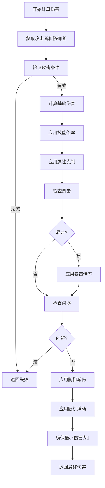

# Q55: 如何设计伤害计算？

## 问题分析

本题考察对伤害计算的理解：
- 伤害公式设计
- 暴击与闪避机制
- 防御减伤计算
- 属性克制系统

---

## 一、伤害计算公式

### 1.1 基础伤害公式

```
┌─────────────────────────────────────────────────────────────┐
│                    伤害计算公式                                │
├─────────────────────────────────────────────────────────────┤
│                                                             │
│  完整公式:                                                  │
│  ┌─────────────────────────────────────────────────┐       │
│  │  Damage = BaseDamage × SkillMultiplier × ...      │       │
│  │                                                   │       │
│  │  详细步骤:                                         │       │
│  │  1. 基础伤害 = 攻击力 - 防御力                        │       │
│  │  2. 技能倍率 = 基础伤害 × 技能倍率                    │       │
│  │  3. 属性克制 = 技能倍率 × (1 + 克制加成)             │       │
│  │  4. 暴击加成 = 属性克制 × (1 + 暴击伤害)               │       │
│  │  5. 防御减伤 = 暴击加成 × (1 - 防御率)                │       │
│  │  6. 随机浮动 = 防御减伤 × (0.9 ~ 1.1)                │       │
│  │  7. 最终伤害 = MAX(1, 向下取整(随机浮动))             │       │
│  └─────────────────────────────────────────────────┘       │
│                                                             │
│  简化版 (常用):                                            │
│  ┌─────────────────────────────────────────────────┐       │
│  │  Damage = (Attack - Defense) × 0.5 + Level × 2     │       │
│  └─────────────────────────────────────────────────┘       │
│                                                             │
└─────────────────────────────────────────────────────────────┘
```

### 1.2 伤害计算流程



---

## 二、伤害计算实现

### 2.1 完整伤害计算器

```cpp
// 伤害计算系统

class DamageCalculator {
public:
    // 计算伤害
    DamageResult calculateDamage(const DamageRequest& request) {
        DamageResult result;
        result.valid = false;

        // 1. 获取攻击者和防御者
        Entity* attacker = getEntity(request.attackerId);
        Entity* defender = getEntity(request.defenderId);

        if (!attacker || !defender) {
            result.reason = "Entity not found";
            return result;
        }

        // 2. 验证攻击条件
        if (!validateAttack(attacker, defender, request)) {
            result.reason = "Attack validation failed";
            return result;
        }

        // 3. 计算基础属性
        int attackPower = attacker->getAttack();
        int defensePower = defender->getDefense();
        int attackerLevel = attacker->getLevel();
        int defenderLevel = defender->getLevel();

        // 4. 获取技能信息
        Skill* skill = getSkill(request.skillId);
        float skillMultiplier = skill ? skill->getDamageMultiplier() : 1.0f;

        // 5. 计算基础伤害
        float baseDamage = calculateBaseDamage(attackPower, defensePower, attackerLevel);

        // 6. 应用技能倍率
        float damage = baseDamage * skillMultiplier;

        // 7. 应用属性克制
        float elementBonus = getElementBonus(
            attacker->getElementType(),
            defender->getElementType()
        );
        damage *= (1.0f + elementBonus);

        // 8. 计算暴击
        bool isCritical = false;
        float critChance = attacker->getCritRate();
        float critDamage = attacker->getCritDamage();

        if (rollCheck(critChance)) {
            isCritical = true;
            damage *= (1.0f + critDamage);
            result.isCritical = true;
        }

        // 9. 计算闪避
        float dodgeChance = defender->getDodgeRate();
        // 攻击者的命中可以减少闪避
        float hitRate = attacker->getHitRate();
        float actualDodgeChance = dodgeChance * (1.0f - hitRate);

        if (rollCheck(actualDodgeChance)) {
            result.damage = 0;
            result.dodged = true;
            result.valid = true;
            return result;
        }

        // 10. 应用防御减伤
        float defenseRate = calculateDefenseRate(defensePower, attackerLevel);
        damage *= (1.0f - defenseRate);
        damage = std::max(1.0f, damage);  // 最小1点伤害

        // 11. 应用随机浮动
        float randomFactor = 0.9f + (rand() % 21) / 100.0f;  // 0.9 ~ 1.1
        damage *= randomFactor;
        damage = std::max(1.0f, damage);

        // 12. 格挡计算
        if (defender->isBlocking()) {
            damage *= 0.5f;  // 格挡减半伤
            result.blocked = true;
        }

        // 13. 装备特效
        damage = applyEquipmentEffects(attacker, defender, damage);

        // 14. 向下取整
        result.damage = static_cast<int>(std::floor(damage));
        result.valid = true;

        return result;
    }

    // 治疗计算
    int calculateHeal(uint64_t casterId, int skillId) {
        Entity* caster = getEntity(casterId);
        if (!caster) return 0;

        Skill* skill = getSkill(skillId);
        if (!skill) return 0;

        // 治疗量 = 魔法攻击 × 技能倍率
        float heal = caster->getMagicAttack() * skill->getHealMultiplier();

        // 治疗加成
        heal *= (1.0f + caster->getHealBonus());

        return static_cast<int>(std::floor(heal));
    }

private:
    float calculateBaseDamage(int attack, int defense, int level) {
        // 方法1: 差值法
        // float damage = attack - defense;

        // 方法2: 带等级的公式 (更常用)
        // 基础伤害 + (攻击 - 防御) × 系数 + 等级加成
        float damage = 10.0f + (attack - defense) * 0.5f + level * 2.0f;

        return std::max(1.0f, damage);  // 最小1点
    }

    float calculateDefenseRate(int defense, int attackerLevel) {
        // 防御率 = 防御力 / (防御力 + 攻击者等级 × 100)
        // 假设同级攻击者攻击力约为等级 × 10
        int attackRef = attackerLevel * 10;
        float defenseRate = static_cast<float>(defense) / (defense + attackRef);

        // 限制防御率上限 75%
        return std::min(0.75f, defenseRate);
    }

    float getElementBonus(ElementType attack, ElementType defense) {
        // 属性克制表
        // 行: 攻击属性, 列: 防御属性, 值: 克制加成
        static const float bonus[6][6] = {
            //物理  火    水    木    金    土
            {0.0f, 0.0f, 0.0f, 0.0f, 0.0f, 0.0f},  // 物理
            {0.0f, 0.0f, 0.5f, 0.0f, 0.0f,-0.5f},  // 火 (克水, 被土克)
            {0.0f,-0.5f, 0.0f, 0.0f, 0.0f, 0.5f},  // 水 (克土, 被火克)
            {0.0f, 0.0f, 0.0f, 0.0f, 0.5f,-0.5f},  // 木 (克土, 被金克)
            {0.0f, 0.0f, 0.0f,-0.5f, 0.0f, 0.5f},  // 金 (克木, 被火克)
            {0.0f, 0.5f,-0.5f, 0.5f, 0.0f, 0.0f},  // 土 (克火, 被水克)
        };

        int attackIdx = static_cast<int>(attack);
        int defenseIdx = static_cast<int>(defense);

        if (attackIdx >= 0 && attackIdx < 6 &&
            defenseIdx >= 0 && defenseIdx < 6) {
            return bonus[attackIdx][defenseIdx];
        }

        return 0.0f;
    }

    bool rollCheck(float chance) {
        // chance 是 0-1 之间的小数
        // 例如: 0.25 = 25% 暴击率
        int roll = rand() % 10000;
        int threshold = static_cast<int>(chance * 10000);
        return roll < threshold;
    }

    float applyEquipmentEffects(Entity* attacker, Entity* defender, float damage) {
        // 装备特效处理
        // 例如: 伤害加深、伤害反射等

        // 攻击者特效
        for (const auto& effect : attacker->getAttackEffects()) {
            if (effect.type == "damage_bonus_percent") {
                damage *= (1.0f + effect.value);
            } else if (effect.type == "damage_bonus_flat") {
                damage += effect.value;
            }
        }

        // 防御者特效
        for (const auto& effect : defender->getDefenseEffects()) {
            if (effect.type == "damage_reduction_percent") {
                damage *= (1.0f - effect.value);
            } else if (effect.type == "damage_reduction_flat") {
                damage -= effect.value;
            }
        }

        return damage;
    }

    bool validateAttack(Entity* attacker, Entity* defender,
                       const DamageRequest& request) {
        // 检查距离
        float distance = attacker->distanceTo(defender);
        if (distance > attacker->getAttackRange()) {
            return false;
        }

        // 检查状态
        if (!attacker->canAttack() || !defender->canBeAttacked()) {
            return false;
        }

        // 检查技能冷却
        if (attacker->isSkillOnCooldown(request.skillId)) {
            return false;
        }

        // 检查魔法值
        Skill* skill = getSkill(request.skillId);
        if (skill && attacker->getMP() < skill->getMPCost()) {
            return false;
        }

        return true;
    }
};

// 伤害请求数据结构
struct DamageRequest {
    uint64_t attackerId;
    uint64_t defenderId;
    uint32_t skillId;
    Vector3 attackPosition;
};

// 伤害结果数据结构
struct DamageResult {
    bool valid = false;
    int damage = 0;
    bool isCritical = false;
    bool dodged = false;
    bool blocked = false;
    std::string reason;
};
```

---

## 三、暴击与闪避

### 3.1 暴击系统

```cpp
// 暴击系统

class CritSystem {
public:
    // 计算暴击率
    float calculateCritRate(Entity* entity) {
        float baseCrit = 0.05f;  // 基础5%暴击

        // 敏捷加成
        int agility = entity->getAgility();
        float agilityBonus = agility * 0.001f;  // 每1点敏捷 +0.1%

        // 装备加成
        float equipmentBonus = entity->getEquipmentCritBonus();

        // Buff加成
        float buffBonus = entity->getBuffCritBonus();

        float totalCrit = baseCrit + agilityBonus + equipmentBonus + buffBonus;

        // 限制上限
        return std::min(0.8f, totalCrit);  // 最大80%暴击
    }

    // 计算暴击伤害
    float calculateCritDamage(Entity* entity) {
        float baseCritDamage = 0.5f;  // 基础暴击 +50%伤害

        // 智力加成
        int intellect = entity->getIntellect();
        float intellectBonus = intellect * 0.0005f;  // 每1点智力 +0.05%

        // 装备加成
        float equipmentBonus = entity->getEquipmentCritDamageBonus();

        float totalCritDamage = baseCritDamage + intellectBonus + equipmentBonus;

        return std::min(2.0f, totalCritDamage);  // 最多+200%伤害
    }

    // 检查是否暴击
    bool rollCrit(Entity* attacker) {
        float critRate = calculateCritRate(attacker);
        return (rand() % 10000) < critRate * 10000;
    }
};
```

### 3.2 闪避系统

```cpp
// 闪避系统

class DodgeSystem {
public:
    // 计算闪避率
    float calculateDodgeRate(Entity* entity) {
        float baseDodge = 0.05f;  // 基础5%闪避

        // 敏捷加成
        int agility = entity->getAgility();
        float agilityBonus = agility * 0.0005f;  // 每1点敏捷 +0.05%

        // 装备加成
        float equipmentBonus = entity->getEquipmentDodgeBonus();

        // Buff加成
        float buffBonus = entity->getBuffDodgeBonus();

        float totalDodge = baseDodge + agilityBonus + equipmentBonus + buffBonus;

        // 限制上限
        return std::min(0.6f, totalDodge);  // 最大60%闪避
    }

    // 检查是否闪避
    bool rollDodge(Entity* defender) {
        float dodgeRate = calculateDodgeRate(defender);
        return (rand() % 10000) < dodgeRate * 10000;
    }

    // 计算命中率 (用于降低闪避)
    float calculateHitRate(Entity* attacker) {
        float baseHit = 0.9f;  // 基础90%命中

        // 装备加成
        float equipmentBonus = attacker->getEquipmentHitBonus();

        float totalHit = baseHit + equipmentBonus;

        return std::min(1.0f, totalHit);  // 最多100%命中
    }
};
```

---

## 四、伤害类型

### 4.1 伤害分类

```
┌─────────────────────────────────────────────────────────────┐
│                    伤害类型分类                                │
├─────────────────────────────────────────────────────────────┤
│                                                             │
│  按来源:                                                    │
│  ├── 物理伤害 (Physical) - 攻击力计算                       │
│  ├── 魔法伤害 (Magic) - 魔法攻击计算                       │
│  ├── 混合伤害 (Hybrid) - 混合计算                           │
│  └── 真实伤害 (True) - 无视防御                            │
│                                                             │
│  按效果:                                                    │
│  ├── 直接伤害 (Direct) - 直接扣除HP                         │
│  ├── 持续伤害 (DoT) - 毒素/燃烧等                          │
│  ├── 反弹伤害 (Reflect) - 反弹给攻击者                     │
│  └── 溅射伤害 (Splash) - 范围伤害                           │
│                                                             │
│  防御类型对应:                                              │
│  ├── 物理防御 - 减少物理伤害                                │
│  ├── 魔法防御 - 减少魔法伤害                                │
│  ├── 魔抗 - 减少特定元素伤害                               │
│  └── 伤害减免 - 百分比减伤                                  │
│                                                             │
└─────────────────────────────────────────────────────────────┘
```

---

## 五、最佳实践

### 5.1 伤害设计建议

| 实践 | 说明 |
|------|------|
| **公式简化** | 避免过于复杂的公式 |
| **数值平衡** | 严格数值验证 |
| **参数可配置** | 技能倍率等可调 |
| **边界检查** | 确保伤害合理范围 |
| **日志记录** | 记录异常伤害 |

### 5.2 数值平衡

```
平衡原则:
1. 等级相当的对战时间合理
2. 装备提升有上限
3. 高级怪物对低级玩家碾压
4. 暴击和闪避不能过高
5. 防御有收益递减
```

---

## 六、总结

### 伤害计算核心

```
伤害计算 = 基础属性 × 技能倍率 × 克制关系 × 暴击闪避 × 防御减伤
- 服务器权威计算
- 客户端仅显示
- 详细的战斗日志
- 可配置的参数系统
```

---

## 参考资料

- [魔兽世界伤害公式](https://wowpedia.fandom.com/)
- [游戏战斗平衡](https://www.gamedev.net/)
