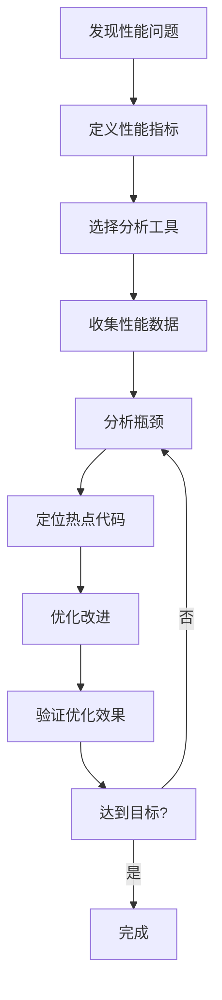

# Q56: 如何进行性能分析？有哪些工具？

## 问题分析

本题考察对性能分析工具和方法的理解：
- 性能分析的重要性
- CPU 分析工具
- 内存分析工具
- 网络分析工具
- KBEngine 性能分析

---

## 一、性能分析基础

### 1.1 性能指标

```
┌─────────────────────────────────────────────────────────────┐
│                    关键性能指标                              │
├─────────────────────────────────────────────────────────────┤
│                                                             │
│  1. CPU 使用率                                              │
│     ├── 用户空间 CPU                                        │
│     ├── 系统空间 CPU                                        │
│     ├── IO 等待                                             │
│     └── 单核/多核使用                                       │
│                                                             │
│  2. 内存使用                                                │
│     ├── 常驻内存                                             │
│     ├── 虚拟内存                                             │
│     ├── 内存泄漏                                             │
│     └── 缓存命中率                                           │
│                                                             │
│  3. I/O 性能                                                │
│     ├── 磁盘读写速度                                        │
│     ├── IOPS                                               │
│     └── IO 等待时间                                         │
│                                                             │
│  4. 网络性能                                                │
│     ├── 带宽使用                                            │
│     ├── 延迟 (RTT)                                          │
│     ├── 丢包率                                              │
│     └── 连接数                                              │
│                                                             │
│  5. 应用程序性能                                          │
│     ├── 帧率 (FPS/TPS)                                     │
│     ├── 响应时间                                            │
│     ├── 吞吐量 (QPS)                                       │
│     └── 并发数                                              │
│                                                             │
└─────────────────────────────────────────────────────────────┘
```

### 1.2 性能分析流程



---

## 二、CPU 性能分析

### 2.1 perf 工具

```bash
# Linux perf 性能分析

# 1. CPU 采样分析
perf top -p <pid>

# 2. 记录性能数据 (60秒)
perf record -p <pid> -g -- sleep 60

# 3. 报告分析
perf report

# 4. 火焰图生成
perf script | FlameGraph/flamegraph.pl > flamegraph.svg

# 5. 热点函数分析
perf report --stdio --call-graph | head -100

# 输出示例:
# Samples: 100k of event 'cpu-clock'
# Event count (approx.): 10000000000
#
# Overhead  Command  Shared Object       Symbol
# ████████  20.00%  game-server  game-server  [.] updateLoop
# ██████    15.00%  game-server  game-server  [.] processPackets
# ████       10.00%  game-server  game-server  [.] updateEntities
```

### 2.2 火焰图解读

```
┌─────────────────────────────────────────────────────────────┐
│                    火焰图解读                                │
├─────────────────────────────────────────────────────────────┤
│                                                             │
│  火焰图：x轴 = 样本比例，y轴 = 调用栈深度                     │
│                                                             │
│  updateLoop (20%)                                           │
│  ├─ processPackets (15%)                                   │
│  │  └─ parseMessage (10%)                                 │
│  │     └─ handleMessage (5%)                               │
│  └─ updateEntities (5%)                                    │
│     └─ updatePositions (2%)                                │
│                                                             │
│  热点识别：                                                  │
│  ├── 扁平的函数 = 热点函数                                 │
│  ├── 宽度 = CPU 占用比例                                   │
│  └── 高度 = 调用链深度                                     │
│                                                             │
└─────────────────────────────────────────────────────────────┘
```

### 2.3 perf 使用示例

```cpp
// 代码优化示例

// 优化前：热循环
void updateEntities(std::vector<Entity*>& entities) {
    for (size_t i = 0; i < entities.size(); ++i) {
        Entity* entity = entities[i];
        if (entity && entity->isActive()) {  // 分支预测失败
            entity->update();
        }
    }
}

// 优化后：减少分支和缓存未命中
void updateEntities(std::vector<Entity*>& entities) {
    // 过滤活跃实体
    std::vector<Entity*> activeEntities;
    activeEntities.reserve(entities.size());

    for (Entity* entity : entities) {
        if (entity && entity->isActive()) {
            activeEntities.push_back(entity);
        }
    }

    // 连续内存访问
    for (Entity* entity : activeEntities) {
        entity->update();
    }
}
```

---

## 三、内存分析

### 3.1 valgrind 工具

```bash
# Valgrind 内存分析

# 1. 内存泄漏检测
valgrind --leak-check=full --show-leak-kinds=all \
         --log-file=valgrind.log ./game-server

# 2. 内存分析
valgrind --tool=massif ./game-server

# 3. 性能分析
valgrind --tool=callgrind ./game-server
callgrind_annotate callgrind.out.<pid> > callgrind.txt

# 输出示例:
# ==12345== LEAK SUMMARY:
# ==12345==    definitely lost: 100 bytes in 5 blocks
# ==12345==    indirectly lost: 200 bytes in 10 blocks
# ==12345==    possibly lost: 50 bytes in 2 blocks
# ==12345==    still reachable: 10,000 bytes in 100 blocks
```

### 3.2 AddressSanitizer

```bash
# AddressSanitizer (ASan) - 编译时检查

# 编译选项
g++ -fsanitize=address -fno-omit-frame-pointer \
    -g -O2 game-server.cpp -o game-server

# 运行时会检测内存错误
./game-server

# 输出示例:
# ==12345==ERROR: AddressSanitizer: heap-use-after-free
#     #0 0x7f1234567890 in operator delete
#     #1 0x7f1234567890 in ~Entity()
#     #2 0x7f1234567890 in updateEntities()
```

### 3.3 内存池分析

```cpp
// 对象池性能分析

class ObjectPoolAnalyzer {
public:
    static void analyze() {
        std::unordered_map<std::type_index, PoolStats> stats;

        // 统计各类对象的分配情况
        for (const auto& [type, info] : allocationStats_) {
            PoolStats& stat = stats[type];
            stat.totalAllocations = info.count;
            stat.currentInUse = info.count - info.freed;
            stat.peakUsage = info.peak;
            stat.avgLifetime = info.totalLifetime / info.count;
        }

        // 打印报告
        printReport(stats);
    }

    struct PoolStats {
        uint64_t totalAllocations;
        uint64_t currentInUse;
        uint64_t peakUsage;
        float avgLifetime;
    };
};
```

---

## 四、网络分析

### 4.1 tcpdump/Wireshark

```bash
# 网络抓包分析

# 1. 抓包
tcpdump -i any -w game-capture.pcap port 9999

# 2. Wireshark 分析
wireshark game-capture.pcap

# 3. 过滤器示例
# 显示所有消息
tcp.port == 9999

# 显示特定消息类型
tcp.port == 9999 && data.len > 100

# 统计消息类型
tcp.port == 9999 | awk '{print $NF}' | sort | uniq -c
```

### 4.2 netstat/ss

```bash
# 连接统计

# 查看连接数
netstat -an | grep ESTABLISHED | wc -l

# 查看各状态连接数
ss -a | awk '{print $1}' | sort | uniq -c

# 输出:
# ESTAB: 1000
# TIME_WAIT: 50
# LISTEN: 10

# 查看 TCP 统计
ss -s

# 输出:
# Tcp:   Active connections: 1000
#        Passive connections: 50
#        Queued connections: 0
```

---

## 五、KBEngine 性能分析

### 5.1 KBEngine 内置分析

```python
# KBEngine 性能监控

class PerformanceMonitor(KBEngine.Entity):
    def __init__(self):
        self.stats = {
            'tick_time': [],
            'entity_count': 0,
            'packet_sent': 0,
            'packet_recv': 0,
            'bandwidth_out': 0,
            'bandwidth_in': 0,
        }

    def onTick(self, deltaTime):
        """
        每帧统计
        """
        self.stats['tick_time'].append(deltaTime)

        # 只保留最近 1000 帧
        if len(self.stats['tick_time']) > 1000:
            self.stats['tick_time'].pop(0)

        # 计算平均帧时间
        avg_time = sum(self.stats['tick_time']) / len(self.stats['tick_time'])

        # 如果帧时间超过阈值，记录
        if avg_time > 0.05:  # 50ms
            KBEngine.warning(f"High tick time: {avg_time * 1000:.2f}ms")

    def report(self):
        """
        生成性能报告
        """
        import json

        report = {
            'avg_tick_time_ms': sum(self.stats['tick_time']) / len(self.stats['tick_time']) * 1000,
            'max_tick_time_ms': max(self.stats['tick_time']) * 1000,
            'entity_count': self.stats['entity_count'],
            'packets_sent': self.stats['packet_sent'],
            'packets_recv': self.stats['packet_recv'],
        }

        print(json.dumps(report, indent=2))
```

### 5.2 KBEngine 性能配置

```python
# kbengine_defs.xml 性能配置

<Baseapp>
    <!-- 实体数量上限 -->
    <entityDefsCount>0</entityDefsCount>

    <!-- 消息队列大小 -->
    <bufferedMessages>0</bufferedMessages>
</Baseapp>

<Cellapp>
    <!-- 最大实体数 -->
    <maxEntities>5000</maxEntities>

    <!-- 更新频率 -->
    <updateHertz>20</updateHertz>

    <!-- AOI 范围 -->
    <aoiRadius>100</aoiRadius>
</Cellapp>
```

---

## 六、性能优化工具链

### 6.1 完整工具链

```
┌─────────────────────────────────────────────────────────────┐
│                  性能分析工具链                              │
├─────────────────────────────────────────────────────────────┤
│                                                             │
│  开发阶段：                                                │
│  ├── Valgrind - 内存泄漏检测                             │
│  ├── ASan/UBSan - 内存错误检测                          │
│  ├── perf - CPU 性能分析                                │
│  └── gprof - 函数级性能分析                             │
│                                                             │
│  测试阶段：                                                │
│  ├── Apache Bench - 压力测试                            │
│  ├── wrk - HTTP 压力测试                                 │
│  ├── iperf - 网络带宽测试                               │
│  └── tcpdump/Wireshark - 网络分析                       │
│                                                             │
│  生产环境：                                                │
│  ├── Prometheus - 指标采集                               │
│  ├── Grafana - 可视化                                   │
│  ├── Jaeger - 分布式追踪                                │
│  └── ELK Stack - 日志分析                               │
│                                                             │
└─────────────────────────────────────────────────────────────┘
```

### 6.2 Prometheus + Grafana

```yaml
# Prometheus 配置

global:
  scrape_interval: 15s

scrape_configs:
  - job_name: 'game-server'
    static_configs:
      - targets: ['localhost:9090']

    metrics_path: /metrics
```

```cpp
// 自定义指标导出

class PrometheusExporter {
public:
    // 导出指标
    std::string exportMetrics() {
        std::stringstream ss;

        // TPS 指标
        ss << "# HELP game_tps Transactions per second\n";
        ss << "# TYPE game_tps gauge\n";
        ss << "game_tps " << calculateTPS() << "\n";

        // 在线玩家数
        ss << "# HELP game_online_players Online players\n";
        ss << "# TYPE game_online_players gauge\n";
        ss << "game_online_players " << getOnlinePlayerCount() << "\n";

        // 帧率
        ss << "# HELP game_tick_ms Tick time in ms\n";
        ss << "# TYPE game_tick_ms gauge\n";
        ss << "game_tick_ms " << getAvgTickTime() << "\n";

        return ss.str();
    }
};
```

---

## 七、最佳实践

### 7.1 性能分析流程

```
┌─────────────────────────────────────────────────────────────┐
│                  性能分析最佳实践                            │
├─────────────────────────────────────────────────────────────┤
│                                                             │
│  1. 确定性能目标                                            │
│     ├── 单服承载 5000 人                                   │
│     ├── 帧率 60 TPS                                         │
│     └── 响应时间 < 100ms                                    │
│                                                             │
│  2. 建立基线测试                                            │
│     ├── 空闲服务器基准                                      │
│     ├── 单玩家基准                                          │
│     └── 满载基准                                            │
│                                                             │
│  3. 识别瓶颈                                                │
│     ├── CPU 是否饱和                                        │
│     ├── 内存是否泄漏                                        │
│     ├── 网络是否阻塞                                        │
│     └── IO 是否过高                                         │
│                                                             │
│  4. 定位热点                                                │
│     ├── perf top 查看 CPU 热点                             │
│     ├── flamegraph 生成火焰图                              │
│     ├── pprof 分析函数调用                                  │
│     └── 自埋点统计执行时间                                │
│                                                             │
│  5. 优化改进                                                │
│     ├── 优化热点函数                                        │
│     ├── 减少内存分配                                        │
│     ├── 优化算法复杂度                                      │
│     └── 异步化阻塞操作                                     │
│                                                             │
│  6. 验证效果                                                │
│     ├── 压力测试验证                                        │
│     ├── 对比优化前后                                        │
│     └── 确保达到目标                                        │
│                                                             │
└─────────────────────────────────────────────────────────────┘
```

### 7.2 常用命令速查

```bash
# CPU 分析
top -p <pid>
mpstat -P ALL 5
perf top -p <pid>

# 内存分析
free -h
vmstat 1 5
pmap -x <pid>

# 网络分析
netstat -an | grep ESTABLISHED | wc -l
ss -s
tcpdump -i any port 9999

# IO 分析
iostat -x 1
iotop -o

# 综合监控
dstat -cdngy 1
```

---

## 八、总结

### 工具选择指南

| 场景 | 推荐工具 | 用途 |
|------|----------|------|
| **CPU 热点** | perf | 找出 CPU 密集函数 |
| **内存泄漏** | Valgrind/ASan | 检测内存问题 |
| **网络分析** | Wireshark/tcpdump | 抓包分析 |
| **压力测试** | Apache Bench/wrk | 模拟高并发 |
| **应用监控** | Prometheus+Grafana | 生产监控 |

### 性能分析检查清单

```
□ 是否建立了性能基线？
□ 是否使用性能分析工具？
□ 是否定期进行性能测试？
□ 是否监控生产环境指标？
□ 是否有性能问题处理流程？
□ 是否建立了性能优化文档？
```

---

## 参考资料

- [Linux perf 官方文档](https://perf.wiki.kernel.org/)
- [Valgrind 用户手册](https://valgrind.org/docs/manual/)
- [Prometheus 最佳实践](https://prometheus.io/docs/practices/)
