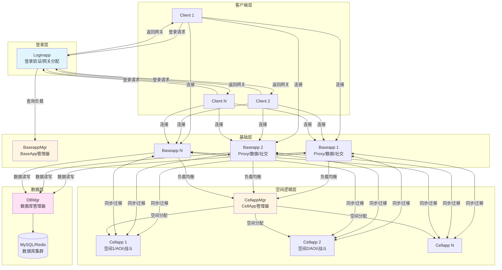
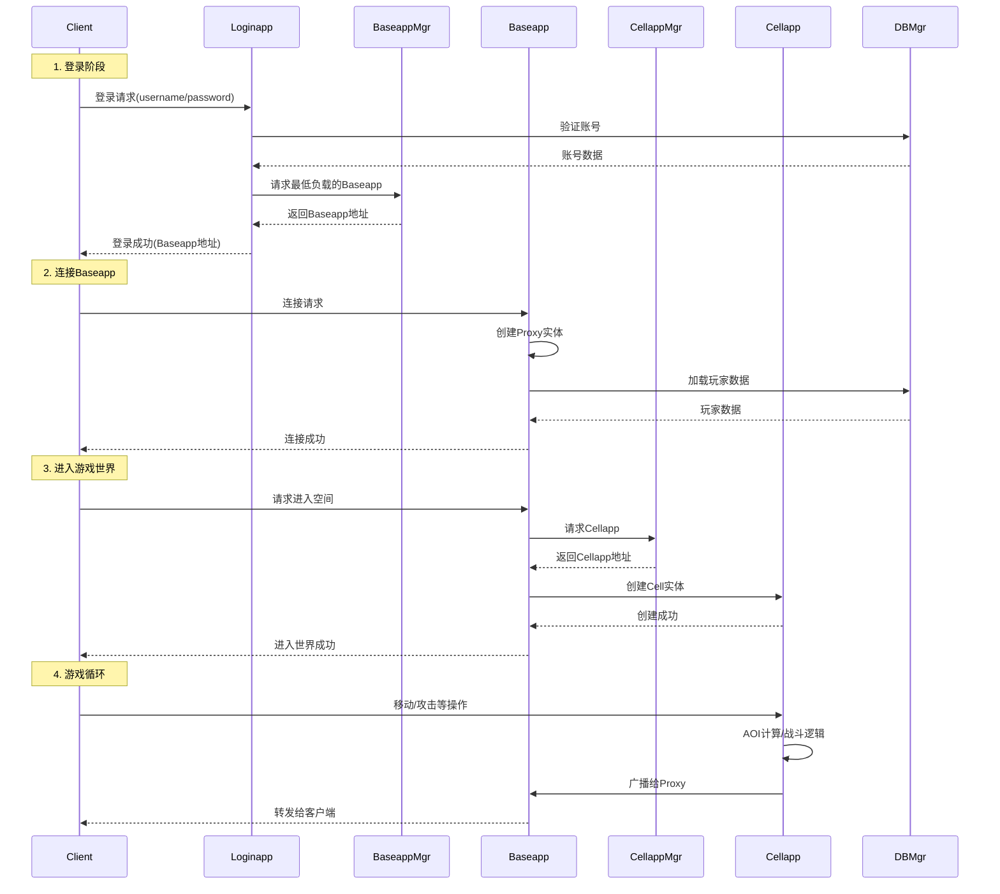
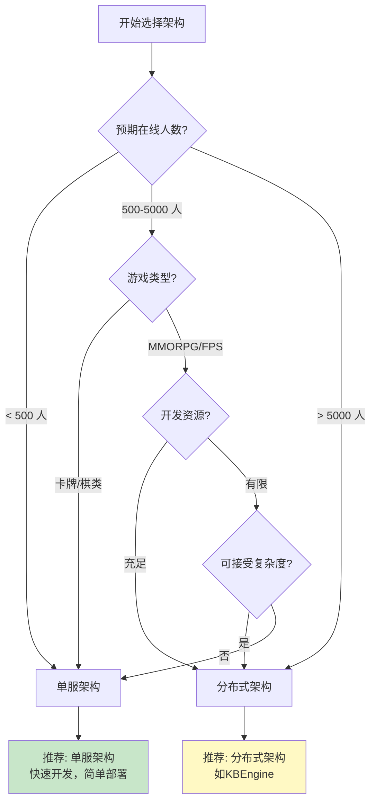

# Q6: 单服架构 vs 分布式架构，如何选择？

## 问题分析

本题考察对服务器架构选择的决策能力：
- 单服架构和分布式架构的本质区别
- KBEngine 的分布式架构设计思路
- 在什么场景下选择哪种架构
- 分布式架构的挑战和解决方案

---

## 一、架构定义

### 1.1 单服架构（Single-Server Architecture）

```
┌─────────────────────────────────────────────────────────────┐
│                       单服架构                                │
├─────────────────────────────────────────────────────────────┤
│                                                             │
│   ┌─────────────────────────────────────────────────┐       │
│   │              单一服务器进程                       │       │
│   │  ┌───────────────────────────────────────────┐  │       │
│   │  │  网络层 │ 业务逻辑 │ 数据访问 │ 数据库   │  │       │
│   │  └───────────────────────────────────────────┘  │       │
│   └─────────────────────────────────────────────────┘       │
│                        │                                     │
│                        ▼                                     │
│   ┌─────────────────────────────────────────────────┐       │
│   │              客户端连接池                        │       │
│   │  Player1, Player2, ..., PlayerN                 │       │
│   └─────────────────────────────────────────────────┘       │
│                                                             │
└─────────────────────────────────────────────────────────────┘

特点：
- 所有功能在一个进程内完成
- 共享内存，无需序列化
- 部署简单，调试方便
- 扩展受限于单机资源
```

### 1.2 分布式架构（Distributed Architecture）

```
┌─────────────────────────────────────────────────────────────┐
│                   KBEngine 分布式架构                        │
├─────────────────────────────────────────────────────────────┤
│                                                             │
│   Client ──► Loginapp ──► Baseapp ──► Cellapp              │
│      │          │            │           │                  │
│      │          ▼            ▼           ▼                  │
│      │     BaseappMgr   CellappMgr     Space               │
│      │          │            │                              │
│      └──────────┴────────────┴──────────────► DBMgr        │
│                                    │                        │
│                                    ▼                        │
│                                 Database                    │
│                                                             │
└─────────────────────────────────────────────────────────────┘

特点：
- 功能按职责分离到不同进程
- 进程间通过网络通信
- 可独立扩展各组件
- 动态负载均衡
```

---

## 二、KBEngine 的分布式架构

### 2.1 架构图

根据 [KBEngine Lab - 引擎概览](https://www.kbelab.com/manual/engine-overview.html)：



### 2.2 组件职责对比

| 组件 | 职责 | 可多实例 | 单点故障 |
|------|------|----------|----------|
| **Loginapp** | 登录验证、网关分配 | ✅ | ❌ |
| **Baseapp** | Proxy管理、数据缓存、社交系统 | ✅ | ❌ (有备份) |
| **Cellapp** | 空间逻辑、AOI、战斗系统 | ✅ | ❌ |
| **BaseappMgr** | BaseApp负载均衡 | ❌ | ⚠️ |
| **CellappMgr** | CellApp负载均衡 | ❌ | ⚠️ |
| **DBMgr** | 数据库访问管理 | ❌ | ⚠️ |

> **关键设计**：只有 Manager 和 DBMgr 是单点，但可以通过进程监控快速重启。

### 2.3 完整通信流程



---

## 三、架构对比分析

### 3.1 对比表格

| 维度 | 单服架构 | 分布式架构 (KBEngine) |
|------|----------|----------------------|
| **开发复杂度** | 低，一个工程完成 | 中高，多个组件协同 |
| **部署复杂度** | 低，单机部署 | 中高，多机协同 |
| **调试难度** | 低，单进程调试 | 高，跨进程调试 |
| **横向扩展** | ❌ 受限于单机 | ✅ 可无限扩展 |
| **纵向扩展** | ✅ 升级硬件即可 | ⚠️ 需配合架构调整 |
| **容错能力** | ❌ 单点故障 | ✅ 组件隔离 |
| **资源隔离** | ❌ 共享资源 | ✅ 独立资源 |
| **通信开销** | ❌ 无(内存访问) | ⚠️ 序列化+网络传输 |
| **数据一致性** | ✅ 简单(事务) | ⚠️ 需分布式事务 |
| **运维成本** | 低 | 高 |

### 3.2 性能对比

#### CPU 利用率

```
单服架构：
┌─────────────────────────────────────────────────────────────┐
│                    CPU 利用率分布                            │
│  ████████████████████████████████████ 100%                 │
│                                                             │
│  问题：CPU 密集型任务会阻塞其他任务                          │
└─────────────────────────────────────────────────────────────┘

分布式架构：
┌─────────────────────────────────────────────────────────────┐
│                    CPU 利用率分布                            │
│  Baseapp:    ████████████████████░░░░ 60%                  │
│  Cellapp 1:  ██████████████████████░░ 70%                  │
│  Cellapp 2:  ████████████████░░░░░░░ 50%                  │
│                                                             │
│  优势：任务隔离，互不影响                                    │
└─────────────────────────────────────────────────────────────┘
```

#### 内存使用

```
单服架构：
┌─────────────────────────────────────────────────────────────┐
│                      内存使用                                │
│  所有数据共享同一内存空间                                    │
│  - 优点：无序列化开销                                        │
│  - 缺点：内存泄漏影响全局                                    │
└─────────────────────────────────────────────────────────────┘

分布式架构：
┌─────────────────────────────────────────────────────────────┐
│                      内存使用                                │
│  每个进程独立内存空间                                        │
│  - 优点：隔离性好，单进程崩溃不影响其他                      │
│  - 缺点：需要序列化传输数据                                  │
└─────────────────────────────────────────────────────────────┘
```

---

## 四、选择标准

### 4.1 决策树



### 4.2 详细选择标准

#### 选择单服架构的场景

| 条件 | 说明 |
|------|------|
| **在线规模 < 500** | 单机可承载 |
| **游戏类型简单** | 卡牌、棋类、回合制 |
| **开发周期短** | 快速原型验证 |
| **团队规模小** | < 5 人 |
| **预算有限** | 服务器成本敏感 |
| **无需跨服** | 单服即可满足需求 |

#### 选择分布式架构的场景

| 条件 | 说明 |
|------|------|
| **在线规模 > 1000** | 需要多机负载 |
| **空间型游戏** | MMORPG、FPS、大世界 |
| **需要动态扩容** | 活动期间流量波动大 |
| **需要跨服功能** | 跨服战场、聊天 |
| **团队有运维能力** | 有专门的运维人员 |
| **追求高可用** | 商业化运营 |

---

## 五、KBEngine 的设计权衡

### 5.1 为什么选择分布式？

根据 [KBEngine GitHub](https://github.com/kbengine/kbengine)：

```
KBEngine 底层架构被设计为多进程分布式动态负载均衡方案，
理论上只需要不断扩展硬件就能够不断增加承载上限，
单台机器的承载上限取决于游戏逻辑本身的复杂度。
```

**设计目标**：
1. **无上限扩展** - 通过增加机器提升承载
2. **组件解耦** - 各组件独立开发和升级
3. **故障隔离** - 单个组件崩溃不影响全局
4. **灵活部署** - 可根据负载动态调整

### 5.2 分布式的代价

#### 通信开销

```cpp
// 单服架构：内存访问
void updateEntityPosition(Entity* entity, Position pos) {
    entity->position = pos;  // 直接内存访问，~10ns
}

// 分布式架构：网络通信
void updateEntityPosition(EntityID id, Position pos) {
    // 1. 序列化
    MemoryStream stream;
    stream.pack(id);
    stream.pack(pos.x); stream.pack(pos.y); stream.pack(pos.z);

    // 2. 网络传输
    channel->send(stream.data(), stream.size());  // ~100μs

    // 3. 接收端反序列化
    // ...
}
```

**开销对比**：内存访问 ~10ns vs 网络通信 ~100μs（相差 10000 倍）

#### 一致性挑战

```cpp
// 单服架构：事务保证
void transferItem(PlayerID from, PlayerID to, ItemID item) {
    db->begin();
    db->removeItem(from, item);
    db->addItem(to, item);
    db->commit();  // 原子操作
}

// 分布式架构：跨进程
void transferItem(PlayerID from, PlayerID to, ItemID item) {
    // from 和 to 可能在不同 BaseApp
    // 需要分布式事务或两阶段提交
    BaseApp* fromApp = findBaseApp(from);
    BaseApp* toApp = findBaseApp(to);

    if (fromApp != toApp) {
        // 跨 BaseApp 交易，更复杂
        distributedTransfer(fromApp, toApp, from, to, item);
    }
}
```

---

## 六、混合架构方案

### 6.1 渐进式架构

```
阶段 1：单服起步
┌─────────────────────────────────────────────────────────────┐
│  ┌─────────────────────────────────────────────────┐       │
│  │           单一服务器进程                        │       │
│  │  所有逻辑在一起，快速开发                        │       │
│  └─────────────────────────────────────────────────┘       │
└─────────────────────────────────────────────────────────────┘
         │ 游戏上线，玩家增长
         ▼
阶段 2：数据库分离
┌─────────────────────────────────────────────────────────────┐
│  ┌─────────────────┐              ┌─────────────────┐       │
│  │   游戏服务器     │ ──────────►  │    数据库       │       │
│  │  (逻辑+缓存)     │              │  (MySQL/Redis)  │       │
│  └─────────────────┘              └─────────────────┘       │
└─────────────────────────────────────────────────────────────┘
         │ 继续增长
         ▼
阶段 3：逻辑分离
┌─────────────────────────────────────────────────────────────┐
│  ┌──────────┐  ┌──────────┐  ┌──────────┐                  │
│  │ 网关服务器 │  │逻辑服务器 │  │空间服务器 │                  │
│  │ (Gateway) │  │(BaseApp) │  │(CellApp) │                  │
│  └──────────┘  └──────────┘  └──────────┘                  │
└─────────────────────────────────────────────────────────────┘
```

### 6.2 业务分离架构

```
根据业务特性选择架构：

┌─────────────────────────────────────────────────────────────┐
│                      游戏系统分类                            │
├─────────────────────────────────────────────────────────────┤
│                                                             │
│  单服即可：                                                  │
│  ├── 聊天系统      → 可独立为 ChatApp                       │
│  ├── 好友系统      → 可在 BaseApp 实现                       │
│  ├── 排行榜        → 可独立使用 Redis Sorted Set             │
│  ├── 邮件系统      → 可独立为 MailApp                       │
│  └── GM 系统       → 可独立为 GMApp                         │
│                                                             │
│  需要分布式：                                                │
│  ├── 空间逻辑      → 必须用 CellApp                         │
│  ├── 战斗系统      → 必须用 CellApp                         │
│  ├── AOI 系统      → 必须用 CellApp                         │
│  └── 大量玩家交互  → 必须分布式                              │
│                                                             │
└─────────────────────────────────────────────────────────────┘
```

---

## 七、实战建议

### 7.1 小团队建议

```
如果你是 < 10 人的小团队：

1. 第一款游戏：单服架构
   - 使用成熟的框架（如 KBEngine）
   - 专注游戏逻辑，而非底层架构
   - 快速上线验证

2. 第二款游戏：考虑分布式
   - 如果第一款成功，有架构经验
   - 可以使用 KBEngine 的分布式特性
   - 逐步学习运维知识
```

### 7.2 架构迁移建议

```
从单服迁移到分布式：

1. 识别瓶颈
   ├── CPU 密集型 → 分离为独立服务
   ├── IO 密集型  → 使用异步+缓存
   └── 内存密集型 → 分离数据服务

2. 逐步迁移
   ├── 先分离数据库（最容易）
   ├── 再分离缓存层
   ├── 最后分离业务逻辑

3. 保持兼容
   ├── 使用 API Gateway 统一入口
   ├── 保持客户端接口不变
   └── 灰度切换
```

### 7.3 KBEngine 使用建议

```python
# KBEngine 中可以根据负载动态调整

# kbengine_defs.xml
<Baseapp>
    <!-- 单机最大承载 -->
    <maxConnections>1000</maxConnections>

    <!-- 自动备份间隔 -->
    <autoArchiveTime>300</autoArchiveTime>

    <!-- 负载均衡权重 -->
    <loadBalanceWeight>1.0</loadBalanceWeight>
</Baseapp>

# 当负载过高时，增加 BaseApp 进程
# BaseappMgr 会自动将新玩家分配到负载低的 BaseApp
```

---

## 八、总结

### 核心观点

| 场景 | 推荐架构 | 原因 |
|------|----------|------|
| **独立游戏/原型验证** | 单服 | 快速开发，成本低 |
| **卡牌/回合制游戏** | 单服 | 逻辑简单，无需复杂架构 |
| **MMORPG** | 分布式(KBEngine) | 空间大，玩家多 |
| **FPS/MOBA** | 分布式 | 低延迟，高并发 |
| **商业运营项目** | 分布式 | 高可用，可扩展 |

### 决策检查清单

```
架构决策检查清单：

□ 预期在线规模是多少？
□ 游戏类型是什么？
□ 开发周期有多长？
□ 团队规模和经验如何？
□ 运维能力如何？
□ 预算是否充足？
□ 是否需要跨服功能？
□ 是否需要热更新？
□ 对可用性要求多高？
□ 未来扩展性如何考虑？

如果 7+ 个答案指向同一方向，就可以做出决策。
```

---

## 参考资料

- [KBEngine GitHub - 架构说明](https://github.com/kbengine/kbengine)
- [KBEngine Lab - 引擎概览](https://www.kbelab.com/manual/engine-overview.html)
- [BigWorld Technology - Architecture](https://www.bigworldtech.com/)
- [Scalable Game Server Architecture](https://www.gdcvault.com/play/1022800/Scalable-Game-Server-Architecture-in)
