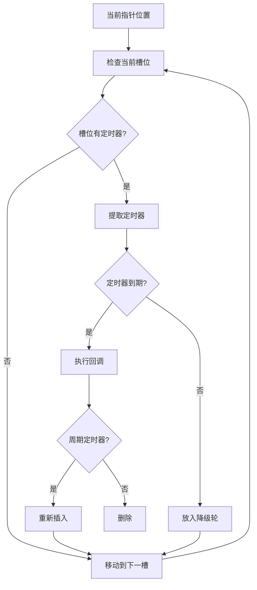

# Q60: 如何设计定时器系统？

## 问题分析

本题考察对定时器系统的理解：
- 定时器数据结构
- 时间轮算法
- 最小堆实现
- 定时器精度与性能
- KBEngine 定时器机制

---

## 一、定时器系统架构

### 1.1 系统组成

```
┌─────────────────────────────────────────────────────────────┐
│                    定时器系统架构                              │
├─────────────────────────────────────────────────────────────┤
│                                                             │
│  API 层 (API Layer):                                        │
│  ├── addTimer(callback, delay)      - 添加一次性定时器      │
│  ├── addRepeatTimer(callback, interval) - 添加重复定时器    │
│  ├── cancelTimer(timerId)           - 取消定时器            │
│  └── updateTime()                   - 更新时间              │
│                          │                                  │
│  ▼                                                          │
│  管理层 (Manager Layer):                                    │
│  ├── TimerManager                 - 定时器管理器           │
│  ├── TimerIdGenerator              - ID 生成器             │
│  └── TimerCollector                - 过期定时器收集         │
│                          │                                  │
│  ▼                                                          │
│  存储层 (Storage Layer):                                    │
│  ├── 时间轮 (Timing Wheel)          - 低精度大量定时器      │
│  ├── 最小堆 (Min-Heap)              - 高精度少量定时器      │
│  └── 哈希表 (Hash Table)            - 快速查找              │
│                          │                                  │
│  ▼                                                          │
│  调度层 (Dispatch Layer):                                   │
│  ├── 回调队列 (Callback Queue)       - 待执行回调           │
│  ├── 线程池 (Thread Pool)           - 异步执行             │
│  └── 事件循环 (Event Loop)          - 集成到主循环         │
│                                                             │
└─────────────────────────────────────────────────────────────┘
```

### 1.2 定时器类型

```
┌─────────────────────────────────────────────────────────────┐
│                    定时器类型                                  │
├─────────────────────────────────────────────────────────────┤
│                                                             │
│  1. 一次性定时器 (One-shot Timer)                           │
│  ┌─────────────────────────────────────────────────┐       │
│  │  - 触发后自动移除                                   │       │
│  │  - 用途: 延迟执行、超时检测                         │       │
│  └─────────────────────────────────────────────────┘       │
│                                                             │
│  2. 周期定时器 (Periodic Timer)                            │
│  ┌─────────────────────────────────────────────────┐       │
│  │  - 按固定间隔重复触发                               │       │
│  │  - 用途: 定时保存、心跳检测、Buff 持续时间          │       │
│  └─────────────────────────────────────────────────┘       │
│                                                             │
│  3. 条件定时器 (Conditional Timer)                          │
│  ┌─────────────────────────────────────────────────┐       │
│  │  - 满足条件时触发                                   │       │
│  │  - 用途: 等待状态达成、资源累积                     │       │
│  └─────────────────────────────────────────────────┘       │
│                                                             │
│  4. 高精度定时器 (High-precision Timer)                    │
│  ┌─────────────────────────────────────────────────┐       │
│  │  - 毫秒级精度                                       │       │
│  │  - 用途: 战斗技能、动画同步                         │       │
│  └─────────────────────────────────────────────────┘       │
│                                                             │
│  5. 低精度定时器 (Low-precision Timer)                     │
│  ┌─────────────────────────────────────────────────┐       │
│  │  - 秒级精度                                        │       │
│  │  - 用途: 数据存盘、日志清理、统计上报               │       │
│  └─────────────────────────────────────────────────┘       │
│                                                             │
└─────────────────────────────────────────────────────────────┘
```

---

## 二、时间轮算法

### 2.1 时间轮原理



### 2.2 分层时间轮实现

```cpp
// 分层时间轮实现 (类似 Linux Kernel 的定时器)
// 参考: KBEngine 的定时器实现

#include <vector>
#include <functional>
#include <unordered_map>
#include <queue>

class TimingWheel {
public:
    using Callback = std::function<void()>;
    using TimerId = uint64_t;

    // 添加定时器
    TimerId addTimer(Callback cb, uint64_t delayMs, bool repeat = false) {
        TimerId id = generateId();

        Timer timer;
        timer.id = id;
        timer.callback = std::move(cb);
        timer.delayMs = delayMs;
        timer.repeat = repeat;
        timer.remaining = delayMs;

        // 根据延迟选择轮层级
        insertTimer(timer);

        timers_[id] = timer;
        return id;
    }

    // 取消定时器
    bool cancelTimer(TimerId id) {
        auto it = timers_.find(id);
        if (it == timers_.end()) {
            return false;
        }

        it->second.cancelled = true;
        timers_.erase(it);
        return true;
    }

    // 更新时间 (每帧调用)
    void tick(uint64_t deltaMs) {
        currentTime_ += deltaMs;

        // 检查第一层轮
        processWheel(wheel0_, slot0Size_, slot0Ms_, deltaMs);

        // 第一层轮满，进位到第二层
        if (currentTime_ % (slot0Size_ * slot0Ms_) < deltaMs) {
            cascade(wheel0_, wheel1_, slot0Size_, slot1Size_);
        }

        // 第二层轮满，进位到第三层
        if (currentTime_ % (slot1Size_ * slot0Size_ * slot0Ms_) < deltaMs) {
            cascade(wheel1_, wheel2_, slot1Size_, slot2Size_);
        }
    }

private:
    struct Timer {
        TimerId id;
        Callback callback;
        uint64_t delayMs;
        uint64_t remaining;
        bool repeat;
        bool cancelled = false;
    };

    struct Slot {
        std::vector<TimerId> timers;
    };

    void insertTimer(Timer& timer) {
        uint64_t ticks = timer.remaining / slot0Ms_;

        if (ticks < slot0Size_) {
            // 放入第一层
            wheel0_[ticks % slot0Size_].timers.push_back(timer.id);
        } else if (ticks < slot0Size_ * slot1Size_) {
            // 放入第二层
            uint64_t slot = (ticks / slot0Size_) % slot1Size_;
            wheel1_[slot].timers.push_back(timer.id);
        } else {
            // 放入第三层
            uint64_t slot = (ticks / (slot0Size_ * slot1Size_)) % slot2Size_;
            wheel2_[slot].timers.push_back(timer.id);
        }
    }

    void processWheel(std::vector<Slot>& wheel, size_t wheelSize,
                      uint64_t slotMs, uint64_t deltaMs) {
        size_t slots = deltaMs / slotMs;
        for (size_t i = 0; i < slots && i < wheelSize; ++i) {
            Slot& slot = wheel[currentSlot_ % wheelSize];
            for (TimerId id : slot.timers) {
                auto it = timers_.find(id);
                if (it != timers_.end() && !it->second.cancelled) {
                    executeTimer(it->second);
                }
            }
            slot.timers.clear();
            currentSlot_++;
        }
    }

    void executeTimer(Timer& timer) {
        if (timer.callback) {
            timer.callback();
        }

        if (timer.repeat) {
            timer.remaining = timer.delayMs;
            insertTimer(timer);
        } else {
            timers_.erase(timer.id);
        }
    }

    void cascade(std::vector<Slot>& from, std::vector<Slot>& to,
                 size_t fromSize, size_t toSize) {
        // 将下一层的定时器重新分配
        // 实现省略...
    }

    TimerId generateId() {
        return ++nextId_;
    }

    // 时间轮配置
    static constexpr size_t slot0Size_ = 256;   // 第一层 256 槽
    static constexpr size_t slot1Size_ = 64;    // 第二层 64 槽
    static constexpr size_t slot2Size_ = 64;    // 第三层 64 槽
    static constexpr uint64_t slot0Ms_ = 10;    // 每槽 10ms

    std::vector<Slot> wheel0_{slot0Size_};     // 2.56 秒
    std::vector<Slot> wheel1_{slot1Size_};     // ~164 秒
    std::vector<Slot> wheel2_{slot2Size_};     // ~3 小时

    size_t currentSlot_ = 0;
    uint64_t currentTime_ = 0;
    TimerId nextId_ = 0;

    std::unordered_map<TimerId, Timer> timers_;
};
```

---

## 三、最小堆实现

### 3.1 最小堆定时器

```cpp
// 基于最小堆的定时器 (高精度场景)

#include <queue>
#include <functional>

class MinHeapTimer {
public:
    using Callback = std::function<void()>;
    using TimerId = uint64_t;
    using TimePoint = std::chrono::steady_clock::time_point;

    TimerId addTimer(Callback cb, std::chrono::milliseconds delay, bool repeat = false) {
        TimerId id = generateId();

        Timer timer;
        timer.id = id;
        timer.callback = std::move(cb);
        timer.expiry = std::chrono::steady_clock::now() + delay;
        timer.delay = delay;
        timer.repeat = repeat;

        heap_.push(timer);
        timers_[id] = timer;

        return id;
    }

    bool cancelTimer(TimerId id) {
        auto it = timers_.find(id);
        if (it == timers_.end()) {
            return false;
        }

        it->second.cancelled = true;
        timers_.erase(it);
        return true;
    }

    // 更新定时器
    void update() {
        auto now = std::chrono::steady_clock::now();

        while (!heap_.empty() && heap_.top().expiry <= now) {
            Timer timer = heap_.top();
            heap_.pop();

            auto it = timers_.find(timer.id);
            if (it == timers_.end() || timer.cancelled) {
                continue;
            }

            // 执行回调
            if (timer.callback) {
                timer.callback();
            }

            // 周期定时器重新插入
            if (timer.repeat && !timer.cancelled) {
                timer.expiry = now + timer.delay;
                heap_.push(timer);
                timers_[timer.id] = timer;
            } else {
                timers_.erase(timer.id);
            }
        }
    }

    // 获取下次触发时间
    std::optional<std::chrono::milliseconds> getNextDelay() const {
        if (heap_.empty()) {
            return std::nullopt;
        }

        auto now = std::chrono::steady_clock::now();
        auto delay = std::chrono::duration_cast<std::chrono::milliseconds>(
            heap_.top().expiry - now
        );

        return std::max(delay, std::chrono::milliseconds(0));
    }

private:
    struct Timer {
        TimerId id;
        Callback callback;
        TimePoint expiry;
        std::chrono::milliseconds delay;
        bool repeat = false;
        bool cancelled = false;

        // 堆比较
        bool operator>(const Timer& other) const {
            return expiry > other.expiry;
        }
    };

    TimerId generateId() {
        return ++nextId_;
    }

    std::priority_queue<Timer, std::vector<Timer>, std::greater<Timer>> heap_;
    std::unordered_map<TimerId, Timer> timers_;
    TimerId nextId_ = 0;
};
```

---

## 四、KBEngine 定时器

### 4.1 KBEngine Python 定时器

```python
# KBEngine Python 定时器系统
# scripts/kbe_scripts/timers.py

import KBEngine
import time

class KBE_Timer:
    """KBEngine 定时器封装"""

    @staticmethod
    def addTimer(interval, callback, repeat=False):
        """
        添加定时器

        Args:
            interval: 间隔时间 (秒)
            callback: 回调函数
            repeat: 是否重复

        Returns:
            timerId: 定时器 ID
        """
        if repeat:
            # 重复定时器
            return KBEngine.addTimer(interval, 0, callback)
        else:
            # 一次性定时器
            return KBEngine.addOnceTimer(interval, callback)

    @staticmethod
    def cancelTimer(timerId):
        """取消定时器"""
        KBEngine.delTimer(timerId)

# 使用示例
class Entity(KBEngine.Entity):
    def __init__(self):
        KBEngine.Entity.__init__(self)

        # 添加一次性定时器
        self.delayTimer = KBE_Timer.addTimer(
            5.0,           # 5 秒后
            self.onTimeout
        )

        # 添加重复定时器
        self.repeatTimer = KBE_Timer.addTimer(
            1.0,           # 每秒
            self.onTick,
            repeat=True
        )

    def onTimeout(self):
        """超时回调"""
        INFO("Timeout reached!")
        # Buff 到期、技能冷却等

    def onTick(self):
        """定时回调"""
        # 持续伤害、心跳检测等
        pass

    def onDestroy(self):
        """实体销毁时清理定时器"""
        KBE_Timer.cancelTimer(self.delayTimer)
        KBE_Timer.cancelTimer(self.repeatTimer)
```

### 4.2 KBEngine C++ 定时器

```cpp
// KBEngine C++ 定时器系统
// src/lib/helpers/timer.h

namespace KBEngine {

// 定时器回调类型
using TimerCallback = std::function<void()>;

// 定时器
class Timer {
public:
    Timer(TimerCallback cb, uint64_t interval, bool repeat)
        : callback_(std::move(cb)),
          interval_(interval),
          repeat_(repeat),
          remaining_(interval) {}

    void update(uint64_t deltaMs) {
        if (remaining_ > deltaMs) {
            remaining_ -= deltaMs;
        } else {
            // 触发
            if (callback_) {
                callback_();
            }

            if (repeat_) {
                remaining_ = interval_;
            } else {
                finished_ = true;
            }
        }
    }

    bool isFinished() const { return finished_; }

private:
    TimerCallback callback_;
    uint64_t interval_;
    uint64_t remaining_;
    bool repeat_;
    bool finished_ = false;
};

// 定时器管理器
class TimerManager {
public:
    TimerId addTimer(TimerCallback cb, uint64_t intervalMs, bool repeat = false) {
        auto timer = std::make_unique<Timer>(
            std::move(cb), intervalMs, repeat
        );

        TimerId id = ++nextId_;
        timers_[id] = std::move(timer);
        return id;
    }

    void cancelTimer(TimerId id) {
        timers_.erase(id);
    }

    void update(uint64_t deltaMs) {
        auto it = timers_.begin();
        while (it != timers_.end()) {
            it->second->update(deltaMs);

            if (it->second->isFinished()) {
                it = timers_.erase(it);
            } else {
                ++it;
            }
        }
    }

private:
    using TimerId = uint64_t;
    std::unordered_map<TimerId, std::unique_ptr<Timer>> timers_;
    TimerId nextId_ = 0;
};

} // namespace KBEngine
```

---

## 五、性能对比

### 5.1 定时器实现对比

| 实现方式 | 添加复杂度 | 删除复杂度 | 触发复杂度 | 适用场景 |
|---------|-----------|-----------|-----------|----------|
| **链表** | O(1) | O(n) | O(n) | 少量定时器 |
| **排序链表** | O(n) | O(n) | O(1) | 少量定时器 |
| **最小堆** | O(log n) | O(log n) | O(1) | 大量定时器 |
| **时间轮** | O(1) | O(1) | O(1) | 大量定时器 |

### 5.2 定时器选择

```
┌─────────────────────────────────────────────────────────────┐
│                    定时器选择指南                              │
├─────────────────────────────────────────────────────────────┤
│                                                             │
│  定时器数量 < 100:                                           │
│  └── 使用最小堆 (简单高效)                                   │
│                                                             │
│  定时器数量 100-1000:                                        │
│  └── 使用单层时间轮                                          │
│                                                             │
│  定时器数量 > 1000:                                          │
│  └── 使用分层时间轮 (Linux Kernel 方案)                      │
│                                                             │
│  高精度要求 (<10ms):                                         │
│  └── 使用最小堆 + 高精度时钟                                  │
│                                                             │
│  低精度要求 (>100ms):                                        │
│  └── 使用时间轮 (性能最优)                                   │
│                                                             │
└─────────────────────────────────────────────────────────────┘
```

---

## 六、最佳实践

### 6.1 定时器设计建议

| 实践 | 说明 |
|------|------|
| **分层处理** | 高精度用堆，低精度用轮 |
| **避免过多定时器** | 合并相似定时器 |
| **及时取消** | 不用的定时器立即取消 |
| **回调轻量化** | 避免回调中执行耗时操作 |
| **周期检测** | 定期清理僵尸定时器 |

### 6.2 KBEngine 定时器技巧

```python
# 1. 使用 addTimer 的用户参数
KBEngine.addTimer(1.0, 0, self.onTimer, userData)

# 2. 批量处理定时器事件
# 减少定时器数量，用一个定时器处理多个事件

# 3. 帧回调代替高频定时器
# 对于每帧都要执行的操作，使用 onTick 而非短间隔定时器
```

---

## 七、总结

### 定时器系统核心

```
定时器系统 = 时间管理 + 触发机制 + 回调执行
- 时间轮: 大量低精度定时器
- 最小堆: 少量高精度定时器
- 分层处理: 平衡性能与精度
- 与事件循环集成
```

---

## 参考资料

- [Linux Kernel Timer Implementation](https://www.kernel.org/doc/Documentation/timers/timers-howto.txt)
- [KBEngine Timer System](https://github.com/kbengine/kbengine/tree/master/src/server)
- [Game Engine Architecture - Event Loop](https://www.gameenginebook.com/)
