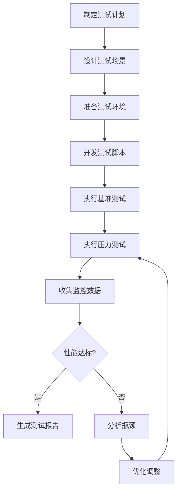

# Q62: 如何进行压力测试？

## 问题分析

本题考察对压力测试的理解：
- 测试工具选择
- 测试场景设计
- 性能指标分析
- 瓶颈定位方法
- KBEngine 压测实践

---

## 一、压力测试概述

### 1.1 测试类型

```
┌─────────────────────────────────────────────────────────────┐
│                    测试类型分类                                │
├─────────────────────────────────────────────────────────────┤
│                                                             │
│  负载测试 (Load Testing):                                   │
│  ┌─────────────────────────────────────────────────┐       │
│  │  - 目标: 验证系统承载能力                           │       │
│  │  - 方法: 逐步增加负载                              │       │
│  │  - 指标: 响应时间、吞吐量                           │       │
│  │  - 示例: 1000 玩家同时在线                          │       │
│  └─────────────────────────────────────────────────┘       │
│                                                             │
│  压力测试 (Stress Testing):                                │
│  ┌─────────────────────────────────────────────────┐       │
│  │  - 目标: 找出系统极限                               │       │
│  │  - 方法: 超过设计负载                              │       │
│  │  - 指标: 系统崩溃点、恢复能力                        │       │
│  │  - 示例: 10000 玩家同时在线                          │       │
│  └─────────────────────────────────────────────────┘       │
│                                                             │
│  耐久测试 (Endurance Testing):                             │
│  ┌─────────────────────────────────────────────────┐       │
│  │  - 目标: 检测内存泄漏、资源耗尽                      │       │
│  │  - 方法: 长时间运行                                 │       │
│  │  - 指标: 内存增长、CPU 稳定性                        │       │
│  │  - 示例: 72 小时连续运行                             │       │
│  └─────────────────────────────────────────────────┘       │
│                                                             │
│  峰值测试 (Spike Testing):                                 │
│  ┌─────────────────────────────────────────────────┐       │
│  │  - 目标: 验证突发流量处理                           │       │
│  │  - 方法: 短时间大量请求                              │       │
│  │  - 指标: 系统稳定性、排队长度                         │       │
│  │  - 示例: 1 秒内 1000 人登录                          │       │
│  └─────────────────────────────────────────────────┘       │
│                                                             │
└─────────────────────────────────────────────────────────────┘
```

### 1.2 测试流程



---

## 二、测试工具

### 2.1 常用工具对比

| 工具 | 类型 | 优点 | 缺点 | 适用场景 |
|------|------|------|------|----------|
| **JMeter** | GUI | 功能丰富、可视化 | 资源占用大 | Web 接口测试 |
| **Locust** | Python | 分布式、代码灵活 | 需要编程 | 自定义协议 |
| **ab** | CLI | 轻量、简单 | 功能单一 | HTTP 基准测试 |
| **wrk** | CLI | 高性能 | 功能单一 | HTTP 压测 |
| **自定义客户端** | C++ | 完全控制 | 开发成本高 | 游戏协议 |

### 2.2 自定义压测客户端

```cpp
// 游戏服务器压测客户端

#include <vector>
#include <thread>
#include <atomic>
#include <chrono>
#include <iomanip>

class StressTestClient {
public:
    struct Config {
        std::string host;
        uint16_t port;
        int botCount;           // 机器人数量
        int rampUpTime;         // 启动时间 (秒)
        int testDuration;       // 测试时长 (秒)
        int thinkTime;          // 思考时间 (毫秒)
        bool login;             // 是否登录
        bool move;              // 是否移动
        bool chat;              // 是否聊天
    };

    struct Stats {
        std::atomic<uint64_t> totalRequests{0};
        std::atomic<uint64_t> failedRequests{0};
        std::atomic<uint64_t> totalLatency{0};
        std::atomic<uint64_t> minLatency{UINT64_MAX};
        std::atomic<uint64_t> maxLatency{0};
        std::atomic<int> activeConnections{0};

        void printReport() {
            uint64_t total = totalRequests.load();
            uint64_t failed = failedRequests.load();
            uint64_t success = total - failed;

            double avgLatency = total > 0 ? totalLatency.load() / (double)total : 0;
            uint64_t minL = minLatency.load() == UINT64_MAX ? 0 : minLatency.load();
            uint64_t maxL = maxLatency.load();

            std::cout << "\n=== Stress Test Report ===\n";
            std::cout << "Total Requests: " << total << "\n";
            std::cout << "Success: " << success << " ("
                      << std::fixed << std::setprecision(2)
                      << (success * 100.0 / total) << "%)\n";
            std::cout << "Failed: " << failed << "\n";
            std::cout << "Avg Latency: " << avgLatency << " ms\n";
            std::cout << "Min Latency: " << minL << " ms\n";
            std::cout << "Max Latency: " << maxL << " ms\n";
        }
    };

    StressTestClient(const Config& config) : config_(config) {}

    void run() {
        std::cout << "Starting stress test with " << config_.botCount << " bots...\n";

        std::vector<std::thread> threads;
        int batchSize = config_.botCount / config_.rampUpTime;
        if (batchSize == 0) batchSize = 1;

        // 分批启动机器人
        for (int i = 0; i < config_.botCount; i += batchSize) {
            int count = std::min(batchSize, config_.botCount - i);

            for (int j = 0; j < count; ++j) {
                threads.emplace_back([this]() {
                    this->runBot();
                });
            }

            std::this_thread::sleep_for(std::chrono::seconds(1));
        }

        // 运行指定时长
        std::this_thread::sleep_for(std::chrono::seconds(config_.testDuration));

        // 停止所有机器人
        running_ = false;

        for (auto& t : threads) {
            if (t.joinable()) t.join();
        }

        stats_.printReport();
    }

private:
    void runBot() {
        stats_.activeConnections++;

        // 连接服务器
        auto conn = connectToServer();
        if (!conn) {
            stats_.activeConnections--;
            return;
        }

        // 登录
        if (config_.login && !doLogin(conn)) {
            stats_.activeConnections--;
            return;
        }

        // 主循环
        auto startTime = std::chrono::steady_clock::now();
        while (running_) {
            auto now = std::chrono::steady_clock::now();
            auto elapsed = std::chrono::duration_cast<std::chrono::seconds>(
                now - startTime
            ).count();

            if (elapsed >= config_.testDuration) {
                break;
            }

            // 执行动作
            if (config_.move) doMove(conn);
            if (config_.chat) doChat(conn);

            // 思考时间
            std::this_thread::sleep_for(
                std::chrono::milliseconds(config_.thinkTime)
            );
        }

        stats_.activeConnections--;
    }

    bool doLogin(Connection* conn) {
        auto start = std::chrono::steady_clock::now();

        // 发送登录请求
        LoginRequest req;
        req.username = "bot_" + std::to_string(std::rand());
        req.password = "123456";

        conn->send(req);

        // 等待响应
        auto resp = conn->receive();
        if (!resp || resp->type != MessageType::LOGIN_RESPONSE) {
            stats_.failedRequests++;
            return false;
        }

        auto end = std::chrono::steady_clock::now();
        auto latency = std::chrono::duration_cast<std::chrono::milliseconds>(
            end - start
        ).count();

        recordLatency(latency);
        return true;
    }

    void doMove(Connection* conn) {
        auto start = std::chrono::steady_clock::now();

        MoveRequest req;
        req.x = (float)(std::rand() % 1000);
        req.z = (float)(std::rand() % 1000);

        conn->send(req);

        auto end = std::chrono::steady_clock::now();
        auto latency = std::chrono::duration_cast<std::chrono::milliseconds>(
            end - start
        ).count();

        recordLatency(latency);
    }

    void recordLatency(uint64_t latency) {
        stats_.totalRequests++;
        stats_.totalLatency += latency;

        uint64_t currentMin = stats_.minLatency.load();
        while (latency < currentMin &&
               !stats_.minLatency.compare_exchange_weak(currentMin, latency)) {}

        uint64_t currentMax = stats_.maxLatency.load();
        while (latency > currentMax &&
               !stats_.maxLatency.compare_exchange_weak(currentMax, latency)) {}
    }

    Config config_;
    Stats stats_;
    std::atomic<bool> running_{true};
};
```

---

## 三、KBEngine 压测实践

### 3.1 KBEngine 自带压测工具

```python
# KBEngine 压测机器人
# scripts/bot/bot.py

import KBEngine
import random
import time

class StressBot:
    """压力测试机器人"""

    def __init__(self, count=100):
        self.botCount = count
        self.bots = []

    def start(self):
        """启动所有机器人"""
        for i in range(self.botCount):
            bot = self.createBot(i)
            self.bots.append(bot)

        print(f"Started {self.botCount} stress bots")

    def createBot(self, index):
        """创建单个机器人"""
        bot = BotEntity()
        bot.login(f"bot_{index}", "password")
        return bot

    def stop(self):
        """停止所有机器人"""
        for bot in self.bots:
            bot.logout()
        print(f"Stopped all bots")


class BotEntity(KBEngine.Entity):
    """机器人实体"""

    def __init__(self):
        KBEngine.Entity.__init__(self)
        self.position = (0, 0, 0)
        self.target = None

    def onLoginSuccess(self):
        """登录成功"""
        INFO(f"Bot {self.id} logged in")

        # 开始执行行为
        self.startBehavior()

    def startBehavior(self):
        """开始机器人行为"""
        # 随机移动
        self.addTimer(1.0, 0, self.randomMove)

        # 定期聊天
        self.addTimer(5.0, 5.0, self.randomChat)

    def randomMove(self):
        """随机移动"""
        x = random.uniform(-100, 100)
        z = random.uniform(-100, 100)
        self.moveTo(x, z)

    def randomChat(self):
        """随机聊天"""
        messages = [
            "Hello!",
            "Anyone here?",
            "Where to go?",
            "Nice day!",
            "Looking for group"
        ]
        msg = random.choice(messages)
        self.say(msg)
```

### 3.2 压测场景设计

```python
# 压测场景定义

class StressTestScenario:
    """压测场景基类"""

    def __init__(self, name):
        self.name = name
        self.metrics = {}

    def setup(self):
        """场景初始化"""
        pass

    def run(self):
        """执行场景"""
        pass

    def collectMetrics(self):
        """收集指标"""
        return self.metrics


class LoginStormScenario(StressTestScenario):
    """登录风暴场景"""

    def __init__(self, botCount, duration):
        super().__init__("Login Storm")
        self.botCount = botCount
        self.duration = duration
        self.loginTimes = []

    def run(self):
        """执行登录风暴"""
        startTime = time.time()

        for i in range(self.botCount):
            start = time.time()
            # 执行登录
            success = self.doLogin(i)
            elapsed = time.time() - start

            self.loginTimes.append(elapsed)

            # 控制速率
            time.sleep(0.01)

        self.metrics = {
            "total": self.botCount,
            "avg_time": sum(self.loginTimes) / len(self.loginTimes),
            "max_time": max(self.loginTimes),
            "min_time": min(self.loginTimes)
        }


class CombatScenario(StressTestScenario):
    """战斗压力场景"""

    def __init__(self, botCount, monsterCount):
        super().__init__("Combat Stress")
        self.botCount = botCount
        self.monsterCount = monsterCount
        self.damageEvents = 0

    def run(self):
        """执行战斗压测"""
        # 创建机器人
        bots = [self.createBot(i) for i in range(self.botCount)]

        # 创建怪物
        monsters = [self.createMonster(i) for i in range(self.monsterCount)]

        # 执行战斗
        for _ in range(1000):
            for bot in bots:
                target = random.choice(monsters)
                bot.attack(target)
                self.damageEvents += 1

        self.metrics = {
            "damage_events": self.damageEvents,
            "events_per_second": self.damageEvents / self.duration
        }
```

---

## 四、性能监控

### 4.1 监控指标

```
┌─────────────────────────────────────────────────────────────┐
│                    关键监控指标                                │
├─────────────────────────────────────────────────────────────┤
│                                                             │
│  服务器指标:                                                 │
│  ├── CPU 使用率                                             │
│  ├── 内存使用量                                             │
│  ├── 网络带宽                                               │
│  ├── 磁盘 I/O                                              │
│  └── 连接数                                                 │
│                                                             │
│  应用指标:                                                   │
│  ├── 请求处理速率 (QPS)                                      │
│  ├── 响应时间 (RT)                                           │
│  ├── 错误率                                                 │
│  ├── 队列长度                                               │
│  └── 实体数量                                               │
│                                                             │
│  业务指标:                                                   │
│  ├── 在线人数                                               │
│  ├── 登录成功率                                             │
│  ├── 移动频率                                               │
│  ├── 战斗次数                                               │
│  └── 消息吞吐量                                             │
│                                                             │
└─────────────────────────────────────────────────────────────┘
```

### 4.2 监控系统

```cpp
// 性能监控系统

class PerformanceMonitor {
public:
    void recordRequest(const std::string& api, uint64_t latencyMs) {
        std::lock_guard<std::mutex> lock(mutex_);

        auto& stats = apiStats_[api];
        stats.count++;
        stats.totalLatency += latencyMs;
        stats.minLatency = std::min(stats.minLatency, latencyMs);
        stats.maxLatency = std::max(stats.maxLatency, latencyMs);
    }

    void recordError(const std::string& api, const std::string& error) {
        std::lock_guard<std::mutex> lock(mutex_);
        apiStats_[api].errorCount++;
    }

    void printReport() {
        std::lock_guard<std::mutex> lock(mutex_);

        std::cout << "\n=== Performance Report ===\n";
        std::cout << std::left << std::setw(30) << "API"
                  << std::right << std::setw(10) << "Count"
                  << std::setw(12) << "Avg(ms)"
                  << std::setw(12) << "Min(ms)"
                  << std::setw(12) << "Max(ms)"
                  << std::setw(10) << "Errors\n";
        std::cout << std::string(86, '-') << "\n";

        for (const auto& [api, stats] : apiStats_) {
            double avg = stats.count > 0 ?
                stats.totalLatency / (double)stats.count : 0;

            std::cout << std::left << std::setw(30) << api
                      << std::right << std::setw(10) << stats.count
                      << std::setw(12) << std::fixed << std::setprecision(2) << avg
                      << std::setw(12) << stats.minLatency
                      << std::setw(12) << stats.maxLatency
                      << std::setw(10) << stats.errorCount << "\n";
        }
    }

private:
    struct ApiStats {
        uint64_t count = 0;
        uint64_t totalLatency = 0;
        uint64_t minLatency = UINT64_MAX;
        uint64_t maxLatency = 0;
        uint64_t errorCount = 0;
    };

    std::mutex mutex_;
    std::unordered_map<std::string, ApiStats> apiStats_;
};
```

---

## 五、瓶颈分析

### 5.1 常见瓶颈

| 瓶颈类型 | 表现 | 定位方法 | 解决方案 |
|---------|------|----------|----------|
| **CPU** | 高 CPU 使用率 | perf/top | 优化算法、减少计算 |
| **内存** | 内存泄漏、GC | valgrind/pmap | 对象池、及时释放 |
| **网络** | 带宽饱和、延迟高 | iftop/iftop | 压缩、批量、CDN |
| **磁盘** | I/O 等待高 | iostat | SSD、批量写入 |
| **锁** | 线程等待 | pstack/lockstat | 无锁结构、减少粒度 |

### 5.2 性能分析工具

```bash
# CPU 性能分析
perf top -p $(pidof server)
perf record -p $(pidof server) -g
perf report

# 内存分析
valgrind --tool=massif ./server
pmap $(pidof server) | sort -k2 -n

# 网络分析
iftop
tcpdump -i any -w capture.pcap

# 系统调用分析
strace -c -p $(pidof server)
```

---

## 六、最佳实践

### 6.1 压测建议

| 实践 | 说明 |
|------|------|
| **渐进式加载** | 逐步增加负载 |
| **真实模拟** | 模拟真实用户行为 |
| **环境隔离** | 专用压测环境 |
| **监控到位** | 全面监控指标 |
| **数据清理** | 测试后清理数据 |
| **结果对比** | 与基线对比 |

### 6.2 KBEngine 压测技巧

```python
# 1. 使用 KBEngine 的性能统计
KBEngine.getWatcher().get("stats/*")

# 2. 监控消息流量
KBEngine.getWatcher().get("network/*")

# 3. 检查内存使用
KBEngine.getWatcher().get("mem/*")

# 4. 分布式压测
# 在多台机器上同时运行压测客户端
```

---

## 七、总结

### 压力测试核心

```
压力测试 = 场景设计 + 工具执行 + 监控分析 + 瓶颈优化
- 模拟真实用户行为
- 找出系统极限
- 发现性能瓶颈
- 验证优化效果
```

---

## 参考资料

- [KBEngine Performance Testing](https://github.com/kbengine/kbengine/wiki)
- [Locust Documentation](https://locust.io/)
- [JMeter User Manual](https://jmeter.apache.org/usermanual/index.html)
