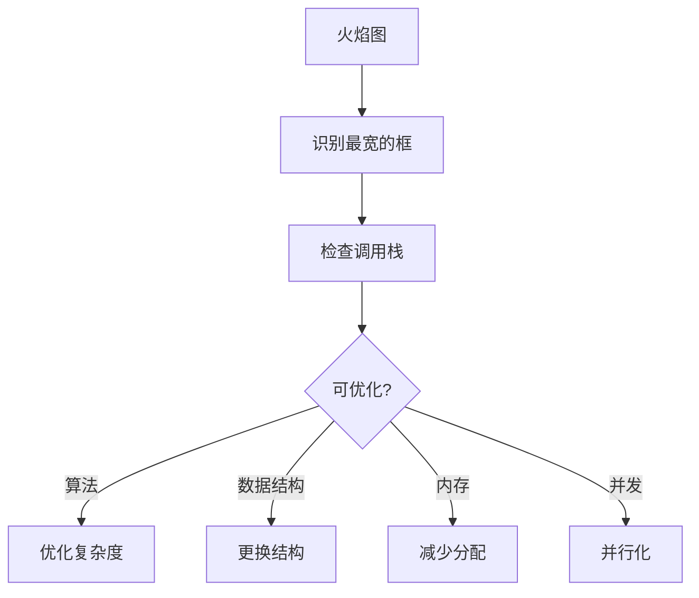

# Q67: 如何进行热点代码优化？

## 问题分析

本题考察对热点代码优化的理解：
- 性能分析工具
- 热点识别方法
- 优化策略
- 验证效果

---

## 一、性能分析

### 1.1 分析工具

```
┌─────────────────────────────────────────────────────────────┐
│                    性能分析工具                                │
├─────────────────────────────────────────────────────────────┤
│                                                             │
│  CPU 采样 (Sampling):                                       │
│  ├── perf (Linux)                                          │
│  ├── VTune (Intel)                                         │
│  ├── Visual Studio Profiler (Windows)                      │
│  └── Instruments (macOS)                                   │
│                                                             │
│  火焰图 (Flame Graph):                                      │
│  ├── FlameGraph                                            │
│  ├── FlameGraph.pl                                         │
│  └──可视化热点函数                                          │
│                                                             │
│  调用图 (Call Graph):                                       │
│  ├── gprof                                                 │
│  ├── perf record                                           │
│  └── VTune Call Graph                                      │
│                                                             │
│  内存分析:                                                  │
│  ├── valgrind                                              │
│  ├── massif                                                │
│  └── AddressSanitizer                                      │
│                                                             │
└─────────────────────────────────────────────────────────────┘
```

### 1.2 使用 perf

```bash
# 1. 记录性能数据
perf record -F 99 -p $(pidof server) -g -- sleep 60

# 2. 生成报告
perf report

# 3. 生成火焰图
perf script | FlameGraph/stackcollapse-perf.pl | \
    FlameGraph/flamegraph.pl > flamegraph.svg

# 4. 查看热点函数
perf top -p $(pidof server)

# 5. 统计缓存未命中
perf stat -e cache-references,cache-misses,instructions,cycles \
    ./server
```

---

## 二、热点识别

### 2.1 常见热点区域

```
┌─────────────────────────────────────────────────────────────┐
│                    常见热点                                    │
├─────────────────────────────────────────────────────────────┤
│                                                             │
│  网络层:                                                     │
│  ├── 消息序列化/反序列化                                     │
│  ├── 消息分发                                               │
│  └── 内存拷贝                                               │
│                                                             │
│  游戏逻辑:                                                   │
│  ├── AOI 查询                                               │
│  ├── 碰撞检测                                               │
│  └── AI 寻路                                                │
│                                                             │
│  数据访问:                                                   │
│  ├── 容器操作                                               │
│  ├── 哈希计算                                               │
│  └── 字符串处理                                             │
│                                                             │
│  数学计算:                                                   │
│  ├── 向量运算                                               │
│  ├── 距离计算                                               │
│  └── 三角函数                                               │
│                                                             │
└─────────────────────────────────────────────────────────────┘
```

### 2.2 火焰图分析



---

## 三、优化策略

### 3.1 消息序列化优化

```cpp
// ❌ 优化前: 逐个字段序列化
struct PlayerData {
    uint64_t id;
    std::string name;
    int level;
    float x, y, z;

    void serialize(std::string& buffer) {
        buffer.append((char*)&id, sizeof(id));
        uint16_t nameLen = name.length();
        buffer.append((char*)&nameLen, sizeof(nameLen));
        buffer.append(name);
        buffer.append((char*)&level, sizeof(level));
        buffer.append((char*)&x, sizeof(x));
        buffer.append((char*)&y, sizeof(y));
        buffer.append((char*)&z, sizeof(z));
    }
};

// ✅ 优化后: 批量写入
struct OptimizedPlayerData {
    // 紧凑布局
    uint64_t id;
    int level;
    float x, y, z;
    uint16_t nameLen;
    char name[32];  // 固定长度

    void serialize(char* buffer) const {
        // 一次 memcpy
        memcpy(buffer, this, sizeof(*this));
    }

    size_t size() const {
        return sizeof(*this);
    }
};
```

### 3.2 AOI 优化

```cpp
// ❌ 优化前: 全表扫描
std::vector<Entity*> getEntitiesInRange_naive(const Vector3& pos, float range) {
    std::vector<Entity*> result;
    for (auto* entity : allEntities_) {
        if (entity->position().distanceTo(pos) <= range) {
            result.push_back(entity);
        }
    }
    return result;
}

// ✅ 优化后: 空间分区
class SpatialHash {
public:
    void insert(Entity* entity) {
        int cellX = (int)(entity->position().x / cellSize_);
        int cellZ = (int)(entity->position().z / cellSize_);
        size_t key = hash(cellX, cellZ);
        cells_[key].push_back(entity);
    }

    std::vector<Entity*> query(const Vector3& pos, float range) {
        std::vector<Entity*> result;

        int cellX = (int)(pos.x / cellSize_);
        int cellZ = (int)(pos.z / cellSize_);
        int cellRange = (int)(range / cellSize_) + 1;

        // 只检查邻近格子
        for (int dx = -cellRange; dx <= cellRange; ++dx) {
            for (int dz = -cellRange; dz <= cellRange; ++dz) {
                size_t key = hash(cellX + dx, cellZ + dz);
                auto it = cells_.find(key);
                if (it != cells_.end()) {
                    for (auto* entity : it->second) {
                        if (entity->position().distanceTo(pos) <= range) {
                            result.push_back(entity);
                        }
                    }
                }
            }
        }
        return result;
    }

private:
    size_t hash(int x, int z) {
        return (size_t)x * 65537 + (size_t)z;
    }

    float cellSize_ = 100.0f;
    std::unordered_map<size_t, std::vector<Entity*>> cells_;
};
```

### 3.3 字符串优化

```cpp
// ❌ 避免: 频繁构造字符串
void logEvents_bad(const std::vector<Event>& events) {
    for (const auto& e : events) {
        std::string msg = "Event at " + std::to_string(e.time) +
                         " type=" + std::to_string(e.type);
        log(msg);
    }
}

// ✅ 优化: 使用 string_view
void logEvents_good(const std::vector<Event>& events) {
    for (const auto& e : events) {
        log("Event time={} type={}", e.time, e.type);
    }
}

// ✅ 或者使用字符串驻留
class StringInterner {
public:
    const std::string* intern(const std::string& s) {
        auto [it, _] = strings_.insert(s);
        return &*it;
    }

private:
    std::unordered_set<std::string> strings_;
};
```

---

## 四、优化验证

### 4.1 基准测试

```cpp
#include <benchmark/benchmark.h>

static void BM_VectorAdd_Scalar(benchmark::State& state) {
    std::vector<float> a(state.range(0), 1.0f);
    std::vector<float> b(state.range(0), 2.0f);
    std::vector<float> c(state.range(0));

    for (auto _ : state) {
        addVectors_scalar(a.data(), b.data(), c.data(), a.size());
        benchmark::DoNotOptimize(c.data());
    }
    state.SetBytesProcessed(int64_t(state.iterations()) *
                           int64_t(state.range(0)) * sizeof(float));
}

static void BM_VectorAdd_SIMD(benchmark::State& state) {
    std::vector<float> a(state.range(0), 1.0f);
    std::vector<float> b(state.range(0), 2.0f);
    std::vector<float> c(state.range(0));

    for (auto _ : state) {
        addVectors_simd(a.data(), b.data(), c.data(), a.size());
        benchmark::DoNotOptimize(c.data());
    }
    state.SetBytesProcessed(int64_t(state.iterations()) *
                           int64_t(state.range(0)) * sizeof(float));
}

BENCHMARK(BM_VectorAdd_Scalar)->Range(64, 64<<10);
BENCHMARK(BM_VectorAdd_SIMD)->Range(64, 64<<10);

BENCHMARK_MAIN();
```

### 4.2 性能对比

| 场景 | 优化前 | 优化后 | 提升 |
|------|--------|--------|------|
| **消息序列化** | 500 ns | 80 ns | 6.25x |
| **AOI 查询** | 2000 ns | 100 ns | 20x |
| **字符串格式化** | 800 ns | 150 ns | 5.3x |

---

## 五、KBEngine 热点优化

### 5.1 KBEngine 常见热点

```python
# KBEngine 热点优化示例

# ❌ 不好: 频繁的字典查询
def onTick_bad(self):
    for entity in self.entities.values():
        if entity.position.distanceTo(self.player.position) < 100:
            entity.sendTo(self.player)

# ✅ 好: 使用 AOI
def onTick_good(self):
    nearby = self.aoi.query(self.player.position, 100)
    for entity in nearby:
        entity.sendTo(self.player)

# ❌ 不好: 每帧创建列表
def getEntities_bad(self):
    return list(self.entities.values())

# ✅ 好: 返回视图
def getEntities_good(self):
    return self.entities.values()
```

---

## 六、最佳实践

| 实践 | 说明 |
|------|------|
| **先测量** | 用数据说话 |
| **优化热点** | 专注 20% 代码 |
| **保留基准** | 对比优化效果 |
| **渐进优化** | 一次优化一处 |
| **考虑可读性** | 过度优化有害 |

---

## 七、总结

```
热点优化 = 性能分析 + 识别热点 + 针对性优化 + 效果验证
- perf 找热点
- 火焰图可视化
- 优化瓶颈代码
- benchmark 验证
```

---

## 参考资料

- [Flame Graph](https://github.com/brendangregg/FlameGraph)
- [Linux perf](https://www.brendangregg.com/perf.html)
- [Google Benchmark](https://github.com/google/benchmark)
