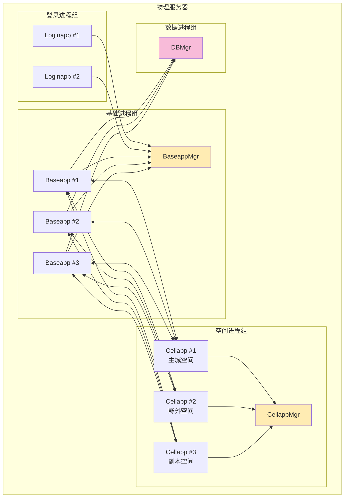
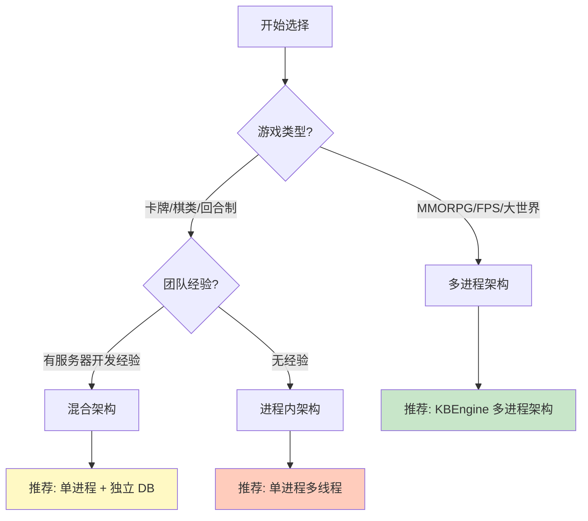

# Q7: 进程内架构 vs 多进程架构，各有什么优劣？

## 问题分析

本题考察对进程架构设计的理解：
- 进程内架构（单进程多线程）vs 多进程架构
- KBEngine 为什么选择多进程架构
- 两种架构在游戏服务器中的适用场景
- 各自的优势和劣势

---

## 一、架构定义

### 1.1 进程内架构（Single-Process Multi-Thread）

```
┌─────────────────────────────────────────────────────────────┐
│                    进程内架构                                │
├─────────────────────────────────────────────────────────────┤
│                                                             │
│   ┌─────────────────────────────────────────────────┐       │
│   │              单一进程                            │       │
│   │  ┌───────────────────────────────────────────┐  │       │
│   │  │  主线程  │ 网络线程 │ 逻辑线程 │ DB线程  │  │       │
│   │  │   │        │         │         │        │  │       │
│   │  │   └────────┴─────────┴─────────┘        │  │       │
│   │  │            共享内存空间                   │  │       │
│   │  └───────────────────────────────────────────┘  │       │
│   └─────────────────────────────────────────────────┘       │
│                        │                                     │
│                        ▼                                     │
│   ┌─────────────────────────────────────────────────┐       │
│   │              共享资源                            │       │
│   │  - 全局对象池                                      │       │
│   │  - 统一内存管理                                    │       │
│   │  - 锁保护的共享数据                               │       │
│   └─────────────────────────────────────────────────┘       │
│                                                             │
└─────────────────────────────────────────────────────────────┘

特点：
- 所有线程共享同一内存空间
- 线程间通信成本低（共享内存）
- 需要处理锁竞争和线程安全
- 一个线程崩溃可能导致整个进程崩溃
```

### 1.2 多进程架构（Multi-Process）

```
┌─────────────────────────────────────────────────────────────┐
│                    KBEngine 多进程架构                       │
├─────────────────────────────────────────────────────────────┤
│                                                             │
│   ┌─────────────┐  ┌─────────────┐  ┌─────────────┐        │
│   │  Loginapp   │  │  Baseapp    │  │  Cellapp    │        │
│   │  进程 1     │  │  进程 2     │  │  进程 3     │        │
│   │  ┌───────┐  │  │  ┌───────┐  │  │  ┌───────┐  │        │
│   │  │线程池 │  │  │  │线程池 │  │  │  │线程池 │  │        │
│   │  └───────┘  │  │  └───────┘  │  │  └───────┘  │        │
│   └──────┬──────┘  └──────┬──────┘  └──────┬──────┘        │
│          │                │                │                │
│          └────────────────┼────────────────┘                │
│                          │                                 │
│                          ▼                                 │
│                   ┌─────────────┐                          │
│                   │    DBMgr    │                          │
│                   │  进程 4      │                          │
│                   └──────┬──────┘                          │
│                          │                                 │
│                          ▼                                 │
│                   ┌─────────────┐                          │
│                   │  Database   │                          │
│                   └─────────────┘                          │
│                                                             │
└─────────────────────────────────────────────────────────────┘

特点：
- 每个进程独立内存空间
- 进程间通过 IPC（TCP/共享内存）通信
- 进程隔离，单个崩溃不影响其他
- 部署和运维更复杂
```

---

## 二、KBEngine 的多进程设计

### 2.1 进程架构图

根据 [KBEngine Lab - 引擎概览](https://www.kbelab.com/manual/engine-overview.html)：



### 2.2 各进程的线程模型

| 进程 | 线程模型 | 说明 |
|------|----------|------|
| **Loginapp** | 主线程 + 网络线程 | 处理登录请求，负载轻 |
| **Baseapp** | 主线程 + 网络线程 + DB线程 | Proxy管理，数据缓存 |
| **Cellapp** | 主线程 + 网络线程 + 逻辑线程 | 游戏逻辑，AOI计算 |
| **DBMgr** | 主线程 + 工作线程池 | 数据库连接池管理 |

### 2.3 进程间通信方式

```cpp
// KBEngine 使用 TCP 进行进程间通信
// src/server/network/bundle.h

class Bundle : public Mercury::Bundle {
public:
    // 消息打包器
    void newMessage(MessageID msgID);

    // 发送到指定进程
    void send(Channel* pChannel);

    // 内部使用 TCP 长连接
};

// src/server/network/channel.h
class Channel {
public:
    // 通道类型
    enum ChannelType {
        CHANNEL_TCP = 0,      // TCP 连接
        CHANNEL_UDP = 1,      // UDP 连接（内部未使用）
    };

    // 唯一标识
    Components::COMPONENT_TYPE type() const;
    COMPONENT_ID componentID() const;
};
```

---

## 三、对比分析

### 3.1 详细对比表

| 维度 | 进程内架构 | 多进程架构 (KBEngine) |
|------|-----------|----------------------|
| **内存隔离** | ❌ 共享内存，风险高 | ✅ 独立内存，隔离好 |
| **故障隔离** | ❌ 线程崩溃可能影响进程 | ✅ 进程崩溃不影响其他 |
| **通信成本** | ✅ 低（共享内存+锁） | ⚠️ 中（序列化+TCP） |
| **并发能力** | ⚠️ 受 GIL/锁限制 | ✅ 真正并行 |
| **部署复杂度** | ✅ 低（单进程） | ⚠️ 中高（多进程协调） |
| **调试难度** | ⚠️ 中（线程调试） | ⚠️ 中高（跨进程调试） |
| **资源利用** | ⚠️ 单机资源上限 | ✅ 可跨机器分布 |
| **扩展性** | ❌ 垂直扩展 | ✅ 水平扩展 |
| **热更新** | ❌ 需重启整个服务 | ✅ 可逐进程重启 |
| **监控运维** | ✅ 简单 | ⚠️ 复杂 |

### 3.2 性能对比

#### 内存访问

```
进程内（共享内存）：
┌─────────────────────────────────────────────────────────────┐
│  Thread A                                    Thread B        │
│      │                                           │           │
│      │  ┌─────────────────────────────────┐        │           │
│      ├─►│         Shared Memory           │◄───────┤           │
│      │  │  ┌─────────────────────────┐    │        │           │
│      │  │  │    Entity Data          │    │        │           │
│      │  │  └─────────────────────────┘    │        │           │
│      │  └─────────────────────────────────┘        │           │
│      │                                           │           │
│  读/写 ~10ns                                     读/写 ~10ns   │
└─────────────────────────────────────────────────────────────┘

多进程（IPC）：
┌─────────────────────────────────────────────────────────────┐
│  Process A                              Process B            │
│      │                                        │             │
│      │  序列化                    序列化      │             │
│      ├──────► TCP ──────────────────────────►┤             │
│      │                                        │             │
│   ~100μs                                   ~100μs            │
└─────────────────────────────────────────────────────────────┘
```

#### 并行计算

```
进程内（多线程）：
┌─────────────────────────────────────────────────────────────┐
│                    CPU 利用率                                │
│  ████████████████████████████████ 95%                       │
│  问题：GIL（Python）或锁竞争限制并行度                      │
└─────────────────────────────────────────────────────────────┘

多进程：
┌─────────────────────────────────────────────────────────────┐
│                    CPU 利用率（多核）                        │
│  Process 1: ████████████████████████░░ 80%  (Core 1)       │
│  Process 2: ██████████████████████████ 85%  (Core 2)       │
│  Process 3: ████████████████████░░░░░░ 70%  (Core 3)       │
│  Process 4: ██████████████████████░░░░ 75%  (Core 4)       │
│  优势：真正并行，充分利用多核                               │
└─────────────────────────────────────────────────────────────┘
```

### 3.3 故障场景对比

```
场景：游戏逻辑出现 Bug 导致崩溃

进程内架构：
┌─────────────────────────────────────────────────────────────┐
│                                                             │
│   ┌─────────────────────────────────────────────────┐       │
│   │              单一进程                            │       │
│   │  ┌───────────────────────────────────────────┐  │       │
│   │  │  登录 │ 聊天 │ 战斗 │ 数据 │ AI │ ...  │  │       │
│   │  └───────────────────────────────────────────┘  │       │
│   │                        │                        │       │
│   │                        ▼                        │       │
│   │                   战斗逻辑崩溃 ❌                │       │
│   │                        │                        │       │
│   │                        ▼                        │       │
│   │              整个进程崩溃 ❌❌❌                  │       │
│   │              所有玩家掉线！                      │       │
│   └─────────────────────────────────────────────────┘       │
│                                                             │
└─────────────────────────────────────────────────────────────┘

多进程架构 (KBEngine)：
┌─────────────────────────────────────────────────────────────┐
│                                                             │
│   ┌──────────┐  ┌──────────┐  ┌──────────┐                │
│   │Loginapp  │  │ Baseapp  │  │ Cellapp  │                │
│   │   ✓      │  │    ✓     │  │    ✗     │                │
│   └──────────┘  └──────────┘  └──────────┘                │
│       │              │              │                      │
│       │              │              ▼                      │
│       │              │         Cellapp 崩溃                  │
│       │              │              │                      │
│       │              │         其他组件不受影响               │
│       │              │         CellappMgr 自动重启          │
│       │              │              │                      │
│       ▼              ▼              ▼                      │
│   玩家可以        玩家数据        受影响的                   │
│   正常登录        正常保存         空间玩家                   │
│                  掉线重连                                  │
│                                                             │
└─────────────────────────────────────────────────────────────┘
```

---

## 四、KBEngine 为什么选择多进程？

### 4.1 设计理念

根据 [KBEngine 源码分析](https://github.com/kbengine/kbengine)：

```cpp
// KBEngine 的核心设计思想：
// 1. 进程隔离 - 单个组件崩溃不影响整体
// 2. 动态负载均衡 - 可根据负载动态调整进程数
// 3. 分布式部署 - 可跨多台机器部署

// src/server/components.h
enum COMPONENT_TYPE {
    UNKNOWN_COMPONENT_TYPE = 0,
    LOGINAPP_TYPE,          // 登录服务
    BASEAPP_TYPE,           // 基础应用
    CELLAPP_TYPE,           // 空间应用
    BASEAPPMGR_TYPE,        // 基础应用管理器
    CELLAPPMGR_TYPE,        // 空间应用管理器
    DBMGR_TYPE,             // 数据库管理器
    // ...
};
```

### 4.2 多进程的优势

#### 1. 故障隔离

```python
# KBEngine 中的自动恢复机制

# scripts/kbe_scripts/base/baseapp.py
class Baseapp(KBEngine.Base):
    def onMgrRecoverBaseapp(self, deadBaseappID):
        """
        当某个 Baseapp 崩溃时，其他 Baseapp 接管其数据
        """
        KBEngine.info(f"Baseapp {deadBaseappID} 崩溃，开始恢复数据")

        # 加载崩溃 Baseapp 的备份数据
        self.loadBackupData(deadBaseappID)

        # 重新分配受影响的玩家
        self.reassignPlayers(deadBaseappID)
```

#### 2. 动态扩展

```python
# KBEngine 支持动态添加进程

# 1. 启动新的 Cellapp
$ cellapp

# 2. Cellapp 自动注册到 CellappMgr
# 3. CellappMgr 开始将新实体分配到新的 Cellapp
# 4. 无需停机，无缝扩展
```

#### 3. 资源隔离

```cpp
// 每个 Cellapp 可以独立设置资源限制

// cellapp.xml
<Cellapp>
    <!-- 单个 Cellapp 最大实体数 -->
    <maxEntities>5000</maxEntities>

    <!-- 内存使用限制 -->
    <maxMemoryUsage>2GB</maxMemoryUsage>

    <!-- CPU 使用限制 -->
    <cpuAffinity>1</cpuAffinity>  <!-- 绑定到 CPU 核心 1 -->
</Cellapp>
```

### 4.3 多进程的代价

#### 1. 通信开销

```cpp
// 进程内：直接访问
void updateHP(Entity* entity, int hp) {
    entity->hp = hp;  // ~10ns
}

// 多进程：网络传输
void updateHP(EntityID id, int hp) {
    MemoryStream stream;
    stream.pack(id);
    stream.pack(hp);

    // 序列化 + TCP 传输 + 反序列化
    channel->send(stream.data(), stream.size());  // ~100μs
}

// 开销对比：100μs / 10ns = 10,000 倍
```

#### 2. 部署复杂度

```bash
# 进程内：单个可执行文件
$ ./game_server

# KBEngine：多个进程
$ machine
$ loginapp
$ baseappmgr
$ baseapp
$ baseapp
$ cellappmgr
$ cellapp
$ cellapp
$ cellapp
$ dbmgr
# ... 需要按顺序启动，监控各自状态
```

---

## 五、选择建议

### 5.1 决策流程图



### 5.2 场景建议表

| 场景 | 推荐架构 | 原因 |
|------|----------|------|
| **卡牌游戏** | 进程内 | 逻辑简单，无需复杂架构 |
| **棋类游戏** | 进程内 | 状态少，计算轻 |
| **回合制 RPG** | 混合 | 单进程 + 独立 DB |
| **MMORPG** | 多进程(KBEngine) | 空间大，逻辑复杂 |
| **FPS 游戏** | 多进程 | 低延迟，高并发 |
| **MOBA 游戏** | 多进程 | 5v5，但多房间 |
| **休闲游戏** | 进程内 | 快速开发 |

### 5.3 团队能力匹配

```
团队规模与架构选择：

1-2 人：进程内架构
   - 开发速度快
   - 运维成本低
   - 适合小规模游戏

3-5 人：混合架构
   - 单进程 + 独立 DB
   - 可以使用现成框架
   - 有一定扩展能力

5-10 人：多进程架构
   - 可以使用 KBEngine
   - 需要专门的运维人员
   - 适合商业化运营

10+ 人：自研分布式架构
   - 可以考虑自研
   - 需要架构师角色
   - 长期投入
```

---

## 六、混合架构方案

### 6.1 渐进式架构演进

```
阶段 1：单进程起步
┌─────────────────────────────────────────────────────────────┐
│  ┌─────────────────────────────────────────────────┐       │
│  │           单一进程 (多线程)                      │       │
│  │  ┌───────────────────────────────────────────┐  │       │
│  │  │  网络 │ 逻辑 │ 数据 │ AI │ 其他           │  │       │
│  │  └───────────────────────────────────────────┘  │       │
│  └─────────────────────────────────────────────────┘       │
└─────────────────────────────────────────────────────────────┘
         │ 玩家增长，性能瓶颈
         ▼
阶段 2：分离数据库
┌─────────────────────────────────────────────────────────────┐
│  ┌─────────────────────────┐      ┌──────────────────┐      │
│  │    游戏服务器 (单进程)   │──────│    独立数据库    │      │
│  │  网络/逻辑/AI/缓存       │      │  MySQL/Redis    │      │
│  └─────────────────────────┘      └──────────────────┘      │
└─────────────────────────────────────────────────────────────┘
         │ 继续增长
         ▼
阶段 3：逻辑分离
┌─────────────────────────────────────────────────────────────┐
│  ┌──────────┐  ┌──────────┐  ┌──────────┐  ┌──────────┐   │
│  │ 网关进程 │  │ 逻辑进程 │  │ 空间进程 │  │ 数据进程 │   │
│  │  Gateway │  │  BaseApp │  │ CellApp  │  │  DBMgr   │   │
│  └──────────┘  └──────────┘  └──────────┘  └──────────┘   │
└─────────────────────────────────────────────────────────────┘
         │ 完全分布式
         ▼
阶段 4：完全分布式 (KBEngine)
┌─────────────────────────────────────────────────────────────┐
│  多机器部署，动态负载均衡，组件化设计                        │
└─────────────────────────────────────────────────────────────┘
```

### 6.2 功能模块分离建议

```
哪些模块适合分离？

适合独立进程的模块：
├── 登录服务      → 独立的 Loginapp
├── 聊天服务      → 独立的 Chatapp (高并发，频繁读写)
├── 排行榜        → 独立服务或 Redis
├── 匹配系统      → 独立的 Matchapp
├── 统计分析      → 独立的 Statsapp (不影响游戏)
└── GM 系统       → 独立的 GMapp

必须在一起的模块：
├── 战斗系统      ─┐
├── AOI 系统      ─┼─ 在 Cellapp 中
├── 空间管理      ─┘
├── 玩家数据      ─┐
└── 社交系统      ─┘ 在 Baseapp 中
```

---

## 七、实战建议

### 7.1 小团队建议

```
如果你是 < 5 人团队：

1. 第一款游戏：进程内架构
   ├── 使用成熟框架（如 Flask/Django + SQLAlchemy）
   ├── 单进程 + 多线程
   ├── Redis 做缓存
   └── MySQL 做存储

2. 验证成功后：考虑迁移
   ├── 使用 KBEngine 等现成 MMO 框架
   ├── 或自研分布式架构
   └── 需要投入学习成本
```

### 7.2 中等团队建议

```
如果你是 5-10 人团队：

1. 直接使用 KBEngine
   ├── 多进程架构已经设计好
   ├── 只需关注游戏逻辑
   ├── 可参考官方 Demo
   └── 社区有经验分享

2. 或混合方案
   ├── 单进程游戏服务器
   ├── Redis 做缓存和排行
   ├── Kafka 做消息队列
   └── 分离非关键模块
```

### 7.3 大团队建议

```
如果你是 10+ 人团队：

1. 自研分布式架构
   ├── 参考 KBEngine 设计
   ├── 根据团队技术栈选择
   ├── 可以使用 RPC 框架（gRPC/Thrift）
   └── 需要架构师和技术专家

2. 或深度定制 KBEngine
   ├── 修改底层 C++ 代码
   ├── 扩展 Python 脚本接口
   └── 优化性能瓶颈
```

---

## 八、总结

### 核心观点

| 架构 | 优势 | 劣势 | 适用场景 |
|------|------|------|----------|
| **进程内** | 开发快、部署简单、通信高效 | 扩展性差、故障风险高 | 小规模游戏、原型验证 |
| **多进程** | 扩展性强、故障隔离、真正并行 | 开发复杂、通信开销 | 大规模游戏、商业运营 |
| **混合** | 平衡开发效率与扩展性 | 需要设计边界 | 中等规模游戏 |

### 决策清单

```
架构选择检查清单：

□ 预期在线人数规模？
□ 游戏类型（空间型/非空间型）？
□ 团队规模和经验？
□ 开发周期要求？
□ 运维能力如何？
□ 是否需要动态扩容？
□ 对故障恢复的要求？
□ 长期维护考虑？

建议：
- 6+ 个答案指向同一方向，就选择该架构
- 不确定时，先选简单的，后续可以重构
```

---

## 参考资料

- [KBEngine GitHub - 源码分析](https://github.com/kbengine/kbengine)
- [KBEngine Lab - 引擎概览](https://www.kbelab.com/manual/engine-overview.html)
- [多进程 vs 多线程游戏服务器](https://www.gamasutra.com/blogs/MichaelKerr/20190314/339300/)
- [BigWorld 架构设计白皮书](https://www.bigworldtech.com/technology)
