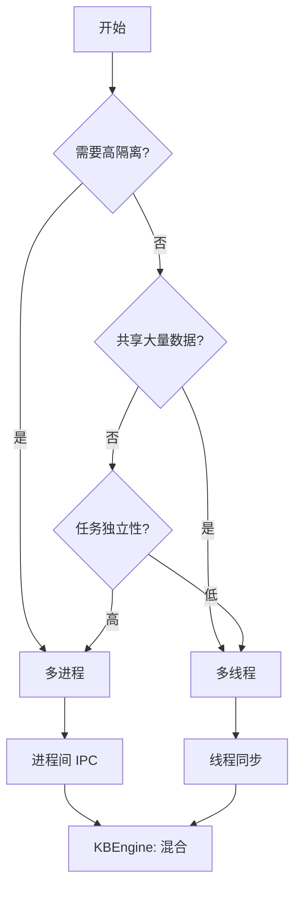

# Q71: 多线程 vs 多进程，如何选择？

## 问题分析

本题考察对并发模型选择的理解：
- 多线程与多进程的区别
- 各自的优缺点
- 适用场景
- KBEngine 的选择

---

## 一、基本概念

### 1.1 对比表

```
┌─────────────────────────────────────────────────────────────┐
│                    多线程 vs 多进程                            │
├─────────────────────────────────────────────────────────────┤
│                                                             │
│  多线程 (Thread):                                           │
│  ├── 共享进程内存空间                                        │
│  ├── 创建开销小                                             │
│  ├── 上下文切换快                                           │
│  ├── 需要处理同步问题                                        │
│  └── 一个线程崩溃可能影响整个进程                             │
│                                                             │
│  多进程 (Process):                                          │
│  ├── 独立内存空间                                            │
│  ├── 创建开销大                                             │
│  ├── 进程间通信复杂                                          │
│  ├── 隔离性好，一个崩溃不影响其他                             │
│  └── 可利用多核                                              │
│                                                             │
└─────────────────────────────────────────────────────────────┘
```

### 1.2 详细对比

| 特性 | 多线程 | 多进程 |
|------|--------|--------|
| **内存共享** | 共享地址空间 | 独立地址空间 |
| **创建开销** | 低 (~MB 级) | 高 (~GB 级) |
| **上下文切换** | 快 (~微秒) | 慢 (~毫秒) |
| **数据通信** | 直接读写共享内存 | IPC (管道/共享内存/消息) |
| **同步机制** | 锁、条件变量 | IPC 信号量、消息队列 |
| **隔离性** | 差，一个线程崩溃可能影响进程 | 好，进程间完全隔离 |
| **CPU 利用** | 多核多线程并行 | 多核多进程并行 |
| **适用场景** | 共享数据密集型 | 隔离要求高、任务独立 |

---

## 二、多线程架构

### 2.1 典型多线程服务器

```cpp
// 多线程游戏服务器架构

class ThreadedGameServer {
public:
    void start(int threadCount = 4) {
        // 主线程处理网络 I/O
        acceptThread_ = std::thread(&ThreadedGameServer::acceptLoop, this);

        // 工作线程处理游戏逻辑
        for (int i = 0; i < threadCount; ++i) {
            workers_.emplace_back(&ThreadedGameServer::workerLoop, this, i);
        }

        // 数据库线程
        dbThread_ = std::thread(&ThreadedGameServer::dbLoop, this);
    }

private:
    void acceptLoop() {
        while (running_) {
            // 接受新连接
            int fd = accept(listenFd_, nullptr, nullptr);

            // 分配给玩家
            assignToPlayer(fd);
        }
    }

    void workerLoop(int workerId) {
        // 每个工作线程有自己的消息队列
        auto& queue = workerQueues_[workerId];

        while (running_) {
            Message msg;
            if (queue.pop(msg)) {
                handleMessage(msg);
            }
        }
    }

    void dbLoop() {
        // 专门处理数据库操作
        while (running_) {
            DBRequest req;
            if (dbQueue_.pop(req)) {
                executeDBRequest(req);
            }
        }
    }

    std::thread acceptThread_;
    std::vector<std::thread> workers_;
    std::thread dbThread_;
    std::array<ThreadSafeQueue<Message>, 16> workerQueues_;
    ThreadSafeQueue<DBRequest> dbQueue_;
};
```

### 2.2 KBEngine 多线程设计

```python
# KBEngine 多线程架构

"""
KBEngine 进程模型:

LoginApp:
├── 主线程: 网络事件循环
├── DB线程: 数据库操作
└── Timer线程: 定时器处理

BaseApp:
├── 主线程: 网络事件 + 游戏逻辑
├── DB线程: 数据库异步操作
└── 备份线程: 数据快照

CellApp:
├── 主线程: 游戏逻辑 + 物理模拟
└── 网络由内部网络层处理
"""

# KBEngine 使用混合模型: 多进程 + 进程内多线程
# 优点: 结合了隔离性和共享内存的高效
```

---

## 三、多进程架构

### 3.1 经典多进程服务器

```cpp
// 多进程服务器 (Pre-fork 模型)

class PreforkServer {
public:
    void start(int workerCount = 4) {
        // 创建多个工作进程
        for (int i = 0; i < workerCount; ++i) {
            pid_t pid = fork();

            if (pid == 0) {
                // 子进程
                workerLoop();
                exit(0);
            } else if (pid > 0) {
                // 父进程
                workerPids_.push_back(pid);
            }
        }

        // 父进程监控子进程
        monitorLoop();
    }

private:
    void workerLoop() {
        // 每个工作进程独立运行
        while (true) {
            // 处理连接和逻辑
            handleEvents();
        }
    }

    void monitorLoop() {
        int status;
        while (true) {
            pid_t pid = wait(&status);

            if (WIFEXITED(status)) {
                // 子进程正常退出，重启
                INFO("Worker {} exited, restarting...", pid);
                restartWorker(pid);
            } else if (WIFSIGNALED(status)) {
                // 子进程崩溃，重启
                ERROR("Worker {} crashed, restarting...", pid);
                restartWorker(pid);
            }
        }
    }

    std::vector<pid_t> workerPids_;
};
```

### 3.2 进程间通信

```cpp
// 共享内存 + 信号量

class SharedMemoryQueue {
public:
    bool create(const std::string& name, size_t size) {
        // 创建共享内存
        fd_ = shm_open(name.c_str(), O_CREAT | O_RDWR, 0666);
        if (fd_ < 0) return false;

        ftruncate(fd_, size);

        // 映射到进程地址空间
        data_ = (char*)mmap(nullptr, size,
                           PROT_READ | PROT_WRITE,
                           MAP_SHARED, fd_, 0);

        // 初始化信号量
        sem_init(&semEmpty_, 1, size);  // 空槽位
        sem_init(&semFull_, 1, 0);      // 数据项
        sem_init(&semMutex_, 1, 1);     // 互斥

        return true;
    }

    bool send(const void* data, size_t len) {
        sem_wait(&semEmpty_);  // 等待空槽位
        sem_wait(&semMutex_);  // 获取锁

        // 写入数据
        memcpy(data_ + writePos_, data, len);
        writePos_ = (writePos_ + len) % size_;

        sem_post(&semMutex_);  // 释放锁
        sem_post(&semFull_);   // 增加数据项
        return true;
    }

    bool receive(void* data, size_t len) {
        sem_wait(&semFull_);   // 等待数据项
        sem_wait(&semMutex_);  // 获取锁

        // 读取数据
        memcpy(data, data_ + readPos_, len);
        readPos_ = (readPos_ + len) % size_;

        sem_post(&semMutex_);  // 释放锁
        sem_post(&semEmpty_);  // 增加空槽位
        return true;
    }

private:
    int fd_;
    char* data_;
    size_t size_;
    size_t readPos_ = 0;
    size_t writePos_ = 0;

    sem_t semEmpty_, semFull_, semMutex_;
};
```

---

## 四、KBEngine 架构选择

### 4.1 KBEngine 的多进程架构

```
┌─────────────────────────────────────────────────────────────┐
│                    KBEngine 进程模型                          │
├─────────────────────────────────────────────────────────────┤
│                                                             │
│  [Machine]                                                  │
│                                                             │
│  ├── [LoginApp] ─────┐                                      │
│  │   ├── 主线程       │                                      │
│  │   ├── DB线程       ├──> [Database]                       │
│  │   └── Timer线程    │                                      │
│  │                    │                                      │
│  ├── [BaseAppMgr] ────┤                                      │
│  │   └── 主线程        │                                      │
│  │                    │                                      │
│  ├── [BaseApp #1] ────┤                                      │
│  │   ├── 主线程        │      ┌─────────────┐               │
│  │   ├── DB线程        │      │   [CellApp]  │               │
│  │   └── 备份线程       │      │   #1         │               │
│  │                    │      │   ├── 主线程  │               │
│  ├── [BaseApp #2] ────┼──────┼──> ├── 网络层  │               │
│  │   └── ...          │      │   └── 物理层  │               │
│  │                    │      └─────────────┘               │
│  ├── [CellAppMgr] ────┤                 │                    │
│  │   └── 主线程        │                 ▼                    │
│  │                    │          ┌─────────────┐             │
│  └── [DBMgr] ─────────┴──────┬───│   [CellApp]  │             │
│      └── 多线程处理           │   │   #2         │             │
│                             │   └─────────────┘             │
│                             │                                │
│                             ▼                                │
│                      ┌─────────────┐                        │
│                      │  Database   │                        │
│                      └─────────────┘                        │
│                                                             │
└─────────────────────────────────────────────────────────────┘
```

### 4.2 KBEngine 选择原因

```cpp
// KBEngine 选择多进程架构的原因

/**
 * 1. 隔离性:
 *    - BaseApp 崩溃不影响 CellApp
 *    - 不同玩家分布在不同 BaseApp
 *    - 一个进程崩溃只影响部分玩家
 *
 * 2. 扩展性:
 *    - 可以动态增减 BaseApp/CellApp
 *    - 不同进程可部署在不同机器
 *    - 负载均衡灵活
 *
 * 3. 简化同步:
 *    - 进程间通过消息通信
 *    - 避免复杂的锁机制
 *    - Actor 模型天然支持
 *
 * 4. 容错性:
 *    - 进程崩溃易检测
 *    - 可自动重启
 *    - 影响范围可控
 */
```

---

## 五、选择决策

### 5.1 决策树



### 5.2 场景推荐

| 场景 | 推荐 | 原因 |
|------|------|------|
| **Web 服务器** | 多进程/混合 | Nginx 风格，隔离 + 响应速度 |
| **游戏逻辑** | 多线程/Actor | 共享状态多，需要高效同步 |
| **数据处理** | 多进程 | 任务独立，崩溃隔离 |
| **IO 密集** | 多线程/协程 | 共享资源，高效等待 |
| **MMO 服务器** | 多进程 + Actor | KBEngine 方案，隔离 + 扩展 |

---

## 六、混合架构

### 6.1 KBEngine 风格混合

```cpp
// 混合架构: 多进程 + 进程内多线程

class HybridServer {
public:
    void start() {
        // 启动多个服务进程
        startLoginApp();
        startBaseApps(4);
        startCellApps(8);
        startDBMgr();
    }

private:
    void startBaseApps(int count) {
        for (int i = 0; i < count; ++i) {
            pid_t pid = fork();

            if (pid == 0) {
                // 子进程: BaseApp
                BaseApp app;
                // 进程内多线程
                app.start();  // 内部有主线程、DB线程、备份线程
                exit(0);
            }
        }
    }

    void startCellApps(int count) {
        // 类似 BaseApp
    }
};
```

---

## 七、总结

### 选择准则

```
多线程 vs 多进程选择:

选择多线程:
- 需要共享大量数据
- 通信频繁
- 创建/销毁频繁
- 内存紧张

选择多进程:
- 需要高隔离性
- 任务相对独立
- 追求稳定性
- 可接受通信开销

KBEngine 方案:
- 多进程实现服务隔离
- 进程内多线程处理不同任务
- 进程间消息通信 (Actor)
```

---

## 参考资料

- [KBEngine Architecture](https://kbengine.github.io/docs/)
- [Multi-threading vs Multi-processing](https://www.geeksforgeeks.org/difference-between-multi-threading-and-multi-programming/)
- [Process vs Thread](https://www.afternerd.com/blog/difference-between-process-and-thread/)
