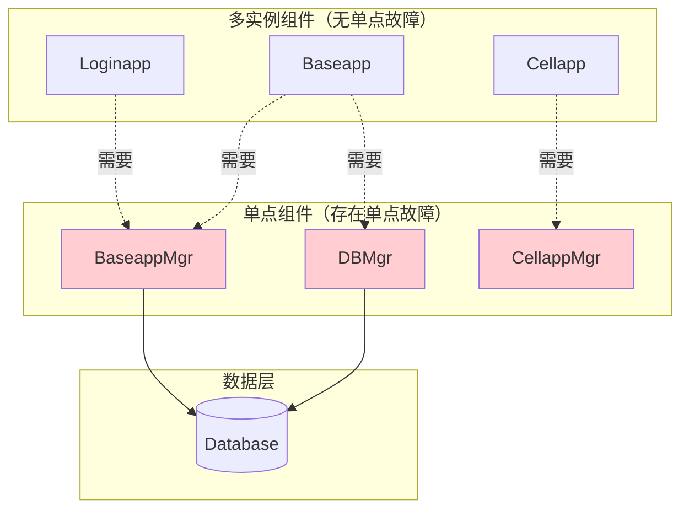
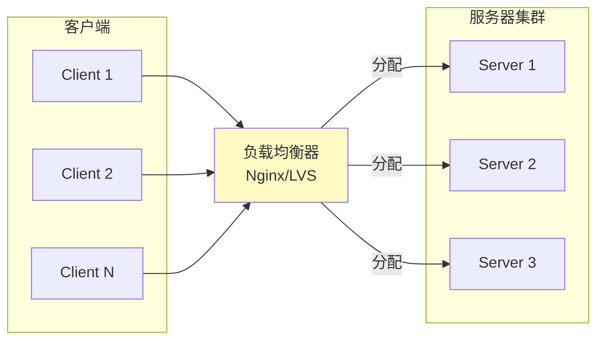

# Q8: 如何设计才能避免单点故障？

## 问题分析

本题考察对高可用架构设计的理解：
- 什么是单点故障（SPOF）
- KBEngine 中哪些组件是单点
- 如何消除单点故障
- 高可用架构的设计模式

---

## 一、单点故障概述

### 1.1 什么是单点故障

```
┌─────────────────────────────────────────────────────────────┐
│                      单点故障示意图                          │
├─────────────────────────────────────────────────────────────┤
│                                                             │
│   ┌──────────┐                                              │
│   │ Clients  │                                              │
│   └────┬─────┘                                              │
│        │                                                    │
│        ▼                                                    │
│   ┌─────────────────────────────────────────────────┐       │
│   │              单一登录服务器                       │       │
│   │            (Single Point of Failure)            │       │
│   │                                                 │       │
│   │            ❌ 崩溃 ❌                            │       │
│   │                                                 │       │
│   │              所有玩家无法登录！                   │       │
│   └─────────────────────────────────────────────────┘       │
│        │                                                    │
│        ▼                                                    │
│   ┌──────────┐                                              │
│   │ Database │                                              │
│   └──────────┘                                              │
│                                                             │
└─────────────────────────────────────────────────────────────┘

单点故障（Single Point of Failure）定义：
系统中的某个组件，如果发生故障会导致整个系统不可用。
```

### 1.2 常见的单点故障

| 组件类型 | 单点故障表现 | 影响 |
|----------|-------------|------|
| **单一服务器** | 服务器宕机 | 完全不可用 |
| **单一网络设备** | 交换机故障 | 网络隔离 |
| **单一数据库** | 数据库宕机 | 数据无法读写 |
| **单一进程** | 进程崩溃 | 功能不可用 |
| **单一电源** | 电源故障 | 整机断电 |

---

## 二、KBEngine 中的单点分析

### 2.1 KBEngine 架构中的单点

根据 [KBEngine Lab - 引擎概览](https://www.kbelab.com/manual/engine-overview.html)：



### 2.2 各组件单点分析

| 组件 | 是否单点 | 故障影响 | KBEngine 的应对 |
|------|----------|----------|----------------|
| **Loginapp** | ❌ 可多实例 | 无影响 | 可部署多个，负载均衡 |
| **Baseapp** | ❌ 可多实例 | 自动备份 | Baseapp 间互相备份 |
| **Cellapp** | ❌ 可多实例 | 空间不可用 | 其他 Cellapp 可接管 |
| **BaseappMgr** | ✅ 单点 | 无法分配新玩家 | Machine 进程监控重启 |
| **CellappMgr** | ✅ 单点 | 无法创建新空间 | Machine 进程监控重启 |
| **DBMgr** | ✅ 单点 | 无法访问数据库 | Machine 进程监控重启 |
| **Database** | ✅ 单点 | 完全不可用 | 需要 MySQL 集群 |

### 2.3 KBEngine 的容错机制

```python
# KBEngine 的备份机制
# scripts/kbe_scripts/base/baseapp.py

class Baseapp(KBEngine.Base):
    def onReady(self):
        """
        Baseapp 准备就绪时注册备份
        """
        # 向其他 Baseapp 发送备份请求
        self.startBackupToOtherBaseapps()

    def backupData(self):
        """
        定期备份玩家数据到其他 Baseapp
        """
        for entity in self.entities:
            # 将实体数据序列化发送给备份 Baseapp
            self.sendBackupData(entity)
```

---

## 三、消除单点故障的方法

### 3.1 冗余设计

#### 服务冗余

```
无冗余：
┌─────────────────────────────────────────────────────────────┐
│                                                             │
│   Clients ──► Loginapp ──► Baseapp                          │
│                  │          │                               │
│                  ▼          ▼                               │
│                崩溃❌      崩溃❌                              │
│                                                             │
└─────────────────────────────────────────────────────────────┘

服务冗余：
┌─────────────────────────────────────────────────────────────┐
│                                                             │
│   Clients ──►┌────────────┐                                │
│              │  Loginapp 1│  ◄── 一个崩溃，其他继续服务      │
│              ├────────────┤                                │
│              │  Loginapp 2│                                │
│              ├────────────┤                                │
│              │  Loginapp 3│                                │
│              └────────────┘                                │
│                                                             │
└─────────────────────────────────────────────────────────────┘
```

#### 数据冗余

```
主从复制：

┌─────────────────────────────────────────────────────────────┐
│                                                             │
│   ┌──────────┐          写入          ┌──────────┐         │
│   │  Client  │ ─────────────────────►│  Master  │         │
│   └──────────┘                        └────┬─────┘         │
│        ▲                                    │               │
│        │           同步复制                  │               │
│        │                                    ▼               │
│        │                            ┌──────────┐         │
│        │          读取 ◄───────────────│  Slave   │         │
│        └──────────────────────────────┴──────────┘         │
│                      主库崩溃时提升从库                      │
│                                                             │
└─────────────────────────────────────────────────────────────┘
```

### 3.2 负载均衡



### 3.3 故障检测与自动恢复

```
监控与恢复流程：

┌─────────────────────────────────────────────────────────────┐
│                                                             │
│   ┌─────────────────────────────────────────────────┐       │
│   │              监控系统                            │       │
│   │  ├── 心跳检测 (每秒)                              │       │
│   │  ├── 健康检查 (每 5 秒)                           │       │
│   │  └── 资源监控 (每秒)                              │       │
│   └────────────┬────────────────────────────────────┘       │
│                │                                            │
│                ▼                                            │
│   ┌─────────────────────────────────────────────────┐       │
│   │            检测到故障 ❌                         │       │
│   │  ┌─────────────────────────────────────────┐    │       │
│   │  │  1. 确认故障 (连续 3 次心跳失败)          │    │       │
│   │  │  2. 触发告警 (通知运维)                   │    │       │
│   │  │  3. 自动重启 (尝试恢复服务)               │    │       │
│   │  │  4. 流量切换 (切换到备用实例)              │    │       │
│   │  └─────────────────────────────────────────┘    │       │
│   └─────────────────────────────────────────────────┘       │
│                                                             │
└─────────────────────────────────────────────────────────────┘
```

---

## 四、KBEngine 单点消除方案

### 4.1 BaseappMgr 消除方案

```
方案 1：进程监控快速重启

┌─────────────────────────────────────────────────────────────┐
│                                                             │
│   ┌─────────────────────────────────────────────────┐       │
│   │              Machine 进程                        │       │
│   │  ┌─────────────────────────────────────────┐    │       │
│   │  │  监控 BaseappMgr 状态                    │    │       │
│   │  │  - 心跳检测 (每秒)                        │    │       │
│   │  │  - 崩溃检测 (进程不存在)                 │    │       │
│   │  └─────────────────────────────────────────┘    │       │
│   │                        │                        │       │
│   │                        ▼                        │       │
│   │  ┌─────────────────────────────────────────┐    │       │
│   │  │  检测到崩溃 → 立即重启                   │    │       │
│   │  │  - 保存崩溃现场 (日志)                   │    │       │
│   │  │  - 重新启动进程                          │    │       │
│   │  │  - 恢复时间: ~5-10 秒                    │    │       │
│   │  └─────────────────────────────────────────┘    │       │
│   └─────────────────────────────────────────────────┘       │
│                                                             │
└─────────────────────────────────────────────────────────────┘
```

```python
# KBEngine Machine 进程的监控逻辑（伪代码）

class Machine:
    def monitor_processes(self):
        """
        监控所有子进程状态
        """
        while True:
            for process in self.processes:
                if not process.is_alive():
                    self.log(f"{process.name} 崩溃，正在重启...")
                    self.restart_process(process)

            sleep(1)  # 每秒检查一次
```

### 4.2 DBMgr 消除方案

```
方案 1：DBMgr 集群（高可用）

┌─────────────────────────────────────────────────────────────┐
│                                                             │
│   ┌─────────────────────────────────────────────────┐       │
│   │               DBMgr 集群                         │       │
│   │                                                  │       │
│   │  ┌────────────┐  ┌────────────┐                │       │
│   │  │  DBMgr 1   │◄─┼────────────┤                │       │
│   │  │  (Active)  │  │  DBMgr 2   │                │       │
│   │  └──────┬─────┘  │ (Standby)  │                │       │
│   │         │         └──────┬─────┘                │       │
│   │         │                │                      │       │
│   │         │    心跳同步     │                      │       │
│   │         │◄───────────────►│                      │       │
│   │         │                                        │       │
│   └─────────┼────────────────────────────────────────┘       │
│             │                                               │
│             ▼                                               │
│   ┌─────────────────────────────────────────────────┐       │
│   │            MySQL 主从集群                        │       │
│   │  ┌────────────┐         ┌────────────┐          │       │
│   │  │   Master   │◄────────┤   Slave    │          │       │
│   │  │  (读写)    │  同步   │   (只读)   │          │       │
│   │  └────────────┘         └────────────┘          │       │
│   └─────────────────────────────────────────────────┘       │
│                                                             │
└─────────────────────────────────────────────────────────────┘
```

### 4.3 Database 消除方案

```
方案：MySQL 主从 + 故障自动切换

正常状态：
┌─────────────────────────────────────────────────────────────┐
│                                                             │
│   Baseapp ──► DBMgr ──► MySQL Master (写入)                │
│                  │                                         │
│                  └─────────────► MySQL Slave (只读)         │
│                                                             │
└─────────────────────────────────────────────────────────────┘

Master 故障切换：
┌─────────────────────────────────────────────────────────────┐
│                                                             │
│   1. 检测到 Master 宕机                                      │
│   2. 提升 Slave 为新的 Master                               │
│   3. DBMgr 连接到新的 Master                                │
│   4. 旧 Master 修复后成为 Slave                             │
│                                                             │
│   Baseapp ──► DBMgr ──► MySQL Slave (新 Master)            │
│                  └─────────────► MySQL Master (修复后)      │
│                                                             │
└─────────────────────────────────────────────────────────────┘
```

---

## 五、完整的高可用架构

### 5.1 理想的高可用架构

```mermaid
flowchart TB
    subgraph Clients["客户端层"]
        C1[Client 1]
        C2[Client 2]
        C3[Client N]
    end

    subgraph LB["负载均衡层"]
        LB1[Nginx/LVS 主]
        LB2[Nginx/LVS 备]
        LB1 -.心跳同步. LB2
    end

    subgraph Login["登录层"]
        LA1[Loginapp 1]
        LA2[Loginapp 2]
        LA3[Loginapp 3]
    end

    subgraph Base["基础层"]
        BA1[Baseapp 1]
        BA2[Baseapp 2]
        BA3[Baseapp 3]
        BAM1[BaseappMgr 主]
        BAM2[BaseappMgr 备]
    end

    subgraph Cell["空间层"]
        CA1[Cellapp 1]
        CA2[Cellapp 2]
        CA3[Cellapp 3]
        CAM1[CellappMgr 主]
        CAM2[CellappMgr 备]
    end

    subgraph Data["数据层"]
        DM1[DBMgr 主]
        DM2[DBMgr 备]
        DB1[(MySQL Master)]
        DB2[(MySQL Slave)]
        R[(Redis Cluster)]
    end

    C1 & C2 & C3 --> LB1 & LB2
    LB1 & LB2 --> LA1 & LA2 & LA3
    LA1 & LA2 & LA3 --> BA1 & BA2 & BA3
    BA1 & BA2 & BA3 --> BAM1 & BAM2
    BA1 & BA2 & BA3 <--> CA1 & CA2 & CA3
    CA1 & CA2 & CA3 --> CAM1 & CAM2
    BA1 & BA2 & BA3 --> DM1 & DM2
    DM1 & DM2 --> DB1 & DB2
    BA1 & BA2 & BA3 --> R

    style LB1 fill:#c8e6c9
    style LB2 fill:#c8e6c9
    style BAM1 fill:#ffcdd2
    style BAM2 fill:#ffcdd2
    style CAM1 fill:#ffcdd2
    style CAM2 fill:#ffcdd2
    style DM1 fill:#ffcdd2
    style DM2 fill:#ffcdd2
```

### 5.2 容错能力对比

| 架构 | 单点数 | 容错能力 | 恢复时间 |
|------|--------|----------|----------|
| **基础架构** | 6 个 | ❌ 无 | 需人工介入 |
| **+ 进程监控** | 6 个 | ⚠️ 进程级 | ~5-10 秒 |
| **+ Manager 备份** | 3 个 | ✅ 进程级 | ~5-10 秒 |
| **+ 数据库集群** | 1 个 | ✅ 进程级 | ~30-60 秒 |
| **+ 负载均衡** | 0 个 | ✅ 完全容错 | < 5 秒 |

---

## 六、实现方案

### 6.1 Heartbeat 心跳检测

```cpp
// KBEngine 中的心跳机制
// src/server/network/channel.h

class Channel {
public:
    // 心跳超时时间
    static constexpr int HEARTBEAT_TIMEOUT = 10;  // 秒

    // 最后心跳时间
    uint64_t lastHeartbeatTime_;

    // 检查心跳
    bool isAlive() const {
        uint64_t now = getTimeInSeconds();
        return (now - lastHeartbeatTime_) < HEARTBEAT_TIMEOUT;
    }
};

// 检测进程心跳
void checkProcessHeartbeat() {
    for (auto& process : monitoredProcesses) {
        if (!process.channel->isAlive()) {
            // 进程可能挂了
            onProcessDead(process);
        }
    }
}
```

### 6.2 服务发现

```cpp
// 服务发现机制
class ServiceRegistry {
private:
    // 服务注册表
    struct ServiceInfo {
        std::string address;
        int port;
        uint64_t lastHeartbeat;
        ServiceStatus status;
    };

    std::unordered_map<std::string, ServiceInfo> services_;

public:
    // 注册服务
    void registerService(const std::string& name,
                         const std::string& address,
                         int port) {
        services_[name] = {address, port, now(), ALIVE};
    }

    // 获取可用服务
    std::string getAvailableService(const std::string& name) {
        for (auto& [key, info] : services_) {
            if (info.status == ALIVE &&
                (now() - info.lastHeartbeat) < HEARTBEAT_TIMEOUT) {
                return info.address;
            }
        }
        return "";  // 无可用服务
    }

    // 下线服务
    void offlineService(const std::string& name) {
        services_[name].status = DEAD;
        // 触发告警
        alert(name + " is down!");
    }
};
```

### 6.3 自动故障切换

```python
# Python 实现的故障切换

class FailoverManager:
    def __init__(self):
        self.primary = None
        self.secondary = None
        self.current = None

    def check_primary(self):
        """
        检查主服务是否可用
        """
        try:
            return self.primary.ping()
        except:
            return False

    def get_connection(self):
        """
        获取可用连接（自动切换）
        """
        if self.current is None:
            self.current = self.primary

        # 检查当前连接
        if not self.check_primary():
            self.log("主服务不可用，切换到备用")
            self.current = self.secondary

            # 尝试恢复主服务
            self.recover_primary()

        return self.current.connect()

    def recover_primary(self):
        """
        尝试恢复主服务
        """
        # 后台线程尝试连接
        Thread(target=self._try_recover).start()

    def _try_recover(self):
        while True:
            if self.primary.ping():
                self.log("主服务已恢复，切换回来")
                self.current = self.primary
                break
            sleep(5)
```

---

## 七、实战建议

### 7.1 渐进式高可用方案

```
阶段 1：基础监控
├── 进程监控（自动重启）
├── 日志收集
└── 告警通知

阶段 2：服务冗余
├── 关键服务多实例
├── 负载均衡
└── 故障自动切换

阶段 3：数据冗余
├── 数据库主从
├── 数据自动备份
└── 灾难恢复计划

阶段 4：完全高可用
├── 多机房部署
├── 数据多活
└── 自动故障转移
```

### 7.2 成本与收益

```
高可用方案的成本收益分析：

┌─────────────────────────────────────────────────────────────┐
│  方案              │ 成本  │ 可用性 │ 适用场景             │
├─────────────────────────────────────────────────────────────┤
│  单服务器           │ 1x    │ 99%   │ 开发测试环境         │
│  + 进程监控         │ 1x    │ 99.5% │ 小型游戏             │
│  + 服务冗余         │ 2x    │ 99.9% │ 中型游戏             │
│  + 数据库主从       │ 2-3x  │ 99.95%│ 大型游戏             │
│  + 多机房           │ 4x+   │ 99.99%│ 商业运营游戏         │
└─────────────────────────────────────────────────────────────┘

可用性计算：
- 99%   = 年宕机时间 3.65 天
- 99.5% = 年宕机时间 1.83 天
- 99.9% = 年宕机时间 8.76 小时
- 99.95% = 年宕机时间 4.38 小时
- 99.99% = 年宕机时间 52.56 分钟
```

### 7.3 KBEngine 部署建议

```bash
# KBEngine 高可用部署配置

# 1. Loginapp（多实例）
machine:
  - loginapp (port 20013)
  - loginapp (port 20014)
  - loginapp (port 20015)

# 2. Baseapp（多实例 + 互相备份）
machine:
  - baseapp (port 20015)
  - baseapp (port 20016)
  - baseapp (port 20017)

# 3. Cellapp（多实例）
machine:
  - cellapp (port 20019)
  - cellapp (port 20020)
  - cellapp (port 20021)

# 4. 数据库（MySQL 主从）
MySQL:
  - Master: 192.168.1.10
  - Slave:  192.168.1.11

# 5. 监控（Machine 进程）
machine:
  - 所有进程由 Machine 监控
  - 崩溃自动重启
  - 日志记录到 Logger
```

---

## 八、总结

### 核心原则

| 原则 | 说明 | 实现方式 |
|------|------|----------|
| **消除单点** | 任何组件都不能是唯一的 | 冗余部署 |
| **故障隔离** | 单个故障不影响整体 | 进程隔离 |
| **快速检测** | 及时发现故障 | 心跳监控 |
| **自动恢复** | 无需人工介入 | 自动重启/切换 |
| **优雅降级** | 部分功能降级保证核心 | 熔断机制 |

### 检查清单

```
高可用设计检查清单：

□ 所有关键组件是否有冗余？
□ 是否有心跳检测机制？
□ 进程崩溃是否能自动恢复？
□ 数据库是否有主从复制？
□ 是否有负载均衡？
□ 是否有监控告警？
□ 是否有灾难恢复计划？
□ 是否定期演练故障切换？

建议：
- 生产环境至少达到 99.9% 可用性
- 关键组件必须有冗余
- 定期进行故障演练
```

---

## 参考资料

- [KBEngine Lab - 灾难恢复](https://www.kbelab.com/manual/disaster.html)
- [KBEngine GitHub - 源码分析](https://github.com/kbengine/kbengine)
- [MySQL 主从复制配置](https://dev.mysql.com/doc/refman/8.0/en/replication.html)
- [高可用架构设计模式](https://sre.google/sre-book/eliminating-toil/)
