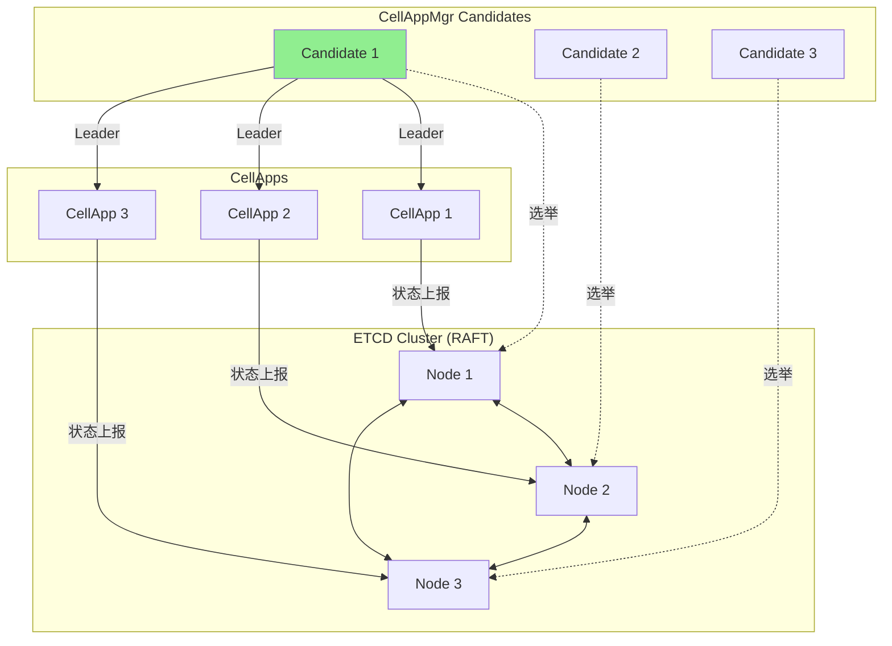

# Q9: CellAppMgr 如果宕机了怎么办？有哪些解决方案？

## 问题分析

CellAppMgr 是 BigWorld/KBEngine 架构中的核心管理组件，负责：
- 协调所有 CellApp 的工作
- 空间分区负载均衡
- 动态调整 Cell 边界
- Entity 跨 CellApp 迁移

如果 CellAppMgr 宕机会发生什么？如何解决？

---

## KBEngine 的实际情况

### 官方确认

根据 [KBEngine Lab 官方文档](https://www.kbelab.com/manual/engine-overview.html)：

> "一个KBE架构中，只会出现一个 **CellappMgr**"

**KBEngine 原生设计是单 CellAppMgr，没有内置高可用方案。**

### 宕机影响

```
┌─────────────────────────────────────────────────────────────┐
│                      CellAppMgr ❌                          │
│                   如果这个进程挂了：                          │
│  - 无法创建新 Cell                                           │
│  - 无法进行负载均衡                                           │
│  - 无法调整 Cell 边界                                         │
│  - 无法处理 Entity 跨 CellApp 迁移                           │
│  - 现有 Cell 仍可运行，但扩展能力丧失                          │
└─────────────────────────────────────────────────────────────┘
```

| 功能 | 宕机后状态 |
|------|-----------|
| 现有 CellApp | ✅ 继续运行 |
| 现有玩家 | ✅ 不受影响 |
| 新玩家登录 | ✅ 可以进入 |
| 负载均衡 | ❌ 停止 |
| 动态扩容 | ❌ 停止 |
| 边界调整 | ❌ 停止 |

---

## 解决方案

### 方案 1: 进程监控 + 自动重启（最简单）

```bash
# Supervisor 配置
[program:cellappmgr]
command=/usr/local/kbe/bin/cellappmgr
directory=/usr/local/kbe/
user=kbe
autostart=true
autorestart=true
startsecs=10
startretries=3
stopwaitsecs=60
redirect_stderr=true
stdout_logfile=/var/log/kbe/cellappmgr.log
```

**工作流程**：
```
CellAppMgr 宕机
       ↓
Supervisor 检测到进程退出
       ↓
自动重启 CellAppMgr
       ↓
CellAppMgr 从持久化数据恢复状态
       ↓
请求所有 CellApp 重新上报状态
       ↓
服务恢复正常
```

**恢复时间**：通常 10-30 秒

| 优点 | 缺点 |
|------|------|
| 实现简单 | 恢复期间服务不可用 |
| 无需修改源码 | 丢失宕机期间的负载调整 |
| 成熟工具支持 | 无法处理机器故障 |

### 方案 2: 状态持久化 + 快速恢复

```cpp
// CellAppMgr 定期持久化状态
class CellAppMgr {
    void saveState() {
        StateSnapshot snapshot;
        snapshot.timestamp = now();
        snapshot.version = stateVersion++;

        // 保存所有 Cell 边界
        for (auto& cell : cells) {
            snapshot.cells[cell.id] = {
                cell.owner,
                cell.bounds,
                cell.load
            };
        }

        // 保存所有 Space 分配
        for (auto& space : spaces) {
            snapshot.spaces[space.id] = {
                space.cellApp,
                space.bounds
            };
        }

        // 保存负载均衡状态
        snapshot.balanceState = currentBalanceState;

        // 持久化到数据库/文件
        db->save("cellappmgr_state", snapshot);
    }

    void recover() {
        // 1. 加载最新快照
        auto snapshot = db->load("cellappmgr_state");

        // 2. 恢复状态
        cells = snapshot.cells;
        spaces = snapshot.spaces;
        currentBalanceState = snapshot.balanceState;

        // 3. 请求所有 CellApp 重新上报
        for (auto cellapp : discoverCellApps()) {
            cellapp->reportFullState();
        }

        // 4. 重新计算负载均衡
        rebalance();
    }
};

// 定时保存（每5秒）
void CellAppMgr::mainLoop() {
    while (running) {
        // 处理负载均衡
        balance();

        // 定期保存状态
        if (now() - lastSaveTime > 5s) {
            saveState();
            lastSaveTime = now();
        }

        sleep(tickPeriod);
    }
}
```

**数据结构**：
```
cellappmgr_state
├── version: 12345
├── timestamp: 2024-03-19 10:30:00
├── cells
│   ├── cell_1: {owner: "cellapp1", bounds: [0,0,1000,1000], load: 0.6}
│   ├── cell_2: {owner: "cellapp1", bounds: [1000,0,2000,1000], load: 0.4}
│   └── ...
├── spaces
│   ├── space_1: {cellapp: "cellapp1", cell: "cell_1"}
│   └── ...
└── balance_state: {...}
```

### 方案 3: 主备模式（需修改源码）

```cpp
// CellAppMgr 主备实现
class CellAppMgr {
    enum Role { MASTER, STANDBY };
    Role role = STANDBY;
    CellAppMgr* masterAddr = nullptr;

    void start() {
        // 尝试获取 Leader 锁
        if (acquireMasterLock()) {
            becomeMaster();
        } else {
            becomeStandby();
        }
    }

    void becomeMaster() {
        role = MASTER;

        // 持续续租
        while (isMaster) {
            renewMasterLock();
            saveState();  // 主节点定期保存状态
            sleep(1);
        }
    }

    void becomeStandby() {
        role = STANDBY;

        // 监控主节点
        watchMaster([this](MasterEvent event) {
            if (event == MASTER_DOWN) {
                log.info("Master down, becoming master...");
                becomeMaster();
            }
        });
    }

    bool acquireMasterLock() {
        // 使用分布式锁（Redis/ETCD/ZooKeeper）
        return redis->setnx("cellappmgr:master", myAddr, 30);
    }

    void renewMasterLock() {
        // 续租
        redis->expire("cellappmgr:master", 30);
    }
};
```

**切换流程**：
```
┌─────────────────────────────────────────────────────────────┐
│                      CellAppMgr-Master                      │
│                   ❌ 宕机 (心跳超时)                         │
└─────────────────────────────────────────────────────────────┘
                            ↓
┌─────────────────────────────────────────────────────────────┐
│                    CellAppMgr-Standby                       │
│                  检测到 Master 宕机                          │
│                            ↓                                │
│                  尝试获取 Master 锁                          │
│                            ↓                                │
│                  升级为新的 Master                           │
│                            ↓                                │
│                  加载持久化状态                              │
│                            ↓                                │
│                  请求 CellApp 重新上报                       │
└─────────────────────────────────────────────────────────────┘
```

### 方案 4: RAFT + ETCD（推荐）

```cpp
// 使用 ETCD 实现 RAFT 一致性
class DistributedCellAppMgr {
    etcd::Client etcd;
    etcd::Lease lease;

    void start() {
        // 1. 参与 RAFT 选举
        auto candidate = etcd.candidate("cellappmgr/leader");

        candidate.onElected([this](etcd::Leader leader) {
            becomeLeader(leader);
        });

        candidate.onFollower([this](etcd::Leader leader) {
            becomeFollower(leader);
        });
    }

    void becomeLeader(etcd::Leader leader) {
        // 作为 Leader 执行负载均衡
        while (leader.isActive()) {
            // 从 ETCD 获取所有 CellApp 状态
            auto cellApps = etcd.get("cellapps/");

            // 计算负载均衡
            auto plan = calculateBalance(cellApps);

            // 将决策写入 ETCD（同步到所有节点）
            etcd.put("balance/plan", plan);

            sleep(BALANCE_INTERVAL);
        }
    }

    void becomeFollower(etcd::Leader leader) {
        // 监听 Leader 的决策
        etcd.watch("balance/plan", [this](BalancePlan plan) {
            // 执行 Leader 的决策
            applyBalancePlan(plan);
        });
    }
};

// CellApp 状态上报到 ETCD
class CellApp {
    void reportLoad() {
        etcd.put(fmt::format("cellapps/{}/load", id),
                 std::to_string(currentLoad));

        etcd.put(fmt::format("cellapps/{}/entities", id),
                 serializeEntities());
    }
};
```

**架构图**：


---

## 方案对比

| 方案 | 优点 | 缺点 | 复杂度 | RTO |
|------|------|------|--------|-----|
| **进程监控** | 简单，无需改代码 | 恢复慢，机器故障无法处理 | ⭐ | 10-30s |
| **状态持久化** | 加快恢复 | 仍需重启，机器故障无法处理 | ⭐⭐ | 5-10s |
| **主备模式** | 自动切换 | 需改代码，备机闲置 | ⭐⭐⭐ | 1-5s |
| **RAFT+ETCD** | 完善的高可用 | 依赖外部组件 | ⭐⭐⭐⭐ | <1s |

---

## Apollo 建议方案

```cpp
// Apollo 采用 RAFT + ETCD 方案
// 文件: apps/cell-appmgr/include/cellappmgr/distributed_mgr.hpp

class ApolloCellAppMgr {
    // 1. 使用 etcd RAFT 进行 Leader 选举
    etcd::Client etcd;
    etcd::Lease lease;

    // 2. 状态存储在 ETCD
    void storeState() {
        etcd.put("cellappmgr/state", serializeState());
    }

    // 3. 监听 CellApp 状态变化
    void watchCellApps() {
        etcd.watch("cellapps/", [this](const Event& e) {
            if (e.type == PUT) {
                onCellAppUpdated(e.key, e.value);
            }
        });
    }

    // 4. 计算负载均衡并存储到 ETCD
    void balance() {
        auto plan = calculateBalance();
        etcd.put("cellappmgr/balance/plan", plan);
    }
};
```

---

## 参考资料

- [KBEngine Lab - 引擎概览](https://www.kbelab.com/manual/engine-overview.html)
- [ETCD 官方文档](https://etcd.io/docs/)
- [RAFT 一致性算法](https://raft.github.io/)
