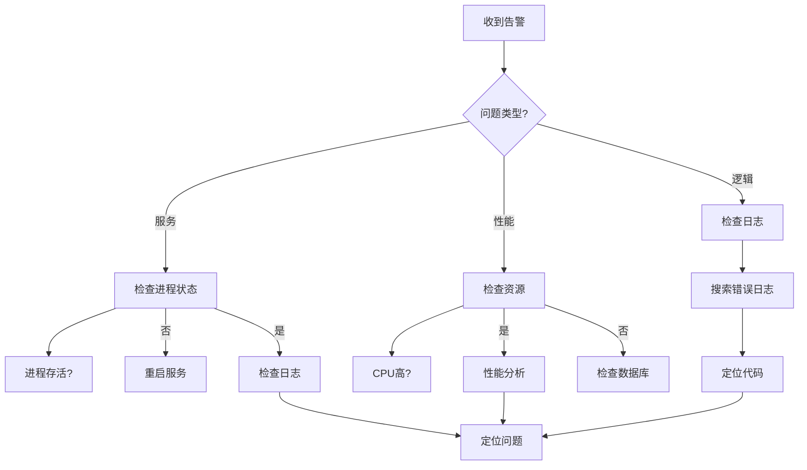

# Q93: 如何快速定位线上问题？

## 问题分析

本题考察对问题定位的理解：
- 问题分类
- 排查方法
- 调试工具
- KBEngine 调试

---

## 一、问题分类

### 1.1 问题类型

```
┌─────────────────────────────────────────────────────────────┐
│                    线上问题分类                                  │
├─────────────────────────────────────────────────────────────┤
│                                                             │
│  服务问题:                                                   │
│  ├── 进程崩溃                                               │
│  ├── 服务假死                                               │
│  ├── 响应缓慢                                               │
│  └── 连接断开                                               │
│                                                             │
│  性能问题:                                                   │
│  ├── CPU 飙高                                               │
│  ├── 内存泄漏                                               │
│  ├── 数据库慢                                               │
│  └── 锁竞争                                                 │
│                                                             │
│  逻辑问题:                                                   │
│  ├── Bug 触发                                               │
│  ├── 数据不一致                                             │
│  ├── 死锁                                                   │
│  └── 资源耗尽                                               │
│                                                             │
│  配置问题:                                                   │
│  ├── 配置错误                                               │
│  ├── 依赖缺失                                               │
│  └── 环境差异                                               │
│                                                             │
└─────────────────────────────────────────────────────────────┘
```

---

## 二、排查流程

### 2.1 问题定位流程图



### 2.2 排查脚本

```bash
#!/bin/bash
# 快速诊断脚本

echo "=== 线上问题诊断 ==="

# 1. 检查进程状态
echo "--- 进程状态 ---"
ps aux | grep -E "kbengine|cellapp|baseapp|dbmgr|loginapp"

# 2. 检查端口占用
echo "--- 端口监听 ---"
netstat -tuln | grep -E ":(20013|20011|20012|20021|20004|20005)"

# 3. 检查内存
echo "--- 内存使用 ---"
free -h

# 4. 检查磁盘
echo "--- 磁盘使用 ---"
df -h

# 5. 检查错误日志
echo "--- 最近错误 ---"
tail -100 /path/to/kbengine/logs/*.log | grep -i "error\|fatal\|exception"

# 6. 检查数据库连接
echo "--- 数据库连接 ---"
mysql -h localhost -u kbengine -p -e "SHOW PROCESSLIST;"

# 7. 检查网络连接
echo "--- 网络连接数 ---"
netstat -an | grep ESTABLISHED | wc -l
```

---

## 三、KBEngine 调试

### 3.1 KBEngine 调试工具

```python
# KBEngine 调试工具

class KBEngineDebug:
    """KBEngine 调试辅助"""

    @staticmethod
    def list_entities():
        """列出所有实体"""
        for entity_id, entity in KBEngine.entities.items():
            print(f"Entity: {entity_id}")
            print(f"  Type: {entity.__class__.__name__}")
            print(f"  Position: {entity.position}")
            print(f"  IsDestroyed: {entity.isDestroyed}")
            if hasattr(entity, 'base'):
                print(f"  Base: {entity.base}")
            print()

    @staticmethod
    def list_spaces():
        """列出所有空间"""
        for space_id, space in KBEngine.spaces.items():
            print(f"Space: {space_id}")
            print(f"  Name: {space.spaceName}")
            print(f"  Entity Count: {space.entityCount}")
            print()

    @staticmethod
    def dump_entity(entity_id):
        """转储实体详细信息"""
        entity = KBEngine.getEntity(entity_id)
        if not entity:
            print(f"Entity {entity_id} not found")
            return

        print(f"=== Entity {entity_id} ===")
        print(f"Class: {entity.__class__.__name__}")
        print(f"Position: {entity.position}")
        print(f"Direction: {entity.direction}")
        print(f"ModelID: {entity.modelID}")

        # 打印所有属性
        print("Attributes:")
        for attr_name in dir(entity):
            if not attr_name.startswith('_'):
                try:
                    value = getattr(entity, attr_name)
                    if not callable(value):
                        print(f"  {attr_name}: {value}")
                except:
                    pass

    @staticmethod
    def check_memory():
        """检查内存使用"""
        mem = KBEngine.getWatcher().get("mem/allocated")
        print(f"Allocated Memory: {mem / 1024 / 1024:.2f} MB")

    @staticmethod
    def check_network():
        """检查网络统计"""
        stats = KBEngine.getWatcher().get("network/*")
        print("Network Statistics:")
        for key, value in stats.items():
            print(f"  {key}: {value}")
```

---

## 四、常用工具

### 4.1 GDB 附加

```bash
# 生产环境 GDB 调试

# 1. 找到进程 ID
PID=$(pgrep -f CellApp | head -1)

# 2. 附加 GDB
gdb -p $PID

# 3. GDB 命令
(gdb) thread apply all bt    # 查看所有线程堆栈
(gdb) info threads         # 查看线程信息
(gdb) thread apply 1 bt   # 查看主线程堆栈
(gdb) quit

# 或使用 bt full 查看完整堆栈
```

### 4.2 CoreDump 分析

```bash
# CoreDump 分析

# 1. 启用 coredump
ulimit -c unlimited
echo "/tmp/core.%e.%p" > /proc/sys/kernel/core_pattern

# 2. 当进程崩溃后分析
gdb /path/to/CellApp /tmp/core.1234

# 3. GDB 分析
(gdb) bt full              # 完整堆栈
(gdb) thread apply all bt  # 所有线程
(gdb) info locals        # 本地变量
```

---

## 五、快速定位技巧

### 5.1 常见问题快速定位

```python
# 常见问题定位脚本

class QuickTroubleshooter:
    """快速问题定位"""

    @staticmethod
    def check_process_health(component_name):
        """检查组件健康状态"""
        # 检查进程是否存在
        pid = get_process_pid(component_name)
        if not pid:
            print(f"[ERROR] {component_name} process not found!")
            return False

        # 检查进程响应
        if not ping_process(pid):
            print(f"[ERROR] {component_name} not responding!")
            return False

        # 检查端口监听
        port = get_component_port(component_name)
        if not is_port_listening(port):
            print(f"[ERROR] {component_name} not listening on port {port}!")
            return False

        print(f"[OK] {component_name} is healthy")
        return True

    @staticmethod
    def check_database_connection():
        """检查数据库连接"""
        try:
            conn = pymysql.connect(
                host='localhost',
                user='kbengine',
                password='kbengine',
                database='kbengine'
            )
            conn.ping()
            print("[OK] Database connection OK")
            return True
        except Exception as e:
            print(f"[ERROR] Database connection failed: {e}")
            return False

    @staticmethod
    def find_high_cpu():
        """查找高 CPU 进程"""
        import psutil
        for proc in psutil.process_iter(['pid', 'name', 'cpu_percent']):
            if proc.info['cpu_percent'] > 80:
                print(f"[WARN] High CPU: {proc.info['name']} ({proc.info['cpu_percent']}%)")

    @staticmethod
    def find_high_memory():
        """查找高内存进程"""
        import psutil
        for proc in psutil.process_iter(['pid', 'name', 'memory_percent']):
            if proc.info['memory_percent'] > 80:
                print(f"[WARN] High Memory: {proc.info['name']} ({proc.info['memory_percent']}%)")
```

---

## 六、最佳实践

### 6.1 定位建议

| 步骤 | 操作 |
|------|------|
| 1 | 确认问题现象 |
| 2 | 查看错误日志 |
| 3 | 检查进程状态 |
| 4 | 分析系统资源 |
| 5 | 定位根因 |
| 6 | 实施修复 |

---

## 七、总结

### 问题定位核心

```
快速定位 = 日志分析 + 工具支持 + 系统监控 + 经验积累
- 看日志找错误
- 工具辅助分析
- 分类排查
- 建立问题知识库
```

---

## 参考资料

- [Linux Troubleshooting](https://access.redhat.com/documentation/en-us/red_hat_enterprise_linux/7/html/troubleshooting/)
- [KBEngine Debug](https://kbengine.github.io/docs/)
