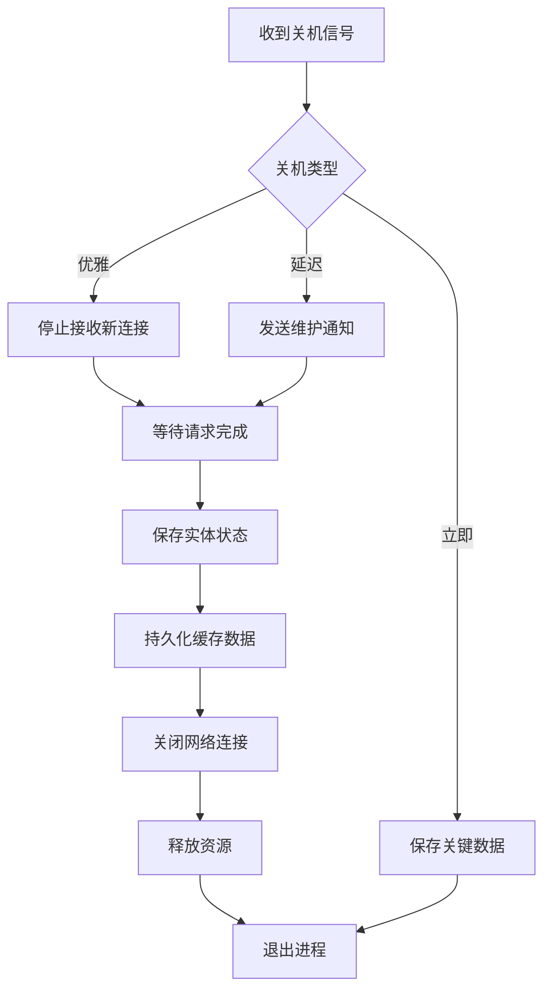

# Q97: 如何实现优雅关机？

## 问题分析

本题考察对优雅关机的理解：
- 关机流程
- 连接清理
- 数据保存
- KBEngine 关机机制

---

## 一、优雅关机原理

### 1.1 关机类型

```
┌─────────────────────────────────────────────────────────────┐
│                    关机类型                                    │
├─────────────────────────────────────────────────────────────┤
│                                                             │
│  立即关机 (Immediate):                                     │
│  ├── SIGKILL 信号                                          │
│  ├── 强制终止                                               │
│  ├── 可能丢失数据                                           │
│  └── 示例: kill -9, 服务器断电                               │
│                                                             │
│  优雅关机 (Graceful):                                      │
│  ├── SIGTERM 信号                                          │
│  ├── 完成当前请求                                           │
│  ├── 保存状态                                               │
│  └── 示例: 正常关闭脚本                                     │
│                                                             │
│  延迟关机 (Delayed):                                       │
│  ├── 等待玩家退出                                           │
│  ├── 定时触发                                               │
│  ├── 维护通知                                               │
│  └── 示例: 维护模式                                         │
│                                                             │
└─────────────────────────────────────────────────────────────┘
```

---

## 二、关机流程

### 2.1 关机流程图



### 2.2 KBEngine 关机流程

```python
# KBEngine 优雅关机

"""
KBEngine 关机机制:

1. 收到 SIGTERM 信号
2. 调用 onKBEngineShutDown 闭包
3. 停止接收新连接
4. 等待实体保存
5. 关闭网络
6. 退出进程
"""

import KBEngine
import signal
import sys

class ShutdownManager:
    """关机管理器"""

    def __init__(self):
        self.shutdown initiated = False
        self.shutdown_timeout = 60  # 秒
        self.players_to_save = set()

        # 注册信号处理
        signal.signal(signal.SIGTERM, self.on_signal)
        signal.signal(signal.SIGINT, self.on_signal)

        # 注册关机回调
        KBEngine.registerCallback("onShutdown", self.on_shutdown)

    def on_signal(self, signum, frame):
        """信号处理"""
        signal_name = signal.Signals(signum).name
        INFO_MSG(f"Received signal: {signal_name}")

        if not self.shutdown_initiated:
            self.initiate_shutdown("normal")
        else:
            WARNING_MSG("Shutdown already in progress, forcing...")
            self.force_shutdown()

    def initiate_shutdown(self, reason):
        """发起关机"""
        if self.shutdown_initiated:
            return

        self.shutdown_initiated = True
        INFO_MSG(f"Initiating graceful shutdown: {reason}")

        # 1. 停止接收新连接
        self.stop_accepting_connections()

        # 2. 通知所有玩家
        self.notify_players_shutdown()

        # 3. 开始保存实体
        self.save_all_entities()

    def stop_accepting_connections(self):
        """停止接收新连接"""
        # KBEngine 内置方法
        KBEngine.setAcceptNewConnections(False)
        INFO_MSG("Stopped accepting new connections")

    def notify_players_shutdown(self):
        """通知玩家关机"""
        shutdown_msg = {
            "type": "server_shutdown",
            "reason": "maintenance",
            "timeout": self.shutdown_timeout
        }

        # 广播给所有在线玩家
        for entity_id, entity in KBEngine.entities.items():
            if hasattr(entity, 'client') and entity.client:
                entity.client.onServerShutdown(shutdown_msg)

    def save_all_entities(self):
        """保存所有实体"""
        INFO_MSG("Saving all entities...")

        # 获取需要保存的实体
        self.players_to_save = set(
            eid for eid, e in KBEngine.entities.items()
            if hasattr(e, 'accountEntity')
        )

        INFO_MSG(f"Entities to save: {len(self.players_to_save)}")

        # KBEngine 会自动触发实体写入
        # 我们需要等待写入完成
        KBEngine.setShutdownTimer(self.shutdown_timeout)

    def on_entity_saved(self, entity_id):
        """实体保存回调"""
        if entity_id in self.players_to_save:
            self.players_to_save.remove(entity_id)
            INFO_MSG(f"Entity {entity_id} saved, "
                    f"remaining: {len(self.players_to_save)}")

        if not self.players_to_save:
            INFO_MSG("All entities saved, shutting down...")
            self.final_shutdown()

    def final_shutdown(self):
        """最终关机"""
        INFO_MSG("Performing final shutdown...")

        # 关闭数据库连接
        self.close_database()

        # 退出
        sys.exit(0)

    def force_shutdown(self):
        """强制关机"""
        WARNING_MSG("Forcing shutdown...")
        sys.exit(1)

    def close_database(self):
        """关闭数据库连接"""
        # KBEngine DBMgr 会自动关闭
        pass


# KBEngine 脚本中的关机处理
def onKBEngineShutDown():
    """
    KBEngine 关机回调

    这个函数在 KBEngine 准备关闭时被调用
    """
    INFO_MSG("KBEngine is shutting down...")

    # 执行清理工作
    cleanup_resources()

    # 保存全局状态
    save_global_state()


def cleanup_resources():
    """清理资源"""
    # 清理缓存
    clear_caches()

    # 关闭外部连接
    close_external_connections()

    # 取消定时器
    cancel_all_timers()


def save_global_state():
    """保存全局状态"""
    # 保存游戏全局状态
    pass
```

---

## 三、数据保存保证

### 3.1 实体保存

```python
# 实体保存保证

class SaveOnShutdown:
    """关机时保存"""

    def __init__(self):
        self.save_callbacks = []

    def register_save_callback(self, callback):
        """注册保存回调"""
        self.save_callbacks.append(callback)

    def execute_saves(self):
        """执行所有保存"""
        results = []

        for callback in self.save_callbacks:
            try:
                result = callback()
                results.append((callback.__name__, True, result))
            except Exception as e:
                ERROR_MSG(f"Save callback failed: {e}")
                results.append((callback.__name__, False, str(e)))

        return results


class Account(KBEngine.Account):
    """账号实体 - 支持关机保存"""

    def __init__(self):
        KBEngine.Account.__init__(self)
        self.pending_save = False

    def onShutdown(self):
        """关机时调用"""
        INFO_MSG(f"Account {self.id} onShutdown")

        # 标记需要保存
        self.pending_save = True

        # 立即写入数据库
        self.writeToDB()

    def onWriteToDBCallback(self, success):
        """数据库写入回调"""
        if success:
            INFO_MSG(f"Account {self.id} saved successfully")
        else:
            ERROR_MSG(f"Account {self.id} save failed!")

        # 通知关机管理器
        shutdown_mgr.on_entity_saved(self.id)
```

---

## 四、连接清理

### 4.1 连接关闭

```python
# 连接清理

class ConnectionManager:
    """连接管理器"""

    def __init__(self):
        self.connections = {}

    def register_connection(self, conn_id, conn):
        """注册连接"""
        self.connections[conn_id] = conn

    def close_all_connections(self):
        """关闭所有连接"""
        INFO_MSG(f"Closing {len(self.connections)} connections...")

        for conn_id, conn in list(self.connections.items()):
            try:
                # 发送关机消息
                conn.send_shutdown_notification()

                # 关闭连接
                conn.close()

                del self.connections[conn_id]

            except Exception as e:
                ERROR_MSG(f"Error closing connection {conn_id}: {e}")

    def wait_connections_empty(self, timeout=30):
        """等待所有连接关闭"""
        import time

        start = time.time()
        while self.connections and (time.time() - start) < timeout:
            INFO_MSG(f"Waiting for {len(self.connections)} connections...")
            time.sleep(1)

        if self.connections:
            WARNING_MSG(f"Timeout with {len(self.connections)} connections remaining")


class KBEngineConnection(KBEngine.Entity):
    """KBEngine 连接处理"""

    def onClientDeath(self):
        """客户端断开"""
        INFO_MSG(f"Client {self.id} disconnected")

    def onShutdownNotify(self):
        """关机通知"""
        if self.client:
            self.client.onServerShutdown({
                "message": "Server is shutting down",
                "timeout": 30
            })
```

---

## 五、维护模式

### 5.1 延迟关机

```python
# 维护模式

class MaintenanceMode:
    """维护模式"""

    def __init__(self, shutdown_delay=300):
        self.shutdown_delay = shutdown_delay  # 5分钟
        self.shutdown_scheduled = False
        self.shutdown_time = 0

    def schedule_maintenance(self, delay):
        """安排维护"""
        self.shutdown_scheduled = True
        self.shutdown_time = time.time() + delay

        INFO_MSG(f"Maintenance scheduled in {delay} seconds")

        # 通知所有玩家
        self.broadcast_maintenance_notice()

        # 设置定时器
        KBEngine.addTimer(delay, 0, self.execute_shutdown)

    def broadcast_maintenance_notice(self):
        """广播维护通知"""
        remaining = int(self.shutdown_time - time.time())

        for entity_id, entity in KBEngine.entities.items():
            if hasattr(entity, 'client') and entity.client:
                # 每分钟通知一次
                for t in range(remaining, 0, -60):
                    KBEngine.addTimer(t, 0, lambda: self.send_notice(entity, remaining - t))

    def send_notice(self, entity, remaining):
        """发送通知"""
        if entity.client:
            entity.client.onMaintenanceNotice({
                "remaining": remaining,
                "message": f"Server will shutdown in {remaining} seconds"
            })

    def execute_shutdown(self):
        """执行关机"""
        INFO_MSG("Maintenance shutdown executing...")
        shutdown_mgr.initiate_shutdown("scheduled_maintenance")
```

---

## 六、最佳实践

### 6.1 优雅关机建议

| 实践 | 说明 |
|------|------|
| **信号处理** | 捕获 SIGTERM/SIGINT |
| **数据保存** | 确保所有实体写入数据库 |
| **连接通知** | 提前通知玩家 |
| **超时保护** | 设置关机超时 |
| **状态检查** | 关机前检查服务健康 |
| **日志记录** | 记录关机过程 |

---

## 七、总结

### 优雅关机核心

```
优雅关机 = 信号捕获 + 连接通知 + 数据保存 + 资源清理
- KBEngine onKBEngineShutDown
- 停止接收新连接
- 等待实体保存完成
- 超时保护机制
```

---

## 参考资料

- [Graceful Shutdown Patterns](https://medium.com/@haxnus/graceful-shutdown-in-go-and-linux- signals-cb4db09e6a1a)
- [KBEngine Lifecycle](https://kbengine.github.io/docs/)
- [Linux Signal Handling](https://man7.org/linux/man-pages/man7/signal.7.html)
